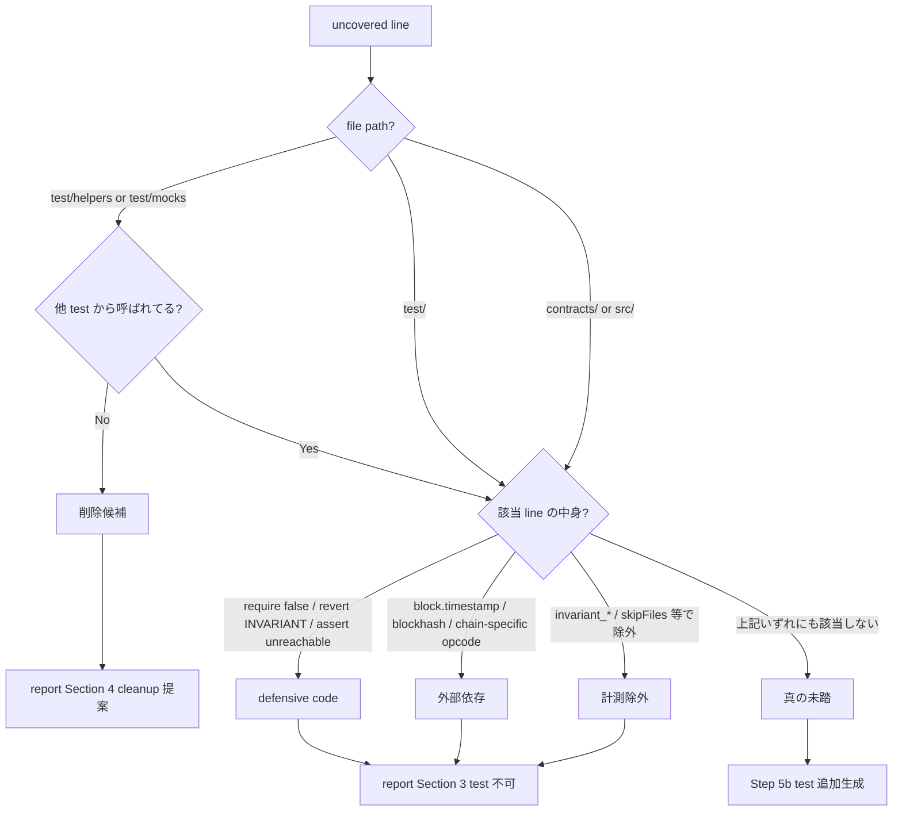

# coverage-classify — file 分類 + uncovered 5 分類 rule SSOT

`/kiwa-forge` / `/kiwa-hardhat` の Step 5 (auto loop) で uncovered line / branch を分類するための rule SSOT。 両 skill から参照される (kiwa-hardhat 側からは `../../kiwa-forge/references/coverage-classify.md` で参照、 もしくは同 path に symlink)。

## 1. file 分類 rule (threshold 対象判定)

production target だけが coverage threshold の評価対象。 test 自身 / mock helper / deploy script は分母から除外。

| file path pattern | カテゴリ | threshold 対象? | 理由 |
|---|---|---|---|
| `contracts/**/*.sol` | production | ✅ 対象 | 実 production contract |
| `src/**/*.sol` | production | ✅ 対象 | 同上 (代替 path 命名) |
| `test/**/*.t.sol` | test 自身 | ❌ 対象外 | test を test する意味がない |
| `test/**/*.test.cjs` | test 自身 | ❌ 対象外 | Hardhat test file |
| `test/helpers/**/*.sol` | mock helper | ❌ 対象外 | mock の全分岐を踏む test は冗長 |
| `test/mocks/**/*.sol` | mock helper | ❌ 対象外 | 同上 (代替 dir 命名) |
| `script/**/*.sol` | deploy script | ❌ 対象外 | 本番 deploy 用 script、 unit test 対象外 |

判定優先順位 — 上から順に評価し、 最初にマッチしたカテゴリを採用 (test/ 配下が contracts/ より先に評価される)。

### カスタム path 対応

monorepo 等で contracts/ 以外の path を production として扱いたい場合、 SKILL.md の引数 `--production-path {pattern}` (default `contracts/**/*.sol,src/**/*.sol`) で override 可能 (引数追加は #222 実装時に対応)。

## 2. uncovered 5 分類 rule

production target で 100% 未達の各 uncovered line / branch を以下 5 分類のいずれかに割り当てる。

### 削除候補 (cleanup recommendation)

該当 file が `test/helpers/**` or `test/mocks/**` で、 該当 function が grep で他 test から呼ばれていない。

判定コマンド例:

```bash
grep -rn "{function_name}" test/ --include="*.t.sol" --include="*.test.cjs" | grep -v "{該当 file}"
# ヒット 0 → 削除候補
```

skill アクション — report Section 4 (Layer 1 spec 書き戻し提案) に「mock {function_name} は未使用、 cleanup 推奨」を bullet 追加。

### defensive code

該当 line が以下のいずれか。

- `require(false, "...")` — 到達不能な invariant 防御
- `revert "INVARIANT_VIOLATION"` — 同上
- `assert(unreachable_condition)` — 到達不能な assert

skill アクション — report Section 3 に「defensive code、 test 不可能」を明示。

### 外部依存

該当 line が以下のいずれかの依存を持ち、 unit test 環境で再現困難。

- `block.timestamp == {specific_value}` — 特定 timestamp 依存
- `blockhash(...)` — block hash 依存
- chain-specific opcode (`PUSH0` 等の特定 EVM version 依存)
- `msg.value` の特殊値依存 (例 `msg.value == type(uint256).max`)

skill アクション — report Section 3 に「外部依存、 fuzz / mainnet fork で cover 可能性あり、 unit test 対象外」を明示。

### 計測除外

該当 test 関数が以下のいずれかで計測から除外されている。

- Foundry: `invariant_*` test 関数 (`--no-match-test 'invariant_'` で除外)
- Foundry: `function_*` で `forge test --no-match-test {pattern}` 引数で除外
- Hardhat: `solidity-coverage` の `skipFiles` 設定で除外
- Hardhat: `--grep` / `--no-tags` 等で除外

skill アクション — report Section 3 に「計測除外、 invariant test 込みで再計測すれば cover される可能性」を明示。 必要なら `--match-test` 引数で再計測を提案。

### 真の未踏

上記 4 分類のいずれにも該当しない、 通常の test 追加で cover 可能な line / branch。

skill アクション — Step 5b の test 追加生成対象。 Layer 1 spec の「テストケース一覧」に新規 TC-NNN として追記し、 Layer 2 で test 関数 / it block を Write。

## 3. 分類フローチャート



## 4. test-passed marker 付与条件

| 状態 | marker 付与? |
|---|---|
| production target 全 4 metric 100% 到達 | ✅ 付与 |
| production 未達だが残 uncovered が全て「削除候補 / defensive / 外部依存」 | ✅ 付与 (report Section 1 に理由明示) |
| 「真の未踏」が残っており、 かつ delta 0 が 2 round 連続 (停滞) | ❌ 付与せず、 manual review 推奨 |
| `forge coverage` / `hardhat coverage` 失敗 | ❌ 付与せず、 原因報告 |

## 5. 関連

- 親 SKILL: `.claude/skills/kiwa-forge/SKILL.md` § Step 5 / `.claude/skills/kiwa-hardhat/SKILL.md` § Step 5
- 並立 reference: `references/coverage-report-template.md` (本 rule で分類した結果を report に書き出す template)
- 親 Issue: #222 (本 rule の motivation、 実装計画)
- 親方針: `rules/quality.md` § テスト品質
