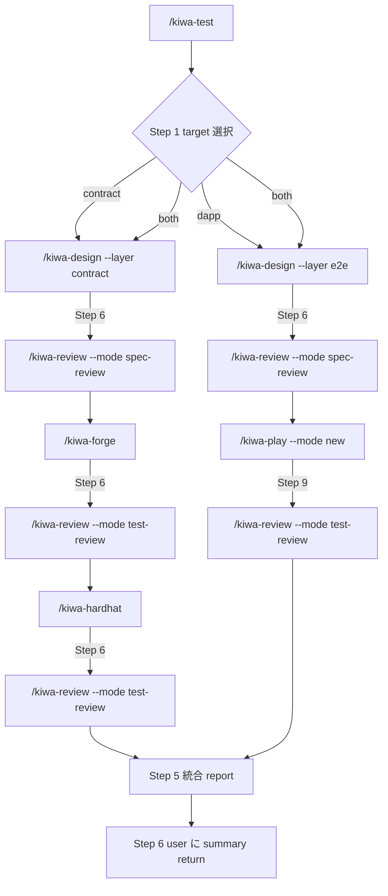

# /kiwa-test — kiwa skill chain 統合フロー skill

`/kiwa-design` → `/kiwa-forge` / `/kiwa-hardhat` / `/kiwa-play` → `/kiwa-review` を 1 コマンドで一括実行する orchestrator。 contract test / dApp e2e test / 両方 を user に選ばせ、 全 step を順次起動して最後に統合 report を Write する。 個別 skill を user が手動で順次叩く負担を解消、 OSS user が「とりあえず /kiwa-test --example X で全部走る」状態を実現。

## 前提

- repo root で起動 (cwd = kiwa repo root)
- 対象 example が `examples/{example}/` に存在 (`--example` 引数で指定)
- `examples/{example}/contracts/` (contract target 時) / `examples/{example}/app/` (dapp target 時) が存在
- pnpm install 済 + Foundry / Node.js 22+ / Playwright chromium install 済 (環境依存は子 skill 側で check)

## ユーザーのリクエスト

$ARGUMENTS

## オプション

- `--example {name}` — 対象 example 名 (必須、 `examples/{name}/` を参照)
- `--target {contract|dapp|both}` — 実行範囲 (省略時は Step 1 で AskUserQuestion)
- `--mode {sequential|parallel}` — target=both 時の実行順 (default `sequential`、 contract → dapp)
- `--lang {ja|en|<ISO 639-1>}` — 文書生成言語 (省略時は Step 0 で AskUserQuestion、 全子 skill に伝播)
- `--no-review` — 子 skill の review step (kiwa-review) を skip (全子 skill に `--no-review` を渡す)
- `--no-coverage-loop` — coverage auto loop を skip (kiwa-forge / kiwa-hardhat の auto loop を 1 round で終わる)
- `--no-codex` — kiwa-play の Codex 委譲を skip (test 件数 1-2 のみ推奨)
- `--rounds {N}` — Playwright 4 round 連続 PASS 検証の round 数 (default 4、 kiwa-play に伝播)

## 実行フロー

### Step 0: 文書生成言語の選択 (skill 起動時 1 回)

AskUserQuestion で文書生成言語を user に確認。 `--lang {code}` 引数指定時は skip。 詳細仕様は `references/doc-language-selection.md`。

確定後 `$DOC_LANG` を全子 skill に `--lang $DOC_LANG` で渡す。

### Step 1: target 選択 (skill 起動時 1 回)

`--target` 引数指定時は skip、 省略時は AskUserQuestion で確認:

```text
question: "実行する test 範囲を選択してください"
header: "test 範囲"
multiSelect: false

選択肢:
- label: "🔷 contract のみ (Foundry + Hardhat) (Recommended)"
  description: "理由 — 小規模 dApp / contract 中心の変更時。 kiwa-design (--layer contract) → kiwa-forge → kiwa-hardhat → kiwa-review の 4 step。 実行時間目安 5-10 分。 ⭐⭐⭐⭐⭐"
- label: "🌐 dApp e2e のみ (Playwright)"
  description: "理由 — UI / wallet flow 中心の変更時。 kiwa-design (--layer e2e) → kiwa-play → kiwa-review の 3 step。 実行時間目安 5-10 分。 ⭐⭐⭐⭐"
- label: "🔷+🌐 両方 (contract + dApp)"
  description: "理由 — full coverage check。 contract → dApp の順で順次実行 (--mode sequential が default)。 実行時間目安 15-25 分。 ⭐⭐⭐⭐"
```

確定後 `$TARGET` を skill 内変数に保持 (`contract` / `dapp` / `both`)。

### Step 2: 環境 + dir check

```bash
cd /Users/cardene/Desktop/projects/kiwa    # repo root に確実に移動 (caller cwd 依存防止)

# example dir 存在 check
[ -d "examples/$EXAMPLE" ] || { echo "ERROR: examples/$EXAMPLE が存在しません"; exit 1; }

# contract target check
if [ "$TARGET" = "contract" ] || [ "$TARGET" = "both" ]; then
  [ -d "examples/$EXAMPLE/contracts" ] || { echo "ERROR: examples/$EXAMPLE/contracts/ が存在しません"; exit 1; }
fi

# dapp target check
if [ "$TARGET" = "dapp" ] || [ "$TARGET" = "both" ]; then
  [ -d "examples/$EXAMPLE/app" ] || { echo "ERROR: examples/$EXAMPLE/app/ が存在しません (dapp target は app/ が必要)"; exit 1; }
fi

# 環境 check
forge --version || echo "WARN: Foundry 未 install"
node --version
```

エラー時は skill 停止 + 原因 + 解決方法を user に return。

### Step 3: contract test chain 実行 (target=contract or both)

`examples/{example}/` に cd した状態で子 skill を内部呼出。

```text
[Step 3a] /kiwa-design --layer contract --module {example} --input contracts/ --lang $DOC_LANG [--no-review]
  ↓ spec 生成 (Step 6 で kiwa-review --mode spec-review 自動呼出)
  ↓ tests/spec/contract/test-spec-{example}.{lang}.md が Write される

[Step 3b] /kiwa-forge --module {example} --gas-report --lang $DOC_LANG [--no-review] [--no-coverage-loop で auto loop を 1 round 化]
  ↓ test/{Contract}.t.sol 生成 + forge test 全 PASS + coverage 100% 到達 (auto loop)
  ↓ Step 5c で tests/reports/contract/coverage-report-{example}.{lang}.md Write
  ↓ Step 6 で kiwa-review --mode test-review 自動呼出
  ↓ tests/reports/review/test-review-{example}.{lang}.md Write

[Step 3c] /kiwa-hardhat --module {example} --gas-report --lang $DOC_LANG [--no-review] [--no-coverage-loop]
  ↓ hardhat-test/{Contract}.test.cjs 生成 + hardhat test 4 round PASS + coverage 100%
  ↓ 同様の review + report
```

各 step の結果 (PASS / FAIL / report path / 件数) を skill 内変数に集約。

### Step 4: dApp e2e test chain 実行 (target=dapp or both)

target=both の場合、 Step 3 完了後に実行。 mode=sequential (default) なら 3 完了待ち、 mode=parallel なら 3 と並走 (ただし parallel は port 衝突リスクあるため非推奨)。

```text
[Step 4a] /kiwa-design --layer e2e --module {example} --input app/ --lang $DOC_LANG [--no-review]
  ↓ spec 生成 (Step 6 で spec-review 自動呼出)
  ↓ tests/spec/e2e/test-spec-{example}.{lang}.md Write

[Step 4b] /kiwa-play --mode new --rounds {N} --lang $DOC_LANG [--no-review] [--no-codex]
  ↓ tests/{example}.spec.ts + helper 生成
  ↓ playwright test 4 round PASS (flaky 0 検証)
  ↓ Step 9 で kiwa-review --mode test-review 自動呼出
  ↓ tests/reports/review/test-review-{example}.{lang}.md Write (contract と同 path、 後勝ち or suffix 区別)
```

### Step 5: 統合 report Write

全 step 完了後、 `tests/reports/integrated/{example}-{target}.{$DOC_LANG}.md` に統合 report を Write。

```markdown
# Integrated Test Report — {example} ({target})

Generated: {ISO8601}
Skill: /kiwa-test --example {example} --target {target} --lang {lang}
Total duration: {sec} 秒

## 1. 実行サマリ

| 段階 | skill | 結果 | 件数 / score |
|---|---|---|---|
| 1. spec 生成 (contract) | /kiwa-design (Layer 1) | ✅ PASS | TC 13 件 / spec-review 8.2/10 |
| 2. Foundry test | /kiwa-forge | ✅ PASS | 27/27 / coverage 100% / test-review 7.8/10 |
| 3. Hardhat test | /kiwa-hardhat | ✅ PASS | 24/24 × 4 round / coverage 100% / test-review 7.8/10 |
| 4. spec 生成 (e2e) | /kiwa-design (Layer 1) | ✅ PASS | TC 13 件 / spec-review 8.0/10 |
| 5. Playwright test | /kiwa-play | ✅ PASS | 12 passed / 1 skipped / 4 round / test-review 7.5/10 |

**判定 — ✅ ALL PASS** ({reason}) / **⚠️ PARTIAL FAIL** ({failed_step}) / **❌ FAIL** ({failed_step})

## 2. 生成 file 一覧

| file | path | 用途 |
|---|---|---|
| spec (contract) | tests/spec/contract/test-spec-{example}.{lang}.md | Layer 1 出力 |
| spec (e2e) | tests/spec/e2e/test-spec-{example}.{lang}.md | Layer 1 出力 |
| Foundry test | examples/{example}/test/{Contract}.t.sol | Layer 2 出力 |
| Hardhat test | examples/{example}/hardhat-test/{Contract}.test.cjs | Layer 2 出力 |
| Playwright spec | examples/{example}/tests/{example}.spec.ts | Layer 2 出力 |
| coverage report (contract) | tests/reports/contract/coverage-report-{example}.{lang}.md | auto loop 結果 |
| review report (spec / test) | tests/reports/review/{spec\|test}-review-{example}.{lang}.md | reviewer 判定 |

## 3. critical / major 指摘 (review 集約)

各子 review report から critical / major 指摘を集約。

### 1. {severity}: {issue}
- **source**: {review report path}
- **詳細**: {issue}
- **改善案**: {suggestion}

## 4. 次アクション

- ✅ ALL PASS → docs 更新 + PR 起票推奨
- ⚠️ PARTIAL FAIL → 失敗 step の修正 (spec 修正 / test 追加 / coverage 未達対応)
- ❌ FAIL → critical 修正必須、 該当子 skill を再起動 (`/kiwa-{forge|hardhat|play} --module {example}`)

## 5. 各子 skill report への link

- spec-review (contract): `tests/reports/review/spec-review-{example}-contract.{lang}.md`
- spec-review (e2e): `tests/reports/review/spec-review-{example}-e2e.{lang}.md`
- test-review (Foundry / Hardhat / Playwright): `tests/reports/review/test-review-{example}-{tool}.{lang}.md`
- coverage report: `tests/reports/contract/coverage-report-{example}.{lang}.md` / `tests/reports/e2e/coverage-report-{example}.{lang}.md`
```

### Step 6: 完了 summary を user に return

```text
🎉 /kiwa-test 完了 — {example} ({target})

判定: ✅ ALL PASS / ⚠️ PARTIAL FAIL / ❌ FAIL

実行サマリ:
- contract: Foundry 27/27 + Hardhat 24/24 × 4 / coverage 100%
- dapp e2e: Playwright 12/13 PASS (1 skip) / 4 round flaky 0

統合 report: tests/reports/integrated/{example}-{target}.{lang}.md

次アクション: {recommend}
```

## エラー時の挙動

- 子 skill が FAIL → 該当 step で停止、 user に AskUserQuestion で「skip して次 step / 中断 / 個別 debug」 を選択
- example dir or contracts/ or app/ 不在 → 即停止、 解決方法を return (例 「examples/X/app/ がない、 UI を持つ別 example を選んでください」)
- spec 生成失敗 → Layer 2 へ進めない、 中断
- test 実行 PASS だが review FAIL critical → 警告 + 修正必須を summary に明示、 next action に修正手順

## chain 連携 (子 skill が auto 呼出する skill)

`/kiwa-test` から見ると以下の chain が一括で起動される (各子 skill 内部で更に sub-skill が auto 呼出される)。



## 完了条件

- `--target` で指定された範囲 (contract / dapp / both) の全 step が PASS or 意図的 skip
- `tests/reports/integrated/{example}-{target}.{$DOC_LANG}.md` が Write 済
- 各子 skill の report path が integrated report 内に link 集約

## references

- `references/doc-language-selection.md` — 文書生成言語選択 共通 SSOT (5 kiwa skill 共用、 symlink で参照)

## 関連

- 子 skill: `.claude/skills/kiwa-{design,forge,hardhat,play,review}/SKILL.md`
- 観点 SSOT: `.claude/skills/kiwa-design/references/viewpoints-catalog.md` (11 観点)
- 親 Issue (本 skill の motivation): #215 (mint-nft fixtures 化 docs 検証で gap 発見、 1 コマンド化要望)
