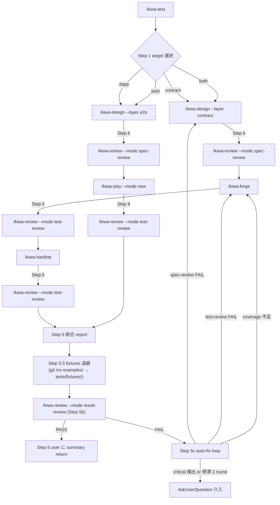

# /kiwa-test — kiwa skill chain 統合フロー skill

`/kiwa-design` → `/kiwa-forge` / `/kiwa-hardhat` / `/kiwa-play` → `/kiwa-review` を 1 コマンドで一括実行する orchestrator。 contract test / dApp e2e test / 両方 を user に選ばせ、 全 step を順次起動して最後に統合 report を Write する。 個別 skill を user が手動で順次叩く負担を解消、 OSS user が「とりあえず /kiwa-test --example X で全部走る」状態を実現。

## 前提

- repo root で起動 (cwd = kiwa repo root)
- 対象 example が `examples/{example}/` に存在 (`--example` 引数で指定)
- `examples/{example}/contracts/` (contract target 時) / `examples/{example}/app/` (dapp target 時) が存在
- pnpm install 済 + Foundry / Node.js 22+ / Playwright chromium install 済 (環境依存は子 skill 側で check)

## ユーザーのリクエスト

$ARGUMENTS

## オプション

- `--example {name}` — 対象 example 名 (必須、 `examples/{name}/` を参照)
- `--target {contract|dapp|both}` — 実行範囲 (省略時は Step 1b で AskUserQuestion)
- `--runner {foundry|hardhat|both}` — contract test の runner 選択 (省略時は Step 1a で LLM 自動判断 + fallback で AskUserQuestion、 target=dapp 時は無視)
- `--mode {sequential|parallel}` — target=both 時の実行順 (default `sequential`、 contract → dapp)
- `--lang {ja|en|<ISO 639-1>}` — 文書生成言語 (省略時は Step 0 で AskUserQuestion、 全子 skill に伝播)
- `--no-review` — 子 skill の review step (kiwa-review) を skip (全子 skill に `--no-review` を渡す)
- `--no-coverage-loop` — coverage auto loop を skip (kiwa-forge / kiwa-hardhat の auto loop を 1 round で終わる)
- `--no-codex` — kiwa-play の Codex 委譲を skip (test 件数 1-2 のみ推奨)
- `--rounds {N}` — Playwright 4 round 連続 PASS 検証の round 数 (default 4、 kiwa-play に伝播)
- `--auto-cleanup` — Step 2.5 既存 test 検出時の AskUserQuestion を skip + 自動削除 (CI / 自動化用)
- `--no-auto-fix` — Step 5c auto-fix loop を skip (review FAIL でも修正試行せず終了、 CI / 単発確認用)

## 実行フロー

### Step 0: 文書生成言語の選択 (skill 起動時 1 回)

AskUserQuestion で文書生成言語を user に確認。 `--lang {code}` 引数指定時は skip。 詳細仕様は `references/doc-language-selection.md`。

確定後 `$DOC_LANG` を全子 skill に `--lang $DOC_LANG` で渡す。

### Step 1a: runner 自動判断 (skill 起動時 1 回、 contract 関連 target のみ)

`--runner` 引数指定時は skip。 省略時は LLM が project の state から自動判断する。

判定ロジック (順に評価):

```bash
ROOT=$(git rev-parse --show-toplevel)
HAS_FOUNDRY=$([ -f "$ROOT/examples/$EXAMPLE/foundry.toml" ] && echo 1 || echo 0)
HAS_HARDHAT=$(ls "$ROOT/examples/$EXAMPLE/"hardhat.config.* 2>/dev/null | head -1 | grep -q . && echo 1 || echo 0)
```

| 検出パターン | `$RUNNER` 確定値 | summary 提示 |
|---|---|---|
| foundry.toml と hardhat.config.* 両方検出 | `both` | 「foundry.toml と hardhat.config.* を検出、 両 runner で同 spec を独立検証」 |
| foundry.toml のみ検出 | `foundry` | 「foundry.toml のみ検出、 Foundry test を生成」 |
| hardhat.config.* のみ検出 | `hardhat` | 「hardhat.config.* のみ検出、 Hardhat test を生成」 |
| どちらも検出されない | (fallback) | AskUserQuestion で user 確認、 `foundry` / `hardhat` / `both` を選択 |

確定後 `$RUNNER` を skill 内変数に保持。 user に summary を 1 文で提示 (例 「foundry.toml と hardhat.config.cjs を検出、 両 runner (Foundry + Hardhat) で同 spec を独立検証します」)。

`--target dapp` の場合は contract chain が走らないため `$RUNNER` 判定を skip し、 `$RUNNER` は未定義のまま。

### Step 1b: target 選択 (skill 起動時 1 回)

`--target` 引数指定時は skip、 省略時は AskUserQuestion で確認:

```text
question: "実行する test 範囲を選択してください"
header: "test 範囲"
multiSelect: false

選択肢:
- label: "🔷 contract のみ ($RUNNER 検出済) (Recommended)"
  description: "理由 — 小規模 dApp / contract 中心の変更時。 kiwa-design (--layer contract) → ($RUNNER に応じて) kiwa-forge / kiwa-hardhat / 両方 → kiwa-review。 実行時間目安 5-10 分 (single runner) / 10-15 分 (both)。 ⭐⭐⭐⭐⭐"
- label: "🌐 dApp e2e のみ (Playwright)"
  description: "理由 — UI / wallet flow 中心の変更時。 kiwa-design (--layer e2e) → kiwa-play → kiwa-review の 3 step。 実行時間目安 5-10 分。 ⭐⭐⭐⭐"
- label: "🔷+🌐 両方 (contract + dApp)"
  description: "理由 — full coverage check。 contract ($RUNNER) → dApp の順で順次実行 (--mode sequential が default)。 実行時間目安 15-30 分。 ⭐⭐⭐⭐"
```

確定後 `$TARGET` を skill 内変数に保持 (`contract` / `dapp` / `both`)。

### Step 2: 環境 + dir check

```bash
cd "$(git rev-parse --show-toplevel)"    # repo root に確実に移動 (caller cwd 依存防止)

# example dir 存在 check
[ -d "examples/$EXAMPLE" ] || { echo "ERROR: examples/$EXAMPLE が存在しません"; exit 1; }

# contract target check
if [ "$TARGET" = "contract" ] || [ "$TARGET" = "both" ]; then
  [ -d "examples/$EXAMPLE/contracts" ] || { echo "ERROR: examples/$EXAMPLE/contracts/ が存在しません"; exit 1; }
fi

# dapp target check
if [ "$TARGET" = "dapp" ] || [ "$TARGET" = "both" ]; then
  [ -d "examples/$EXAMPLE/app" ] || { echo "ERROR: examples/$EXAMPLE/app/ が存在しません (dapp target は app/ が必要)"; exit 1; }
fi

# 環境 check
forge --version || echo "WARN: Foundry 未 install"
node --version
```

エラー時は skill 停止 + 原因 + 解決方法を user に return。

### Step 2.5: 既存 test 検出 + 削除確認

retrofit walkthrough は examples 側を空 dir 状態から開始するため、 既存 test (`examples/{example}/test/` `hardhat-test/` `tests/`) が存在する場合は user に削除確認する。

```bash
# 検出ロジック
EXISTING=()
[ "$TARGET" != "dapp" ] && [ -d "examples/$EXAMPLE/test" ] && [ -n "$(ls -A examples/$EXAMPLE/test 2>/dev/null)" ] && EXISTING+=("examples/$EXAMPLE/test")
[ "$TARGET" != "dapp" ] && [ -d "examples/$EXAMPLE/hardhat-test" ] && [ -n "$(ls -A examples/$EXAMPLE/hardhat-test 2>/dev/null)" ] && EXISTING+=("examples/$EXAMPLE/hardhat-test")
[ "$TARGET" != "contract" ] && [ -d "examples/$EXAMPLE/tests" ] && [ -n "$(ls -A examples/$EXAMPLE/tests 2>/dev/null)" ] && EXISTING+=("examples/$EXAMPLE/tests")
# spec 既存 check
[ -f "tests/spec/contract/test-spec-${EXAMPLE}.${DOC_LANG}.md" ] && EXISTING+=("tests/spec/contract/test-spec-${EXAMPLE}.${DOC_LANG}.md")
[ -f "tests/spec/e2e/test-spec-${EXAMPLE}.${DOC_LANG}.md" ] && EXISTING+=("tests/spec/e2e/test-spec-${EXAMPLE}.${DOC_LANG}.md")
```

既存 file / dir 検出時は AskUserQuestion で 3 択:

```text
question: "examples/{example}/ と tests/spec/ に既存 file が検出されました。 どう処理しますか?"
header: "既存 test 処理"
multiSelect: false

選択肢:
- label: "🗑️ 削除して 0 から再生成 (Recommended)"
  description: "理由 — skill chain を clean state で再走、 retrofit walkthrough と同じ条件。 既存 test の影響を完全排除。 削除対象 file が user に列挙される (列挙後 user 最終確認なしで削除実行)。 ⭐⭐⭐⭐⭐"
- label: "📝 上書き許可 (skill の判定に委ねる)"
  description: "理由 — kiwa-design は spec を新規 file で衝突回避 (-2.md として連番)、 kiwa-forge / kiwa-hardhat / kiwa-play は既存 test を上書き or extend mode に切替。 既存 test と新規 test が並立する可能性、 chain の途中で意図しない state になるリスク。 ⭐⭐⭐"
- label: "🛑 skill chain を中断"
  description: "理由 — 既存 test の処理方針を一旦保留し /kiwa-test を中断。 user が手動でリセットしてから再起動。 リセットコマンドは tests/docs/run-tests.ja.md Step 0 を参照。 ⭐⭐"
```

🗑️ 選択時は以下を実行 (cwd 問わず動く):

```bash
ROOT=$(git rev-parse --show-toplevel)
for path in "${EXISTING[@]}"; do
  if [ -d "$ROOT/$path" ]; then
    rm -rf "$ROOT/$path"
    echo "🗑️ removed dir: $path"
  elif [ -f "$ROOT/$path" ]; then
    rm -f "$ROOT/$path"
    echo "🗑️ removed file: $path"
  fi
done

# 関連 cache / report も削除 (再走時の混乱防止)
[ "$TARGET" != "dapp" ] && rm -rf "$ROOT/examples/$EXAMPLE"/{forge-out,hardhat-cache,hardhat-artifacts,cache,coverage,coverage.json}
[ "$TARGET" != "contract" ] && rm -rf "$ROOT/examples/$EXAMPLE"/{test-results,playwright-report,.next}
rm -rf "$ROOT/tests/reports"/{contract,e2e,review,integrated}/*${EXAMPLE}* 2>/dev/null || true
```

📝 上書き許可選択時は何もせず Step 3 へ進む。 🛑 中断選択時は skill を停止 + リセットコマンドを return。

`--auto-cleanup` 引数 (kiwa-test 引数追加予定) で AskUserQuestion を skip + 自動削除も可能 (CI / 自動化用)。

### Step 3: contract test chain 実行 (target=contract or both)

`examples/{example}/` に cd した状態で子 skill を `$RUNNER` 分岐に応じて内部呼出。 Step 3a (spec 生成) は runner 共通、 Step 3b / 3c は `$RUNNER` で選択実行。

```text
[Step 3a] /kiwa-design --layer contract --module {example} --input contracts/ --lang $DOC_LANG [--no-review]
  ↓ spec 生成 (Step 6 で kiwa-review --mode spec-review 自動呼出)
  ↓ tests/spec/contract/test-spec-{example}.{lang}.md が Write される

[Step 3b] $RUNNER ∈ {foundry, both} の場合のみ実行:
  /kiwa-forge --module {example} --gas-report --lang $DOC_LANG [--no-review] [--no-coverage-loop で auto loop を 1 round 化]
  ↓ test/{Contract}.t.sol 生成 + forge test 全 PASS + coverage 100% 到達 (auto loop)
  ↓ Step 5c で tests/reports/contract/coverage-report-{example}.{lang}.md Write
  ↓ Step 6 で kiwa-review --mode test-review 自動呼出
  ↓ tests/reports/review/test-review-{example}-foundry.{lang}.md Write

[Step 3c] $RUNNER ∈ {hardhat, both} の場合のみ実行:
  /kiwa-hardhat --module {example} --gas-report --lang $DOC_LANG [--no-review] [--no-coverage-loop]
  ↓ hardhat-test/{Contract}.test.cjs 生成 + hardhat test 4 round PASS + coverage 100%
  ↓ tests/reports/review/test-review-{example}-hardhat.{lang}.md Write
```

`$RUNNER` 分岐の実装パターン:

```bash
if [ "$RUNNER" = "foundry" ] || [ "$RUNNER" = "both" ]; then
  # invoke /kiwa-forge
fi
if [ "$RUNNER" = "hardhat" ] || [ "$RUNNER" = "both" ]; then
  # invoke /kiwa-hardhat
fi
```

各 step の結果 (PASS / FAIL / report path / 件数) を skill 内変数に集約。 `$RUNNER` が `foundry` か `hardhat` 単独の場合、 統合 report と result-review でも該当 runner のみの結果を集約する (省略 runner は report 内で "skipped (--runner={selected})" として明示)。

### Step 4: dApp e2e test chain 実行 (target=dapp or both)

target=both の場合、 Step 3 完了後に実行。 mode=sequential (default) なら 3 完了待ち、 mode=parallel なら 3 と並走 (ただし parallel は port 衝突リスクあるため非推奨)。

```text
[Step 4a] /kiwa-design --layer e2e --module {example} --input app/ --lang $DOC_LANG [--no-review]
  ↓ spec 生成 (Step 6 で spec-review 自動呼出)
  ↓ tests/spec/e2e/test-spec-{example}.{lang}.md Write

[Step 4b] /kiwa-play --mode new --rounds {N} --lang $DOC_LANG [--no-review] [--no-codex]
  ↓ tests/{example}.spec.ts + helper 生成
  ↓ playwright test 4 round PASS (flaky 0 検証)
  ↓ Step 9 で kiwa-review --mode test-review 自動呼出
  ↓ tests/reports/review/test-review-{example}.{lang}.md Write (contract と同 path、 後勝ち or suffix 区別)
```

### Step 5: 統合 report Write

全 step 完了後、 `tests/reports/integrated/{example}-{target}.{$DOC_LANG}.md` に統合 report を Write。

```markdown
# Integrated Test Report — {example} ({target}, runner={runner})

Generated: {ISO8601}
Skill: /kiwa-test --example {example} --target {target} --runner {runner} --lang {lang}
Total duration: {sec} 秒

## 1. 実行サマリ

| 段階 | skill | 結果 | 件数 / score |
|---|---|---|---|
| 1. spec 生成 (contract) | /kiwa-design (Layer 1) | ✅ PASS | TC 13 件 / spec-review 8.2/10 |
| 2. Foundry test | /kiwa-forge | ✅ PASS or ⏭️ skipped (--runner=hardhat) | 27/27 / coverage 100% / test-review 7.8/10 |
| 3. Hardhat test | /kiwa-hardhat | ✅ PASS or ⏭️ skipped (--runner=foundry) | 24/24 × 4 round / coverage 100% / test-review 7.8/10 |
| 4. spec 生成 (e2e) | /kiwa-design (Layer 1) | ✅ PASS | TC 13 件 / spec-review 8.0/10 |
| 5. Playwright test | /kiwa-play | ✅ PASS | 12 passed / 1 skipped / 4 round / test-review 7.5/10 |

**判定 — ✅ ALL PASS** ({reason}) / **⚠️ PARTIAL FAIL** ({failed_step}) / **❌ FAIL** ({failed_step})

## 2. 生成 file 一覧

| file | path | 用途 |
|---|---|---|
| spec (contract) | tests/spec/contract/test-spec-{example}.{lang}.md | Layer 1 出力 |
| spec (e2e) | tests/spec/e2e/test-spec-{example}.{lang}.md | Layer 1 出力 |
| Foundry test (退避済) | tests/fixtures/{example}/contract-test/{Contract}.t.sol | Layer 2 出力 → Step 5.5 で退避 |
| Hardhat test (退避済) | tests/fixtures/{example}/hardhat-test/{Contract}.test.cjs | Layer 2 出力 → Step 5.5 で退避 |
| Playwright spec (退避済) | tests/fixtures/{example}/e2e-test/{example}.spec.ts | Layer 2 出力 → Step 5.5 で退避 |
| coverage report (contract) | tests/reports/contract/coverage-report-{example}.{lang}.md | auto loop 結果 |
| review report (spec / test) | tests/reports/review/{spec\|test}-review-{example}.{lang}.md | reviewer 判定 |

## 3. critical / major 指摘 (review 集約)

各子 review report から critical / major 指摘を集約。

### 1. {severity}: {issue}
- **source**: {review report path}
- **詳細**: {issue}
- **改善案**: {suggestion}

## 4. 次アクション

- ✅ ALL PASS → docs 更新 + PR 起票推奨
- ⚠️ PARTIAL FAIL → 失敗 step の修正 (spec 修正 / test 追加 / coverage 未達対応)
- ❌ FAIL → critical 修正必須、 該当子 skill を再起動 (`/kiwa-{forge|hardhat|play} --module {example}`)

## 5. 各子 skill report への link

- spec-review (contract): `tests/reports/review/spec-review-{example}-contract.{lang}.md`
- spec-review (e2e): `tests/reports/review/spec-review-{example}-e2e.{lang}.md`
- test-review (Foundry / Hardhat / Playwright): `tests/reports/review/test-review-{example}-{tool}.{lang}.md`
- coverage report: `tests/reports/contract/coverage-report-{example}.{lang}.md` / `tests/reports/e2e/coverage-report-{example}.{lang}.md`
```

### Step 5.5: 生成 test を tests/fixtures/{example}/ に永続化 (退避)

example 側の `test/` `hardhat-test/` `tests/` は `.gitignore` で除外されているため、 生成 test を commit 対象化するには `tests/fixtures/{example}/` への退避が必須。 本 step で git mv 経由で履歴保持移動し PR に test code を含める。

```bash
ROOT=$(git rev-parse --show-toplevel)
FIXTURES_BASE="$ROOT/tests/fixtures/$EXAMPLE"
mkdir -p "$FIXTURES_BASE"

# 退避対象 (target に応じて 1-3 dir)
declare -a MOVES=()
[ "$TARGET" != "dapp" ] && [ -d "$ROOT/examples/$EXAMPLE/test" ] && MOVES+=("test:contract-test")
[ "$TARGET" != "dapp" ] && [ -d "$ROOT/examples/$EXAMPLE/hardhat-test" ] && MOVES+=("hardhat-test:hardhat-test")
[ "$TARGET" != "contract" ] && [ -d "$ROOT/examples/$EXAMPLE/tests" ] && MOVES+=("tests:e2e-test")
```

衝突回避 — 退避先 `tests/fixtures/{example}/{contract-test, hardhat-test, e2e-test}/` が既存 + 非空の場合、 AskUserQuestion で user に確認:

```text
question: "tests/fixtures/{example}/{subdir}/ が既存です。 どう処理しますか?"
header: "fixtures 衝突"
multiSelect: false

選択肢:
- label: "🗑️ 既存を削除して上書き (Recommended)"
  description: "理由 — /kiwa-test の生成物が最新の完成形、 既存 fixtures は古い snapshot として上書き。 既存 file は git の履歴から復元可能。 ⭐⭐⭐⭐⭐"
- label: "🔢 連番 suffix で並立 (-2 suffix)"
  description: "理由 — 既存 fixtures を残しつつ新 fixtures を `{subdir}-2/` として並立。 比較・diff 用途。 ⭐⭐⭐"
- label: "⏭️ 退避 skip (examples/ に残置)"
  description: "理由 — 退避せず examples/ 側に残す。 session 後消失するため非推奨、 確認目的のみ。 ⭐"
```

`--auto-cleanup` 引数指定時は AskUserQuestion を skip + 上書き default。

退避実行 (上書き default の場合):

```bash
for spec in "${MOVES[@]}"; do
  src="${spec%%:*}"
  dst="${spec##*:}"
  src_path="$ROOT/examples/$EXAMPLE/$src"
  dst_path="$FIXTURES_BASE/$dst"

  if [ -d "$dst_path" ] && [ -n "$(ls -A "$dst_path" 2>/dev/null)" ]; then
    rm -rf "$dst_path"
  fi

  # 履歴保持のため git mv 優先、 失敗時は plain mv で fallback (tracked でない場合)
  git mv "examples/$EXAMPLE/$src" "tests/fixtures/$EXAMPLE/$dst" 2>/dev/null \
    || { mkdir -p "$(dirname "$dst_path")"; mv "$src_path" "$dst_path"; git add "tests/fixtures/$EXAMPLE/$dst"; }

  echo "📦 退避: examples/$EXAMPLE/$src → tests/fixtures/$EXAMPLE/$dst"
done
```

退避後 `git status` で stage 状態を確認、 退避先 path を skill 内変数 `$FIXTURES_PATHS` に保持して Step 5 統合 report の Section 2 と Step 6 summary に明示する。

### Step 5b: kiwa-review 自動呼出 (result-review mode)

Step 5 で統合 report Write 完了後、 test 実行結果の総合品質を独立 review する。 `/kiwa-review --mode result-review --module {example}` を内部呼出し、 coverage 達成度 / passing 件数 / flaky 兆候 / 子 review 集約 / 後追い項目 を 5 軸で判定。

呼出例:
```text
/kiwa-review --mode result-review --module {example} --lang $DOC_LANG
```

review 結果:
- PASS (weighted_score >= 7.0) → Step 6 へ
- FAIL → Step 5c (auto-fix loop) へ

report 出力先: `tests/reports/review/result-review-{example}.{$DOC_LANG}.md`

`--no-review` 引数で本 step を skip 可能 (CI 用、 skip 時は Step 5c も skip して Step 6 へ)。

### Step 5c: auto-fix loop (review FAIL 時の自走修正、 上限なし)

result-review or 子 review (spec-review / test-review) が FAIL の場合、 review 指摘を元に spec / test code を再生成して再 test。 上限なしで loop、 以下 3 条件のいずれかで終了。

| 終了条件 | アクション |
|---|---|
| **PASS** (result-review weighted_score >= 7.0 + critical 0) | Step 6 へ完了 |
| **停滞** (連続 2 round で result-review weighted_score delta 0) | loop 終了、 user 介入を AskUserQuestion (継続 / 諦めて完了 / 中断) |
| **critical 検出** (security / 設計根本問題、 自動修正不可) | loop 即停止、 user 介入必須 (修正方針を user 判断) |

#### loop 内部 flow

各 round で以下を実行:

1. **failure 分類** — どの review が FAIL したか + 指摘内容を分類:
   - `spec-review` FAIL (観点漏れ / 優先度ミス / 抽象表現過多) → spec 再生成
   - `test-review` FAIL (TC mapping 漏れ / assertion 抽象化 / 追加 test 提案) → test code 再生成
   - `result-review` FAIL (coverage 未達 / flaky 兆候 / 後追い項目残存) → 対応する Layer 2 skill 再走 (coverage 不足は kiwa-forge auto loop、 flaky は該当 Layer 2 を再生成)

2. **対応 skill 再走** — review 指摘を prompt に含めて該当 skill を再起動:
   ```text
   # spec-review FAIL の場合
   /kiwa-design --layer {layer} --module {module} --input {input} --lang $DOC_LANG
     "[前 round review 指摘] {critical / major bullets を貼付}、 これを反映して spec を再生成してください"

   # test-review FAIL の場合
   /kiwa-forge --module {module} --gas-report --lang $DOC_LANG
     "[前 round review 指摘] {bullets}、 不足 TC を追加 + assertion 具体化してください"

   # result-review FAIL (coverage 不足) の場合
   /kiwa-forge --module {module} --gas-report --lang $DOC_LANG
     (coverage auto loop が真の未踏 line を追加 test で cover、 #222 ロジックに従う)
   ```

3. **再 test + 再 review** — Layer 2 完了後に再度 review chain (spec-review / test-review / result-review) を回す

4. **round 別 report 累積** — `tests/reports/integrated/{example}-{target}-round-{N}.md` を round ごとに保存、 canonical report は最終 round の内容で上書き

5. **改善判定** — 前 round と result-review weighted_score を比較:
   - 改善あり (delta > 0) → 次 round 継続
   - 改善なし (delta 0) が 2 round 連続 → 停滞判定で終了

#### critical 検出時の挙動

以下 6 種の critical は **auto-fix 不可** として user 介入必須:

| critical 種別 | 理由 |
|---|---|
| security 関連 (signature replay / access control bypass 等) | 自動修正で security hole を埋めるのは危険、 設計判断必須 |
| 設計根本問題 (spec の「対象機能」 が contract / app と不一致) | spec 設計段階の根本誤り、 user の機能要件確認必要 |
| contract 未実装 function に対する test 提案 | test 追加でなく contract 実装が必要、 別 issue |
| `forge build` / `hardhat compile` 失敗 (環境 / 依存問題) | skill 修正でなく環境調査必要 |
| UI 不在で UI 起点 test 不可能 (e2e で app/ 欠落) | skill では実装不可、 user が UI 実装 or target 変更必要 |
| **kiwa fixture 拡張前提の test (改善 6 / Issue #227)** | **`browser.newContext()` で別 PK wallet inject / `anvil_setStorageAt` storage 改変 / wallet 接続 race polling 等を必要とする test は @kiwa-test/core helper 拡張が前提、 auto-fix loop 内で実装すると core API の設計判断を Opus 裁量で固定するリスク。 別 Issue 化推奨** |

##### 「kiwa fixture 拡張前提」 critical の判定 logic

以下 grep pattern のいずれかが test code 生成提案に含まれる場合、 本 critical として分類する。

| grep pattern | 拡張対象 helper |
|---|---|
| `browser.newContext()` を伴う multi-context test | `injectMultipleWallets` 系 helper |
| `anvil_setStorageAt` / `hardhat_setStorageAt` の JSON-RPC を直接叩く test | `setStorageSlot` 系 helper |
| wallet connection race を polling する独自実装 | `waitForWalletConnected` 系 helper |
| `@walletconnect/sign-client` 等の追加 SDK 依存を要する test | wallet support 系 helper (例 #168 WalletConnect v2) |
| Safe / Gnosis 等の specific wallet 統合を要する test | wallet support 系 helper (例 #169 Safe) |

検出時のアクション。

1. auto-fix loop を **即停止** (round 数に関わらず)
2. AskUserQuestion で 3 択を user に提示:
   - `🆕 別 Issue 化推奨 (helper 拡張 → 後追い PR)` (Recommended、 ⭐⭐⭐⭐⭐)
   - `📝 spec の「不足している仕様」 に bullet 追加 → TC skip` (⭐⭐⭐)
   - `🛑 中断 (user 手動判断)` (⭐⭐)
3. 別 Issue 化を選択した場合は `gh api repos/{owner}/{repo}/issues --method POST` で Issue 起票 (template = `feat-improve`、 title は「feat(core): {helper 名} を kiwa fixture に追加して {TC 観点} を表現可能化」)

検出時は `AskUserQuestion` で「修正方針を入力 / 中断 / 無視して完了 (critical 残存)」 を選択。

### Step 6: 完了 summary を user に return

```text
🎉 /kiwa-test 完了 — {example} ({target})

判定: ✅ ALL PASS / ⚠️ PARTIAL FAIL / ❌ FAIL

実行サマリ:
- contract: Foundry 27/27 + Hardhat 24/24 × 4 / coverage 100%
- dapp e2e: Playwright 12/13 PASS (1 skip) / 4 round flaky 0

統合 report: tests/reports/integrated/{example}-{target}.{lang}.md
test code 退避先: tests/fixtures/{example}/{contract-test, hardhat-test, e2e-test}/ (PR に含まれます)

次アクション: {recommend}
```

## エラー時の挙動

- 子 skill が FAIL → 該当 step で停止、 user に AskUserQuestion で「skip して次 step / 中断 / 個別 debug」 を選択
- example dir or contracts/ or app/ 不在 → 即停止、 解決方法を return (例 「examples/X/app/ がない、 UI を持つ別 example を選んでください」)
- spec 生成失敗 → Layer 2 へ進めない、 中断
- test 実行 PASS だが review FAIL critical → 警告 + 修正必須を summary に明示、 next action に修正手順

## chain 連携 (子 skill が auto 呼出する skill)

`/kiwa-test` から見ると以下の chain が一括で起動される (各子 skill 内部で更に sub-skill が auto 呼出される)。



## 完了条件

- `--target` で指定された範囲 (contract / dapp / both) の全 step が PASS or 意図的 skip
- `--runner` (contract 関連 target のみ) で選択された runner の test chain が PASS、 非選択 runner は report 内で skipped と明示
- `tests/reports/integrated/{example}-{target}.{$DOC_LANG}.md` が Write 済
- 各子 skill の report path が integrated report 内に link 集約
- 生成 test が `tests/fixtures/{example}/{contract-test, hardhat-test, e2e-test}/` に退避済 (Step 5.5、 `--target` 範囲外と非選択 runner の subdir は対象外)

## references

- `references/doc-language-selection.md` — 文書生成言語選択 共通 SSOT (5 kiwa skill 共用、 symlink で参照)

## 関連

- 子 skill: `.claude/skills/kiwa-{design,forge,hardhat,play,review}/SKILL.md`
- 観点 SSOT: `.claude/skills/kiwa-design/references/viewpoints-catalog.md` (11 観点)
- 親 Issue (本 skill の motivation): #215 (mint-nft fixtures 化 docs 検証で gap 発見、 1 コマンド化要望)
