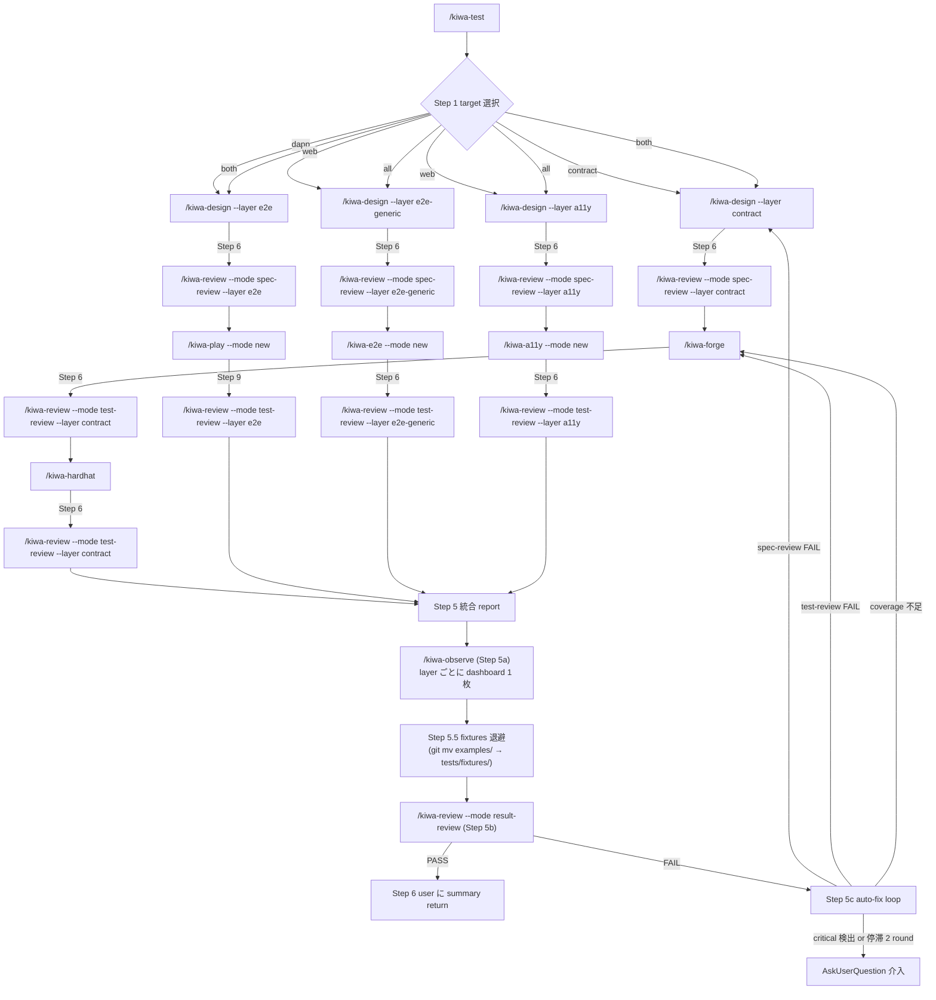

# /kiwa-test — kiwa skill chain 統合フロー skill

`/kiwa-design` → `/kiwa-forge` / `/kiwa-hardhat` / `/kiwa-play` → `/kiwa-review` を 1 コマンドで一括実行する orchestrator。 contract test / dApp e2e test / 両方 を user に選ばせ、 全 step を順次起動して最後に統合 report を Write する。 個別 skill を user が手動で順次叩く負担を解消、 OSS user が「とりあえず /kiwa-test --example X で全部走る」状態を実現。

## 前提

- repo root で起動 (cwd = kiwa repo root)
- 対象 example が `examples/{example}/` に存在 (`--example` 引数で指定)
- `examples/{example}/contracts/` (contract target 時) / `examples/{example}/app/` (dapp target 時) が存在
- pnpm install 済 + Foundry / Node.js 22+ / Playwright chromium install 済 (環境依存は子 skill 側で check)

## ユーザーのリクエスト

$ARGUMENTS

## オプション

- `--example {name}` — 対象 example 名 (必須、 `examples/{name}/` を参照)
- `--target {contract|dapp|web|both|all}` — 実行範囲 (省略時は Step 1b で AskUserQuestion)。 `contract` は Foundry / Hardhat、 `dapp` は dApp e2e (Playwright + viem + anvil、 `/kiwa-play`)、 `web` は非 web3 web app 2 surface セット (`/kiwa-e2e` + `/kiwa-a11y`)、 `both` は contract + dapp、 `all` は web を起動する (contract / dapp は `both` で起動する。 内訳は各 Step の起動条件が SSOT で、 surface 数は数えない)
- `--runner {foundry|hardhat|both}` — contract test の runner 選択 (省略時は Step 1a で LLM 自動判断 + fallback で AskUserQuestion、 target=dapp 時は無視)
- `--mode {sequential|parallel}` — target=both 時の実行順 (default `sequential`、 contract → dapp)
- `--lang {ja|en|<ISO 639-1>}` — 文書生成言語 (省略時は起動元が渡した値、 単体起動なら `ja`。 全子 skill に伝播)
- `--no-review` — 子 skill の review step (kiwa-review) を skip (全子 skill に `--no-review` を渡す)
- `--no-observe` — Step 5a の kiwa-observe 自動呼出を skip (CI / 自動化用)
- `--no-coverage-loop` — coverage auto loop を skip (kiwa-forge / kiwa-hardhat の auto loop を 1 round で終わる)
- `--no-codex` — kiwa-play の Codex 委譲を skip (test 件数 1-2 のみ推奨)
- `--rounds {N}` — Playwright 4 round 連続 PASS 検証の round 数 (default 4、 kiwa-play に伝播)
- `--auto-cleanup` — Step 2.5 既存 test 検出時の AskUserQuestion を skip + 自動削除 (CI / 自動化用)
- `--no-auto-fix` — Step 5c auto-fix loop を skip (review FAIL でも修正試行せず終了、 CI / 単発確認用)

## 実行フロー

### Step 0: 文書生成言語の決定 (skill 起動時 1 回)

`--lang` が渡っていればそれを使う。 渡っていなければ **起動元が渡した値、 単体起動なら `ja`** を既定にする (option 宣言と同じ規則)。

本 skill は入口なので単体起動が主だが、 そこにも既定があるので **AskUserQuestion は出さない** = 既定が決まっている問いを毎回聞くと chain が止まる。

確定後 `$DOC_LANG` を全子 skill に `--lang $DOC_LANG` で渡す。

### 入力 spec の path は CLI から受け取る

**自前で組み立てず `kiwa layers` に訊く**。 本 skill は orchestrator で、 target ごとに扱う layer が変わる。

| `--target` | 解決する layer |
|---|---|
| `contract` | `contract` |
| `dapp` | `e2e` |
| `web` | `e2e-generic` / `a11y` |
| `both` | `contract` / `e2e` |
| `all` | `contract` / `e2e` / `e2e-generic` / `a11y` |

```bash
pnpm exec kiwa layers --json --layer "$LAYER" --lang "$DOC_LANG" --module "$EXAMPLE"
```

`--layer` は省いて 1 度に全件受け取ってもよい。 その場合は返った配列から必要な `id` を選ぶ。

返る `spec_path` は言語と module 名まで解決済 (`packages/cli/src/detect/layers.ts` の `withLangSuffix` / `withModule`)。 skill 側で `sed` を挟まず、 言語 suffix を作る変数も組まない = module 名に separator が入ると path が spec directory の外を指す (`test-spec-../../etc/passwd.ui.md` を実測)。 CLI が `[a-z0-9-]` 1-32 字を強制して弾く。

`$DOC_LANG` は skill 引数の `--lang`。 **`LANG` を使わない** = shell の locale 変数で `ja_JP.UTF-8` 等が入っており、 CLI が ISO 639-1 でないとして拒否する。 `--lang` 省略時の既定は起動元が渡した値、 単体起動なら `ja`。

`$EXAMPLE` は skill 引数の `--example`。 必須で、 推測しない。

#### 解決に失敗したら止める

**exit code を見る。 0 でなければ中断して user に返す**。 pipeline で握り潰すと、 空 path を Read しようとして「spec が無い」 と報告することになり、 本当の原因 (layer 名の誤り / 不正な module / CLI 未 install) が消える。

判定は **件数ではなく「必要な layer が取れたか」**で行う。 `--layer` を省くと 30 件返るので、 件数で判定すると全 layer を一度に解決する経路が「異常」 に落ちる。

**「読める」 と「期待した形をしている」 を分ける**。 JSON として parse できることは、 中身が使える形だと言っていない。

| 結果 | 扱い |
|---|---|
| exit != 0 | stderr をそのまま user に返して中断 |
| stdout が JSON として読めない | 中断 (CLI 未 install / 別 command の出力) |
| `layers` が配列でない | 中断 (応答が壊れている) |
| 必要な `id` が `layers` に無い | layer 名が誤り。 中断 |
| 同じ `id` が 2 件以上ある | どちらを使うか決められない。 中断 |
| その layer の `spec_path` が文字列でない、 または空 | spec を持たないか応答が壊れている。 中断 |
| `spec_path` に `{module}` が残っている | `--module` が効いていない。 中断 |
| 上記いずれでもない | その `spec_path` を使う |

`.layers[] | select(.id == "<layer>")` で先に絞ってから、 取れた 1 件を見る。

`jq` が無い環境では `--json` の出力をそのまま読む。 `jq` は整形の手段であって、 解決の一部ではない。

#### 解決した値を下流に渡す

子 skill を起動する時、 **同じ `--lang` を渡す**。 渡さないと子が別の言語で解決し、 本 skill が確認した file と子が読む file が食い違う。

自前で suffix を組むと 2 経路になり、 CLI 側の規約が変わった時に取り残される。 `--lang ja` を付けると Layer 1 が書いた file を Layer 2 が探せなかったのがこの形 (#1855 / #1861)。

**report path は本節の対象外**。 `tests/reports/` 配下は `kiwa layers` が解決する先ではなく、 別の場所の別の規約で決まる。 本 SKILL.md では `{lang}` placeholder のまま表記する。

本 SKILL.md 内の spec path 表記は説明のための例示で、 解決の指示ではない。

### Step 1a: runner 自動判断 (skill 起動時 1 回、 contract 関連 target のみ)

`--runner` 引数指定時は skip。 省略時は LLM が project の state から自動判断する。

判定ロジック (順に評価):

```bash
ROOT=$(git rev-parse --show-toplevel)
HAS_FOUNDRY=$([ -f "$ROOT/examples/$EXAMPLE/foundry.toml" ] && echo 1 || echo 0)
# glob を shell に展開させない。 zsh は一致 0 件を **展開段で** エラーにするため、
# `ls ...hardhat.config.* 2>/dev/null` の `2>/dev/null` は届かず端末に
# `no matches found` が出る (値自体は 0 で正しいので、 読み手だけが誤解する)。
# `find -name` は pattern を自分で解釈するので 0 件でも黙って終わる。
HAS_HARDHAT=$(find "$ROOT/examples/$EXAMPLE" -maxdepth 1 -name 'hardhat.config.*' -print -quit 2>/dev/null | grep -qc . && echo 1 || echo 0)
```

| 検出パターン | `$RUNNER` 確定値 | summary 提示 |
|---|---|---|
| foundry.toml と hardhat.config.* 両方検出 | `both` | 「foundry.toml と hardhat.config.* を検出、 両 runner で同 spec を独立検証」 |
| foundry.toml のみ検出 | `foundry` | 「foundry.toml のみ検出、 Foundry test を生成」 |
| hardhat.config.* のみ検出 | `hardhat` | 「hardhat.config.* のみ検出、 Hardhat test を生成」 |
| どちらも検出されない | (fallback) | AskUserQuestion で user 確認、 `foundry` / `hardhat` / `both` を選択 |

確定後 `$RUNNER` を skill 内変数に保持。 user に summary を 1 文で提示 (例 「foundry.toml と hardhat.config.cjs を検出、 両 runner (Foundry + Hardhat) で同 spec を独立検証します」)。

`--target dapp` の場合は contract chain が走らないため `$RUNNER` 判定を skip し、 `$RUNNER` は未定義のまま。

### Step 1b: target 選択 (skill 起動時 1 回)

`--target` 引数指定時は skip、 省略時は AskUserQuestion で確認:

```text
question: "実行する test 範囲を選択してください"
header: "test 範囲"
multiSelect: false

選択肢:
- label: "🔷 contract のみ ($RUNNER 検出済) (Recommended)"
  description: "理由 — 小規模 dApp / contract 中心の変更時。 kiwa-design (--layer contract) → ($RUNNER に応じて) kiwa-forge / kiwa-hardhat / 両方 → kiwa-review。 実行時間目安 5-10 分 (single runner) / 10-15 分 (both)。 ⭐⭐⭐⭐⭐"
- label: "🌐 dApp e2e のみ (Playwright)"
  description: "理由 — UI / wallet flow 中心の変更時。 kiwa-design (--layer e2e) → kiwa-play → kiwa-review の 3 step。 実行時間目安 5-10 分。 ⭐⭐⭐⭐"
- label: "🖥️ 汎用 web 2 surface (e2e-generic + a11y)"
  description: "理由 — 非 web3 web app の品質ゲート (browser flow + accessibility)。 kiwa-design (--layer e2e-generic / a11y) → kiwa-e2e + kiwa-a11y → kiwa-review。 実行時間目安 10-15 分。 ⭐⭐⭐⭐"
- label: "🔷+🌐 両方 (contract + dApp)"
  description: "理由 — full coverage check。 contract ($RUNNER) → dApp の順で順次実行 (--mode sequential が default)。 実行時間目安 15-30 分。 ⭐⭐⭐⭐"
- label: "🌈 all (web を通す)"
  description: "理由 — `all` が起動するのは web (e2e-generic + a11y) の chain。 contract と dApp は `both` を、 Next.js は専用 Step が未実装のため個別 skill を使う (#1809)。 統合 report に各 chain の result を集約。 実行時間目安 10-15 分。 ⭐⭐⭐"
```

確定後 `$TARGET` を skill 内変数に保持 (`contract` / `dapp` / `web` / `both` / `all`)。

### Step 2: 環境 + dir check

```bash
cd "$(git rev-parse --show-toplevel)"    # repo root に確実に移動 (caller cwd 依存防止)

# example dir 存在 check
[ -d "examples/$EXAMPLE" ] || { echo "ERROR: examples/$EXAMPLE が存在しません"; exit 1; }

# contract target check
if [ "$TARGET" = "contract" ] || [ "$TARGET" = "both" ]; then
  [ -d "examples/$EXAMPLE/contracts" ] || { echo "ERROR: examples/$EXAMPLE/contracts/ が存在しません"; exit 1; }
fi

# dapp target check
if [ "$TARGET" = "dapp" ] || [ "$TARGET" = "both" ]; then
  [ -d "examples/$EXAMPLE/app" ] || { echo "ERROR: examples/$EXAMPLE/app/ が存在しません (dapp target は app/ が必要)"; exit 1; }
fi

# 環境 check
forge --version || echo "WARN: Foundry 未 install"
node --version
```

エラー時は skill 停止 + 原因 + 解決方法を user に return。

### Step 2.5: 既存 test 検出 + 削除確認

retrofit walkthrough は examples 側を空 dir 状態から開始するため、 既存 test (`examples/{example}/test/` `hardhat-test/` `tests/`) が存在する場合は user に削除確認する。

```bash
# 検出ロジック
# spec の path は § 入力 spec の path は CLI から受け取る で解決する。
# ここで組み立てない = 組み立てると producer と別の規約になり、 存在するのに
# 「無い」 と判定して上書き確認を出さないまま再生成する。
case "$TARGET" in
  contract) LAYERS="contract" ;;
  dapp)     LAYERS="e2e" ;;
  web)      LAYERS="e2e-generic a11y" ;;
  both)     LAYERS="contract e2e" ;;
  all)      LAYERS="contract e2e e2e-generic a11y" ;;
  *) echo "ERROR: 未知の --target: $TARGET"; exit 1 ;;
esac

SPECS=()
for LAYER in $LAYERS; do
  # exit code / 形 / 一意性を分けて見る (§ 解決に失敗したら止める)。
  # pipe で jq に直接繋がない = pipefail 無しでは CLI が落ちても exit 0 になり、
  # 空 path が「spec 無し」 と区別できなくなる。
  OUT=$(pnpm exec kiwa layers --json --layer "$LAYER" --lang "$DOC_LANG" --module "$EXAMPLE") \
    || { echo "ERROR: kiwa layers が失敗 (layer=$LAYER)"; exit 1; }
  # 型を先に見る。 `.layers[]?` は配列でない応答を黙って 0 件に潰すため、
  # 壊れた応答が「spec 無し」 と区別できなくなる。
  printf '%s' "$OUT" | jq -e '(.layers | type) == "array"' >/dev/null 2>&1 \
    || { echo "ERROR: layers が配列でない (応答が壊れている)"; exit 1; }
  HITS=$(printf '%s' "$OUT" | jq -r --arg id "$LAYER" '[.layers[] | select(.id == $id)] | length') \
    || { echo "ERROR: kiwa layers の出力を JSON として読めない"; exit 1; }
  [ "$HITS" = "1" ] || { echo "ERROR: layer $LAYER が $HITS 件 (1 件でない)"; exit 1; }
  # `// ""` は型を見ないので数値の spec_path が "42" として通る。
  # 文字列かつ非空を jq -e に判定させ、 落ちたら中断する。
  SPEC=$(printf '%s' "$OUT" | jq -er --arg id "$LAYER" \
    '.layers[] | select(.id == $id) | .spec_path | select(type == "string" and . != "")') \
    || { echo "ERROR: layer $LAYER の spec_path が文字列でないか空"; exit 1; }
  case "$SPEC" in
    *"{module}"*) echo "ERROR: layer $LAYER の spec_path が未解決: '$SPEC'"; exit 1 ;;
  esac
  SPECS+=("$SPEC")
done

EXISTING=()
[ "$TARGET" != "dapp" ] && [ -d "examples/$EXAMPLE/test" ] && [ -n "$(ls -A examples/$EXAMPLE/test 2>/dev/null)" ] && EXISTING+=("examples/$EXAMPLE/test")
[ "$TARGET" != "dapp" ] && [ -d "examples/$EXAMPLE/hardhat-test" ] && [ -n "$(ls -A examples/$EXAMPLE/hardhat-test 2>/dev/null)" ] && EXISTING+=("examples/$EXAMPLE/hardhat-test")
[ "$TARGET" != "contract" ] && [ -d "examples/$EXAMPLE/tests" ] && [ -n "$(ls -A examples/$EXAMPLE/tests 2>/dev/null)" ] && EXISTING+=("examples/$EXAMPLE/tests")
# spec 既存 check。 **起点は `examples/$EXAMPLE`** で、 cwd ではない。
# 返る `spec_path` は project-root 起点の相対 path で、 Step 3 / 4 / 4w は
# `examples/{example}/` に cd して生成するため spec はそこに落ちる。 Step 2 が repo root へ
# 移動した後の cwd でそのまま見ると当たらず、 **上書き確認が発火しないまま再生成する**。
for SPEC in "${SPECS[@]}"; do
  [ -f "examples/$EXAMPLE/$SPEC" ] && EXISTING+=("examples/$EXAMPLE/$SPEC")
done
```

**解決に失敗したら中断する**。 握り潰して空 path のまま進むと、 spec が存在するのに「無い」 と判定して上書き確認を出さず、 user の spec を黙って作り直す。 `$TARGET` の分岐に既定を置かないのも同じ理由で、 未知の値が「layer 0 件」 に落ちると全 spec が見えなくなる。

**repo root 直下の `tests/spec/` は見ない**。 そこにある spec は Step 3 が cd する前の規約で書かれた
過去の生成物で、 本 skill の生成先ではないため上書きも起きない。 見に行くと「消さないものを消すか
訊く」 ことになり、 確認の意味が薄れる。

既存 file / dir 検出時は AskUserQuestion で 3 択:

```text
question: "examples/{example}/ と tests/spec/ に既存 file が検出されました。 どう処理しますか?"
header: "既存 test 処理"
multiSelect: false

選択肢:
- label: "🗑️ 削除して 0 から再生成 (Recommended)"
  description: "理由 — skill chain を clean state で再走、 retrofit walkthrough と同じ条件。 既存 test の影響を完全排除。 削除対象 file が user に列挙される (列挙後 user 最終確認なしで削除実行)。 ⭐⭐⭐⭐⭐"
- label: "📝 上書き許可 (skill の判定に委ねる)"
  description: "理由 — kiwa-design は CLI が解決した同じ spec path を上書きし、 kiwa-forge / kiwa-hardhat / kiwa-play は既存 test を上書き or extend mode に切替。 既存成果物を残したまま各 skill の更新規約で再生成する。 ⭐⭐⭐"
- label: "🛑 skill chain を中断"
  description: "理由 — 既存 test の処理方針を一旦保留し /kiwa-test を中断。 user が手動でリセットしてから再起動。 リセットコマンドは tests/docs/run-tests.ja.md Step 0 を参照。 ⭐⭐"
```

🗑️ 選択時は以下を実行 (cwd 問わず動く):

```bash
ROOT=$(git rev-parse --show-toplevel)
for path in "${EXISTING[@]}"; do
  if [ -d "$ROOT/$path" ]; then
    rm -rf "$ROOT/$path"
    echo "🗑️ removed dir: $path"
  elif [ -f "$ROOT/$path" ]; then
    rm -f "$ROOT/$path"
    echo "🗑️ removed file: $path"
  fi
done

# 関連 cache / report も削除 (再走時の混乱防止)
[ "$TARGET" != "dapp" ] && rm -rf "$ROOT/examples/$EXAMPLE"/{forge-out,hardhat-cache,hardhat-artifacts,cache,coverage,coverage.json}
[ "$TARGET" != "contract" ] && rm -rf "$ROOT/examples/$EXAMPLE"/{test-results,playwright-report,.next}

# report は **dir ごとに find で列挙して** 消す。 brace + glob を 1 行に畳むと、
# zsh が 1 dir でも一致 0 件の時点で **展開段で全体を中断** し、 他 3 dir に一致が
# あっても 1 件も消えない (実測 = `mint-nft` は contract / review / integrated に
# 一致があるのに `tests/reports/e2e/` が無いだけで 0 件だった)。
#
# 展開段のエラーなので `2>/dev/null` も `|| true` も届かない。 前者は rm の stderr を、
# 後者は rm の exit を隠すだけで、 **rm はそもそも起動しない**。
# 消し残った report は次の run の result-review が「前回の結果」 として読む。
for d in contract e2e review integrated; do
  [ -d "$ROOT/tests/reports/$d" ] || continue
  find "$ROOT/tests/reports/$d" -maxdepth 1 -name "*${EXAMPLE}*" -exec rm -rf {} +
done
```

📝 上書き許可選択時は何もせず Step 3 へ進む。 🛑 中断選択時は skill を停止 + リセットコマンドを return。

`--auto-cleanup` 引数 (kiwa-test 引数追加予定) で AskUserQuestion を skip + 自動削除も可能 (CI / 自動化用)。

### Step 3: contract test chain 実行 (target=contract or both)

生成側の子 skill を呼ぶたびに `examples/{example}/` へ cd する。 Step 3a (spec 生成) は runner 共通、 Step 3b / 3c は `$RUNNER` で選択実行。各子 skill の直後に review のため repo root へ戻るので、次の生成前に cwd を再確立する。

**本 skill から起動する生成側の子 skill には常に `--no-review` を渡し、 review は repo root に戻って本 skill が直接起動する**。 子の自動 review に任せると、 同じ `--module` を使う Foundry / Hardhat / Playwright が既定の同じ path を順に上書きし、 chain return を集めても最後の 1 枚しか残らない。 本 skill は run 全体を知る呼出側なので、 surface ごとに一意な `--out` を渡す。

親の `--no-review` が指定されている場合は直接 review も全件 skip する。 指定されていない場合、 生成側の子 skill が戻った直後に repo root から下記 review を起動し、 各 chain return の report path を控える。 `${DOC_LANG}` は明示 `--out` の一部なので、 `en` でも suffix を付ける。

```text
[Step 3a] examples/{example}/ へ cd して /kiwa-design --layer contract --module {example} --input contracts/ --lang $DOC_LANG --no-review
  ↓ spec 生成
  ↓ tests/spec/contract/test-spec-{example}.{lang}.md が Write される
  ↓ repo root から /kiwa-review --mode spec-review --module {example} --layer contract --lang $DOC_LANG --project-root examples/{example} --out tests/reports/review/spec-review-{example}-contract.${DOC_LANG}.md

[Step 3b] $RUNNER ∈ {foundry, both} の場合のみ実行:
  examples/{example}/ へ cd し直して /kiwa-forge --module {example} --gas-report --lang $DOC_LANG --no-review [--no-coverage-loop で auto loop を 1 round 化]
  ↓ test/{Contract}.t.sol 生成 + forge test 全 PASS + coverage 100% 到達 (auto loop)
  ↓ Step 5c で tests/reports/contract/coverage-report-{example}.{lang}.md Write
  ↓ repo root から /kiwa-review --mode test-review --module {example} --layer contract --lang $DOC_LANG --producer kiwa-forge --project-root examples/{example} --out tests/reports/review/test-review-{example}-contract-foundry.${DOC_LANG}.md
  ↓ review が返した report path を控える

[Step 3c] $RUNNER ∈ {hardhat, both} の場合のみ実行:
  examples/{example}/ へ cd し直して /kiwa-hardhat --module {example} --gas-report --lang $DOC_LANG --no-review [--no-coverage-loop]
  ↓ hardhat-test/{Contract}.test.cjs 生成 + hardhat test 4 round PASS + coverage 100%
  ↓ repo root から /kiwa-review --mode test-review --module {example} --layer contract --lang $DOC_LANG --producer kiwa-hardhat --project-root examples/{example} --out tests/reports/review/test-review-{example}-contract-hardhat.${DOC_LANG}.md
  ↓ review が返した report path を控える
```

`$RUNNER` 分岐の実装パターン:

```bash
if [ "$RUNNER" = "foundry" ] || [ "$RUNNER" = "both" ]; then
  # invoke /kiwa-forge
fi
if [ "$RUNNER" = "hardhat" ] || [ "$RUNNER" = "both" ]; then
  # invoke /kiwa-hardhat
fi
```

各 step の結果 (PASS / FAIL / report path / 件数) を skill 内変数に集約。 `$RUNNER` が `foundry` か `hardhat` 単独の場合、 統合 report と result-review でも該当 runner のみの結果を集約する (省略 runner は report 内で "skipped (--runner={selected})" として明示)。

### Step 4: dApp e2e test chain 実行 (target=dapp or both)

生成側の子 skill を呼ぶたびに `examples/{example}/` へ cd する。 target=dapp の単独経路でも
Step 2 の repo root に残らず、 target=both で直前の review を repo root から呼んだ後も、
Step 4a の review 後に Step 4b を呼ぶ時も、生成前にこの cwd を確立し直す。

target=both の場合、 Step 3 完了後に実行。 mode=sequential (default) なら 3 完了待ち、 mode=parallel なら 3 と並走 (ただし parallel は port 衝突リスクあるため非推奨)。

```text
[Step 4a] examples/{example}/ へ cd して /kiwa-design --layer e2e --module {example} --input app/ --lang $DOC_LANG --no-review
  ↓ spec 生成
  ↓ tests/spec/e2e/test-spec-{example}.{lang}.md Write
  ↓ repo root から /kiwa-review --mode spec-review --module {example} --layer e2e --lang $DOC_LANG --project-root examples/{example} --out tests/reports/review/spec-review-{example}-e2e.${DOC_LANG}.md

[Step 4b] examples/{example}/ へ cd し直して /kiwa-play --mode new --rounds {N} --lang $DOC_LANG --no-review [--no-codex]
  ↓ tests/{example}.spec.ts + helper 生成
  ↓ playwright test 4 round PASS (flaky 0 検証)
  ↓ repo root から /kiwa-review --mode test-review --module {example} --layer e2e --lang $DOC_LANG --producer kiwa-play --project-root examples/{example} --out tests/reports/review/test-review-{example}-e2e-playwright.${DOC_LANG}.md
  ↓ review が返した report path を控える
```

### Step 4w: web chain 実行 (e2e-generic + a11y、 target=web or all)

生成側の子 skill を呼ぶたびに `examples/{example}/` へ cd する。 target=web / all は Step 3 を
通らないため Step 2 の repo root から明示的に移動し、各 review 後も次の生成前に cwd を
確立し直す。

target=web (汎用 web 2 surface セット) または target=all の場合に実行する。 mode=sequential なら Step 3 / 4 完了後、 mode=parallel は port 衝突リスクで非推奨。 e2e-generic / a11y の 2 chain は **互いに独立** なため内部で `parallel()` 起動可能 (内部実装で同 example dir を 2 子 skill が同時 Read するだけ、 file 書込 path は別)。

```text
[Step 4w-e2e-a] examples/{example}/ へ cd して /kiwa-design --layer e2e-generic --module {example} --input app/ --lang $DOC_LANG --no-review
  ↓ tests/spec/integration/test-spec-{example}.e2e.{lang}.md Write
  ↓ repo root から /kiwa-review --mode spec-review --module {example} --layer e2e-generic --lang $DOC_LANG --project-root examples/{example} --out tests/reports/review/spec-review-{example}-e2e-generic.${DOC_LANG}.md

[Step 4w-e2e-b] examples/{example}/ へ cd し直して /kiwa-e2e --mode new --lang $DOC_LANG --no-review
  ↓ tests/{example}.e2e.spec.ts 生成
  ↓ @kiwa-lab/e2e で playwright 起動
  ↓ repo root から /kiwa-review --mode test-review --module {example} --layer e2e-generic --lang $DOC_LANG --producer kiwa-e2e --project-root examples/{example} --out tests/reports/review/test-review-{example}-e2e-generic.${DOC_LANG}.md
  ↓ review が返した report path を控える

[Step 4w-a11y-a] examples/{example}/ へ cd し直して /kiwa-design --layer a11y --module {example} --input app/ --lang $DOC_LANG --no-review
  ↓ tests/spec/integration/test-spec-{example}.a11y.{lang}.md Write
  ↓ repo root から /kiwa-review --mode spec-review --module {example} --layer a11y --lang $DOC_LANG --project-root examples/{example} --out tests/reports/review/spec-review-{example}-a11y.${DOC_LANG}.md

[Step 4w-a11y-b] examples/{example}/ へ cd し直して /kiwa-a11y --mode new --lang $DOC_LANG --no-review
  ↓ tests/{example}.a11y.test.ts 生成
  ↓ @kiwa-lab/a11y で axe-core 評価
  ↓ repo root から /kiwa-review --mode test-review --module {example} --layer a11y --lang $DOC_LANG --producer kiwa-a11y --project-root examples/{example} --out tests/reports/review/test-review-{example}-a11y.${DOC_LANG}.md
  ↓ review が返した report path を控える
```

2 surface の result は Step 5 統合 report の「web (e2e-generic / a11y)」 section に集約する。

### Step 5: 統合 report Write

全 step 完了後、 `tests/reports/integrated/{example}-{target}.{$DOC_LANG}.md` に統合 report を Write。

```markdown
# Integrated Test Report — {example} ({target}, runner={runner})

Generated: {ISO8601}
Skill: /kiwa-test --example {example} --target {target} --runner {runner} --lang {lang}
Total duration: {sec} 秒

## 1. 実行サマリ

| 段階 | skill | 結果 | 件数 / score |
|---|---|---|---|
| 1. spec 生成 (contract) | /kiwa-design (Layer 1) | ✅ PASS | TC 13 件 / spec-review 8.2/10 |
| 2. Foundry test | /kiwa-forge | ✅ PASS or ⏭️ skipped (--runner=hardhat) | 27/27 / coverage 100% / test-review 7.8/10 |
| 3. Hardhat test | /kiwa-hardhat | ✅ PASS or ⏭️ skipped (--runner=foundry) | 24/24 × 4 round / coverage 100% / test-review 7.8/10 |
| 4. spec 生成 (e2e) | /kiwa-design (Layer 1) | ✅ PASS | TC 13 件 / spec-review 8.0/10 |
| 5. Playwright test | /kiwa-play | ✅ PASS | 12 passed / 1 skipped / 4 round / test-review 7.5/10 |
| 6. spec 生成 (e2e-generic) | /kiwa-design (Layer 1) | ✅ PASS or ⏭️ skipped (target≠web/all) | TC N 件 / spec-review X.X/10 |
| 7. 汎用 e2e test | /kiwa-e2e | ✅ PASS or ⏭️ skipped | N passed / 0 failed / test-review X.X/10 |
| 8. spec 生成 (a11y) | /kiwa-design (Layer 1) | ✅ PASS or ⏭️ skipped | TC N 件 (axe-core rule カバー) / spec-review X.X/10 |
| 9. a11y test | /kiwa-a11y | ✅ PASS or ⏭️ skipped | WCAG 違反 N 件 (critical 0 / serious 0) |

**判定 — ✅ ALL PASS** ({reason}) / **⚠️ PARTIAL FAIL** ({failed_step}) / **❌ FAIL** ({failed_step})

## 2. 生成 file 一覧

| file | path | 用途 |
|---|---|---|
| spec (contract) | tests/spec/contract/test-spec-{example}.{lang}.md | Layer 1 出力 |
| spec (e2e) | tests/spec/e2e/test-spec-{example}.{lang}.md | Layer 1 出力 |
| Foundry test (退避済) | tests/fixtures/{example}/contract-test/{Contract}.t.sol | Layer 2 出力 → Step 5.5 で退避 |
| Hardhat test (退避済) | tests/fixtures/{example}/hardhat-test/{Contract}.test.cjs | Layer 2 出力 → Step 5.5 で退避 |
| Playwright spec (退避済) | tests/fixtures/{example}/e2e-test/*.spec.ts | Layer 2 出力 → Step 5.5 で退避 (名前は生成時のまま) |
| coverage report (contract) | tests/reports/contract/coverage-report-{example}.{lang}.md | auto loop 結果 |
| review report (spec / test) | 各 `/kiwa-review` が chain return した実 path をそのまま書く | reviewer 判定。 Step 5b の result-review 軸 4 がこの行を読む |
| observe dashboard (layer ごと) | tests/reports/observe/dashboard-{example}-{layer}.{lang}.md | Step 5a 出力。 失敗した layer は path の代わりに理由を書く |
| observe dashboard (contract, foundry) | tests/reports/observe/dashboard-{example}-contract-foundry.{lang}.md | `$RUNNER` が `foundry` / `both` の時 |
| observe dashboard (contract, hardhat) | tests/reports/observe/dashboard-{example}-contract-hardhat.{lang}.md | `$RUNNER` が `hardhat` / `both` の時 |

## 3. critical / major 指摘 (review 集約)

各子 review report から critical / major 指摘を集約。

### 1. {severity}: {issue}
- **source**: {review report path}
- **詳細**: {issue}
- **改善案**: {suggestion}

## 4. 次アクション

- ✅ ALL PASS → docs 更新 + PR 起票推奨
- ⚠️ PARTIAL FAIL → 失敗 step の修正 (spec 修正 / test 追加 / coverage 未達対応)
- ❌ FAIL → critical 修正必須、 該当子 skill を再起動 (`/kiwa-{forge|hardhat|play} --module {example}`)

## 5. 各子 skill report への link

- spec-review / test-review: 各 `/kiwa-review` が chain return した実 path (§ 2 の review report 行と同じ値)
- coverage report: `tests/reports/contract/coverage-report-{example}.{lang}.md` / `tests/reports/e2e/coverage-report-{example}.{lang}.md`
```

### Step 5a: kiwa-observe 自動呼出 (layer ごとに 1 枚)

`--no-review` ではなく **`--no-observe` 未指定なら**、 Step 2.5 で決めた `$LAYERS` の各 layer について `/kiwa-observe` を起動し、 flaky と spec coverage gap の dashboard を書く。

Step 5b (result-review) の **前** に置く。 result-review は統合 report を Read し、 その Section 2 に本 step が書いた dashboard の path が載る。 後に置くと、 result-review が読む時点で dashboard がまだ無い。

`contract` 以外の layer は 1 回起動する。

```text
/kiwa-observe --module {example} --layer {layer} --lang ${DOC_LANG} --producer {producer} --project-root examples/{example} --out tests/reports/observe/dashboard-{example}-{layer}.${DOC_LANG}.md
```

`--layer` は `$LAYERS` の各値をそのまま渡す。 Step 2.5 で `--target` から解決した同じ list で、 ここで組み直さない = 2 箇所で解決すると target の解釈が割れる。

`--producer` は `test_outputs` の鍵。 実測すると鍵が 2 つある layer は `contract` の 1 つだけで、 残りは 1 つに定まる。 どちらの成果物を観測するかを知っているのは `$RUNNER` を持つ本 skill だけなので、 明示して渡す。

**`--project-root` は `examples/{example}`**。 `{example}/...` の起点で、 これを知っているのも本 skill だけ。 `{example}` をそのまま置くと repo root からの相対になり、 `mint-nft/test/*.t.sol` のような存在しない path になる (#1896 で実測)。

**test path 自体は解決しない**。 生成先 (`examples/{example}/...`) と退避先 (`tests/fixtures/{example}/...`) のどちらを採るかは `kiwa layers --producer --project-root` が実在で決めて `test_paths` に返す (#1899)。 本 skill が 2 形を並べて選ぶと、 同じ規約が `kiwa-observe` 側と 2 箇所になる。

観測対象が 1 件も無い場合は `kiwa-observe` が非 0 で終わるので、 下表の失敗経路で report に理由が残る。

#### `contract` layer は `$RUNNER` で分岐する

`contract` の `consumer_skill` は常に `kiwa-forge` で、 `kiwa-hardhat` は `also_consumed_by` 側にある。 **`consumer_skill` から producer を決めない** = Hardhat で走らせた時も Foundry の `.t.sol` を観測しようとして 0 件 match になる。

| `$RUNNER` | `--producer` | `--out` |
|---|---|---|
| `foundry` | `kiwa-forge` | `tests/reports/observe/dashboard-{example}-contract-foundry.${DOC_LANG}.md` |
| `hardhat` | `kiwa-hardhat` | `tests/reports/observe/dashboard-{example}-contract-hardhat.${DOC_LANG}.md` |
| `both` | 上 2 行を順に実行 (2 回起動) | 上 2 行の path (別 file になる) |

**どの file を観測するかは書かない**。 鍵ごとの成果物は `docs/layers.json` の `test_outputs` が宣言し、 `kiwa layers` が実在で解決する。 ここに写すと同じ宣言が 2 箇所になる。

**`contract` は runner を `--out` に足す**。 既定の `dashboard-{example}-contract.{lang}.md` は layer までしか区別しないため、 `both` で 2 回起動すると 2 枚目が 1 枚目を上書きする。

`contract` 以外は `--out` に runner を足さない。 鍵が 1 つなので layer だけで一意になる。

`${DOC_LANG}` と書く。 `{$DOC_LANG}` は shell の変数展開にならず、 `{ja}` が file 名に残る。

**Step 5.5 (fixtures 退避) の前に置く**。 退避後は `tests/fixtures/` にも複製ができるが、 観測すべきは実際に走った方で、 両方あると `--test` の解決が 2 択になる。

#### 失敗しても chain を止めない

観測は判定ではないので、 起動に失敗した layer はその layer だけ飛ばして次へ進む。

**飛ばした layer は統合 report の行に理由付きで残す**。 黙って飛ばすと dashboard が無いことと観測して gap が 0 だったことが区別できない。

| 結果 | 扱い |
|---|---|
| dashboard を書けた | Section 2 に path を載せる |
| `kiwa-observe` が非 0 で終わった | Section 2 に「observe 失敗: {stderr 要約}」 を載せて次の layer へ |
| `--no-observe` 指定 | Section 2 に「observe skip (--no-observe)」 を 1 行載せる |

### Step 5.5: 生成 test を tests/fixtures/{example}/ に永続化 (退避)

example 側の `test/` `hardhat-test/` `tests/` は `.gitignore` で除外されているため、 生成 test を commit 対象化するには `tests/fixtures/{example}/` への退避が必須。 本 step で git mv 経由で履歴保持移動し PR に test code を含める。

```bash
ROOT=$(git rev-parse --show-toplevel)
FIXTURES_BASE="$ROOT/tests/fixtures/$EXAMPLE"
mkdir -p "$FIXTURES_BASE"

# 退避対象 (target に応じて 1-3 dir)
declare -a MOVES=()
[ "$TARGET" != "dapp" ] && [ -d "$ROOT/examples/$EXAMPLE/test" ] && MOVES+=("test:contract-test")
[ "$TARGET" != "dapp" ] && [ -d "$ROOT/examples/$EXAMPLE/hardhat-test" ] && MOVES+=("hardhat-test:hardhat-test")
[ "$TARGET" != "contract" ] && [ -d "$ROOT/examples/$EXAMPLE/tests" ] && MOVES+=("tests:e2e-test")
```

衝突回避 — 退避先 `tests/fixtures/{example}/{contract-test, hardhat-test, e2e-test}/` が既存 + 非空の場合、 AskUserQuestion で user に確認:

```text
question: "tests/fixtures/{example}/{subdir}/ が既存です。 どう処理しますか?"
header: "fixtures 衝突"
multiSelect: false

選択肢:
- label: "🗑️ 既存を削除して上書き (Recommended)"
  description: "理由 — /kiwa-test の生成物が最新の完成形、 既存 fixtures は古い snapshot として上書き。 既存 file は git の履歴から復元可能。 ⭐⭐⭐⭐⭐"
- label: "🔢 連番 suffix で並立 (-2 suffix)"
  description: "理由 — 既存 fixtures を残しつつ新 fixtures を `{subdir}-2/` として並立。 比較・diff 用途。 ⭐⭐⭐"
- label: "⏭️ 退避 skip (examples/ に残置)"
  description: "理由 — 退避せず examples/ 側に残す。 session 後消失するため非推奨、 確認目的のみ。 ⭐"
```

`--auto-cleanup` 引数指定時は AskUserQuestion を skip + 上書き default。

退避実行 (上書き default の場合):

```bash
for spec in "${MOVES[@]}"; do
  src="${spec%%:*}"
  dst="${spec##*:}"
  src_path="$ROOT/examples/$EXAMPLE/$src"
  dst_path="$FIXTURES_BASE/$dst"

  if [ -d "$dst_path" ] && [ -n "$(ls -A "$dst_path" 2>/dev/null)" ]; then
    rm -rf "$dst_path"
  fi

  # 履歴保持のため git mv 優先、 失敗時は plain mv で fallback (tracked でない場合)。
  #
  # **git は `-C "$ROOT"` で対象を明示する**。 pathspec は repo 相対なので、 cwd 依存の
  # まま書くと Step 3 が確立した cwd (`examples/{example}/`) で解決され
  # `fatal: bad source, source=examples/{example}/examples/{example}/test` になる (実測)。
  # しかも `2>/dev/null ||` が git mv の失敗を隠して plain mv に落ちるため **履歴が消え**、
  # fallback 側の `git add` も同じ理由で外して **退避物が staging されない**。
  # 本 step の目的は「生成 test を commit 対象化する」 ことなので、 staging に失敗したまま
  # 進むと PR に test code が入らない。
  git -C "$ROOT" mv "examples/$EXAMPLE/$src" "tests/fixtures/$EXAMPLE/$dst" 2>/dev/null \
    || {
      mkdir -p "$(dirname "$dst_path")"
      mv "$src_path" "$dst_path"
      # **fallback の git add は exit を見る**。 握り潰すと「退避したが staging されていない」
      # 状態が成功として通り、 git status を目で見るまで気付けない。
      git -C "$ROOT" add "tests/fixtures/$EXAMPLE/$dst" \
        || { echo "ERROR: 退避先を staging できません: tests/fixtures/$EXAMPLE/$dst"; exit 1; }
    }

  echo "📦 退避: examples/$EXAMPLE/$src → tests/fixtures/$EXAMPLE/$dst"
done
```

退避後 `git status` で stage 状態を確認、 退避先 path を skill 内変数 `$FIXTURES_PATHS` に保持して Step 5 統合 report の Section 2 と Step 6 summary に明示する。

### Step 5b: kiwa-review 自動呼出 (result-review mode)

Step 5 で統合 report Write 完了後、 test 実行結果の総合品質を独立 review する。 `/kiwa-review --mode result-review --module {example}` を repo root から内部呼出し、 coverage 達成度 / passing 件数 / flaky 兆候 / 子 review 集約 / 後追い項目 を 5 軸で判定。 spec は example 配下にあるため、 **`--project-root examples/{example}` を省かない**。

呼出例:
```text
/kiwa-review --mode result-review --module {example} --lang $DOC_LANG --project-root examples/{example}
```

review 結果:
- PASS (weighted_score >= 7.0) → Step 6 へ
- CONDITIONAL (未生成 TC / 未測定軸あり) → 未検証の観点と次の手を統合 report に残して Step 6 へ。 FAIL として auto-fix loop に入れない
- FAIL → Step 5c (auto-fix loop) へ

report 出力先: `tests/reports/review/result-review-{example}.{$DOC_LANG}.md`

`--no-review` 引数で本 step を skip 可能 (CI 用、 skip 時は Step 5c も skip して Step 6 へ)。

### Step 5c: auto-fix loop (review FAIL 時の自走修正、 上限なし)

result-review or 子 review (spec-review / test-review) が FAIL の場合、 review 指摘を元に spec / test code を再生成して再 test。 上限なしで loop、 以下 3 条件のいずれかで終了。

| 終了条件 | アクション |
|---|---|
| **PASS** (result-review weighted_score >= 7.0 + critical 0) | Step 6 へ完了 |
| **CONDITIONAL** (未生成 TC / 未測定軸あり) | 未検証の観点と次の手を統合 report に残して Step 6 へ。 自動修正で証拠は生成しない |
| **停滞** (連続 2 round で result-review weighted_score delta 0) | loop 終了、 user 介入を AskUserQuestion (継続 / 諦めて完了 / 中断) |
| **critical 検出** (security / 設計根本問題、 自動修正不可) | loop 即停止、 user 介入必須 (修正方針を user 判断) |

#### loop 内部 flow

各 round で以下を実行:

1. **failure 分類** — どの review が FAIL したか + 指摘内容を分類:
   - `spec-review` FAIL (観点漏れ / 優先度ミス / 抽象表現過多) → spec 再生成
   - `test-review` FAIL (TC mapping 漏れ / assertion 抽象化 / 追加 test 提案) → test code 再生成
   - `result-review` FAIL (coverage 未達 / flaky 兆候 / 後追い項目残存) → 対応する Layer 2 skill 再走 (coverage 不足は kiwa-forge auto loop、 flaky は該当 Layer 2 を再生成)

2. **対応 skill 再走** — review 指摘を prompt に含めて該当 skill を再起動。各 review は repo root から呼ぶため、生成側の子 skill を呼ぶたびに `examples/{example}/` へ cd し直す:
   ```text
   # spec-review FAIL の場合
   examples/{example}/ へ cd し直して /kiwa-design --layer {layer} --module {module} --input {input} --lang $DOC_LANG --no-review
     "[前 round review 指摘] {critical / major bullets を貼付}、 これを反映して spec を再生成してください"

   # test-review FAIL の場合
   examples/{example}/ へ cd し直して /kiwa-forge --module {module} --gas-report --lang $DOC_LANG --no-review
     "[前 round review 指摘] {bullets}、 不足 TC を追加 + assertion 具体化してください"

   # result-review FAIL (coverage 不足) の場合
   examples/{example}/ へ cd し直して /kiwa-forge --module {module} --gas-report --lang $DOC_LANG --no-review
     (coverage auto loop が真の未踏 line を追加 test で cover、 #222 ロジックに従う)
   ```

3. **再 test + 再 review** — Layer 2 完了後、 Steps 3 / 4 と同じ一意な `--out` を渡して repo root から spec-review / test-review を直接再実行し、 続けて result-review を回す。 子の自動 review は使わない

4. **round 別 report 累積** — `tests/reports/integrated/{example}-{target}-round-{N}.md` を round ごとに保存、 canonical report は最終 round の内容で上書き

5. **改善判定** — 前 round と result-review weighted_score を比較:
   - 改善あり (delta > 0) → 次 round 継続
   - 改善なし (delta 0) が 2 round 連続 → 停滞判定で終了

#### critical 検出時の挙動

以下 6 種の critical は **auto-fix 不可** として user 介入必須:

| critical 種別 | 理由 |
|---|---|
| security 関連 (signature replay / access control bypass 等) | 自動修正で security hole を埋めるのは危険、 設計判断必須 |
| 設計根本問題 (spec の「対象機能」 が contract / app と不一致) | spec 設計段階の根本誤り、 user の機能要件確認必要 |
| contract 未実装 function に対する test 提案 | test 追加でなく contract 実装が必要、 別 issue |
| `forge build` / `hardhat compile` 失敗 (環境 / 依存問題) | skill 修正でなく環境調査必要 |
| UI 不在で UI 起点 test 不可能 (e2e で app/ 欠落) | skill では実装不可、 user が UI 実装 or target 変更必要 |
| **kiwa fixture 拡張前提の test (改善 6 / Issue #227)** | **`browser.newContext()` で別 PK wallet inject / `anvil_setStorageAt` storage 改変 / wallet 接続 race polling 等を必要とする test は @kiwa-lab/dapp helper 拡張が前提、 auto-fix loop 内で実装すると core API の設計判断を Opus 裁量で固定するリスク。 別 Issue 化推奨** |

##### 「kiwa fixture 拡張前提」 critical の判定 logic

以下 grep pattern のいずれかが test code 生成提案に含まれる場合、 本 critical として分類する。

| grep pattern | 拡張対象 helper |
|---|---|
| `browser.newContext()` を伴う multi-context test | `injectMultipleWallets` 系 helper |
| `anvil_setStorageAt` / `hardhat_setStorageAt` の JSON-RPC を直接叩く test | `setStorageSlot` 系 helper |
| wallet connection race を polling する独自実装 | `waitForWalletConnected` 系 helper |
| `@walletconnect/sign-client` 等の追加 SDK 依存を要する test | wallet support 系 helper (例 #168 WalletConnect v2) |
| Safe / Gnosis 等の specific wallet 統合を要する test | wallet support 系 helper (例 #169 Safe) |

検出時のアクション。

1. auto-fix loop を **即停止** (round 数に関わらず)
2. AskUserQuestion で 3 択を user に提示:
   - `🆕 別 Issue 化推奨 (helper 拡張 → 後追い PR)` (Recommended、 ⭐⭐⭐⭐⭐)
   - `📝 spec の「不足している仕様」 に bullet 追加 → TC skip` (⭐⭐⭐)
   - `🛑 中断 (user 手動判断)` (⭐⭐)
3. 別 Issue 化を選択した場合は `gh api repos/{owner}/{repo}/issues --method POST` で Issue 起票 (template = `feat-improve`、 title は「feat(core): {helper 名} を kiwa fixture に追加して {TC 観点} を表現可能化」)

検出時は `AskUserQuestion` で「修正方針を入力 / 中断 / 無視して完了 (critical 残存)」 を選択。

### Step 6: 完了 summary を user に return

```text
🎉 /kiwa-test 完了 — {example} ({target})

判定: ✅ ALL PASS / ⚠️ PARTIAL FAIL / ❌ FAIL

実行サマリ:
- contract: Foundry 27/27 + Hardhat 24/24 × 4 / coverage 100%
- dapp e2e: Playwright 12/13 PASS (1 skip) / 4 round flaky 0

統合 report: tests/reports/integrated/{example}-{target}.{lang}.md
test code 退避先: tests/fixtures/{example}/{contract-test, hardhat-test, e2e-test}/ (PR に含まれます)

次アクション: {recommend}
```

## エラー時の挙動

- 子 skill が FAIL → 該当 step で停止、 user に AskUserQuestion で「skip して次 step / 中断 / 個別 debug」 を選択
- example dir or contracts/ or app/ 不在 → 即停止、 解決方法を return (例 「examples/X/app/ がない、 UI を持つ別 example を選んでください」)
- spec 生成失敗 → Layer 2 へ進めない、 中断
- test 実行 PASS だが review FAIL critical → 警告 + 修正必須を summary に明示、 next action に修正手順

## chain 連携 (子 skill が auto 呼出する skill)

`/kiwa-test` から見ると以下の chain が一括で起動される (各子 skill 内部で更に sub-skill が auto 呼出される)。


```mermaid
graph TD
    A["/kiwa-test"] --> B{Step 1 target 選択}
    B -->|contract| C1["/kiwa-design --layer contract"]
    B -->|dapp| D1["/kiwa-design --layer e2e"]
    B -->|web| W1["/kiwa-design --layer e2e-generic"]
    B -->|web| W3["/kiwa-design --layer a11y"]
    B -->|both| C1
    B -->|both| D1
    B -->|all| W1
    B -->|all| W3
    C1 -->|Step 6| R1["/kiwa-review --mode spec-review --layer contract"]
    R1 --> C2["/kiwa-forge"]
    C2 -->|Step 6| R2["/kiwa-review --mode test-review --layer contract"]
    R2 --> C3["/kiwa-hardhat"]
    C3 -->|Step 6| R3["/kiwa-review --mode test-review --layer contract"]
    D1 -->|Step 6| R4["/kiwa-review --mode spec-review --layer e2e"]
    R4 --> D2["/kiwa-play --mode new"]
    D2 -->|Step 9| R5["/kiwa-review --mode test-review --layer e2e"]
    W1 -->|Step 6| RW1["/kiwa-review --mode spec-review --layer e2e-generic"]
    RW1 --> W2["/kiwa-e2e --mode new"]
    W2 -->|Step 6| RW2["/kiwa-review --mode test-review --layer e2e-generic"]
    W3 -->|Step 6| RW3["/kiwa-review --mode spec-review --layer a11y"]
    RW3 --> W4["/kiwa-a11y --mode new"]
    W4 -->|Step 6| RW4["/kiwa-review --mode test-review --layer a11y"]
    R3 --> E["Step 5 統合 report"]
    R5 --> E
    RW2 --> E
    RW4 --> E
    E --> O["/kiwa-observe (Step 5a)<br>layer ごとに dashboard 1 枚"]
    O --> M["Step 5.5 fixtures 退避<br>(git mv examples/ → tests/fixtures/)"]
    M --> R6["/kiwa-review --mode result-review (Step 5b)"]
    R6 -->|PASS| F["Step 6 user に summary return"]
    R6 -->|FAIL| L["Step 5c auto-fix loop"]
    L -->|spec-review FAIL| C1
    L -->|test-review FAIL| C2
    L -->|coverage 不足| C2
    L -->|critical 検出 or 停滞 2 round| F2["AskUserQuestion 介入"]
```

## 完了条件

- `--target` で指定された範囲 (contract / dapp / both) の全 step が PASS or 意図的 skip
- `--runner` (contract 関連 target のみ) で選択された runner の test chain が PASS、 非選択 runner は report 内で skipped と明示
- `tests/reports/integrated/{example}-{target}.{$DOC_LANG}.md` が Write 済
- 各子 skill の report path が integrated report 内に link 集約
- 生成 test が `tests/fixtures/{example}/{contract-test, hardhat-test, e2e-test}/` に退避済 (Step 5.5、 `--target` 範囲外と非選択 runner の subdir は対象外)

## references

- `references/doc-language-selection.md` — 文書生成言語選択 共通 SSOT (5 kiwa skill 共用、 symlink で参照)

## 関連

- 子 skill: `.claude/skills/kiwa-{design,forge,hardhat,play,review}/SKILL.md`
- 観点 SSOT: `.claude/skills/kiwa-design/references/viewpoints-catalog.md` (11 観点)
- 親 Issue (本 skill の motivation): #215 (mint-nft fixtures 化 docs 検証で gap 発見、 1 コマンド化要望)
