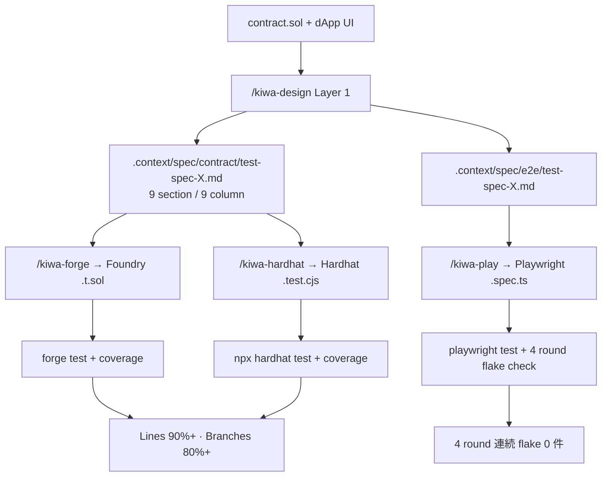

<div align="center">


# kiwa

**設計・実装・検証 — dApp と smart contract のテスト全 layer を、 1 つの仕様書から自動化。**

1 つの Layer 1 仕様書から Foundry `.t.sol` / Hardhat `.test.cjs` / Playwright `.spec.ts` を並列生成。 **4 metric のカバレッジ閾値を skill 側で必須化**。

[](https://www.npmjs.com/package/@kiwa-test/core)
[](https://www.npmjs.com/package/@kiwa-test/core)
[](./LICENSE)
[](#testing--quality)
[](#testing--quality)
[](#coverage-requirement)
[](./docs/ja/cookbook/smart-wallet-aa.md)
[](./tsconfig.base.json)
[](./docs/SKILL-DESIGN.ja.md)

[**Quickstart**](#quickstart) • [**4 layer 連携**](#4-layer-chain) • [**機能**](#features) • [**Examples**](#examples) • [**Docs**](./docs/ja/README.md) • [**Cookbook**](./docs/ja/cookbook/README.md) • [**FAQ**](./docs/ja/faq.md)

[🇬🇧 English](./README.md) • [🇯🇵 日本語](./README.ja.md)

</div>

<p align="center">
  
  <br />
  <sub><a href="./assets/kiwa-promo-ja.mp4">▶ フル画質 MP4 を視聴 (8.4 MB / 1920×1080 / h264)</a></sub>
</p>

---

> 🎨 **リブランド通知**: 本プロジェクトは 2026 年 6 月に `dapp-e2e` から **kiwa** (際) に改名しました。
> 旧 `dapp-e2e` は Playwright e2e fixture のみでしたが、 **kiwa** は同 fixture **+** Layer 1 テスト設計 + Layer 2 contract test 生成 (Foundry / Hardhat) を加えたツール群です。 Playwright fixture の API は変更なし。 詳細は [docs/MIGRATION.md § Rebrand notice](./docs/MIGRATION.ja.md#-rebrand-notice-2026-06-dapp-e2e--kiwa) を参照。

---

## なぜ kiwa か

dApp の test を書くには **2 つの仕事を同時に** こなす必要があります。 smart contract の test (Foundry / Hardhat) と、 UI + wallet flow の test (Playwright)。 多くの team が片方のランナーだけ選び、 test の半分しか書かず、 重要観点を見落としたまま release します。

**kiwa は 1 つの仕様書から 5 つの test layer (contract Foundry + contract Hardhat + unit Vitest + integration API + e2e Playwright) すべてを設計・生成するツールチェーンです。** "kiwa" は日本語で **際 / 境界 / 限界** — まさに良い test が証明する場所を意味します。



|  | ランナー 1 つだけ採用 | kiwa (4 layer) |
|---|---|---|
| テスト設計 | 手動 checklist、 担当者依存 | 13 観点 catalog + 5 リスク基準で決定論的 |
| Contract test (Foundry) | 手書き `.t.sol` | Layer 1 仕様書から自動生成 |
| Contract test (Hardhat) | 手書き `.test.ts` | 自動生成、 Foundry と **同 TC ID** |
| dApp e2e test | 手書き Playwright | 自動生成、 既存 test を壊さず extend |
| Coverage gate | optional、 飛ばされがち | skill 側で **必須化** (4 metric) |
| Flake 検出 | ad-hoc | 4 round loop が組み込み |

> 既に動いている contract / dApp に test を追加したい場合 — [tests/docs/retrofit-existing-dapp.ja.md](./tests/docs/retrofit-existing-dapp.ja.md) を参照。 skill chain は **後付け導入を主用途** として設計されており、 既存コードから仕様を逆算します。

---

## 提供物

kiwa は 2 つに分かれており、 連携も単独利用もできます。

### 1. Claude Code skill 群 (8 skill、 設計 + 生成側)

| Skill | Layer | 役割 |
|---|---|---|
| [`/kiwa-test`](./.claude/skills/kiwa-test/SKILL.md) | **orchestrator** | skill chain を 1 コマンドで一括実行 (contract / dApp / 両方) |
| [`/kiwa-design`](./.claude/skills/kiwa-design/SKILL.md) | **Layer 1** | 既存 contract / API / 画面 / 機能仕様から 9 section + 9 column の test 仕様書を逆算生成 |
| [`/kiwa-forge`](./.claude/skills/kiwa-forge/SKILL.md) | **Layer 2** (contract) | Layer 1 仕様 → Foundry `.t.sol` を fuzz / invariant / `vm.prank` / custom-error revert で生成、 `forge test` 実行、 `forge coverage` で gate |
| [`/kiwa-hardhat`](./.claude/skills/kiwa-hardhat/SKILL.md) | **Layer 2** (contract) | 同 Layer 1 仕様 → Hardhat `.test.cjs` を `chai-matchers` / `fast-check` / `loadFixture` で生成、 `npx hardhat test` 実行、 `solidity-coverage` で gate |
| [`/kiwa-vitest`](./.claude/skills/kiwa-vitest/SKILL.md) | **Layer 2** (unit) | Layer 1 仕様 → Vitest `test/unit/*.test.{ts,tsx}` を TS helper / TSX hook 用に生成 (F-3) |
| [`/kiwa-api`](./.claude/skills/kiwa-api/SKILL.md) | **Layer 2** (integration) | Layer 1 仕様 → msw / supertest / Playwright `request` の API integration test を生成 (F-3) |
| [`/kiwa-play`](./.claude/skills/kiwa-play/SKILL.md) | **Layer 3** (e2e) | Layer 1 仕様 → Playwright `.spec.ts` + `prepare-env.ts` 生成、 4 round flake check、 `--mode extend` で既存 test を破壊せず追加 |
| [`/kiwa-review`](./.claude/skills/kiwa-review/SKILL.md) | **reviewer** | spec / test code / 実行結果を 3 mode (spec-review / test-review / result-review) で品質判定 |

### 2. npm パッケージ (runtime fixture 側)

| パッケージ | 用途 |
|---|---|
| [`@kiwa-test/core`](./packages/core) | Playwright fixture: `window.ethereum` inject、 anvil 起動、 sign、 mine、 time-travel、 EIP-6963 multi-wallet、 ERC-4337 smart account、 custom-error helper |
| [`@kiwa-test/cli`](./packages/cli) | `kiwa init` で `@kiwa-test/core` と連携した Playwright project を scaffold |

**skill 単独** (npm 依存なし — test file を生成するだけ) でも、 **fixture 単独** (Claude なし — `pnpm add @kiwa-test/core` だけ) でも、 両方併用しても OK。

---

## 4-layer chain (後付け導入例: token-gating dApp)

[`examples/nextjs-token-gating`](./examples/nextjs-token-gating) (既存 `GatedContent.sol` + `GateNFT.sol` + 既存 Playwright test) に対して chain を実行する例。

```bash
# Step 1: 既存 .sol から contract 用仕様書を生成
/kiwa-design --layer contract --module token-gating \
  --input examples/nextjs-token-gating/contracts/GatedContent.sol
# → .context/spec/contract/test-spec-token-gating.md (9 section、 6 観点で 11 ケース)

# Step 2: その仕様書から Foundry test を生成
/kiwa-forge --module token-gating
# → test/GatedContent.t.sol (fuzz 込み 20 test)
# → forge test → 20/20 PASS
# → forge coverage → Lines 100% / Branches 87.50%  ✅ gate 通過

# Step 2': 同じ仕様書から Hardhat test を並列生成
/kiwa-hardhat --module token-gating
# → test/GatedContent.test.cjs (fast-check 込み 24 test)
# → npx hardhat test → 24/24 PASS
# → npx hardhat coverage → Branches 80.56%  ✅ gate 通過

# Step 3: 既存 Playwright test を仕様書ベースで extend
/kiwa-play --mode extend --example nextjs-token-gating
# → tests/gating.spec.ts に不足観点を追加 (既存 8 test に regression なし)
# → pnpm test x4 round → 4/4 PASS、 flake 0 件
```

同 `TC-001 … TC-020` test ID が Foundry と Hardhat の出力に揃って現れ、 team 内で「Foundry 派 / Hardhat 派」が同じ仕様書を共有可能。

---

## Quickstart

### Option A: Claude Code plugin (Claude 利用時の推奨)

kiwa の skill chain を Claude Code plugin として導入する経路。 clone 不要で、 install 後は **任意の dApp project** から skill を呼び出せる。

```bash
# Claude Code 内で (任意の project から):
/plugin marketplace add cardene777/kiwa
/plugin install kiwa@kiwa-marketplace
```

install 後、 8 skill が global に利用可能:

```bash
/kiwa-test --module your-module           # 一括 orchestrator (contract + e2e)
# or 個別 layer を順に
/kiwa-design --layer contract --input path/to/YourContract.sol --module your-module
/kiwa-forge --module your-module          # Foundry
/kiwa-hardhat --module your-module        # Hardhat (並立)
/kiwa-vitest --module your-module         # Vitest unit (F-3、 任意)
/kiwa-api --module your-module            # API integration (F-3、 任意)
/kiwa-play --mode new --example your-dapp # Playwright e2e
/kiwa-review --mode test-review           # spec / test / 結果 review
```

plugin の更新は `/plugin marketplace update kiwa-marketplace`。

### Option B: clone & install (kiwa contributor 用)

```bash
# 1. clone & install
git clone https://github.com/cardene777/kiwa.git && cd kiwa
pnpm install

# 2. Claude Code を kiwa repo 内で起動すると project-local の skill が自動 load される
/kiwa-test --module your-module
```

### Option C: Playwright fixture だけ使う (Claude 不要)

```bash
pnpm dlx @kiwa-test/cli init
pnpm install
pnpm exec playwright test
```

> 前提: Node.js 20+ · pnpm/npm/yarn · [Foundry](https://book.getfoundry.sh/) (`anvil` + `forge`) · Playwright (`pnpm exec playwright install`)

`init` で生成されるもの:

```text
e2e/
├── connect.spec.ts         ← dappE2eTest と接続済の Playwright spec
playwright.config.ts        ← Headless Chromium config
package.json                ← test:e2e script + peer deps
```

> npm 公開済 — `pnpm dlx @kiwa-test/cli init` で clone 不要で導入できます。

### Option D — local checkout (kiwa への contributor 用)

kiwa 本体に手を入れた変更を、 publish 前に local の dApp project で検証したい場合は **`file:` 依存** で local checkout を参照する:

```bash
# 1. kiwa を clone & build
git clone https://github.com/cardene777/kiwa.git ~/kiwa
cd ~/kiwa
pnpm install
pnpm -F @kiwa-test/core -F @kiwa-test/cli build

# 2. 試用先 project で file: 依存を追加
cd /path/to/your-dapp
pnpm add -D file:$HOME/kiwa/packages/core file:$HOME/kiwa/packages/cli

# 3. local install した CLI で scaffold
pnpm exec kiwa init     # または: node $HOME/kiwa/packages/cli/dist/index.js init
```

通常利用は Option C (`pnpm dlx @kiwa-test/cli init`) を推奨、 公開済 0.1.0 を直接取得します。

### CJS / Next.js 14 プロジェクトとの共存

`@kiwa-test/core` は **ESM と CJS の両方を build 出力** (`dist/index.js` + `dist/index.cjs`) しており、 `import` / `require` どちらも解決できます。 以下いずれの project にもそのまま導入可能:

| Project type | そのまま使える形式 |
|---|---|
| Pure ESM (`"type": "module"`) | `import { dappE2eTest } from '@kiwa-test/core'` |
| Pure CJS (`"type": "commonjs"`) | `const { dappE2eTest } = require('@kiwa-test/core')` |
| Next.js 14 (CJS host + ESM 依存) | 両形式とも解決、 Next は CJS bundle、 Playwright は ESM 実行 |

それでも古い toolchain で `Error: No "exports" main defined` に遭遇した場合は、 kiwa test dir を局所 `package.json` で ESM 化する:

```bash
mkdir -p tests/kiwa
echo '{"type":"module"}' > tests/kiwa/package.json
```

これにより `tests/kiwa/**.ts` だけ ESM 解釈され、 残りの `tests/` の既存 CJS 解決は影響を受けません。

### MetaMask との挙動差 (公開前に確認推奨)

`@kiwa-test/core` は **production 現実的、 ただし挙動差を明示** することを設計方針としています。 default 設定での主な挙動差:

| 挙動 | MetaMask | kiwa (default) | 変更方法 |
|---|---|---|---|
| 接続前の `eth_accounts` | `[]` を返す | wallet の account を返す (常時 "connected") | `dappE2e.setApprovalMode('reject')` で `eth_requestAccounts` を拒否し account を隠す |
| network 追加 prompt | popup 表示 | silent allow (store に chain がない場合 switch 失敗) | test 内で `dappE2e.addChain(config)` を呼び networks を seed |
| 送金時の user reject | popup の reject button | `setApprovalMode('reject')` 経由で `code: 4001` を返す | [`docs/ja/cookbook/user-reject.md`](./docs/ja/cookbook/user-reject.md) 参照 |
| EIP-6963 announce | extension install 時 announce | fixture 初期化時 announce | [`docs/ja/concepts/eip-6963.md`](./docs/ja/concepts/eip-6963.md) 参照 |

完全な RPC 忠実度 matrix は [`docs/MOCK-DESIGN.ja.md`](./docs/MOCK-DESIGN.ja.md) (A/B/C level scoring rubric) を参照。

---

## Features

### Layer 1: テスト設計自動化 (`/kiwa-design`)

- 📋 **9 section 統一仕様** — 対象機能 / 仕様の要約 / 主な品質リスク / 推奨テスト構成 / テスト観点一覧 / テストケース一覧 / 自動化すべきテスト / 手動確認でよいテスト / 不足している仕様
- 🎯 **13 観点 catalog** — 正常系 / 異常系 / 境界値 / 状態遷移 / 権限 / 入力バリデーション / 冪等性 / 並行処理 / 性能 / セキュリティ
- ⚖️ **5 基準リスク評価** — 売上影響 / セキュリティ影響 / データ破壊リスク / 利用頻度 / 過去障害 → 優先度を機械的に導出
- 📄 **9 column ケース表** — テスト ID / テストレベル / テスト観点 / 前提条件 / 入力値 / 操作手順 / 期待結果 / 優先度 / 自動化
- 🔁 **後付け導入が主用途** — 既存 `.sol` / `app/` / `tests/` / OpenAPI spec から逆算

### Layer 2: Contract test 生成 (`/kiwa-forge` + `/kiwa-hardhat`)

- 🔨 **Foundry mapping** — fuzz / invariant + Handler / `vm.prank` / `vm.expectRevert(Error.selector)` / `vm.warp` / `--gas-report`
- ⚒️ **Hardhat mapping** — `chai-matchers` `revertedWithCustomError` / `fast-check` `asyncProperty` / `loadFixture` / `hardhat-gas-reporter`
- 🪞 **並列生成** — 両ランナーが同じ `TC-NNN` ID で出力。 team で Foundry / Hardhat / 両方併用 を自由に選択
- 🛡️ **Coverage gate 必須化** — Lines ≥ 90%、 Statements ≥ 90%、 **Branches ≥ 80%**、 Funcs ≥ 90%。 4 metric 全部 PASS まで skill が `test-passed` marker を作りません

### Layer 2: dApp E2E fixture (`/kiwa-play` + `@kiwa-test/core`)

- 🦊 **`window.ethereum` inject** — ブラウザ拡張不要
- ⚡ **test ごとに anvil 起動** — chain 隔離完全
- 🔌 **9 RPC method 直接対応** (`eth_requestAccounts` / `personal_sign` / `eth_signTypedData_v4` / `eth_sendTransaction` / `wallet_switchEthereumChain` …)、 その他は anvil に forward
- 📡 **EIP-1193 event** — `accountsChanged` / `chainChanged` / `connect` / `disconnect` を test から trigger 可能
- 👛 **EIP-6963 multi-wallet** — MetaMask、 Rabby、 Coinbase 等を並立宣言
- 🤖 **Smart contract account (AA)** — `isContractAccount: true` で `personal_sign` を EIP-1271、 `eth_sendTransaction` を `execute()` 経由に reroute
- 📦 **viem は peer dep** — version を user 側で固定
- 🔁 **`--mode extend`** — 既存 test を壊さず新規観点だけ追加、 4 round flake check 内蔵
- ❌ **error envelope** — page 境界越しに `code` と `message` を保持

### 業界標準 helper (`@kiwa-test/core`)

| Helper | 用途 |
|---|---|
| `snapshotChain` / `revertChain` | `evm_snapshot` / `evm_revert` で test 間隔離 |
| `expectCustomError` | Solidity custom error 1 行 assertion |
| `increaseTime` / `mineBlock` / `setNextBlockTimestamp` | vesting / TTL / timelock の時間操作 |
| `impersonateAccount` / `stopImpersonateAccount` / `setBalance` | 任意 EOA / contract として balance 注入で呼び出し |
| `startAnvilCluster` | Multi-chain (L1 + L2 + …) anvil cluster |
| `startAnvilFork` | `anvil --fork-url` 薄 wrapper (mainnet / sepolia / 任意 RPC) |
| `expectEvent` | `decodeEventLog` + assertion 一体 |
| `expectBalanceChange` / `expectEthBalanceChange` | Balance delta assertion (hardhat-chai-matchers 互換) |

---

## kiwa は他ツールと何が違う?

kiwa は 2 つのエコシステムの交点にあります。 要約。

| 軸 | 最近接の競合 | kiwa の差別化 |
|---|---|---|
| dApp E2E fixture (Playwright + viem + anvil) | [`wallet-mock`](https://github.com/johanneskares/wallet-mock) / [Synpress](https://github.com/Synthetixio/synpress) / [dappwright](https://github.com/TenKeyLabs/dappwright) | wallet-mock が一番近い (headless `window.ethereum` 注入)。 Synpress / dappwright は実 MetaMask UI 自動化。 kiwa は headless を維持しつつ CLI scaffold (`pnpm dlx @kiwa-test/cli init`) と下記 skill chain を上乗せ。 |
| 仕様書 → test 自動生成 | [hardhat-test-suite-generator](https://github.com/ahmedali8/hardhat-test-suite-generator) / Foundry / Hardhat AI plugin (2026) / [Claude Code spec-driven dev](https://www.augmentcode.com/guides/claude-code-spec-driven-development) | 1 つの 9 section / 9 column 仕様書から **4 layer** (contract / unit / integration / e2e) を駆動する競合は確認できず。 `/kiwa-design` → `/kiwa-{forge,hardhat,play,vitest,api}` → `/kiwa-review` chain が kiwa 独自の差別化。 |

詳細な比較表 (Synpress / dappwright / wallet-mock / kiwa の fixture 軸 + hardhat-test-suite-generator / Foundry AI / Claude Code spec-driven dev の test 生成軸) と選定ガイド、 「kiwa が MetaMask extension 自動化を意図的に持たない理由」は [docs/COMPARISON.ja.md](./docs/COMPARISON.ja.md) を参照してください。

---

## Coverage requirement

`/kiwa-forge` と `/kiwa-hardhat` は 4 metric の閾値を満たすまで `test-passed` marker を **作りません**。 default (OSS 公開 smart contract 向け閾値):

| Metric | Default 閾値 | 理由 |
|---|---|---|
| Lines | 90 % | 主要 path 全件 cover |
| Statements | 90 % | 文単位の網羅 |
| **Branches** | **80 %** | Solidity の `require` / `revert` / short-circuit で 100% は現実的でない |
| Funcs | 90 % | 全 `public` / `external` 関数 cover |

未達成の metric が 1 件でもあると、 skill は **不足観点 / 未テスト error path / 未テスト event を Layer 1 仕様書の「不足している仕様」 section に逆書き戻し**、 次 loop で補完できるように案内します。 弱い test を silent に sign off しません。

引数で個別 override 可: `--coverage-lines 95 --coverage-branches 85` 等。

---

## Examples

機能から逆引きしたい場合は [`docs/ja/examples/README.md`](./docs/ja/examples/README.md) を参照。 人気 5 件を 30 分 ~ 1 時間で順に試すツアーは [`docs/ja/examples/walkthrough.md`](./docs/ja/examples/walkthrough.md)。 個別 README は [`examples/{name}/README.md`](./examples/) 配下 (人気 5 例 — basic-connect / mint-nft / defi-swap / nextjs-wagmi-rainbow / nft-marketplace — は `README.ja.md` も併設)。

### 4 layer chain 動作実証済 example

以下 3 example は **forge test + hardhat test (該当時) + playwright test 全部 4 round 連続 flake 0 + coverage gate 通過** を確認済:

| Example | Foundry test | Hardhat test | Playwright e2e | Coverage (Lines / Branches) |
|---|---|---|---|---|
| [`mint-nft`](./examples/mint-nft) | 27 / 27 | 24 / 24 | (basic-connect でカバー) | Foundry 97.70 / 83.33 · Hardhat 93.75 / 80.56 |
| [`defi-swap`](./examples/defi-swap) | 17 / 17 | — | (basic-connect でカバー) | 100 / 87.50 |
| [`nextjs-token-gating`](./examples/nextjs-token-gating) | 20 / 20 | — | 既存 8 PASS | 100 / 87.50 |

### dApp E2E reference (`@kiwa-test/core` fixture)

[`examples/`](./examples/) 配下の 20 dApp で fixture を様々な stack に対して実証:

| Example | Stack / 対象 | E2E test |
|---|---|---|
| [`basic-connect`](./examples/basic-connect) | inline HTML + EIP-6963 + reject path | 15 |
| [`nextjs-wagmi-rainbow`](./examples/nextjs-wagmi-rainbow) | Next.js 14 + wagmi v2 + RainbowKit | 4 |
| [`vite-react-wagmi`](./examples/vite-react-wagmi) | Vite 5 + React 18 + wagmi v2 (SPA) | 3 |
| [`nextjs-aa-erc4337`](./examples/nextjs-aa-erc4337) ⭐ | Full ERC-4337 v0.7 (EntryPoint + SimpleAccountFactory + UserOp bundler stub) | 7 |
| [`nextjs-aa-smart-account`](./examples/nextjs-aa-smart-account) | Simplified ERC-4337 + ERC-1271 + guardian recovery | 10 |
| [`nextjs-multi-chain`](./examples/nextjs-multi-chain) | 3-chain 並走 anvil + chain switch | 6 |
| [`nextjs-bridge`](./examples/nextjs-bridge) | L1 ↔ L2 lock / mint / burn / unlock | 10 |
| [`nextjs-permit-swap`](./examples/nextjs-permit-swap) | EIP-2612 permit + deadline | 6 |
| [`nextjs-dao-vote`](./examples/nextjs-dao-vote) | Compound 型 Governor + timelock + quorum | 10 |
| [`nextjs-lending`](./examples/nextjs-lending) | Aave 型 lending + liquidation + max LTV | 10 |
| [`nextjs-staking`](./examples/nextjs-staking) | Stake + reward + early-unstake penalty | 12 |
| [`nextjs-erc1155-game`](./examples/nextjs-erc1155-game) | ERC-1155 batch mint / transfer / burn | 8 |
| [`nextjs-vesting`](./examples/nextjs-vesting) | Cliff + linear vesting + immutability | 9 |
| [`nextjs-token-gating`](./examples/nextjs-token-gating) | NFT-gated content + timed access + transfer revoke | 8 |
| [`nextjs-ens-resolver`](./examples/nextjs-ens-resolver) | ENS 型 forward / reverse + collision | 7 |
| [`nextjs-event-history`](./examples/nextjs-event-history) | Past event query + multi-indexed filter | 7 |
| [`nextjs-zk-verifier`](./examples/nextjs-zk-verifier) | Commit-reveal + range proof variant | 7 |
| [`nft-marketplace`](./examples/nft-marketplace) | List / buy / offer / royalty split | 12 |

---

## Multi-Wallet (EIP-6963)

```ts
import { dappE2eTest } from '@kiwa-test/core';

const test = dappE2eTest.extend({
  wallets: [
    {
      name: 'MetaMask',
      rdns: 'io.metamask',
      icon: 'data:image/svg+xml;base64,...',
      privateKey: '0xac09...ff80',
    },
    {
      name: 'Rabby',
      rdns: 'io.rabby',
      icon: 'data:image/svg+xml;base64,...',
      privateKey: '0x59c6...690d',
    },
  ],
});

test('multi wallet picker', async ({ page, dappE2e }) => {
  await dappE2e.wallets!['io.rabby'].connect();
});
```

`wallets` 未設定なら MetaMask 互換の single wallet が走る (backward 互換)。

---

## Testing & Quality

Phase E リブランド時点 (main @ `b7267a7`):

| 項目 | 値 |
|---|---|
| 4 layer chain 動作実証 example | **3** (mint-nft / defi-swap / nextjs-token-gating) |
| Foundry test (3 example 合計) | **64** (27 + 17 + 20) |
| Hardhat test (mint-nft) | **24** |
| Playwright test (basic-connect) | **15** |
| **4 round 累計 execution** | **292 PASS** (Foundry 164 + Hardhat 68 + Playwright 60) |
| **Flaky** | **0 / 292** |
| Coverage Lines | **93.75 – 100 %** 全 chain で達成 |
| Coverage Branches | **80.56 – 87.50 %** 全 chain で達成 |
| Coverage Functions | **95.24 – 100 %** |
| Adversarial review findings (解消済) | 21 件 (5 CRITICAL / 9 MAJOR / 7 MINOR、 全 PR 内修正) |

release tag を切る前の 4 round flake check は必須。 runner は [`.context/scratch/multi-round-all-examples.sh`](./examples) (developer 側)。

Adversarial review pattern は [`adversarial-pitfalls.md`](./.claude/skills/kiwa-play/references/adversarial-pitfalls.md) に偽陽性 self-check checklist として整理。

---

## Documentation

5 section (Quickstart / Concepts / API / Cookbook / FAQ) の docs を **JP↔EN 1:1 対訳** で [`docs/`](./docs/) に維持。

- 🇬🇧 [English documentation](./docs/en/README.md)
- 🇯🇵 [日本語ドキュメント](./docs/ja/README.md)

Reference docs:

|  |  |
|---|---|
| [`docs/SKILL-DESIGN.ja.md`](./docs/SKILL-DESIGN.ja.md) ⭐ | **8 skill 共通 SSOT** (5 段階フロー / 9 section 出力 / 13 観点 / 5 リスク基準) |
| [`docs/MOCK-DESIGN.ja.md`](./docs/MOCK-DESIGN.ja.md) | Wallet / SDK mock 精度仕様 (A/B/C level、 scoring rubric) |
| [`tests/docs/skill-chain-tutorial.ja.md`](./tests/docs/skill-chain-tutorial.ja.md) ⭐ | **skill chain walkthrough** (後付け導入起点) |
| [`docs/RPC.ja.md`](./docs/RPC.ja.md) | 9 直接対応 RPC + anvil fallback |
| [`docs/EVENTS.ja.md`](./docs/EVENTS.ja.md) | 4 event + `triggerEvent()` |
| [`docs/ERRORS.ja.md`](./docs/ERRORS.ja.md) | EIP-1193 error code + envelope 設計 |
| [`docs/MIGRATION.ja.md`](./docs/MIGRATION.ja.md) | v0.x breaking change policy + dapp-e2e → kiwa リブランド案内 |
| [`docs/COMPARISON.ja.md`](./docs/COMPARISON.ja.md) | Synpress / dappwright / wallet-mock 比較 + 仕様書ベース test 生成軸 (hardhat-test-suite-generator / Foundry AI / Claude Code) |
| [`docs/RELEASING.ja.md`](./docs/RELEASING.ja.md) | Publish flow + provenance |

Claude Code 利用者向け — skill 完全リファレンス:

- [`/kiwa-design`](./.claude/skills/kiwa-design/SKILL.md) — Layer 1 仕様書生成
- [`/kiwa-forge`](./.claude/skills/kiwa-forge/SKILL.md) — Foundry 生成
- [`/kiwa-hardhat`](./.claude/skills/kiwa-hardhat/SKILL.md) — Hardhat 生成
- [`/kiwa-play`](./.claude/skills/kiwa-play/SKILL.md) — Playwright 生成 + 22 example index + 偽陽性 9 pattern

---

## Contributing

- 📖 [CONTRIBUTING.md を読む](./CONTRIBUTING.md) — 開発環境 setup + skill chain 経由の test 生成 + PR checklist
- 🤝 [Code of Conduct](./CODE_OF_CONDUCT.md) — Contributor Covenant 2.1
- 🔒 [Security policy](./SECURITY.md) — 脆弱性は非公開経路で報告
- 🐛 [Issue を起票する](https://github.com/cardene777/kiwa/issues)
- 🔀 [Pull request を送る](https://github.com/cardene777/kiwa/pulls)
- 🗺️ 現行 roadmap (open Issue): [enhancement label](https://github.com/cardene777/kiwa/issues?q=is%3Aissue+is%3Aopen+label%3Aenhancement+sort%3Acreated-desc)
- 💡 Breaking change の指摘前に [`docs/MIGRATION.ja.md`](./docs/MIGRATION.ja.md) を確認

---

## Contact

GitHub Issue に当てはまらない質問 / フィードバック / 雑談は以下から連絡してください。

- 💬 [GitHub Discussions](https://github.com/cardene777/kiwa/discussions) — 長文 / 提案
- 🐦 [X / Twitter @cardene777](https://x.com/cardene777) — 短文 / DM 開放

バグ報告は [Issue 起票](https://github.com/cardene777/kiwa/issues) に倒した方が後追い検索しやすくおすすめ。 脆弱性報告は [Security advisory](https://github.com/cardene777/kiwa/security/advisories/new) (詳細は [SECURITY.md](./SECURITY.md)) で非公開経路で受け取ります。

---

## License

[MIT](./LICENSE) © [cardene](https://github.com/cardene777) — [GitHub](https://github.com/cardene777) / [X](https://x.com/cardene777)

<div align="center">

Made with ⚡ by the kiwa contributors. **際 (きわ) まで試す。**

**[⬆ トップへ戻る](#kiwa)**

</div>
