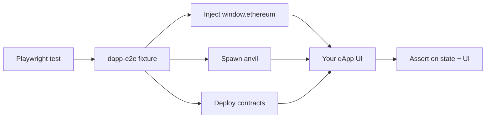

<div align="center">

# dapp-e2e

**dApp 向けの headless E2E テスト fixture — ブラウザ拡張不要、 MetaMask popup 不要、 flake 0。**

Playwright × viem × anvil。 `window.ethereum` の inject から contract deploy / EIP-712 署名 / block mine まで、 1 つの fixture で完結。

[](https://www.npmjs.com/package/@dapp-e2e/core)
[](https://www.npmjs.com/package/@dapp-e2e/core)
[](./LICENSE)
[](#testing--quality)
[](#testing--quality)
[](./docs/ja/cookbook/smart-wallet-aa.md)
[](./tsconfig.json)
[](./.claude/skills/dapp-e2e-test/SKILL.md)

[**Quickstart**](#quickstart) • [**Features**](#features) • [**Examples**](#examples) • [**Docs**](./docs/ja/README.md) • [**Cookbook**](./docs/ja/cookbook/README.md) • [**FAQ**](./docs/ja/faq.md)

[🇬🇧 English](./README.md) • [🇯🇵 日本語](./README.ja.md)

</div>

---

## なぜ dapp-e2e か

従来の dApp E2E test は MetaMask / Rabby などのブラウザ拡張に依存し、 popup flake / version drift / CI 維持コストに苦しんできました。 **dapp-e2e は拡張機能をプログラマブルな `window.ethereum` に置き換え** 、 test ごとに anvil を起動し、 署名 / chain state / 時間操作を Playwright から完全に制御できます。



| | ブラウザ拡張 wallet | dapp-e2e |
|---|---|---|
| セットアップ | MetaMask install / seed phrase / network 追加 ... | `pnpm dlx @dapp-e2e/cli init` |
| popup 操作 | 必須 (flake の元) | なし |
| test 間 chain 隔離 | 手動 | 自動 (`snapshotChain` / `revertChain`) |
| Multi-wallet (EIP-6963) | wallet ごとに手動 install | 宣言的 config |
| 時間操作 (vesting / TTL) | 困難 | `increaseTime(client, sec)` |
| CI コスト | 高 (browser + extension) | 低 (headless Chromium) |

Synpress / wallet-mock との詳細比較は [docs/COMPARISON.md](./docs/COMPARISON.md) を参照。

---

## Quickstart

```bash
pnpm dlx @dapp-e2e/cli init
pnpm install
pnpm exec playwright test
```

> 前提: Node.js 20+ · pnpm/npm/yarn · [Foundry](https://book.getfoundry.sh/) (`anvil`) · Playwright (`pnpm exec playwright install`)

`init` で生成されるもの:

```text
e2e/
├── connect.spec.ts         ← dappE2eTest 経由の Playwright spec
playwright.config.ts        ← headless Chromium 設定
package.json                ← test:e2e script + peer deps (package.json が存在する場合)
```

これだけで `e2e/connect.spec.ts` を開いて自分の dApp の test を書き始められます。

> v0.1.0 が npm に publish される前は、 本リポを clone して以下を実行:
> `pnpm install && pnpm -F @dapp-e2e/core -F @dapp-e2e/cli build && node packages/cli/dist/index.js init`

---

## Features

### Wallet · RPC · Fixture

- 🦊 **`window.ethereum` を inject** — ブラウザ拡張不要
- ⚡ **test ごとに anvil を spawn** — chain 完全隔離
- 🔌 **9 RPC を core が直接処理** (`eth_requestAccounts` / `personal_sign` / `eth_signTypedData_v4` / `eth_sendTransaction` / `wallet_switchEthereumChain` ...)、 残りは anvil へ forward
- 📡 **EIP-1193 event** — `accountsChanged` / `chainChanged` / `connect` / `disconnect` を test から trigger 可能
- 👛 **EIP-6963 multi-wallet** — MetaMask / Rabby / Coinbase ... を同時 inject
- 🤖 **Smart contract account (AA)** — `isContractAccount: true` を宣言するだけで `personal_sign` / `eth_signTypedData_v4` を EIP-1271 経由に、 `eth_sendTransaction` を `execute()` 経由に、 `eth_accounts` を smart account address 返却に自動振替
- 📦 **viem を peer dependency** — version はプロジェクト側で管理
- ❌ **error envelope** で EIP-1193 の `code` / `message` を page 境界の先まで保持

### Test helpers (v0.2 以降)

業界標準 (hardhat / foundry / viem / hardhat-chai-matchers) と並ぶ helper を core に集約:

| Helper | 用途 |
|---|---|
| `snapshotChain` / `revertChain` | `evm_snapshot` / `evm_revert` wrapper、 test 間隔離 |
| `expectCustomError` | Solidity custom error の検証を 1 関数化 |
| `increaseTime` / `mineBlock` / `setNextBlockTimestamp` | 時間操作 (vesting / TTL / timelock) |
| `impersonateAccount` / `stopImpersonateAccount` / `setBalance` | 任意 EOA / contract への impersonate + balance 注入 |
| `startAnvilCluster` | multi-chain (L1 + L2 + ...) anvil cluster |
| `startAnvilFork` | `anvil --fork-url` の thin wrapper (mainnet / sepolia / 任意 RPC) |
| `expectEvent` | `decodeEventLog` + assertion 統合 |
| `expectBalanceChange` / `expectEthBalanceChange` | hardhat-chai-matchers 互換の残高差分 assertion |

### Claude Code skill

`.claude/skills/dapp-e2e-test/` に [`/dapp-e2e-test`](./.claude/skills/dapp-e2e-test/SKILL.md) skill を同梱。 Claude Code から呼び出すとプロジェクト読込 → **test 仕様書生成** → 実装 → 4 round 連続 PASS 検証までを構造化フローで進められます。 19 example 用途別 index / fixture API / troubleshooting / 偽陽性パターン 9 種 + self-check 5 問が references にあります。

### スコープ外 (意図的)

- wallet 拡張機能の popup UX / 見た目の差分 (実拡張 test ツールに任せる)
- mainnet RPC への過剰トラフィック (`startAnvilFork` + pinned block で upstream コスト抑制)

---

## Examples

[`examples/`](./examples/) 配下に 20 個の参考実装 (full ERC-4337 v0.7 lifecycle 含む)、 合計 **166 test** が **4 round 連続 PASS** (664 assertion / flake 0) で安定化済みです。

### Framework 統合

| Example | Stack | Tests |
|---|---|---|
| [`nextjs-wagmi-rainbow`](./examples/nextjs-wagmi-rainbow) | Next.js 14 App Router + wagmi v2 + RainbowKit | 4 |
| [`vite-react-wagmi`](./examples/vite-react-wagmi) | Vite 5 + React 18 + wagmi v2 + RainbowKit (SPA) | 3 |

### dApp カテゴリ別

| Example | Domain | Tests |
|---|---|---|
| [`nextjs-erc1155-game`](./examples/nextjs-erc1155-game) | ERC-1155 batch mint / transfer / burn | 8 |
| [`nextjs-multi-chain`](./examples/nextjs-multi-chain) | 3 chain 並走 anvil + chain switch | 6 |
| [`nextjs-permit-swap`](./examples/nextjs-permit-swap) | EIP-2612 permit + deadline | 6 |
| [`nextjs-dao-vote`](./examples/nextjs-dao-vote) | Compound 風 Governor + timelock + quorum | 10 |
| [`nextjs-lending`](./examples/nextjs-lending) | Aave 風 lending + liquidation + max LTV | 10 |
| [`nextjs-staking`](./examples/nextjs-staking) | Stake + reward + 早期 unstake penalty | 12 |
| [`nextjs-bridge`](./examples/nextjs-bridge) | L1 ↔ L2 lock / mint / burn / unlock | 10 |
| [`nextjs-aa-smart-account`](./examples/nextjs-aa-smart-account) | ERC-4337 (簡略) + ERC-1271 + guardian recovery | 10 |
| [`nextjs-aa-erc4337`](./examples/nextjs-aa-erc4337) ⭐ v0.3 | Full ERC-4337 v0.7 (EntryPoint + SimpleAccountFactory + UserOperation bundler stub + EIP-1271 + dappE2e isContractAccount fixture 統合) | 7 |
| [`nextjs-ens-resolver`](./examples/nextjs-ens-resolver) | ENS 風 forward / reverse + collision | 7 |
| [`nextjs-event-history`](./examples/nextjs-event-history) | 過去 event 取得 + multi-indexed filter | 7 |
| [`nextjs-token-gating`](./examples/nextjs-token-gating) | NFT-gated content + timed access + transfer revoke | 8 |
| [`nextjs-zk-verifier`](./examples/nextjs-zk-verifier) | Commit-reveal + range proof variant | 7 |
| [`nextjs-vesting`](./examples/nextjs-vesting) | Cliff + linear vesting + 不変性 | 9 |
| [`nextjs-wagmi-rainbow`](./examples/nextjs-wagmi-rainbow) | wagmi + RainbowKit + RPC reconnect | 4 |

### 低レベル (inline HTML、 framework 抜き)

| Example | 用途 | Tests |
|---|---|---|
| [`basic-connect`](./examples/basic-connect) | `window.ethereum` 直叩き + EIP-6963 + reject 経路 | 15 |
| [`mint-nft`](./examples/mint-nft) | ERC-721 mint + batch + supply cap + EIP-2981 | 8 |
| [`nft-marketplace`](./examples/nft-marketplace) | List / buy / offer / royalty split | 12 |
| [`defi-swap`](./examples/defi-swap) | ERC-20 approve + swap + slippage / 流動性不足 | 7 |

---

## Multi-Wallet (EIP-6963)

```ts
import { dappE2eTest } from '@dapp-e2e/core';

const test = dappE2eTest.extend({
  wallets: [
    {
      name: 'MetaMask',
      rdns: 'io.metamask',
      icon: 'data:image/svg+xml;base64,...',
      privateKey: '0xac09...ff80',
    },
    {
      name: 'Rabby',
      rdns: 'io.rabby',
      icon: 'data:image/svg+xml;base64,...',
      privateKey: '0x59c6...690d',
    },
  ],
});

test('multi wallet picker', async ({ page, dappE2e }) => {
  await dappE2e.wallets!['io.rabby'].connect();
});
```

`wallets` 未指定時は単一 MetaMask 互換 wallet で動作 (既存挙動互換)。

---

## Documentation

公開ドキュメントは 5 部構成 (Quickstart / Concepts / API / Cookbook / FAQ)、 **JP↔EN 1:1 対訳** で [`docs/`](./docs/) に。

- 🇯🇵 [日本語ドキュメント](./docs/ja/README.md)
- 🇬🇧 [English documentation](./docs/en/README.md)

その他の reference:

| | |
|---|---|
| [`docs/RPC.md`](./docs/RPC.md) | 直接処理する 9 RPC と anvil fallback |
| [`docs/EVENTS.md`](./docs/EVENTS.md) | 4 event と `triggerEvent()` |
| [`docs/ERRORS.md`](./docs/ERRORS.md) | EIP-1193 error code と envelope 設計 |
| [`docs/MIGRATION.md`](./docs/MIGRATION.md) | v0.x 系の破壊的変更ポリシー |
| [`docs/COMPARISON.md`](./docs/COMPARISON.md) | Synpress / wallet-mock との使い分け |
| [`docs/MOCK-DESIGN.md`](./docs/MOCK-DESIGN.md) | wallet / SDK mock 精度仕様書 (A/B/C 3 段階 + 5 観点スコアリング) ⭐ |
| [`docs/RELEASING.md`](./docs/RELEASING.md) | publish 手順と provenance 設定 |

Claude Code 利用者向け:

- [`.claude/skills/dapp-e2e-test/SKILL.md`](./.claude/skills/dapp-e2e-test/SKILL.md) — `/dapp-e2e-test` skill (test 仕様書 → 実装 → 4 round フロー)
- [`example-patterns.md`](./.claude/skills/dapp-e2e-test/references/example-patterns.md) — 19 example 用途別 index
- [`adversarial-pitfalls.md`](./.claude/skills/dapp-e2e-test/references/adversarial-pitfalls.md) — 偽陽性パターン 9 種 + self-check 5 問

---

## Testing & Quality

| 指標 | 値 |
|---|---|
| 合計 test 数 | **166** |
| 4 round 連続 PASS | **4 / 4** (flake 0) |
| 合計 assertion 数 | 664 |
| Example 数 | 20 |
| Adversarial review findings (解消済) | 9 件 (3 CRITICAL / 4 MAJOR / 2 MINOR) |
| 平均 test 時間 | 約 50 秒 / example |

release tag を切る前に 19 example 全てが 4 round 連続 PASS することを必須化しています。 runner は [`.context/scratch/multi-round-all-examples.sh`](./.context/scratch/multi-round-all-examples.sh) (開発側)。

Phase C-5/6/7 の adversarial review findings (PR [#145](https://github.com/cardene777/dapp-e2e/pull/145) / [#146](https://github.com/cardene777/dapp-e2e/pull/146) / [#147](https://github.com/cardene777/dapp-e2e/pull/147)) は全て同 PR 内で解決済。 パターンは [`adversarial-pitfalls.md`](./.claude/skills/dapp-e2e-test/references/adversarial-pitfalls.md) に教材として集約しています。

---

## Contributing

- 🐛 [Issue を起票](https://github.com/cardene777/dapp-e2e/issues)
- 🔀 [Pull Request を送る](https://github.com/cardene777/dapp-e2e/pulls)
- 💡 破壊的変更の確認は [`docs/MIGRATION.md`](./docs/MIGRATION.md) を参照

---

## License

[MIT](./LICENSE) © [cardene](https://github.com/cardene777)

<div align="center">

Made with ⚡ by the dapp-e2e contributors.

**[⬆ トップへ戻る](#dapp-e2e)**

</div>
