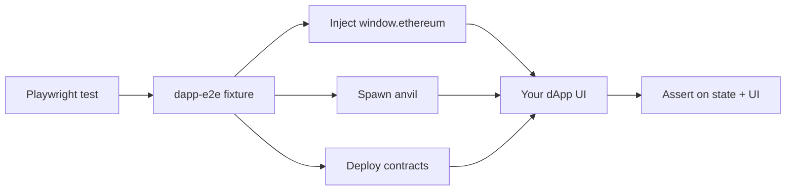

<div align="center">

# dapp-e2e

**Headless E2E testing fixture for dApps — no browser extension, no MetaMask popup, no flake.**

Playwright × viem × anvil. Inject `window.ethereum`, deploy contracts, sign typed data, mine blocks — all from a single fixture.

[](https://www.npmjs.com/package/@dapp-e2e/core)
[](https://www.npmjs.com/package/@dapp-e2e/core)
[](./LICENSE)
[](#testing--quality)
[](#testing--quality)
[](./docs/en/cookbook/smart-wallet-aa.md)
[](./tsconfig.json)
[](./.claude/skills/dapp-e2e-test/SKILL.md)

[**Quickstart**](#quickstart) • [**Features**](#features) • [**Examples**](#examples) • [**Docs**](./docs/en/README.md) • [**Cookbook**](./docs/en/cookbook/README.md) • [**FAQ**](./docs/en/faq.md)

[🇬🇧 English](./README.md) • [🇯🇵 日本語](./README.ja.md)

</div>

---

## Why dapp-e2e?

Traditional dApp E2E tests rely on browser-extension wallets (MetaMask, Rabby, …) that introduce popup flake, version drift, and CI maintenance pain. **dapp-e2e replaces the extension with a programmable `window.ethereum`**, runs anvil per test, and gives you full control over signing, chain state, and time — straight from Playwright.



| | Browser extension wallet | dapp-e2e |
|---|---|---|
| Setup time | Install MetaMask, seed phrase, network add … | `pnpm dlx @dapp-e2e/cli init` |
| Popup interaction | Required (flaky) | None |
| Chain isolation per test | Manual | Automatic (`snapshotChain` / `revertChain`) |
| Multi-wallet (EIP-6963) | Manual install per wallet | Declarative config |
| Time travel (vesting / TTL) | Hard | `increaseTime(client, sec)` |
| CI cost | High (browser + extension) | Low (headless Chromium) |

See [docs/COMPARISON.md](./docs/COMPARISON.md) for a deeper comparison with Synpress / wallet-mock.

---

## Quickstart

```bash
pnpm dlx @dapp-e2e/cli init
pnpm install
pnpm exec playwright test
```

> Prerequisites: Node.js 20+ · pnpm/npm/yarn · [Foundry](https://book.getfoundry.sh/) (`anvil`) · Playwright (`pnpm exec playwright install`)

`init` scaffolds:

```text
e2e/
├── connect.spec.ts         ← Playwright spec wired to dappE2eTest
playwright.config.ts        ← Headless Chromium config
package.json                ← test:e2e script + peer deps (if package.json exists)
```

That's it. Open `e2e/connect.spec.ts` and start writing tests against your dApp.

> Before v0.1.0 is published to npm, clone this repo and run:
> `pnpm install && pnpm -F @dapp-e2e/core -F @dapp-e2e/cli build && node packages/cli/dist/index.js init`

---

## Features

### Wallet · RPC · Fixture

- 🦊 **Inject `window.ethereum`** without any browser extension
- ⚡ **Spawn anvil per test** for total chain isolation
- 🔌 **9 RPC methods handled directly** (`eth_requestAccounts` / `personal_sign` / `eth_signTypedData_v4` / `eth_sendTransaction` / `wallet_switchEthereumChain` …), the rest forwarded to anvil
- 📡 **EIP-1193 events** — `accountsChanged` / `chainChanged` / `connect` / `disconnect` triggerable from tests
- 👛 **EIP-6963 multi-wallet** — declare MetaMask, Rabby, Coinbase, … side-by-side
- 🤖 **Smart contract account (AA)** — set `isContractAccount: true` and dapp-e2e reroutes `personal_sign` / `eth_signTypedData_v4` through EIP-1271, `eth_sendTransaction` through `execute()`, and `eth_accounts` to the smart account address
- 📦 **viem as peer dep** — your project owns the version
- ❌ **error envelope** preserves `code` and `message` across page boundaries

### Test helpers (v0.2+)

Industry-standard helpers (hardhat / foundry / viem / hardhat-chai-matchers compatible) consolidated into `@dapp-e2e/core`:

| Helper | Purpose |
|---|---|
| `snapshotChain` / `revertChain` | Per-test isolation via `evm_snapshot` / `evm_revert` |
| `expectCustomError` | One-liner Solidity custom-error assertion |
| `increaseTime` / `mineBlock` / `setNextBlockTimestamp` | Time travel for vesting / TTL / timelock |
| `impersonateAccount` / `stopImpersonateAccount` / `setBalance` | Call as arbitrary EOA / contract with injected balance |
| `startAnvilCluster` | Multi-chain (L1 + L2 + …) anvil cluster |
| `startAnvilFork` | `anvil --fork-url` thin wrapper (mainnet / sepolia / any RPC) |
| `expectEvent` | `decodeEventLog` + assertion combined |
| `expectBalanceChange` / `expectEthBalanceChange` | Balance delta assertion (hardhat-chai-matchers compatible) |

### Claude Code skill

`.claude/skills/dapp-e2e-test/` ships a [`/dapp-e2e-test`](./.claude/skills/dapp-e2e-test/SKILL.md) skill that walks you from project scan → **test spec generation** → implementation → 4-round flake check. Built-in references include 19-example index, fixture API, troubleshooting, and 9 adversarial-review pitfalls.

### Out of scope (by design)

- Wallet popup UX / visual regression of extensions (use real extension tests for that)
- Mainnet RPC traffic (use `startAnvilFork` with pinned block to cap upstream cost)

---

## Examples

20 reference dApps live under [`examples/`](./examples/), **166 tests** total (incl. full ERC-4337 v0.7 lifecycle), **4 rounds back-to-back PASS** (664 assertions, 0 flake).

### Framework integration

| Example | Stack | Tests |
|---|---|---|
| [`nextjs-wagmi-rainbow`](./examples/nextjs-wagmi-rainbow) | Next.js 14 App Router + wagmi v2 + RainbowKit | 4 |
| [`vite-react-wagmi`](./examples/vite-react-wagmi) | Vite 5 + React 18 + wagmi v2 + RainbowKit (SPA) | 3 |

### dApp category

| Example | Domain | Tests |
|---|---|---|
| [`nextjs-erc1155-game`](./examples/nextjs-erc1155-game) | ERC-1155 batch mint / transfer / burn | 8 |
| [`nextjs-multi-chain`](./examples/nextjs-multi-chain) | 3-chain parallel anvil + chain switch | 6 |
| [`nextjs-permit-swap`](./examples/nextjs-permit-swap) | EIP-2612 permit + deadline | 6 |
| [`nextjs-dao-vote`](./examples/nextjs-dao-vote) | Compound-style Governor + timelock + quorum | 10 |
| [`nextjs-lending`](./examples/nextjs-lending) | Aave-style lending + liquidation + max LTV | 10 |
| [`nextjs-staking`](./examples/nextjs-staking) | Stake + reward + early-unstake penalty | 12 |
| [`nextjs-bridge`](./examples/nextjs-bridge) | L1 ↔ L2 lock / mint / burn / unlock | 10 |
| [`nextjs-aa-smart-account`](./examples/nextjs-aa-smart-account) | ERC-4337 (simplified) + ERC-1271 + guardian recovery | 10 |
| [`nextjs-aa-erc4337`](./examples/nextjs-aa-erc4337) ⭐ v0.3 | Full ERC-4337 v0.7 (EntryPoint + SimpleAccountFactory + UserOperation bundler stub + EIP-1271 + dappE2e isContractAccount fixture integration) | 7 |
| [`nextjs-ens-resolver`](./examples/nextjs-ens-resolver) | ENS-like forward / reverse + collision | 7 |
| [`nextjs-event-history`](./examples/nextjs-event-history) | Past event query + multi-indexed filter | 7 |
| [`nextjs-token-gating`](./examples/nextjs-token-gating) | NFT-gated content + timed access + transfer revoke | 8 |
| [`nextjs-zk-verifier`](./examples/nextjs-zk-verifier) | Commit-reveal + range proof variant | 7 |
| [`nextjs-vesting`](./examples/nextjs-vesting) | Cliff + linear vesting + immutability | 9 |
| [`nextjs-wagmi-rainbow`](./examples/nextjs-wagmi-rainbow) | wagmi + RainbowKit + RPC reconnect | 4 |

### Low-level (inline HTML, no framework)

| Example | Purpose | Tests |
|---|---|---|
| [`basic-connect`](./examples/basic-connect) | `window.ethereum` direct + EIP-6963 + reject paths | 15 |
| [`mint-nft`](./examples/mint-nft) | ERC-721 mint + batch + supply cap + EIP-2981 | 8 |
| [`nft-marketplace`](./examples/nft-marketplace) | List / buy / offer / royalty split | 12 |
| [`defi-swap`](./examples/defi-swap) | ERC-20 approve + swap + slippage / insufficient liquidity | 7 |

---

## Multi-Wallet (EIP-6963)

```ts
import { dappE2eTest } from '@dapp-e2e/core';

const test = dappE2eTest.extend({
  wallets: [
    {
      name: 'MetaMask',
      rdns: 'io.metamask',
      icon: 'data:image/svg+xml;base64,...',
      privateKey: '0xac09...ff80',
    },
    {
      name: 'Rabby',
      rdns: 'io.rabby',
      icon: 'data:image/svg+xml;base64,...',
      privateKey: '0x59c6...690d',
    },
  ],
});

test('multi wallet picker', async ({ page, dappE2e }) => {
  await dappE2e.wallets!['io.rabby'].connect();
});
```

When `wallets` is unset, a single MetaMask-compatible wallet runs (backward compatible).

---

## Documentation

Full 5-section docs (Quickstart / Concepts / API / Cookbook / FAQ) maintained in **JP↔EN 1:1 translation** under [`docs/`](./docs/).

- 🇬🇧 [English documentation](./docs/en/README.md)
- 🇯🇵 [日本語ドキュメント](./docs/ja/README.md)

Reference docs:

| | |
|---|---|
| [`docs/RPC.md`](./docs/RPC.md) | 9 directly-handled RPC + anvil fallback |
| [`docs/EVENTS.md`](./docs/EVENTS.md) | 4 events + `triggerEvent()` |
| [`docs/ERRORS.md`](./docs/ERRORS.md) | EIP-1193 error code + envelope design |
| [`docs/MIGRATION.md`](./docs/MIGRATION.md) | v0.x breaking-change policy |
| [`docs/COMPARISON.md`](./docs/COMPARISON.md) | Synpress / wallet-mock comparison |
| [`docs/MOCK-DESIGN.md`](./docs/MOCK-DESIGN.md) | Wallet / SDK mock fidelity spec (A/B/C levels, scoring rubric) ⭐ |
| [`docs/SKILL-DESIGN.md`](./docs/SKILL-DESIGN.md) | Test-design skill spec (5-step flow, 9-section output, 3 layers) ⭐ |
| [`docs/RELEASING.md`](./docs/RELEASING.md) | Publish flow + provenance |

For Claude Code users:

- [`.claude/skills/dapp-e2e-test/SKILL.md`](./.claude/skills/dapp-e2e-test/SKILL.md) — the `/dapp-e2e-test` skill (spec → impl → 4-round flow)
- [`example-patterns.md`](./.claude/skills/dapp-e2e-test/references/example-patterns.md) — 19-example index by use case
- [`adversarial-pitfalls.md`](./.claude/skills/dapp-e2e-test/references/adversarial-pitfalls.md) — 9 false-positive patterns + self-check checklist

---

## Testing & Quality

| Metric | Value |
|---|---|
| Total tests | **166** |
| Round-by-round PASS | **4 / 4** (back-to-back, no flake) |
| Total assertions | 664 |
| Examples | 20 |
| Adversarial review findings (resolved) | 9 (3 CRITICAL / 4 MAJOR / 2 MINOR) |
| Avg test duration | ~50s per example |

All 19 examples must pass 4 rounds in a row before a release tag is cut. The runner lives at [`.context/scratch/multi-round-all-examples.sh`](./.context/scratch/multi-round-all-examples.sh) (developer-side).

Adversarial review findings from Phase C-5/6/7 (PRs [#145](https://github.com/cardene777/dapp-e2e/pull/145) / [#146](https://github.com/cardene777/dapp-e2e/pull/146) / [#147](https://github.com/cardene777/dapp-e2e/pull/147)) were all resolved in-PR. The patterns are catalogued in [`adversarial-pitfalls.md`](./.claude/skills/dapp-e2e-test/references/adversarial-pitfalls.md) as a learning resource.

---

## Contributing

- 🐛 [Open an issue](https://github.com/cardene777/dapp-e2e/issues)
- 🔀 [Send a pull request](https://github.com/cardene777/dapp-e2e/pulls)
- 💡 Check [`docs/MIGRATION.md`](./docs/MIGRATION.md) before reporting breaking-change concerns

---

## License

[MIT](./LICENSE) © [cardene](https://github.com/cardene777)

<div align="center">

Made with ⚡ by the dapp-e2e contributors.

**[⬆ Back to top](#dapp-e2e)**

</div>
