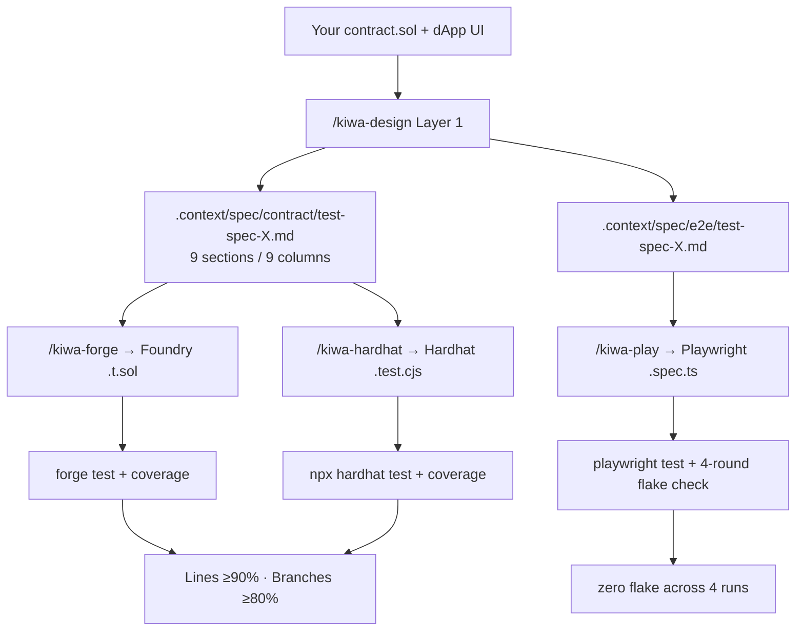

<div align="center">

# kiwa

**Design, implement, verify — every test layer for dApps and smart contracts, from one spec.**

One Layer 1 spec → Foundry `.t.sol`, Hardhat `.test.cjs`, and Playwright `.spec.ts` in parallel. With **4 metric coverage thresholds enforced** by the skill itself.

[](https://www.npmjs.com/package/@kiwa/core)
[](https://www.npmjs.com/package/@kiwa/core)
[](./LICENSE)
[](#testing--quality)
[](#testing--quality)
[](#coverage-requirement)
[](./docs/en/cookbook/smart-wallet-aa.md)
[](./tsconfig.base.json)
[](./docs/SKILL-DESIGN.md)

[**Quickstart**](#quickstart) • [**4 layer chain**](#4-layer-chain) • [**Features**](#features) • [**Examples**](#examples) • [**Docs**](./docs/en/README.md) • [**Cookbook**](./docs/en/cookbook/README.md) • [**FAQ**](./docs/en/faq.md)

[🇬🇧 English](./README.md) • [🇯🇵 日本語](./README.ja.md)

</div>

---

> 🎨 **Rebrand notice**: This project was renamed from `dapp-e2e` to **kiwa** (際) in 2026-06.
> `dapp-e2e` was a Playwright-only E2E fixture; **kiwa** is the same fixture **plus** Layer 1 test design + Layer 2 contract test generators (Foundry / Hardhat). The Playwright fixture API itself is unchanged — see [docs/MIGRATION.md § Rebrand notice](./docs/MIGRATION.md#-rebrand-notice-2026-06-dapp-e2e--kiwa) for the package-name mapping.

---

## Why kiwa?

Writing tests for a dApp is **two jobs welded together**: testing the smart contracts (Foundry / Hardhat) and testing the UI + wallet flow (Playwright). Most teams pick one runner, write half the tests, miss critical viewpoints, and ship.

**kiwa is the first toolchain that designs and generates all four test layers from a single, opinionated spec.** "kiwa" means **edge / boundary / limit** in Japanese — exactly what good tests prove.



|  | Pick one runner | kiwa (4 layers) |
|---|---|---|
| Test design | Manual checklist, varies by author | 10-viewpoint catalog + 5-risk scoring, deterministic |
| Contract tests (Foundry) | Hand-written `.t.sol` | Auto-generated from Layer 1 spec |
| Contract tests (Hardhat) | Hand-written `.test.ts` | Auto-generated, same TC IDs as Foundry |
| dApp e2e tests | Hand-written Playwright | Auto-generated, extends existing tests safely |
| Coverage gate | Optional, often skipped | **Enforced** by the skill itself (4 metrics) |
| Flake detection | Ad-hoc | Built-in 4-round loop |

> Already have a contract or dApp? See [tests/docs/retrofit-existing-dapp.md](./tests/docs/retrofit-existing-dapp.md) — the skill chain is designed **retrofit-first**, reverse-engineering specs from existing code.

---

## What's in the box

kiwa ships in two halves that work together but stand alone:

### 1. Claude Code skills (8 skills, the design + generation half)

| Skill | Layer | Role |
|---|---|---|
| [`/kiwa-test`](./.claude/skills/kiwa-test/SKILL.md) | **orchestrator** | Run the full chain in one command (contract / dApp / both) |
| [`/kiwa-design`](./.claude/skills/kiwa-design/SKILL.md) | **Layer 1** | Reverse-engineer a 9-section / 9-column test spec from existing contracts, APIs, screens, or written feature specs |
| [`/kiwa-forge`](./.claude/skills/kiwa-forge/SKILL.md) | **Layer 2** (contract) | Layer 1 spec → Foundry `.t.sol` with fuzz / invariant / `vm.prank` / custom-error reverts, run `forge test`, gate on `forge coverage` |
| [`/kiwa-hardhat`](./.claude/skills/kiwa-hardhat/SKILL.md) | **Layer 2** (contract) | Same Layer 1 spec → Hardhat `.test.cjs` with `chai-matchers` / `fast-check` / `loadFixture`, run `npx hardhat test`, gate on `solidity-coverage` |
| [`/kiwa-vitest`](./.claude/skills/kiwa-vitest/SKILL.md) | **Layer 2** (unit) | Layer 1 spec → Vitest `test/unit/*.test.{ts,tsx}` for TS helpers / TSX hooks (F-3) |
| [`/kiwa-api`](./.claude/skills/kiwa-api/SKILL.md) | **Layer 2** (integration) | Layer 1 spec → msw / supertest / Playwright `request` API integration tests (F-3) |
| [`/kiwa-play`](./.claude/skills/kiwa-play/SKILL.md) | **Layer 3** (e2e) | Layer 1 spec → Playwright `.spec.ts` + `prepare-env.ts`, 4-round flake check, extends existing tests via `--mode extend` |
| [`/kiwa-review`](./.claude/skills/kiwa-review/SKILL.md) | **reviewer** | Judge spec / test code / execution results in 3 modes (spec-review / test-review / result-review) |

### 2. npm packages (the runtime fixture half)

| Package | Use it for |
|---|---|
| [`@kiwa/core`](./packages/core) | Playwright fixture: inject `window.ethereum`, spawn `anvil`, sign, mine, time-travel, EIP-6963 multi-wallet, ERC-4337 smart accounts, custom-error helpers |
| [`@kiwa/cli`](./packages/cli) | `kiwa init` scaffolds a Playwright project wired to `@kiwa/core` |

You can use the **skills alone** (no npm dependency — they just generate test files) or the **fixture alone** (no Claude — just `pnpm add @kiwa/core`), or both together for the full chain.

---

## 4-layer chain (retrofit example: token-gating dApp)

Run the chain against [`examples/nextjs-token-gating`](./examples/nextjs-token-gating) — already contains `GatedContent.sol` + `GateNFT.sol` + existing Playwright tests.

```bash
# Step 1: Generate a contract-side spec from the existing .sol files
/kiwa-design --layer contract --module token-gating \
  --input examples/nextjs-token-gating/contracts/GatedContent.sol
# → .context/spec/contract/test-spec-token-gating.md (9 sections, 11 test cases across 6 viewpoints)

# Step 2: Generate Foundry tests from that spec
/kiwa-forge --module token-gating
# → test/GatedContent.t.sol (20 tests including fuzz)
# → forge test → 20/20 PASS
# → forge coverage → Lines 100% / Branches 87.50%  ✅ passes the gate

# Step 2': Generate Hardhat tests from the SAME spec (parallel)
/kiwa-hardhat --module token-gating
# → test/GatedContent.test.cjs (24 tests with fast-check)
# → npx hardhat test → 24/24 PASS
# → npx hardhat coverage → Branches 80.56%  ✅ passes the gate

# Step 3: Extend the existing Playwright tests using the same spec
/kiwa-play --mode extend --example nextjs-token-gating
# → tests/gating.spec.ts adds missing viewpoints (no regression on 8 existing tests)
# → pnpm test x4 rounds → 4/4 PASS, 0 flake
```

Same `TC-001 … TC-020` test IDs appear in **both** Foundry and Hardhat output — your team can pick a runner per developer without fragmenting the spec.

---

## Quickstart

### Option A: Claude Code user (full 4-layer chain)

```bash
# 1. Clone & install
git clone https://github.com/cardene777/kiwa.git && cd kiwa
pnpm install

# 2. In Claude Code, invoke the skills against your contracts / dApp
/kiwa-test --module your-module           # one-shot orchestrator (contract + e2e)
# or run individual layers:
/kiwa-design --layer contract --input path/to/YourContract.sol --module your-module
/kiwa-forge --module your-module          # Foundry
/kiwa-hardhat --module your-module        # Hardhat (parallel)
/kiwa-vitest --module your-module         # Vitest unit (F-3, optional)
/kiwa-api --module your-module            # API integration (F-3, optional)
/kiwa-play --mode new --example your-dapp # Playwright e2e
```

### Option B: Playwright fixture only (no Claude needed)

```bash
pnpm dlx @kiwa/cli init
pnpm install
pnpm exec playwright test
```

> Prerequisites: Node.js 20+ · pnpm/npm/yarn · [Foundry](https://book.getfoundry.sh/) (`anvil` + `forge`) · Playwright (`pnpm exec playwright install`)

`init` scaffolds:

```text
e2e/
├── connect.spec.ts         ← Playwright spec wired to dappE2eTest
playwright.config.ts        ← Headless Chromium config
package.json                ← test:e2e script + peer deps
```

> Before `@kiwa/*` v0.1.0 is published to npm, clone this repo and run:
> `pnpm install && pnpm -F @kiwa/core -F @kiwa/cli build && node packages/cli/dist/index.js init`

### Trying kiwa before v0.1.0 is on npm

Until `@kiwa/*` is published, point your test project at the local checkout with a `file:` dependency:

```bash
# 1. Clone & build kiwa
git clone https://github.com/cardene777/kiwa.git ~/kiwa
cd ~/kiwa
pnpm install
pnpm -F @kiwa/core -F @kiwa/cli build

# 2. In your test project, add a file: dependency
cd /path/to/your-dapp
pnpm add -D file:$HOME/kiwa/packages/core file:$HOME/kiwa/packages/cli

# 3. Scaffold from the locally-installed CLI
pnpm exec kiwa init     # or: node $HOME/kiwa/packages/cli/dist/index.js init
```

After v0.1.0 publish you can switch to `pnpm dlx @kiwa/cli init` (Option B above).

### Using kiwa with a CJS / Next.js 14 project

`@kiwa/core` ships **both ESM and CJS builds** (`dist/index.js` + `dist/index.cjs`), so both `import` and `require` resolve correctly. You can drop it into any of:

| Project type | What works out of the box |
|---|---|
| Pure ESM (`"type": "module"`) | `import { dappE2eTest } from '@kiwa/core'` |
| Pure CJS (`"type": "commonjs"`) | `const { dappE2eTest } = require('@kiwa/core')` |
| Next.js 14 (CJS host with ESM packages) | Both forms resolve; Next bundles CJS, Playwright runs ESM |

If you still hit `Error: No "exports" main defined` (older toolchains), isolate the kiwa test dir as ESM with a local `package.json`:

```bash
mkdir -p tests/kiwa
echo '{"type":"module"}' > tests/kiwa/package.json
```

Only `tests/kiwa/**.ts` is treated as ESM; the rest of your `tests/` keeps its existing CJS resolution.

### Differences from MetaMask (read before shipping)

`@kiwa/core` aims to be **production-realistic but explicit about deltas**. Key default behavioural differences:

| Behavior | MetaMask | kiwa (default) | Override |
|---|---|---|---|
| `eth_accounts` before connect | returns `[]` | returns the wallet's account (always "connected") | set `dappE2e.setApprovalMode('reject')` to refuse `eth_requestAccounts` and keep accounts hidden |
| Network add prompt | shows a popup | silent allow (no chain in store → switch fails) | call `dappE2e.addChain(config)` from the test to seed networks |
| User reject on send | popup with reject button | rejected via `setApprovalMode('reject')` returning `code: 4001` | see [`docs/en/cookbook/user-reject.md`](./docs/en/cookbook/user-reject.md) |
| EIP-6963 announce | announced on extension install | announced on fixture init | see [`docs/en/concepts/eip-6963.md`](./docs/en/concepts/eip-6963.md) |

The full RPC fidelity matrix lives in [`docs/MOCK-DESIGN.md`](./docs/MOCK-DESIGN.md) (A/B/C level scoring rubric).

---

## Features

### Layer 1: Test design automation (`/kiwa-design`)

- 📋 **9-section unified spec** — Target / Spec summary / Quality risks / Recommended composition / Viewpoints / Cases / Automated / Manual / Insufficient spec
- 🎯 **10-viewpoint catalog** — Happy / Failure / Boundary / State transition / Permission / Validation / Idempotency / Concurrency / Performance / Security
- ⚖️ **5-criteria risk scoring** — Revenue / Security / Data destruction / Frequency / Past incidents → drives test priority deterministically
- 📄 **9-column case table** — Test ID / Level / Viewpoint / Precondition / Input / Steps / Expected / Priority / Automation
- 🔁 **Retrofit-first** — reverse-engineers specs from existing `.sol`, `app/`, `tests/`, OpenAPI specs

### Layer 2: Contract test generators (`/kiwa-forge` + `/kiwa-hardhat`)

- 🔨 **Foundry mapping** — fuzz / invariant + Handler / `vm.prank` / `vm.expectRevert(Error.selector)` / `vm.warp` / `--gas-report`
- ⚒️ **Hardhat mapping** — `chai-matchers` `revertedWithCustomError` / `fast-check` `asyncProperty` / `loadFixture` / `hardhat-gas-reporter`
- 🪞 **Mirror generation** — both runners produce the same `TC-NNN` IDs from one spec; teams can run Foundry, Hardhat, or both
- 🛡️ **Coverage gate enforced** — Lines ≥ 90%, Statements ≥ 90%, **Branches ≥ 80%**, Funcs ≥ 90%. The skill won't write `test-passed` marker until all four metrics pass

### Layer 2: dApp E2E fixture (`/kiwa-play` + `@kiwa/core`)

- 🦊 **Inject `window.ethereum`** without any browser extension
- ⚡ **Spawn anvil per test** for total chain isolation
- 🔌 **9 RPC methods handled directly** (`eth_requestAccounts` / `personal_sign` / `eth_signTypedData_v4` / `eth_sendTransaction` / `wallet_switchEthereumChain` …), the rest forwarded to anvil
- 📡 **EIP-1193 events** — `accountsChanged` / `chainChanged` / `connect` / `disconnect` triggerable from tests
- 👛 **EIP-6963 multi-wallet** — declare MetaMask, Rabby, Coinbase, … side-by-side
- 🤖 **Smart contract account (AA)** — `isContractAccount: true` reroutes `personal_sign` through EIP-1271, `eth_sendTransaction` through `execute()`
- 📦 **viem as peer dep** — your project owns the version
- 🔁 **`--mode extend`** — appends new viewpoints without breaking existing tests, 4-round flake check built in
- ❌ **error envelope** preserves `code` and `message` across page boundaries

### Industry-standard helpers (`@kiwa/core`)

| Helper | Purpose |
|---|---|
| `snapshotChain` / `revertChain` | Per-test isolation via `evm_snapshot` / `evm_revert` |
| `expectCustomError` | One-liner Solidity custom-error assertion |
| `increaseTime` / `mineBlock` / `setNextBlockTimestamp` | Time travel for vesting / TTL / timelock |
| `impersonateAccount` / `stopImpersonateAccount` / `setBalance` | Act as arbitrary EOA / contract with injected balance |
| `startAnvilCluster` | Multi-chain (L1 + L2 + …) anvil cluster |
| `startAnvilFork` | `anvil --fork-url` thin wrapper (mainnet / sepolia / any RPC) |
| `expectEvent` | `decodeEventLog` + assertion combined |
| `expectBalanceChange` / `expectEthBalanceChange` | Balance delta assertion (hardhat-chai-matchers compatible) |

---

## Coverage requirement

`/kiwa-forge` and `/kiwa-hardhat` **block the `test-passed` marker** until all four coverage metrics clear thresholds. Default values (tuned for OSS-grade smart contracts):

| Metric | Default threshold | Rationale |
|---|---|---|
| Lines | 90 % | Cover the primary paths fully |
| Statements | 90 % | Statement-level coverage |
| **Branches** | **80 %** | 100% on Solidity `require` / `revert` / short-circuit is impractical |
| Functions | 90 % | Cover every `public` / `external` function |

If any metric falls short, the skill **records the under-covered viewpoints / error paths / events back into the Layer 1 spec's "Insufficient spec" section** so the next loop can address them — instead of silently signing off on weak tests.

Override with `--coverage-lines 95 --coverage-branches 85` etc.

---

## Examples

For a reverse lookup by feature, jump to [`docs/en/examples/README.md`](./docs/en/examples/README.md). For a 30 min ~ 1 hour guided tour through five popular examples, follow [`docs/en/examples/walkthrough.md`](./docs/en/examples/walkthrough.md). Per-example READMEs live under [`examples/{name}/README.md`](./examples/) (bilingual `README.ja.md` available for the popular five — basic-connect / mint-nft / defi-swap / nextjs-wagmi-rainbow / nft-marketplace).

### Retrofit examples with verified Foundry / Hardhat / Playwright chains

These three examples have **forge test + hardhat test (where applicable) + playwright test, all in 4-round zero-flake state, with coverage gates passed**:

| Example | Contract tests (Foundry) | Contract tests (Hardhat) | E2E tests (Playwright) | Coverage (Lines / Branches) |
|---|---|---|---|---|
| [`mint-nft`](./examples/mint-nft) | 27 / 27 | 24 / 24 | (covered by basic-connect) | Foundry 97.70 / 83.33 · Hardhat 93.75 / 80.56 |
| [`defi-swap`](./examples/defi-swap) | 17 / 17 | — | (covered by basic-connect) | 100 / 87.50 |
| [`nextjs-token-gating`](./examples/nextjs-token-gating) | 20 / 20 | — | 8 existing PASS | 100 / 87.50 |

### dApp E2E reference (`@kiwa/core` fixture)

20 reference dApps live under [`examples/`](./examples/), proving the fixture against a wide stack:

| Example | Stack / Domain | E2E tests |
|---|---|---|
| [`basic-connect`](./examples/basic-connect) | inline HTML + EIP-6963 + reject paths | 15 |
| [`nextjs-wagmi-rainbow`](./examples/nextjs-wagmi-rainbow) | Next.js 14 + wagmi v2 + RainbowKit | 4 |
| [`vite-react-wagmi`](./examples/vite-react-wagmi) | Vite 5 + React 18 + wagmi v2 (SPA) | 3 |
| [`nextjs-aa-erc4337`](./examples/nextjs-aa-erc4337) ⭐ | Full ERC-4337 v0.7 (EntryPoint + SimpleAccountFactory + UserOp bundler stub) | 7 |
| [`nextjs-aa-smart-account`](./examples/nextjs-aa-smart-account) | Simplified ERC-4337 + ERC-1271 + guardian recovery | 10 |
| [`nextjs-multi-chain`](./examples/nextjs-multi-chain) | 3-chain parallel anvil + chain switch | 6 |
| [`nextjs-bridge`](./examples/nextjs-bridge) | L1 ↔ L2 lock / mint / burn / unlock | 10 |
| [`nextjs-permit-swap`](./examples/nextjs-permit-swap) | EIP-2612 permit + deadline | 6 |
| [`nextjs-dao-vote`](./examples/nextjs-dao-vote) | Compound-style Governor + timelock + quorum | 10 |
| [`nextjs-lending`](./examples/nextjs-lending) | Aave-style lending + liquidation + max LTV | 10 |
| [`nextjs-staking`](./examples/nextjs-staking) | Stake + reward + early-unstake penalty | 12 |
| [`nextjs-erc1155-game`](./examples/nextjs-erc1155-game) | ERC-1155 batch mint / transfer / burn | 8 |
| [`nextjs-vesting`](./examples/nextjs-vesting) | Cliff + linear vesting + immutability | 9 |
| [`nextjs-token-gating`](./examples/nextjs-token-gating) | NFT-gated content + timed access + transfer revoke | 8 |
| [`nextjs-ens-resolver`](./examples/nextjs-ens-resolver) | ENS-like forward / reverse + collision | 7 |
| [`nextjs-event-history`](./examples/nextjs-event-history) | Past event query + multi-indexed filter | 7 |
| [`nextjs-zk-verifier`](./examples/nextjs-zk-verifier) | Commit-reveal + range proof variant | 7 |
| [`nft-marketplace`](./examples/nft-marketplace) | List / buy / offer / royalty split | 12 |

---

## Multi-Wallet (EIP-6963)

```ts
import { dappE2eTest } from '@kiwa/core';

const test = dappE2eTest.extend({
  wallets: [
    {
      name: 'MetaMask',
      rdns: 'io.metamask',
      icon: 'data:image/svg+xml;base64,...',
      privateKey: '0xac09...ff80',
    },
    {
      name: 'Rabby',
      rdns: 'io.rabby',
      icon: 'data:image/svg+xml;base64,...',
      privateKey: '0x59c6...690d',
    },
  ],
});

test('multi wallet picker', async ({ page, dappE2e }) => {
  await dappE2e.wallets!['io.rabby'].connect();
});
```

When `wallets` is unset, a single MetaMask-compatible wallet runs (backward compatible).

---

## Testing & Quality

Phase E rebrand snapshot (main @ `b7267a7`):

| Metric | Value |
|---|---|
| 4-layer chain examples | **3** (mint-nft / defi-swap / nextjs-token-gating) |
| Foundry tests across 3 examples | **64** (27 + 17 + 20) |
| Hardhat tests (mint-nft) | **24** |
| Playwright tests (basic-connect) | **15** |
| **4-round execution total** | **292 PASS** (164 Foundry + 68 Hardhat + 60 Playwright) |
| **Flaky** | **0 / 292** |
| Coverage Lines | **93.75 – 100 %** across all chains |
| Coverage Branches | **80.56 – 87.50 %** across all chains |
| Coverage Functions | **95.24 – 100 %** |
| Adversarial review findings (resolved) | 21 (5 CRITICAL / 9 MAJOR / 7 MINOR, all closed in-PR) |

The 4-round flake check is mandatory before any release tag — runner at [`.context/scratch/multi-round-all-examples.sh`](./examples) (developer-side).

Adversarial review patterns are catalogued in [`adversarial-pitfalls.md`](./.claude/skills/kiwa-play/references/adversarial-pitfalls.md) as a self-check checklist for false positives.

---

## Documentation

Full 5-section docs (Quickstart / Concepts / API / Cookbook / FAQ) maintained in **JP↔EN 1:1 translation** under [`docs/`](./docs/).

- 🇬🇧 [English documentation](./docs/en/README.md)
- 🇯🇵 [日本語ドキュメント](./docs/ja/README.md)

Reference docs:

|  |  |
|---|---|
| [`docs/SKILL-DESIGN.md`](./docs/SKILL-DESIGN.md) ⭐ | **SSOT for all 8 skills** (5-step flow, 9-section output, 13 viewpoints, 5 risk criteria) |
| [`docs/MOCK-DESIGN.md`](./docs/MOCK-DESIGN.md) | Wallet / SDK mock fidelity spec (A/B/C levels, scoring rubric) |
| [`tests/docs/skill-chain-tutorial.md`](./tests/docs/skill-chain-tutorial.md) ⭐ | **skill chain walkthrough** (retrofit-first) |
| [`docs/RPC.md`](./docs/RPC.md) | 9 directly-handled RPC + anvil fallback |
| [`docs/EVENTS.md`](./docs/EVENTS.md) | 4 events + `triggerEvent()` |
| [`docs/ERRORS.md`](./docs/ERRORS.md) | EIP-1193 error code + envelope design |
| [`docs/MIGRATION.md`](./docs/MIGRATION.md) | v0.x breaking-change policy + dapp-e2e → kiwa rebrand notice |
| [`docs/COMPARISON.md`](./docs/COMPARISON.md) | Synpress / wallet-mock comparison |
| [`docs/RELEASING.md`](./docs/RELEASING.md) | Publish flow + provenance |

For Claude Code users — full skill reference:

- [`/kiwa-design`](./.claude/skills/kiwa-design/SKILL.md) — Layer 1 spec generator
- [`/kiwa-forge`](./.claude/skills/kiwa-forge/SKILL.md) — Foundry generator
- [`/kiwa-hardhat`](./.claude/skills/kiwa-hardhat/SKILL.md) — Hardhat generator
- [`/kiwa-play`](./.claude/skills/kiwa-play/SKILL.md) — Playwright generator + 22-example index + 9 false-positive patterns

---

## Contributing

- 📖 [Read CONTRIBUTING.md](./CONTRIBUTING.md) — dev setup + skill chain workflow + PR checklist
- 🤝 [Code of Conduct](./CODE_OF_CONDUCT.md) — Contributor Covenant 2.1
- 🔒 [Security policy](./SECURITY.md) — Report vulnerabilities privately
- 🐛 [Open an issue](https://github.com/cardene777/kiwa/issues)
- 🔀 [Send a pull request](https://github.com/cardene777/kiwa/pulls)
- 🗺️ Open Issues (current roadmap): [enhancement label](https://github.com/cardene777/kiwa/issues?q=is%3Aissue+is%3Aopen+label%3Aenhancement+sort%3Acreated-desc)
- 💡 Check [`docs/MIGRATION.md`](./docs/MIGRATION.md) before reporting breaking-change concerns

---

## Contact

For questions, feedback, or general chat that does not fit a GitHub Issue, reach out via either channel below.

- 💬 [GitHub Discussions](https://github.com/cardene777/kiwa/discussions) — Long-form questions / proposals
- 🐦 [X / Twitter @cardene777](https://x.com/cardene777) — Quick replies, DMs open

For bug reports, please [open an Issue](https://github.com/cardene777/kiwa/issues) instead so the discussion stays searchable. For private security disclosures, use the [Security advisory channel](https://github.com/cardene777/kiwa/security/advisories/new) (see [SECURITY.md](./SECURITY.md)).

---

## License

[MIT](./LICENSE) © [cardene](https://github.com/cardene777) — find me on [GitHub](https://github.com/cardene777) and [X](https://x.com/cardene777).

<div align="center">

Made with ⚡ by the kiwa contributors. **Test to the edge.**

**[⬆ Back to top](#kiwa)**

</div>
