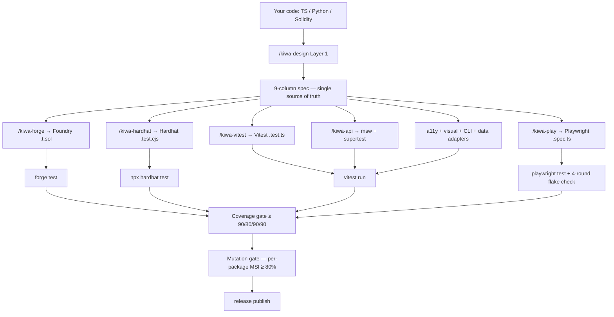

<div align="center">


# kiwa

**Every test layer · one spec · TypeScript / Solidity / Python.**

One Layer 1 spec → contract / API / component / e2e / a11y / visual / Next.js (Server Actions / middleware / RSC) tests in parallel, across **12 npm packages + 1 PyPI package + Foundry / Hardhat bridges**. Coverage and Mutation gates **enforced at release** by `scripts/check-{coverage,mutation}-gates.mjs`.

[](https://www.npmjs.com/package/@kiwa-test/dapp)
[](https://www.npmjs.com/package/@kiwa-test/dapp)
[](#what-s-in-the-box)
[](./kiwa-py)
[](./LICENSE)
[](#testing--quality)
[](#testing--quality)
[](#quality-gates)
[](#quality-gates)
[](./docs/en/cookbook/smart-wallet-aa.md)
[](./tsconfig.base.json)
[](./docs/SKILL-DESIGN.md)

[**Quickstart**](#quickstart) • [**4 layer chain**](#4-layer-chain) • [**Features**](#features) • [**Examples**](#examples) • [**Docs**](./docs/en/README.md) • [**Cookbook**](./docs/en/cookbook/README.md) • [**FAQ**](./docs/en/faq.md)

[🇬🇧 English](./README.md) • [🇯🇵 日本語](./README.ja.md)

</div>

<p align="center">
  
  <br />
  <sub><a href="./assets/kiwa-promo-en.mp4">▶ Watch the full-quality MP4 (2.9 MB, 1920×1080, h264)</a></sub>
</p>

---

> 🎨 **Rebrand notice**: This project was renamed from `dapp-e2e` to **kiwa** (際) in 2026-06.
> `dapp-e2e` was a Playwright-only E2E fixture; **kiwa** is the same fixture **plus** Layer 1 test design + Layer 2 contract test generators (Foundry / Hardhat). The Playwright fixture API itself is unchanged — see [docs/MIGRATION.md § Rebrand notice](./docs/MIGRATION.md#-rebrand-notice-2026-06-dapp-e2e--kiwa) for the package-name mapping.

---

## Why kiwa?

Modern stacks scatter their tests across **mismatched runners**: Foundry / Hardhat for contracts, Vitest for unit + API, Playwright for e2e, Testing Library for components, axe-core for a11y, pixelmatch for visual, pytest for Python services. Every runner has its own conventions, fixtures, and gates — and **no single source of truth** spans them.

**kiwa is a test toolchain that turns one Layer 1 spec into every test layer your stack actually needs.** "kiwa" means **edge / boundary / limit** in Japanese — exactly what good tests prove. dApps and smart contracts are first-class citizens, alongside REST APIs (msw / supertest / Playwright request), SPA components (8 framework adapters), CLI tools, queue workers, generic browser e2e (Playwright), accessibility (axe-core), visual regression (pixelmatch), Next.js App Router (Server Actions / middleware / RSC), and Python pytest (port of the spec parser + requests/httpx adapter, published as `kiwa-test-py` on PyPI).


```mermaid
graph TD
    A[Your code: TS / Python / Solidity] --> B["/kiwa-design Layer 1"]
    B --> C[9-column spec — single source of truth]
    C --> D["/kiwa-forge → Foundry .t.sol"]
    C --> E["/kiwa-hardhat → Hardhat .test.cjs"]
    C --> F["/kiwa-vitest → Vitest .test.ts"]
    C --> G["/kiwa-api → msw + supertest"]
    C --> H["/kiwa-play → Playwright .spec.ts"]
    C --> I["a11y + visual + CLI + data adapters"]
    D --> J[forge test]
    E --> K[npx hardhat test]
    F --> L[vitest run]
    G --> L
    H --> M[playwright test + 4-round flake check]
    I --> L
    J --> N[Coverage gate ≥ 90/80/90/90]
    K --> N
    L --> N
    M --> N
    N --> O[Mutation gate — per-package MSI ≥ 80%]
    O --> P[release publish]
```

|  | One-runner approach | kiwa (6 surfaces, 1 spec) |
|---|---|---|
| Test design | Per-runner checklist, varies by author | 10-viewpoint catalog + 5-risk scoring, deterministic |
| Contract (dApp / smart contract) | Hand-written `.t.sol` / `.test.ts` | Foundry + Hardhat from one spec, same TC IDs |
| API integration | Hand-written msw / supertest | Auto-generated, both mock + live modes |
| Component (8 frameworks) | Per-framework runner, drifted fixtures | One `@kiwa-test/ui` package across React / Vue / Svelte / Solid / Lit / Qwik / Angular / Chromium |
| dApp e2e | Hand-written Playwright + wallet glue | Auto-generated, anvil + viem + EIP-6963 + ERC-4337 wired |
| A11y / Visual | Ad-hoc CI step or skipped | First-class adapters (axe-core / pixelmatch) sharing the same spec |
| Polyglot | TS-only by default | TypeScript + Solidity (forge / hardhat) + Python (pytest, `pip install kiwa-test-py`) from the same skill chain |
| Coverage gate | Optional, often skipped | **Enforced** at release — 4 metrics × 11 packages |
| Mutation gate | Rarely run | **Enforced** at release — per-package MSI threshold |
| Flake detection | Ad-hoc | Built-in 4-round loop |

> Already have code? `kiwa` is designed **retrofit-first**: every Layer 2 generator can reverse-engineer a spec from existing tests. See [tests/docs/retrofit-existing-dapp.md](./tests/docs/retrofit-existing-dapp.md) for a dApp walkthrough, [`@kiwa-test/api`](./packages/api) / [`@kiwa-test/ui`](./packages/ui) / [`@kiwa-test/cli-test`](./packages/cli-test) for non-dApp stacks.

---

## What's in the box

kiwa ships in two halves that work together but stand alone:

### 1. Claude Code skills (15 skills, the design + generation half)

| Skill | Layer | Role |
|---|---|---|
| [`/kiwa-test`](./.claude/skills/kiwa-test/SKILL.md) | **orchestrator** | Run the full chain in one command (`--target {contract\|dapp\|web\|both\|all}`, where `web` runs the generic-e2e + a11y + visual trio against the same `app/` source and `all` covers all 6 web-side surfaces) |
| [`/kiwa-design`](./.claude/skills/kiwa-design/SKILL.md) | **Layer 1** | Reverse-engineer a 9-section / 9-column test spec from existing contracts, APIs, screens, or written feature specs |
| [`/kiwa-forge`](./.claude/skills/kiwa-forge/SKILL.md) | **Layer 2** (contract) | Layer 1 spec → Foundry `.t.sol` with fuzz / invariant / `vm.prank` / custom-error reverts, run `forge test`, gate on `forge coverage` |
| [`/kiwa-hardhat`](./.claude/skills/kiwa-hardhat/SKILL.md) | **Layer 2** (contract) | Same Layer 1 spec → Hardhat `.test.cjs` with `chai-matchers` / `fast-check` / `loadFixture`, run `npx hardhat test`, gate on `solidity-coverage` |
| [`/kiwa-vitest`](./.claude/skills/kiwa-vitest/SKILL.md) | **Layer 2** (unit) | Layer 1 spec → Vitest `test/unit/*.test.{ts,tsx}` for TS helpers / TSX hooks |
| [`/kiwa-api`](./.claude/skills/kiwa-api/SKILL.md) | **Layer 2** (integration) | Layer 1 spec → msw / supertest / Playwright `request` API integration tests |
| [`/kiwa-ui`](./.claude/skills/kiwa-ui/SKILL.md) | **Layer 2** (ui) | Layer 1 spec → Vitest + Testing Library component tests for 8 frameworks (React / Vue / Svelte / SolidJS / Lit / Qwik / Angular / Browser) |
| [`/kiwa-e2e`](./.claude/skills/kiwa-e2e/SKILL.md) | **Layer 2** (e2e) | Layer 1 spec → Playwright generic browser e2e tests (static html / fetch / Node handler / SSR app) for non-web3 contexts |
| [`/kiwa-play`](./.claude/skills/kiwa-play/SKILL.md) | **Layer 2** (dApp e2e) | Layer 1 spec → Playwright `.spec.ts` + `prepare-env.ts` with wallet inject / anvil / viem for web3 contexts |
| [`/kiwa-a11y`](./.claude/skills/kiwa-a11y/SKILL.md) | **Layer 2** (a11y) | Layer 1 spec → axe-core accessibility tests (jsdom + Playwright), WCAG 2.1 AA violation detection |
| [`/kiwa-visual`](./.claude/skills/kiwa-visual/SKILL.md) | **Layer 2** (visual) | Layer 1 spec → pixelmatch visual regression tests with baseline / actual / diff snapshot management |
| [`/kiwa-data`](./.claude/skills/kiwa-data/SKILL.md) | **Layer 2** (data) | Layer 1 spec → in-memory queue + fake clock tests for queue / cron / batch / DLQ semantics |
| [`/kiwa-cli-test`](./.claude/skills/kiwa-cli-test/SKILL.md) | **Layer 2** (cli) | Layer 1 spec → CLI / shell / file IO tests with isolated tempdir + stdout/stderr snapshot |
| [`/kiwa-observe`](./.claude/skills/kiwa-observe/SKILL.md) | **observability** | Aggregate vitest JSON results → flaky detection + spec-coverage gap analysis + markdown dashboard |
| [`/kiwa-review`](./.claude/skills/kiwa-review/SKILL.md) | **reviewer** | Judge spec / test code / execution results in 3 modes (spec-review / test-review / result-review) |

### 2. npm packages (the runtime fixture half)

| Package | Use it for |
|---|---|
| [`@kiwa-test/dapp`](./packages/dapp) | Playwright fixture: inject `window.ethereum`, spawn `anvil`, sign, mine, time-travel, EIP-6963 multi-wallet, ERC-4337 smart accounts, custom-error helpers |
| [`@kiwa-test/cli`](./packages/cli) | `kiwa init` scaffolds a Playwright project wired to `@kiwa-test/dapp` |
| [`@kiwa-test/core`](./packages/core) | Spec markdown parser shared by every adapter (9-column `test-spec-*.md` → `SpecDoc`) |
| [`@kiwa-test/api`](./packages/api) | API integration adapter (Vitest + msw + supertest + Playwright `request`) |
| [`@kiwa-test/ui`](./packages/ui) | Component adapters for **React / Vue / Svelte / SolidJS / Lit / Qwik / Angular / real Chromium** (render / interaction / snapshot modes) |
| [`@kiwa-test/data`](./packages/data) | Queue / cron / batch adapter — in-memory queue + fake clock + idempotency / DLQ semantics |
| [`@kiwa-test/cli-test`](./packages/cli-test) | CLI / shell / file IO adapter — isolated tempdir + env override + stdout/stderr snapshot |
| [`@kiwa-test/e2e`](./packages/e2e) | Generic browser E2E adapter (Playwright + static html / fetch app) |
| [`@kiwa-test/observability`](./packages/observability) | Run history collection / flaky detection / coverage report / spec-coverage gap analysis |
| [`@kiwa-test/a11y`](./packages/a11y) | Accessibility adapter — axe-core integration for jsdom + Playwright pages |
| [`@kiwa-test/visual`](./packages/visual) | Visual regression adapter — pixel-level PNG diff backed by pixelmatch + pngjs |
| [`kiwa-test-py`](./kiwa-py) (PyPI, v1.0.0+) | Python pytest adapter — port of `@kiwa-test/core` + requests / httpx adapter, `pip install kiwa-test-py` |

You can use the **skills alone** (no npm dependency — they just generate test files) or the **fixture alone** (no Claude — just `pnpm add @kiwa-test/dapp`), or both together for the full chain.

---

## 4-layer chain (retrofit example: token-gating dApp)

Run the chain against [`examples/nextjs-token-gating`](./examples/nextjs-token-gating) — already contains `GatedContent.sol` + `GateNFT.sol` + existing Playwright tests.

```bash
# Step 1: Generate a contract-side spec from the existing .sol files
/kiwa-design --layer contract --module token-gating \
  --input examples/nextjs-token-gating/contracts/GatedContent.sol
# → .context/spec/contract/test-spec-token-gating.md (9 sections, 11 test cases across 6 viewpoints)

# Step 2: Generate Foundry tests from that spec
/kiwa-forge --module token-gating
# → test/GatedContent.t.sol (20 tests including fuzz)
# → forge test → 20/20 PASS
# → forge coverage → Lines 100% / Branches 87.50%  ✅ passes the gate

# Step 2': Generate Hardhat tests from the SAME spec (parallel)
/kiwa-hardhat --module token-gating
# → test/GatedContent.test.cjs (24 tests with fast-check)
# → npx hardhat test → 24/24 PASS
# → npx hardhat coverage → Branches 80.56%  ✅ passes the gate

# Step 3: Extend the existing Playwright tests using the same spec
# (run from examples/nextjs-token-gating/ — Step 0 auto-detects the dApp project)
/kiwa-play --mode extend
# → tests/gating.spec.ts adds missing viewpoints (no regression on 8 existing tests)
# → pnpm test x4 rounds → 4/4 PASS, 0 flake
```

Same `TC-001 … TC-020` test IDs appear in **both** Foundry and Hardhat output — your team can pick a runner per developer without fragmenting the spec.

### 6-surface chain coverage (Layer 1 → Layer 2 → Layer 3)

Every kiwa surface follows the same `kiwa-design → Layer 2 generator → kiwa-review` chain. The spec format (9 sections) and the 11 viewpoints catalog are shared across all surfaces, so once you learn the contract chain you already know the dApp E2E / generic E2E / a11y / visual / API / UI chains.

| Surface | Layer 1 (spec) | Layer 2 (generator) | Layer 3 (review) | runtime fixture |
|---|---|---|---|---|
| contract (Foundry / Hardhat) | `/kiwa-design --layer contract` | `/kiwa-forge` + `/kiwa-hardhat` | `/kiwa-review --layer contract` | `forge` / `hardhat` |
| dApp e2e (Playwright + viem + anvil) | `/kiwa-design --layer e2e` | `/kiwa-play` | `/kiwa-review --layer e2e` | `@kiwa-test/dapp` |
| generic browser e2e (non-web3) | `/kiwa-design --layer e2e-generic` | `/kiwa-e2e` | `/kiwa-review --layer e2e-generic` | `@kiwa-test/e2e` |
| accessibility (WCAG 2.1 AA) | `/kiwa-design --layer a11y` | `/kiwa-a11y` | `/kiwa-review --layer a11y` | `@kiwa-test/a11y` (axe-core) |
| visual regression (pixel diff) | `/kiwa-design --layer visual` | `/kiwa-visual` | `/kiwa-review --layer visual` | `@kiwa-test/visual` (pixelmatch) |
| HTTP API (REST / GraphQL) | `/kiwa-design --layer api` | `/kiwa-api` | `/kiwa-review --layer api` | `@kiwa-test/api` |
| React component | `/kiwa-design --layer ui` | `/kiwa-ui` | `/kiwa-review --layer ui` | `@kiwa-test/ui` |
| queue / cron / batch | `/kiwa-design --layer data` | `/kiwa-data` | `/kiwa-review --layer data` | `@kiwa-test/data` |
| CLI / shell / file IO | `/kiwa-design --layer cli` | `/kiwa-cli-test` | `/kiwa-review --layer cli` | `@kiwa-test/cli-test` |

`/kiwa-test --target {contract|dapp|web|both|all}` orchestrates the chain end-to-end for any subset of surfaces — `web` runs the generic e2e / a11y / visual trio against the same `app/` source, and `all` covers all 6 web-side surfaces (contract + dapp + web). The integrated report at `tests/reports/integrated/{example}-{target}.{lang}.md` aggregates every surface's pass/fail count, coverage, and reviewer score in one table.

---

## Quickstart

### Option A: Claude Code plugin (recommended for Claude users)

Install the kiwa skill chain as a Claude Code plugin — no clone required, available across **any** of your dApp projects after install.

```bash
# In Claude Code (run from any project):
/plugin marketplace add cardene777/kiwa
/plugin install kiwa@kiwa-marketplace
/reload-plugins                            # activate without restarting the session
```

After install, all 8 skills appear under the `kiwa:` namespace (Claude Code namespaces plugin skills by plugin name). Inside any dApp project, run the individual layers:

```bash
# Layer 1 — design tests (output: tests/spec/<layer>/test-spec-<module>.md)
/kiwa:kiwa-design --layer contract --input path/to/YourContract.sol --module your-module
/kiwa:kiwa-design --layer unit --module your-module
/kiwa:kiwa-design --layer integration --module your-module

# Layer 2 — implement tests from the spec
/kiwa:kiwa-forge --module your-module          # Foundry contract tests
/kiwa:kiwa-hardhat --module your-module        # Hardhat contract tests (parallel runner option)
/kiwa:kiwa-vitest --module your-module         # Vitest unit (F-3)
/kiwa:kiwa-api --module your-module            # API integration (F-3)
/kiwa:kiwa-play --init                          # Bootstrap Playwright fixture for a fresh dApp
/kiwa:kiwa-play --mode new                      # Add new dApp e2e tests
/kiwa:kiwa-play --mode extend                   # Extend existing dApp e2e tests

# Review — covers spec / test / result (provide --module + --layer to resolve paths)
/kiwa:kiwa-review --mode test-review --module your-module --layer contract
```

> The `--example` flag and `/kiwa:kiwa-test` one-shot orchestrator are intended for the kiwa monorepo itself (which has `examples/`). Plugin users run the individual skills above directly from their project.

Update the plugin later:

```bash
/plugin marketplace update kiwa-marketplace  # refresh the catalog
/plugin update kiwa@kiwa-marketplace         # apply the new version
```

### Option B: Clone & install (for kiwa contributors)

```bash
# 1. Clone & install
git clone https://github.com/cardene777/kiwa.git && cd kiwa
pnpm install

# 2. In Claude Code (run from the kiwa repo), the project-local skills load automatically
/kiwa-test --example nextjs-token-gating   # one-shot orchestrator (kiwa repo only, uses examples/)
```

### Option C: Playwright fixture only (no Claude needed)

```bash
pnpm dlx @kiwa-test/cli init
pnpm install
pnpm exec playwright test
```

> Prerequisites: Node.js 20+ · pnpm/npm/yarn · [Foundry](https://book.getfoundry.sh/) (`anvil` + `forge`) · Playwright (`pnpm exec playwright install`)

`init` scaffolds:

```text
e2e/
├── connect.spec.ts         ← Playwright spec wired to dappE2eTest
playwright.config.ts        ← Headless Chromium config
package.json                ← test:e2e script + peer deps
```

> Now available on npm — `pnpm dlx @kiwa-test/cli init` works out of the box (no clone required).

### Option D — Local checkout (for kiwa contributors)

If you are hacking on kiwa itself and want to test changes against a local dApp project before publishing, link with a `file:` dependency:

```bash
# 1. Clone & build kiwa
git clone https://github.com/cardene777/kiwa.git ~/kiwa
cd ~/kiwa
pnpm install
pnpm -F @kiwa-test/dapp -F @kiwa-test/cli build

# 2. In your test project, add a file: dependency
cd /path/to/your-dapp
pnpm add -D file:$HOME/kiwa/packages/dapp file:$HOME/kiwa/packages/cli

# 3. Scaffold from the locally-installed CLI
pnpm exec kiwa init     # or: node $HOME/kiwa/packages/cli/dist/index.js init
```

For everyday use, prefer Option C (`pnpm dlx @kiwa-test/cli init`) which pulls the published 0.1.0 version directly.

### Using kiwa with a CJS / Next.js 14 project

`@kiwa-test/dapp` ships **both ESM and CJS builds** (`dist/index.js` + `dist/index.cjs`), so both `import` and `require` resolve correctly. You can drop it into any of:

| Project type | What works out of the box |
|---|---|
| Pure ESM (`"type": "module"`) | `import { dappE2eTest } from '@kiwa-test/dapp'` |
| Pure CJS (`"type": "commonjs"`) | `const { dappE2eTest } = require('@kiwa-test/dapp')` |
| Next.js 14 (CJS host with ESM packages) | Both forms resolve; Next bundles CJS, Playwright runs ESM |

If you still hit `Error: No "exports" main defined` (older toolchains), isolate the kiwa test dir as ESM with a local `package.json`:

```bash
mkdir -p tests/kiwa
echo '{"type":"module"}' > tests/kiwa/package.json
```

Only `tests/kiwa/**.ts` is treated as ESM; the rest of your `tests/` keeps its existing CJS resolution.

### Differences from MetaMask (read before shipping)

`@kiwa-test/dapp` aims to be **production-realistic but explicit about deltas**. Key default behavioural differences:

| Behavior | MetaMask | kiwa (default) | Override |
|---|---|---|---|
| `eth_accounts` before connect | returns `[]` | returns the wallet's account (always "connected") | set `dappE2e.setApprovalMode('reject')` to refuse `eth_requestAccounts` and keep accounts hidden |
| Network add prompt | shows a popup | silent allow (no chain in store → switch fails) | call `dappE2e.addChain(config)` from the test to seed networks |
| User reject on send | popup with reject button | rejected via `setApprovalMode('reject')` returning `code: 4001` | see [`docs/en/cookbook/user-reject.md`](./docs/en/cookbook/user-reject.md) |
| EIP-6963 announce | announced on extension install | announced on fixture init | see [`docs/en/concepts/eip-6963.md`](./docs/en/concepts/eip-6963.md) |

The full RPC fidelity matrix lives in [`docs/MOCK-DESIGN.md`](./docs/MOCK-DESIGN.md) (A/B/C level scoring rubric).

---

## Features

### Layer 1: Test design automation (`/kiwa-design`)

- 📋 **9-section unified spec** — Target / Spec summary / Quality risks / Recommended composition / Viewpoints / Cases / Automated / Manual / Insufficient spec
- 🎯 **10-viewpoint catalog** — Happy / Failure / Boundary / State transition / Permission / Validation / Idempotency / Concurrency / Performance / Security
- ⚖️ **5-criteria risk scoring** — Revenue / Security / Data destruction / Frequency / Past incidents → drives test priority deterministically
- 📄 **9-column case table** — Test ID / Level / Viewpoint / Precondition / Input / Steps / Expected / Priority / Automation
- 🔁 **Retrofit-first** — reverse-engineers specs from existing `.sol`, `app/`, `tests/`, OpenAPI specs

### Layer 2: Contract test generators (`/kiwa-forge` + `/kiwa-hardhat`)

- 🔨 **Foundry mapping** — fuzz / invariant + Handler / `vm.prank` / `vm.expectRevert(Error.selector)` / `vm.warp` / `--gas-report`
- ⚒️ **Hardhat mapping** — `chai-matchers` `revertedWithCustomError` / `fast-check` `asyncProperty` / `loadFixture` / `hardhat-gas-reporter`
- 🪞 **Mirror generation** — both runners produce the same `TC-NNN` IDs from one spec; teams can run Foundry, Hardhat, or both
- 🛡️ **Coverage gate enforced** — Lines ≥ 90%, Statements ≥ 90%, **Branches ≥ 80%**, Funcs ≥ 90%. The skill won't write `test-passed` marker until all four metrics pass

### Layer 2: dApp E2E fixture (`/kiwa-play` + `@kiwa-test/dapp`)

- 🦊 **Inject `window.ethereum`** without any browser extension
- ⚡ **Spawn anvil per test** for total chain isolation
- 🔌 **9 RPC methods handled directly** (`eth_requestAccounts` / `personal_sign` / `eth_signTypedData_v4` / `eth_sendTransaction` / `wallet_switchEthereumChain` …), the rest forwarded to anvil
- 📡 **EIP-1193 events** — `accountsChanged` / `chainChanged` / `connect` / `disconnect` triggerable from tests
- 👛 **EIP-6963 multi-wallet** — declare MetaMask, Rabby, Coinbase, … side-by-side
- 🤖 **Smart contract account (AA)** — `isContractAccount: true` reroutes `personal_sign` through EIP-1271, `eth_sendTransaction` through `execute()`
- 📦 **viem as peer dep** — your project owns the version
- 🔁 **`--mode extend`** — appends new viewpoints without breaking existing tests, 4-round flake check built in
- ❌ **error envelope** preserves `code` and `message` across page boundaries

### Industry-standard helpers (`@kiwa-test/dapp`)

| Helper | Purpose |
|---|---|
| `snapshotChain` / `revertChain` | Per-test isolation via `evm_snapshot` / `evm_revert` |
| `expectCustomError` | One-liner Solidity custom-error assertion |
| `increaseTime` / `mineBlock` / `setNextBlockTimestamp` | Time travel for vesting / TTL / timelock |
| `impersonateAccount` / `stopImpersonateAccount` / `setBalance` | Act as arbitrary EOA / contract with injected balance |
| `startAnvilCluster` | Multi-chain (L1 + L2 + …) anvil cluster |
| `startAnvilFork` | `anvil --fork-url` thin wrapper (mainnet / sepolia / any RPC) |
| `expectEvent` | `decodeEventLog` + assertion combined |
| `expectBalanceChange` / `expectEthBalanceChange` | Balance delta assertion (hardhat-chai-matchers compatible) |

---

## How does kiwa compare to other tools?

kiwa sits at the intersection of two ecosystems. Short version:

| Axis | Closest competitor | kiwa's differentiation |
|---|---|---|
| dApp E2E fixture (Playwright + viem + anvil) | [`wallet-mock`](https://github.com/johanneskares/wallet-mock), [Synpress](https://github.com/Synthetixio/synpress), [dappwright](https://github.com/TenKeyLabs/dappwright) | wallet-mock is closest (headless `window.ethereum` injection). Synpress / dappwright automate the real MetaMask UI. kiwa stays headless and adds a CLI scaffold (`pnpm dlx @kiwa-test/cli init`) plus the skill chain below. |
| Spec → test generation | [hardhat-test-suite-generator](https://github.com/ahmedali8/hardhat-test-suite-generator), Foundry / Hardhat AI plugins (2026), [Claude Code spec-driven dev](https://www.augmentcode.com/guides/claude-code-spec-driven-development) | None drive **four layers** (contract / unit / integration / e2e) from a single 9-section / 9-column spec. kiwa's `/kiwa-design` → `/kiwa-{forge,hardhat,play,vitest,api}` → `/kiwa-review` chain is the differentiator. |

See [docs/COMPARISON.md](./docs/COMPARISON.md) for the full comparison tables (Synpress / dappwright / wallet-mock / kiwa on the fixture axis, plus hardhat-test-suite-generator / Foundry AI / Claude Code spec-driven dev on the test-generation axis), selection guide, and the explanation of why kiwa intentionally does not own MetaMask extension automation.

---

## Runtime support

`@kiwa-test/*` packages target **Node.js 22+** as the production baseline. **Bun** (`bun.sh`) is also supported for the entire 19-package matrix — all packages pass Vitest under Bun without modification.

| Runtime | Status | Verification |
|---|---|---|
| Node.js 22+ | ✅ primary | Main `release.yml` workflow runs Vitest + coverage + mutation gates |
| Bun 1.3+ | ✅ supported (v1.2+) | `.github/workflows/test-bun.yml` runs `bunx --bun vitest run` over all 19 packages |
| Deno 2.x | ✅ supported (v1.2+) | `.github/workflows/test-deno.yml` runs `deno run --allow-all npm:vitest run` over all 19 packages |
| Cloudflare Workers / Vercel Edge | ✅ via [`@kiwa-test/edge`](./packages/edge) | KV mock + `invokeEdgeHandler` (Miniflare 不要) |

### Running tests under Bun locally

```bash
# install deps (still requires pnpm)
pnpm install

# run a single package's tests under Bun
cd packages/edge
bunx --bun vitest run

# loop over every package
for pkg in core api ui data cli-test observability e2e cli a11y visual nextjs nuxt sveltekit remix astro solidstart qwikcity edge; do
  (cd packages/$pkg && bunx --bun vitest run)
done
```

Vitest itself doesn't need a Bun-specific runner — Vitest's Node compat surface is exercised through Bun's Node API shim. `bun test` (Bun's native runner) is NOT used because Vitest's API surface (`describe` / `it` / `vi.mock`) is incompatible with Bun's native runner.

### Running tests under Deno locally

```bash
# install deps (still requires pnpm)
pnpm install

# run a single package's tests under Deno
cd packages/edge
deno run --allow-all npm:vitest run

# loop over every package
for pkg in core api ui data cli-test observability e2e cli a11y visual nextjs nuxt sveltekit remix astro solidstart qwikcity edge; do
  (cd packages/$pkg && deno run --allow-all npm:vitest run)
done
```

Deno reads Vitest through its npm: specifier compatibility layer — no `deno.json` import map required. `--allow-all` is the simplest permission set; real-world Deno consumers can tighten this to `--allow-read --allow-env --allow-net=localhost` for sandboxed CI.

---

## Coverage requirement

`/kiwa-forge` and `/kiwa-hardhat` **block the `test-passed` marker** until all four coverage metrics clear thresholds. Default values (tuned for OSS-grade smart contracts):

| Metric | Default threshold | Rationale |
|---|---|---|
| Lines | 90 % | Cover the primary paths fully |
| Statements | 90 % | Statement-level coverage |
| **Branches** | **80 %** | 100% on Solidity `require` / `revert` / short-circuit is impractical |
| Functions | 90 % | Cover every `public` / `external` function |

If any metric falls short, the skill **records the under-covered viewpoints / error paths / events back into the Layer 1 spec's "Insufficient spec" section** so the next loop can address them — instead of silently signing off on weak tests.

Override with `--coverage-lines 95 --coverage-branches 85` etc.

---

## Quality gates

kiwa enforces **two independent gates** at release time so a publish can't ship without both. Both gates run inside `.github/workflows/release.yml` and fail the publish if any package regresses.

### Gate 1 — Coverage (`scripts/check-coverage-gates.mjs`)

Lines / Statements / Functions ≥ **90 %**, Branches ≥ **80 %**, across all 11 packages. Optional-peer-dep error paths in the adapter wrappers (msw / pixelmatch / pngjs / @testing-library/* / @vue/test-utils / @solidjs/testing-library / lit / @noma.to/qwik-testing-library / @testing-library/angular) are why Branches stays at 80 — they cannot be exercised when their peer is installed for the package-local tests.

### Gate 2 — Mutation Score Indicator (`scripts/check-mutation-gates.mjs`)

[Stryker](https://stryker-mutator.io/) runs against the compiled `.vitest-dist/src/` artefacts for every package and the gate computes
`MSI = killed / (killed + survived + timeout)`. Thresholds are intentionally **per-package** — pure-logic packages hold to 90 %+, thin wrappers around third-party libs are pinned at 80 %.

| Package | MSI | Threshold |
|---|---|---|
| [`@kiwa-test/api`](./packages/api) | **96.06 %** | 90 |
| [`@kiwa-test/a11y`](./packages/a11y) | **93.62 %** | 90 |
| [`@kiwa-test/ui`](./packages/ui) | **91.76 %** | 80 |
| [`@kiwa-test/cli-test`](./packages/cli-test) | 89.69 % | 80 |
| [`@kiwa-test/data`](./packages/data) | 86.93 % | 80 |
| [`@kiwa-test/core`](./packages/core) | 85.51 % | 80 |
| [`@kiwa-test/dapp`](./packages/dapp) | 85.09 % | 80 |
| [`@kiwa-test/cli`](./packages/cli) | 84.44 % | 80 |
| [`@kiwa-test/e2e`](./packages/e2e) | 84.21 % | 80 |
| [`@kiwa-test/observability`](./packages/observability) | 84.12 % | 80 |
| [`@kiwa-test/visual`](./packages/visual) | 83.02 % | 80 |

Run both gates locally:

```bash
pnpm test:mutation                  # builds + mutates all 11 packages
pnpm gate:mutation                  # asserts the per-package thresholds
pnpm gate:coverage                  # asserts Lines/Branches/Functions thresholds
```

---

## Examples

For a reverse lookup by feature, jump to [`docs/en/examples/README.md`](./docs/en/examples/README.md). For a 30 min ~ 1 hour guided tour through five popular examples, follow [`docs/en/examples/walkthrough.md`](./docs/en/examples/walkthrough.md). Per-example READMEs live under [`examples/{name}/README.md`](./examples/) (bilingual `README.ja.md` available for the popular five — basic-connect / mint-nft / defi-swap / nextjs-wagmi-rainbow / nft-marketplace).

### Retrofit examples with verified Foundry / Hardhat / Playwright chains

These three examples have **forge test + hardhat test (where applicable) + playwright test, all in 4-round zero-flake state, with coverage gates passed**:

| Example | Contract tests (Foundry) | Contract tests (Hardhat) | E2E tests (Playwright) | Coverage (Lines / Branches) |
|---|---|---|---|---|
| [`mint-nft`](./examples/mint-nft) | 27 / 27 | 24 / 24 | (covered by basic-connect) | Foundry 97.70 / 83.33 · Hardhat 93.75 / 80.56 |
| [`defi-swap`](./examples/defi-swap) | 17 / 17 | — | (covered by basic-connect) | 100 / 87.50 |
| [`nextjs-token-gating`](./examples/nextjs-token-gating) | 20 / 20 | — | 8 existing PASS | 100 / 87.50 |

### dApp E2E reference (`@kiwa-test/dapp` fixture)

20 reference dApps live under [`examples/`](./examples/), proving the fixture against a wide stack:

| Example | Stack / Domain | E2E tests |
|---|---|---|
| [`basic-connect`](./examples/basic-connect) | inline HTML + EIP-6963 + reject paths | 15 |
| [`nextjs-wagmi-rainbow`](./examples/nextjs-wagmi-rainbow) | Next.js 14 + wagmi v2 + RainbowKit | 4 |
| [`vite-react-wagmi`](./examples/vite-react-wagmi) | Vite 5 + React 18 + wagmi v2 (SPA) | 3 |
| [`nextjs-aa-erc4337`](./examples/nextjs-aa-erc4337) ⭐ | Full ERC-4337 v0.7 (EntryPoint + SimpleAccountFactory + UserOp bundler stub) | 7 |
| [`nextjs-aa-smart-account`](./examples/nextjs-aa-smart-account) | Simplified ERC-4337 + ERC-1271 + guardian recovery | 10 |
| [`nextjs-multi-chain`](./examples/nextjs-multi-chain) | 3-chain parallel anvil + chain switch | 6 |
| [`nextjs-bridge`](./examples/nextjs-bridge) | L1 ↔ L2 lock / mint / burn / unlock | 10 |
| [`nextjs-permit-swap`](./examples/nextjs-permit-swap) | EIP-2612 permit + deadline | 6 |
| [`nextjs-dao-vote`](./examples/nextjs-dao-vote) | Compound-style Governor + timelock + quorum | 10 |
| [`nextjs-lending`](./examples/nextjs-lending) | Aave-style lending + liquidation + max LTV | 10 |
| [`nextjs-staking`](./examples/nextjs-staking) | Stake + reward + early-unstake penalty | 12 |
| [`nextjs-erc1155-game`](./examples/nextjs-erc1155-game) | ERC-1155 batch mint / transfer / burn | 8 |
| [`nextjs-vesting`](./examples/nextjs-vesting) | Cliff + linear vesting + immutability | 9 |
| [`nextjs-token-gating`](./examples/nextjs-token-gating) | NFT-gated content + timed access + transfer revoke | 8 |
| [`nextjs-ens-resolver`](./examples/nextjs-ens-resolver) | ENS-like forward / reverse + collision | 7 |
| [`nextjs-event-history`](./examples/nextjs-event-history) | Past event query + multi-indexed filter | 7 |
| [`nextjs-zk-verifier`](./examples/nextjs-zk-verifier) | Commit-reveal + range proof variant | 7 |
| [`nft-marketplace`](./examples/nft-marketplace) | List / buy / offer / royalty split | 12 |

### Framework full server PoC (real dev server + kiwa helper unit test + Playwright e2e の 2 軸構成)

`@kiwa-test/{framework}` の helper を **実 framework dev server** で動かす reference 実装。 Pattern A (Dependency Injection) で thin wrapper / pure logic を分離、 unit test (kiwa helper、 Nitro 不要) と e2e test (Playwright + 実 dev server) を **同じ pure logic** に対して別 angle で走らせる構成。 OSS contributor が自プロジェクトに kiwa を導入する際の参考に。

| Example | Stack / 対象 helper | Unit tests (kiwa) | E2E tests (Playwright) |
|---|---|---|---|
| [`nuxt-server-routes-full`](./examples/nuxt-server-routes-full) ⭐ | Nuxt 3 + `@kiwa-test/nuxt` v1.0.4+ (3 helper 全 demo) | 20 (Server Routes 8 + route middleware 6 + Nitro plugin 6) | 4 (real `nuxt dev` :3030) |
| [`sveltekit-full`](./examples/sveltekit-full) ⭐ | SvelteKit 2 + `@kiwa-test/sveltekit` v1.0.x (3 helper 全 demo) | 19 (load 8 + actions 6 + handle 5) | 4 (real `vite dev` :3040) |
| [`remix-full`](./examples/remix-full) ⭐ | Remix v2 + `@kiwa-test/remix` v1.0.x (loader + action + Resource Route + 共通 auth) | 26 (loader 8 + action 7 + resource 6 + auth 5) | 7 (real `remix vite:dev` :3050) |
| [`astro-server-endpoints-full`](./examples/astro-server-endpoints-full) ⭐ | Astro v5 SSR + `@kiwa-test/astro` v1.0.x (APIRoute GET/POST + middleware locals) | 24 (items GET 8 + items POST 7 + counter 5 + auth 4) | 7 (real `astro dev` :3060) |
| [`nextjs-app-router-full`](./examples/nextjs-app-router-full) ⭐ | Next.js v15 App Router + `@kiwa-test/nextjs` v1.0.x (Server Actions + middleware + RSC + Route Handler の 4 layer) | 21 (action 6 + middleware 5 + RSC 5 + route 5) | 7 (real `next dev` :3070) |

---

## Multi-Wallet (EIP-6963)

```ts
import { dappE2eTest } from '@kiwa-test/dapp';

const test = dappE2eTest.extend({
  wallets: [
    {
      name: 'MetaMask',
      rdns: 'io.metamask',
      icon: 'data:image/svg+xml;base64,...',
      privateKey: '0xac09...ff80',
    },
    {
      name: 'Rabby',
      rdns: 'io.rabby',
      icon: 'data:image/svg+xml;base64,...',
      privateKey: '0x59c6...690d',
    },
  ],
});

test('multi wallet picker', async ({ page, dappE2e }) => {
  await dappE2e.wallets!['io.rabby'].connect();
});
```

When `wallets` is unset, a single MetaMask-compatible wallet runs (backward compatible).

---

## Testing & Quality

Phase E rebrand snapshot (main @ `b7267a7`):

| Metric | Value |
|---|---|
| 4-layer chain examples | **3** (mint-nft / defi-swap / nextjs-token-gating) |
| Foundry tests across 3 examples | **64** (27 + 17 + 20) |
| Hardhat tests (mint-nft) | **24** |
| Playwright tests (basic-connect) | **15** |
| **4-round execution total** | **292 PASS** (164 Foundry + 68 Hardhat + 60 Playwright) |
| **Flaky** | **0 / 292** |
| Coverage Lines | **93.75 – 100 %** across all chains |
| Coverage Branches | **80.56 – 87.50 %** across all chains |
| Coverage Functions | **95.24 – 100 %** |
| Adversarial review findings (resolved) | 21 (5 CRITICAL / 9 MAJOR / 7 MINOR, all closed in-PR) |

The 4-round flake check is mandatory before any release tag — runner at [`.context/scratch/multi-round-all-examples.sh`](./examples) (developer-side).

Adversarial review patterns are catalogued in [`adversarial-pitfalls.md`](./.claude/skills/kiwa-play/references/adversarial-pitfalls.md) as a self-check checklist for false positives.

---

## Documentation

Full 5-section docs (Quickstart / Concepts / API / Cookbook / FAQ) maintained in **JP↔EN 1:1 translation** under [`docs/`](./docs/).

- 🇬🇧 [English documentation](./docs/en/README.md)
- 🇯🇵 [日本語ドキュメント](./docs/ja/README.md)

Reference docs:

|  |  |
|---|---|
| [`docs/SKILL-DESIGN.md`](./docs/SKILL-DESIGN.md) ⭐ | **SSOT for all 8 skills** (5-step flow, 9-section output, 13 viewpoints, 5 risk criteria) |
| [`docs/MOCK-DESIGN.md`](./docs/MOCK-DESIGN.md) | Wallet / SDK mock fidelity spec (A/B/C levels, scoring rubric) |
| [`tests/docs/skill-chain-tutorial.md`](./tests/docs/skill-chain-tutorial.md) ⭐ | **skill chain walkthrough** (retrofit-first) |
| [`docs/RPC.md`](./docs/RPC.md) | 9 directly-handled RPC + anvil fallback |
| [`docs/EVENTS.md`](./docs/EVENTS.md) | 4 events + `triggerEvent()` |
| [`docs/ERRORS.md`](./docs/ERRORS.md) | EIP-1193 error code + envelope design |
| [`docs/MIGRATION.md`](./docs/MIGRATION.md) | v0.x breaking-change policy + dapp-e2e → kiwa rebrand notice |
| [`docs/COMPARISON.md`](./docs/COMPARISON.md) | Synpress / dappwright / wallet-mock comparison + spec-driven test generation axis (hardhat-test-suite-generator / Foundry AI / Claude Code) |
| [`docs/RELEASING.md`](./docs/RELEASING.md) | Publish flow + provenance |

For Claude Code users — full skill reference:

- [`/kiwa-design`](./.claude/skills/kiwa-design/SKILL.md) — Layer 1 spec generator
- [`/kiwa-forge`](./.claude/skills/kiwa-forge/SKILL.md) — Foundry generator
- [`/kiwa-hardhat`](./.claude/skills/kiwa-hardhat/SKILL.md) — Hardhat generator
- [`/kiwa-play`](./.claude/skills/kiwa-play/SKILL.md) — Playwright generator + 22-example index + 9 false-positive patterns

---

## Limitations

kiwa v1.0 ships **complete coverage for the layers below**. The table is exhaustive and intentionally honest — features outside this list are tracked in [Roadmap](#roadmap) below, not silently missing.

### What kiwa v1.0 covers end-to-end

| Layer | Status | Skill | Runtime fixture |
|---|---|---|---|
| Solidity contracts (Foundry + Hardhat) | ✅ production-ready | `/kiwa-forge` + `/kiwa-hardhat` | `forge` / `hardhat` |
| dApp e2e (Playwright + viem + anvil) | ✅ production-ready, 22 examples | `/kiwa-play` | `@kiwa-test/dapp` v1.0.1 |
| HTTP API (msw + supertest + Playwright request) | ✅ production-ready | `/kiwa-api` | `@kiwa-test/api` v1.0.1 |
| Client components (React / Vue / Svelte / SolidJS / Lit / Qwik / Angular / Chromium) | ✅ production-ready, 8 frameworks | `/kiwa-ui` | `@kiwa-test/ui` v1.0.1 |
| Generic browser e2e (Playwright, non-web3) | ✅ production-ready | `/kiwa-e2e` | `@kiwa-test/e2e` v1.0.1 |
| Accessibility (axe-core, WCAG 2.1 AA) | ✅ production-ready | `/kiwa-a11y` | `@kiwa-test/a11y` v1.0.1 |
| Visual regression (pixelmatch + pngjs) | ✅ production-ready | `/kiwa-visual` | `@kiwa-test/visual` v1.0.1 |
| Queue / cron / batch / DLQ | ✅ production-ready | `/kiwa-data` | `@kiwa-test/data` v1.0.1 |
| CLI / shell / file IO | ✅ production-ready | `/kiwa-cli-test` | `@kiwa-test/cli-test` v1.0.1 |
| Unit tests (Vitest generic) | ✅ production-ready | `/kiwa-vitest` | Vitest |
| Flaky / spec-coverage observability | ✅ production-ready | `/kiwa-observe` | `@kiwa-test/observability` v1.0.1 |
| Next.js Server Actions (`'use server'`) | ✅ production-ready (v1.0.1+) | `/kiwa-nextjs` | `@kiwa-test/nextjs` v1.0.1 |
| Next.js middleware (`middleware.ts`) | ✅ production-ready (v1.0.2+) | `/kiwa-nextjs` (`--layer nextjs-middleware`) | `@kiwa-test/nextjs` v1.0.2 |
| Next.js React Server Components (async server component) | ✅ production-ready (v1.0.3+) | `/kiwa-nextjs` (`--layer nextjs-rsc`) | `@kiwa-test/nextjs` v1.0.3 |
| Next.js Parallel Routes + Intercepting Routes (`@modal` / `@sidebar` / `(.)`) | ✅ production-ready (v1.0.4+) | `/kiwa-nextjs` (`--layer nextjs-parallel-route`) | `@kiwa-test/nextjs` v1.0.4 |
| Nuxt 3 Server Routes (`defineEventHandler`) | ✅ production-ready (v1.0.0+) | `/kiwa-nuxt` (`--layer nuxt-server-route`) | `@kiwa-test/nuxt` v1.0.0 |
| Nuxt 3 route middleware (`middleware/*.ts`) | ✅ production-ready (v1.0.2+) | `/kiwa-nuxt` (`--layer nuxt-route-middleware`) | `@kiwa-test/nuxt` v1.0.2 |
| Nuxt 3 Nitro plugin lifecycle (`defineNitroPlugin`) | ✅ production-ready (v1.0.3+) | `/kiwa-nuxt` (`--layer nuxt-nitro-plugin`) | `@kiwa-test/nuxt` v1.0.3 |
| SvelteKit load + form actions + hooks.server (handle / handleFetch / handleError) | ✅ production-ready (v1.0.1+) | `/kiwa-sveltekit` (`--layer sveltekit-load` / `--layer sveltekit-action` / `--layer sveltekit-handle` / `--layer sveltekit-handle-fetch` / `--layer sveltekit-handle-error`) | `@kiwa-test/sveltekit` v1.0.1 |
| Remix v2 / React Router v7 loader + action | ✅ production-ready (v1.0.0+) | `/kiwa-remix` (`--layer remix-loader` / `--layer remix-action`) | `@kiwa-test/remix` v1.0.0 |
| Remix v2 Resource Routes (HTTP method dispatch + 405 capture) | ✅ production-ready (v1.0.2+) | `/kiwa-remix` (`--layer remix-resource-route`) | `@kiwa-test/remix` v1.0.2 |
| Astro Server Endpoints (`pages/api/*.ts`) | ✅ production-ready (v1.0.0+) | `/kiwa-astro` (`--layer astro-endpoint`) | `@kiwa-test/astro` v1.0.0 |
| Astro `.astro` page SSR (redirect / notFound / rewrite signal capture) | ✅ production-ready (v1.0.2+) | `/kiwa-astro` (`--layer astro-ssr`) | `@kiwa-test/astro` v1.0.2 |
| SolidStart Server Functions + API Routes | ✅ production-ready (v1.0.0+) | `/kiwa-solidstart` (`--layer solidstart-server-function` / `--layer solidstart-api-route`) | `@kiwa-test/solidstart` v1.0.0 |
| Qwik City routeAction + routeLoader + Endpoints | ✅ production-ready (v1.0.0+) | `/kiwa-qwikcity` (`--layer qwikcity-action` / `--layer qwikcity-loader` / `--layer qwikcity-endpoint`) | `@kiwa-test/qwikcity` v1.0.0 |
| Edge runtime (Cloudflare Workers / Vercel Edge / generic fetch handler) | ✅ production-ready (v1.0.0+) | `/kiwa-edge` (`--layer edge-handler`) | `@kiwa-test/edge` v1.0.0 |

Next.js, Nuxt, SvelteKit, Remix, and Astro **client-side pages** are tested through `/kiwa-ui` (React / Vue / Svelte component layer) plus `/kiwa-e2e` (browser layer). Next.js **API Routes** under `app/api/*/route.ts` are tested through `/kiwa-api` (`examples/nextjs-api-poc/` is a working reference).

### What kiwa v1.0 does NOT cover (explicitly out of scope)

| Layer | Status | Workaround for v1.0 | Tracking |
|---|---|---|---|
| **Next.js Server Actions** (`'use server'`) | ✅ shipped in v1.0.1 — `/kiwa-nextjs` skill + `@kiwa-test/nextjs` runtime | (n/a, fully supported) | [#493](https://github.com/cardene777/kiwa/issues/493) ✅ resolved |
| **Next.js React Server Components (RSC)** | ✅ shipped in v1.0.3 — `/kiwa-nextjs --layer nextjs-rsc` + `renderServerComponent` + `findAll` + `textContent` | (n/a, fully supported) | [#494](https://github.com/cardene777/kiwa/issues/494) ✅ resolved |
| **Next.js middleware.ts** | ✅ shipped in v1.0.2 — `/kiwa-nextjs --layer nextjs-middleware` + `invokeMiddleware` | (n/a, fully supported) | [#495](https://github.com/cardene777/kiwa/issues/495) ✅ resolved |
| **Nuxt 3 Server Routes** | ✅ shipped in v1.0.0 — `/kiwa-nuxt --layer nuxt-server-route` + `invokeEventHandler` | (n/a, Server Routes fully supported) | [#496](https://github.com/cardene777/kiwa/issues/496) ✅ resolved (composables → kiwa-ui Vue mode) |
| **Nuxt 3 route middleware** | ✅ shipped in v1.0.2 — `/kiwa-nuxt --layer nuxt-route-middleware` + `invokeRouteMiddleware` (navigateTo / abortNavigation signal capture) | (n/a, route middleware fully supported) | [#523](https://github.com/cardene777/kiwa/issues/523) ✅ resolved |
| **Nuxt 3 Nitro plugin lifecycle** | ✅ shipped in v1.0.3 — `/kiwa-nuxt --layer nuxt-nitro-plugin` + `invokeNitroPlugin` (7 hook + hookOnce + callHookErrors) | (n/a, Nitro plugin lifecycle fully supported) | [#523](https://github.com/cardene777/kiwa/issues/523) ✅ resolved |
| **Next.js Parallel Routes + Intercepting Routes** | ✅ shipped in v1.0.4 — `/kiwa-nextjs --layer nextjs-parallel-route` + `invokeParallelRoutes` (parallel slot await + intercepting variant) | (n/a, parallel + intercepting routes fully supported) | [#523](https://github.com/cardene777/kiwa/issues/523) ✅ resolved |
| **Astro `.astro` page SSR** | ✅ shipped in v1.0.2 — `/kiwa-astro --layer astro-ssr` + `renderAstroPage` (redirect / notFound / rewrite + cookies + locals) | (n/a, `.astro` page SSR fully supported; HTML-perfect snapshot は Astro Container API 直接利用も併用可) | [#523](https://github.com/cardene777/kiwa/issues/523) ✅ resolved |
| **Remix v2 Resource Routes** | ✅ shipped in v1.0.2 — `/kiwa-remix --layer remix-resource-route` + `invokeResourceRoute` (HTTP method dispatch + 405 + allow list) | (n/a, Resource Routes fully supported including binary download) | [#523](https://github.com/cardene777/kiwa/issues/523) ✅ resolved |
| **SvelteKit load / form actions** | ✅ shipped in v1.0.0 — `/kiwa-sveltekit` + `invokeLoad` / `invokeAction` | (n/a, load + actions fully supported; `hooks.server.ts` still tracked) | [#497](https://github.com/cardene777/kiwa/issues/497) ✅ resolved |
| **Remix / React Router v7 loader / action** | ✅ shipped in v1.0.0 — `/kiwa-remix` + `invokeLoader` / `invokeAction` | (n/a, loader + action fully supported including Response normalize) | [#498](https://github.com/cardene777/kiwa/issues/498) ✅ resolved |
| **Astro Server Endpoints** | ✅ shipped in v1.0.0 — `/kiwa-astro` + `invokeEndpoint` | (n/a, Server Endpoints fully supported; Islands → kiwa-ui framework adapter; `.astro` rendering → Astro Container API direct) | [#499](https://github.com/cardene777/kiwa/issues/499) ✅ resolved |
| **SolidStart Server Functions + API Routes** | ✅ shipped in v1.0.0 — `/kiwa-solidstart` + `invokeServerFunction` / `invokeApiRoute` | (n/a, fully supported) | [#518](https://github.com/cardene777/kiwa/issues/518) ✅ resolved |
| **Qwik City routeAction + routeLoader + Endpoints** | ✅ shipped in v1.0.0 — `/kiwa-qwikcity` + `invokeRouteAction` / `invokeRouteLoader` / `invokeEndpoint` | (n/a, fully supported) | [#519](https://github.com/cardene777/kiwa/issues/519) ✅ resolved |
| **Python pytest adapter (PyPI publish)** | ✅ shipped in v1.0.0 — `pip install kiwa-test-py` | (n/a, fully supported) | [#492](https://github.com/cardene777/kiwa/issues/492) ✅ resolved |
| **Bun runtime (`bun.sh`)** | ✅ shipped in v1.2 — all 19 packages pass Vitest under Bun via `bunx --bun vitest run` (verified locally + CI workflow `.github/workflows/test-bun.yml`) | (n/a, pnpm install + bunx vitest) | [#520](https://github.com/cardene777/kiwa/issues/520) ✅ resolved |
| **Deno runtime** | ✅ shipped in v1.2 — all 19 packages pass Vitest under Deno via `deno run --allow-all npm:vitest run` (verified locally + CI workflow `.github/workflows/test-deno.yml`) | (n/a, pnpm install + deno run) | [#521](https://github.com/cardene777/kiwa/issues/521) ✅ resolved |
| **Edge runtime (Cloudflare Workers / Vercel Edge)** | ✅ shipped in v1.0.0 — `/kiwa-edge` + `invokeEdgeHandler` + `createKvNamespace` (Miniflare 不要、 pure JS mock) | (n/a, fetch handler + KV fully supported; R2 / D1 / DurableObject は test 側 vi.fn() で対応) | [#522](https://github.com/cardene777/kiwa/issues/522) ✅ resolved |
| **Desktop (Electron / Tauri) / mobile (React Native / Expo)** | ❌ out of scope | Use platform-native test tooling | not on roadmap |
| **ORM (Drizzle / Prisma / Kysely) query test layer** | ❌ no dedicated adapter | Use `/kiwa-vitest` + testcontainers | (tracked in v1.2) |
| **Other test runners (Jest / Jasmine / Mocha)** | ❌ Vitest-only by design | None — use Vitest | not on roadmap |

If your stack falls outside the ✅ list above, kiwa is **still useful for the layers it does cover** (e.g., your Next.js client + API routes still work even if Server Actions need hand-writing for now), but **don't expect the chain to cover everything end-to-end**. The Roadmap below shows where coverage is heading.

## Roadmap

| Milestone | Scope | Status | Tracking |
|---|---|---|---|
| ✅ **v1.1** | Next.js Server Actions / RSC / middleware skill + runtime, PyPI publish for `kiwa-test-py`, Nuxt 3 / SvelteKit / Remix v2 / Astro Server Route adapters | **8/8 resolved** ([#492](https://github.com/cardene777/kiwa/issues/492) [#493](https://github.com/cardene777/kiwa/issues/493) [#494](https://github.com/cardene777/kiwa/issues/494) [#495](https://github.com/cardene777/kiwa/issues/495) [#496](https://github.com/cardene777/kiwa/issues/496) [#497](https://github.com/cardene777/kiwa/issues/497) [#498](https://github.com/cardene777/kiwa/issues/498) [#499](https://github.com/cardene777/kiwa/issues/499)) | [v1.1 label](https://github.com/cardene777/kiwa/issues?q=is%3Aissue+label%3Av1.1) |
| **v1.2** | SolidStart / Qwik City Server adapters, Bun / Deno runtime support, Edge runtime (Cloudflare Workers via Miniflare), SvelteKit `hooks.server.ts`, framework sub-features (Next.js Parallel Routes / Nuxt route middleware + Nitro plugin / Astro `.astro` SSR / Remix Resource Routes), ORM (Drizzle / Prisma / Kysely) + testcontainers, mutation gate extension to 16 packages, full-stack `examples/*` for each framework | **9/11 resolved** ([#518](https://github.com/cardene777/kiwa/issues/518) [#519](https://github.com/cardene777/kiwa/issues/519) [#520](https://github.com/cardene777/kiwa/issues/520) [#521](https://github.com/cardene777/kiwa/issues/521) [#522](https://github.com/cardene777/kiwa/issues/522) [#523](https://github.com/cardene777/kiwa/issues/523) [#524](https://github.com/cardene777/kiwa/issues/524) [#526](https://github.com/cardene777/kiwa/issues/526) [#538](https://github.com/cardene777/kiwa/issues/538)、 残 [#525](https://github.com/cardene777/kiwa/issues/525) [#527](https://github.com/cardene777/kiwa/issues/527)) — npm publish 完了 (19 package) | [v1.2 label](https://github.com/cardene777/kiwa/issues?q=is%3Aissue+label%3Av1.2) |
| **v2.0** | Storybook integration, multi-version Vitest matrix CI, desktop (Electron / Tauri) + mobile (React Native / Expo) adapters, coverage 100% milestone, all-framework CI matrix | tbd | [v2.0 label](https://github.com/cardene777/kiwa/issues?q=is%3Aissue+label%3Av2.0) |

Contributions welcome — pick an issue from the milestone label list above and follow [`CONTRIBUTING.md`](./CONTRIBUTING.md).

---

## Contributing

- 📖 [Read CONTRIBUTING.md](./CONTRIBUTING.md) — dev setup + skill chain workflow + PR checklist
- 🤝 [Code of Conduct](./CODE_OF_CONDUCT.md) — Contributor Covenant 2.1
- 🔒 [Security policy](./SECURITY.md) — Report vulnerabilities privately
- 🐛 [Open an issue](https://github.com/cardene777/kiwa/issues)
- 🔀 [Send a pull request](https://github.com/cardene777/kiwa/pulls)
- 🗺️ Open Issues (current roadmap): [enhancement label](https://github.com/cardene777/kiwa/issues?q=is%3Aissue+is%3Aopen+label%3Aenhancement+sort%3Acreated-desc)
- 💡 Check [`docs/MIGRATION.md`](./docs/MIGRATION.md) before reporting breaking-change concerns

---

## Community

- 💬 [GitHub Discussions](https://github.com/cardene777/kiwa/discussions) — Long-form questions, proposals, Show & Tell. Start with the [v0.5 announcement](https://github.com/cardene777/kiwa/discussions/451) for what landed in the latest cut.
- 🐦 [X / Twitter @cardene777](https://x.com/cardene777) — Quick replies and DMs. Release threads land here too.
- 📰 [Zenn @cardene777](https://zenn.dev/cardene) — Long-form articles and write-ups (v0.5 deep-dive linked from the README badge).

For bug reports, please [open an Issue](https://github.com/cardene777/kiwa/issues) so the discussion stays searchable. For private security disclosures, use the [Security advisory channel](https://github.com/cardene777/kiwa/security/advisories/new) (see [SECURITY.md](./SECURITY.md)).

---

## License

[MIT](./LICENSE) © [cardene](https://github.com/cardene777) — find me on [GitHub](https://github.com/cardene777) and [X](https://x.com/cardene777).

<div align="center">

Made with ⚡ by the kiwa contributors. **Test to the edge.**

**[⬆ Back to top](#kiwa)**

</div>
