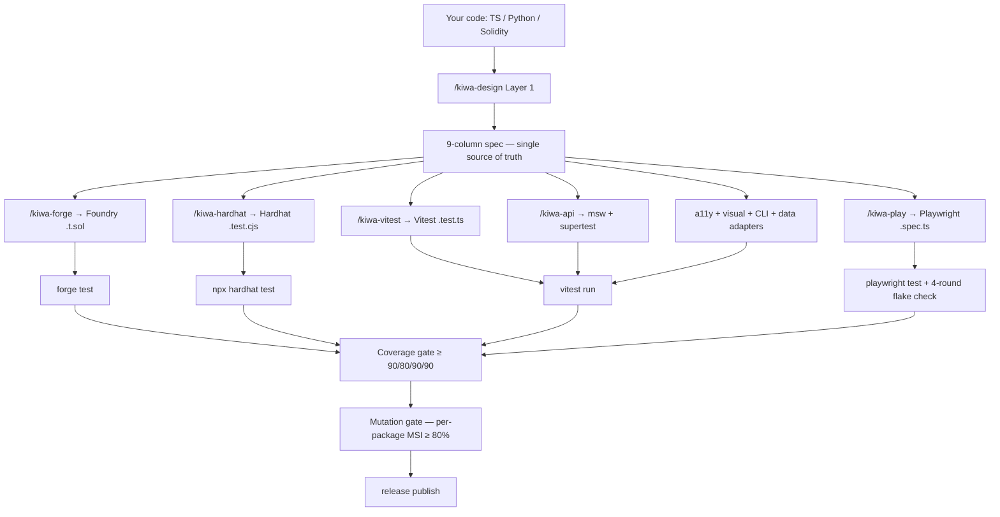

<div align="center">


# kiwa

**Every test layer · one spec · TypeScript / Solidity / Python.**

One Layer 1 spec → contract / API / component / e2e / a11y / visual / Next.js (Server Actions / middleware / RSC) tests in parallel, across **12 npm packages + 1 PyPI package + Foundry / Hardhat bridges**. Coverage and Mutation gates **enforced at release** by `scripts/check-{coverage,mutation}-gates.mjs`.

[](https://www.npmjs.com/package/@kiwa-test/dapp)
[](https://www.npmjs.com/package/@kiwa-test/dapp)
[](#what-s-in-the-box)
[](./kiwa-py)
[](./LICENSE)
[](#testing--quality)
[](#testing--quality)
[](#quality-gates)
[](#quality-gates)
[](./docs/en/cookbook/smart-wallet-aa.md)
[](./tsconfig.base.json)
[](./docs/SKILL-DESIGN.md)

[**Quickstart**](#quickstart) • [**4 layer chain**](#4-layer-chain) • [**Features**](#features) • [**Examples**](#examples) • [**Docs**](./docs/en/README.md) • [**Cookbook**](./docs/en/cookbook/README.md) • [**FAQ**](./docs/en/faq.md)

[🇬🇧 English](./README.md) • [🇯🇵 日本語](./README.ja.md)

</div>

<p align="center">
  
  <br />
  <sub><a href="./assets/kiwa-promo-en.mp4">▶ Watch the full-quality MP4 (2.9 MB, 1920×1080, h264)</a></sub>
</p>

---

> 🎨 **Rebrand notice**: This project was renamed from `dapp-e2e` to **kiwa** (際) in 2026-06.
> `dapp-e2e` was a Playwright-only E2E fixture; **kiwa** is the same fixture **plus** Layer 1 test design + Layer 2 contract test generators (Foundry / Hardhat). The Playwright fixture API itself is unchanged — see [docs/MIGRATION.md § Rebrand notice](./docs/MIGRATION.md#-rebrand-notice-2026-06-dapp-e2e--kiwa) for the package-name mapping.

---

## Why kiwa?

Modern stacks scatter their tests across **mismatched runners**: Foundry / Hardhat for contracts, Vitest for unit + API, Playwright for e2e, Testing Library for components, axe-core for a11y, pixelmatch for visual, pytest for Python services. Every runner has its own conventions, fixtures, and gates — and **no single source of truth** spans them.

**kiwa is a test toolchain that turns one Layer 1 spec into every test layer your stack actually needs.** "kiwa" means **edge / boundary / limit** in Japanese — exactly what good tests prove. dApps and smart contracts are first-class citizens, alongside REST APIs (msw / supertest / Playwright request), SPA components (8 framework adapters), CLI tools, queue workers, generic browser e2e (Playwright), accessibility (axe-core), visual regression (pixelmatch), Next.js App Router (Server Actions / middleware / RSC), and Python pytest (port of the spec parser + requests/httpx adapter, published as `kiwa-test-py` on PyPI).


```mermaid
graph TD
    A[Your code: TS / Python / Solidity] --> B["/kiwa-design Layer 1"]
    B --> C[9-column spec — single source of truth]
    C --> D["/kiwa-forge → Foundry .t.sol"]
    C --> E["/kiwa-hardhat → Hardhat .test.cjs"]
    C --> F["/kiwa-vitest → Vitest .test.ts"]
    C --> G["/kiwa-api → msw + supertest"]
    C --> H["/kiwa-play → Playwright .spec.ts"]
    C --> I["a11y + visual + CLI + data adapters"]
    D --> J[forge test]
    E --> K[npx hardhat test]
    F --> L[vitest run]
    G --> L
    H --> M[playwright test + 4-round flake check]
    I --> L
    J --> N[Coverage gate ≥ 90/80/90/90]
    K --> N
    L --> N
    M --> N
    N --> O[Mutation gate — per-package MSI ≥ 80%]
    O --> P[release publish]
```

|  | One-runner approach | kiwa (6 surfaces, 1 spec) |
|---|---|---|
| Test design | Per-runner checklist, varies by author | 10-viewpoint catalog + 5-risk scoring, deterministic |
| Contract (dApp / smart contract) | Hand-written `.t.sol` / `.test.ts` | Foundry + Hardhat from one spec, same TC IDs |
| API integration | Hand-written msw / supertest | Auto-generated, both mock + live modes |
| Component (8 frameworks) | Per-framework runner, drifted fixtures | One `@kiwa-test/ui` package across React / Vue / Svelte / Solid / Lit / Qwik / Angular / Chromium |
| dApp e2e | Hand-written Playwright + wallet glue | Auto-generated, anvil + viem + EIP-6963 + ERC-4337 wired |
| A11y / Visual | Ad-hoc CI step or skipped | First-class adapters (axe-core / pixelmatch) sharing the same spec |
| Polyglot | TS-only by default | TypeScript + Solidity (forge / hardhat) + Python (pytest, `pip install kiwa-test-py`) from the same skill chain |
| Coverage gate | Optional, often skipped | **Enforced** at release — 4 metrics × 11 packages |
| Mutation gate | Rarely run | **Enforced** at release — per-package MSI threshold |
| Flake detection | Ad-hoc | Built-in 4-round loop |

> Already have code? `kiwa` is designed **retrofit-first**: every Layer 2 generator can reverse-engineer a spec from existing tests. See [tests/docs/retrofit-existing-dapp.md](./tests/docs/retrofit-existing-dapp.md) for a dApp walkthrough, [`@kiwa-test/api`](./packages/api) / [`@kiwa-test/ui`](./packages/ui) / [`@kiwa-test/cli-test`](./packages/cli-test) for non-dApp stacks.

---

## What's in the box

kiwa ships in two halves that work together but stand alone:

### 1. Claude Code skills (30 skills, the design + generation half)

| Skill | Layer | Role |
|---|---|---|
| [`/kiwa-test`](./.claude/skills/kiwa-test/SKILL.md) | **orchestrator** | Run the full chain in one command (`--target {contract\|dapp\|web\|nextjs\|rust\|go\|both\|all}`, where `web` runs the generic-e2e + a11y + visual trio against the same `app/` source, `rust`/`go` cover polyglot Rust / Go layers via `/kiwa-rust` / `/kiwa-go`, and `all` covers every surface) |
| [`/kiwa-design`](./.claude/skills/kiwa-design/SKILL.md) | **Layer 1** | Reverse-engineer a 9-section / 9-column test spec from existing contracts, APIs, screens, or written feature specs |
| [`/kiwa-forge`](./.claude/skills/kiwa-forge/SKILL.md) | **Layer 2** (contract) | Layer 1 spec → Foundry `.t.sol` with fuzz / invariant / `vm.prank` / custom-error reverts, run `forge test`, gate on `forge coverage` |
| [`/kiwa-hardhat`](./.claude/skills/kiwa-hardhat/SKILL.md) | **Layer 2** (contract) | Same Layer 1 spec → Hardhat `.test.cjs` with `chai-matchers` / `fast-check` / `loadFixture`, run `npx hardhat test`, gate on `solidity-coverage` |
| [`/kiwa-vitest`](./.claude/skills/kiwa-vitest/SKILL.md) | **Layer 2** (unit) | Layer 1 spec → Vitest `test/unit/*.test.{ts,tsx}` for TS helpers / TSX hooks |
| [`/kiwa-rust`](./.claude/skills/kiwa-rust/SKILL.md) | **Layer 2** (polyglot Rust) | Layer 1 spec (`rust-unit` / `rust-integration` / `rust-axum` / `rust-actix-web` / `rust-tower-http`) → cargo test `tests/*.rs` driven by `kiwa-test-rs` (`setup_env`, `assert_kiwa_eq!`, `mock_server` + `reqwest`, `axum::test_app`, `actix::test_app`, `tower_http::test_chain` + 6 middleware helper), runs `cargo test` and gates on `cargo llvm-cov` (`--mode {axum|actix-web}` flag added in v1.5-6, `--mode tower-http` flag added in v1.7-6 for middleware chain spec → test conversion) |
| [`/kiwa-go`](./.claude/skills/kiwa-go/SKILL.md) | **Layer 2** (polyglot Go) | Layer 1 spec (`go-unit` / `go-integration` / `go-gin` / `go-echo` / `go-fiber`) → `testing.T` `*_test.go` driven by `kiwa-test-go` (`SetupUnitEnv`, `AssertEqual`, `NewMockServer` + `http.Client`, `kiwa_gin.NewTestServer`, `kiwa_echo.NewTestServer`, `kiwa_fiber.NewTestServer` + fasthttp-compatible `NormalizeRequest` / `NormalizeResponse`), runs `go test` and gates on `go test -cover` (`--mode {gin|echo}` flag added in v1.5-6, `--mode fiber` flag added in v1.7-6 for Fiber spec → test conversion) |
| [`/kiwa-api`](./.claude/skills/kiwa-api/SKILL.md) | **Layer 2** (integration) | Layer 1 spec → msw / supertest / Playwright `request` API integration tests |
| [`/kiwa-ui`](./.claude/skills/kiwa-ui/SKILL.md) | **Layer 2** (ui) | Layer 1 spec → Vitest + Testing Library component tests for 8 frameworks (React / Vue / Svelte / SolidJS / Lit / Qwik / Angular / Browser) |
| [`/kiwa-e2e`](./.claude/skills/kiwa-e2e/SKILL.md) | **Layer 2** (e2e) | Layer 1 spec → Playwright generic browser e2e tests (static html / fetch / Node handler / SSR app) for non-web3 contexts |
| [`/kiwa-play`](./.claude/skills/kiwa-play/SKILL.md) | **Layer 2** (dApp e2e) | Layer 1 spec → Playwright `.spec.ts` + `prepare-env.ts` with wallet inject / anvil / viem for web3 contexts |
| [`/kiwa-a11y`](./.claude/skills/kiwa-a11y/SKILL.md) | **Layer 2** (a11y) | Layer 1 spec → axe-core accessibility tests (jsdom + Playwright), WCAG 2.1 AA violation detection |
| [`/kiwa-visual`](./.claude/skills/kiwa-visual/SKILL.md) | **Layer 2** (visual) | Layer 1 spec → pixelmatch visual regression tests with baseline / actual / diff snapshot management |
| [`/kiwa-data`](./.claude/skills/kiwa-data/SKILL.md) | **Layer 2** (data) | Layer 1 spec → in-memory queue + fake clock tests for queue / cron / batch / DLQ semantics |
| [`/kiwa-cli-test`](./.claude/skills/kiwa-cli-test/SKILL.md) | **Layer 2** (cli) | Layer 1 spec → CLI / shell / file IO tests with isolated tempdir + stdout/stderr snapshot |
| [`/kiwa-auth`](./.claude/skills/kiwa-auth/SKILL.md) | **Layer 2** (auth) | Layer 1 spec → Vitest `test/*.auth.test.ts` driven by `@kiwa-test/auth` (5 provider: NextAuth v5 / Lucia v3 / Better Auth / Clerk / Auth0), covers session mock + OAuth provider mock + email/password + magic link + 2FA + passkey + organizations + Clerk orgs + Auth0 tenant + rules + Management API mock, `--provider` flag で provider 別生成 (v1.8 + v1.9) |
| [`/kiwa-queue`](./.claude/skills/kiwa-queue/SKILL.md) | **Layer 2** (job-queue) | Layer 1 spec → Vitest `test/*.queue.test.ts` driven by `@kiwa-test/queue` (4 provider: BullMQ sandbox / testcontainers + Inngest stub / dev-server + Cloudflare Queues miniflare / wrangler + SQS stub / localstack), covers job add / process / retry / fail / drain / delay + event send / step function / concurrency + queue send / consumer batch / DLQ + SQS FIFO / batch / long polling / visibility timeout, `--provider` flag で provider 別生成 (v1.8 + v1.9) |
| [`/kiwa-cache`](./.claude/skills/kiwa-cache/SKILL.md) | **Layer 2** (cache) | Layer 1 spec → Vitest `test/*.cache.test.ts` driven by `@kiwa-test/cache` (3 provider: Redis in-memory / testcontainers + ioredis / node-redis + Memcached stub / testcontainers + memjs / memcached + KeyDB stub / testcontainers + ioredis 互換), covers get / set / delete / TTL / expiry / Pub/Sub / assertPublished + Memcached 8 command + consistent-hash + KeyDB multi-master + cross-region Pub/Sub, `--provider` flag で provider 別生成 (v1.8 + v1.9) |
| [`/kiwa-observe`](./.claude/skills/kiwa-observe/SKILL.md) | **observability** | Aggregate vitest JSON results → flaky detection + spec-coverage gap analysis + markdown dashboard |
| [`/kiwa-review`](./.claude/skills/kiwa-review/SKILL.md) | **reviewer** | Judge spec / test code / execution results in 3 modes (spec-review / test-review / result-review) |

### 2. npm packages (the runtime fixture half)

| Package | Use it for |
|---|---|
| [`@kiwa-test/dapp`](./packages/dapp) | Playwright fixture: inject `window.ethereum`, spawn `anvil`, sign, mine, time-travel, EIP-6963 multi-wallet, ERC-4337 smart accounts, custom-error helpers |
| [`@kiwa-test/cli`](./packages/cli) | `kiwa init` scaffolds a Playwright project wired to `@kiwa-test/dapp` |
| [`@kiwa-test/core`](./packages/core) | Spec markdown parser shared by every adapter (9-column `test-spec-*.md` → `SpecDoc`) |
| [`@kiwa-test/api`](./packages/api) | API integration adapter (Vitest + msw + supertest + Playwright `request`) |
| [`@kiwa-test/ui`](./packages/ui) | Component adapters for **React / Vue / Svelte / SolidJS / Lit / Qwik / Angular / real Chromium** (render / interaction / snapshot modes) |
| [`@kiwa-test/data`](./packages/data) | Queue / cron / batch adapter — in-memory queue + fake clock + idempotency / DLQ semantics |
| [`@kiwa-test/cli-test`](./packages/cli-test) | CLI / shell / file IO adapter — isolated tempdir + env override + stdout/stderr snapshot |
| [`@kiwa-test/e2e`](./packages/e2e) | Generic browser E2E adapter (Playwright + static html / fetch app) |
| [`@kiwa-test/observability`](./packages/observability) | Run history collection / flaky detection / coverage report / spec-coverage gap analysis |
| [`@kiwa-test/a11y`](./packages/a11y) | Accessibility adapter — axe-core integration for jsdom + Playwright pages |
| [`@kiwa-test/visual`](./packages/visual) | Visual regression adapter — pixel-level PNG diff backed by pixelmatch + pngjs |
| [`@kiwa-test/auth`](./packages/auth) (v0.2+) | Auth test adapter — 5 provider: NextAuth v5 (Auth.js) session (jwt + database) + Google / GitHub / Email (Magic Link) provider mocks + Prisma / Drizzle-compatible in-memory database adapter + Lucia v3 + Better Auth + Clerk (SaaS user + session + orgs mock) + Auth0 (enterprise tenant + rules + Management API mock) (v1.8 + v1.9) |
| [`@kiwa-test/queue`](./packages/queue) (v0.2+) | Queue test adapter — 4 provider: BullMQ (Redis-backed) sandbox (in-memory) + testcontainers Redis env + Inngest (event-driven) dev-server + stub env + Cloudflare Queues (miniflare + wrangler edge queue) + AWS SQS (stub + localstack standard + FIFO), with job / run / message assertion helpers (`waitForJob` / `assertProcessed` / `assertFailed` / `assertRetried` / `assertQueueDrained` / `assertFunctionRan` / `assertStepRan` / `assertAcknowledged` / `assertDeadLettered` / `assertDeleted`) (v1.8 + v1.9) |
| [`@kiwa-test/cache`](./packages/cache) (v0.2+) | Cache test adapter — 3 provider: Redis (testcontainers) live env + in-memory sandbox env + Memcached (stub + testcontainers with 8 core commands + multi-server consistent hashing) + KeyDB (stub + testcontainers with Redis-compatible surface + multi-master replication + cross-region Pub/Sub), with TTL / Pub/Sub / expiry / consistent-hash / multi-master assertion helpers (`assertTTL` / `subscribe` / `assertPublished` / `serverFor` / `listEntries`) (v1.8 + v1.9) |
| [`kiwa-test-py`](./kiwa-py) (PyPI, v1.0.0+) | Python pytest adapter — port of `@kiwa-test/core` + requests / httpx adapter, `pip install kiwa-test-py` |

You can use the **skills alone** (no npm dependency — they just generate test files) or the **fixture alone** (no Claude — just `pnpm add @kiwa-test/dapp`), or both together for the full chain.

---

## 4-layer chain (retrofit example: token-gating dApp)

Run the chain against [`examples/nextjs-token-gating`](./examples/nextjs-token-gating) — already contains `GatedContent.sol` + `GateNFT.sol` + existing Playwright tests.

```bash
# Step 1: Generate a contract-side spec from the existing .sol files
/kiwa-design --layer contract --module token-gating \
  --input examples/nextjs-token-gating/contracts/GatedContent.sol
# → .context/spec/contract/test-spec-token-gating.md (9 sections, 11 test cases across 6 viewpoints)

# Step 2: Generate Foundry tests from that spec
/kiwa-forge --module token-gating
# → test/GatedContent.t.sol (20 tests including fuzz)
# → forge test → 20/20 PASS
# → forge coverage → Lines 100% / Branches 87.50%  ✅ passes the gate

# Step 2': Generate Hardhat tests from the SAME spec (parallel)
/kiwa-hardhat --module token-gating
# → test/GatedContent.test.cjs (24 tests with fast-check)
# → npx hardhat test → 24/24 PASS
# → npx hardhat coverage → Branches 80.56%  ✅ passes the gate

# Step 3: Extend the existing Playwright tests using the same spec
# (run from examples/nextjs-token-gating/ — Step 0 auto-detects the dApp project)
/kiwa-play --mode extend
# → tests/gating.spec.ts adds missing viewpoints (no regression on 8 existing tests)
# → pnpm test x4 rounds → 4/4 PASS, 0 flake
```

Same `TC-001 … TC-020` test IDs appear in **both** Foundry and Hardhat output — your team can pick a runner per developer without fragmenting the spec.

### 6-surface chain coverage (Layer 1 → Layer 2 → Layer 3)

Every kiwa surface follows the same `kiwa-design → Layer 2 generator → kiwa-review` chain. The spec format (9 sections) and the 11 viewpoints catalog are shared across all surfaces, so once you learn the contract chain you already know the dApp E2E / generic E2E / a11y / visual / API / UI chains.

| Surface | Layer 1 (spec) | Layer 2 (generator) | Layer 3 (review) | runtime fixture |
|---|---|---|---|---|
| contract (Foundry / Hardhat) | `/kiwa-design --layer contract` | `/kiwa-forge` + `/kiwa-hardhat` | `/kiwa-review --layer contract` | `forge` / `hardhat` |
| dApp e2e (Playwright + viem + anvil) | `/kiwa-design --layer e2e` | `/kiwa-play` | `/kiwa-review --layer e2e` | `@kiwa-test/dapp` |
| generic browser e2e (non-web3) | `/kiwa-design --layer e2e-generic` | `/kiwa-e2e` | `/kiwa-review --layer e2e-generic` | `@kiwa-test/e2e` |
| accessibility (WCAG 2.1 AA) | `/kiwa-design --layer a11y` | `/kiwa-a11y` | `/kiwa-review --layer a11y` | `@kiwa-test/a11y` (axe-core) |
| visual regression (pixel diff) | `/kiwa-design --layer visual` | `/kiwa-visual` | `/kiwa-review --layer visual` | `@kiwa-test/visual` (pixelmatch) |
| HTTP API (REST / GraphQL) | `/kiwa-design --layer api` | `/kiwa-api` | `/kiwa-review --layer api` | `@kiwa-test/api` |
| React component | `/kiwa-design --layer ui` | `/kiwa-ui` | `/kiwa-review --layer ui` | `@kiwa-test/ui` |
| queue / cron / batch | `/kiwa-design --layer data` | `/kiwa-data` | `/kiwa-review --layer data` | `@kiwa-test/data` |
| CLI / shell / file IO | `/kiwa-design --layer cli` | `/kiwa-cli-test` | `/kiwa-review --layer cli` | `@kiwa-test/cli-test` |
| ORM query (Drizzle + Prisma + Kysely 全 3 ORM × SQLite mock + Postgres/MySQL testcontainers + drizzle-orm/migrator folder migration + Prisma + Postgres testcontainers、 v0.6 / v1.2 完遂版) | `/kiwa-design --layer orm-query` | `/kiwa-orm` | `/kiwa-review --layer orm-query` | `@kiwa-test/orm` (Prisma + MySQL testcontainers は future follow-up) |

`/kiwa-test --target {contract|dapp|web|both|all}` orchestrates the chain end-to-end for any subset of surfaces — `web` runs the generic e2e / a11y / visual trio against the same `app/` source, and `all` covers all 6 web-side surfaces (contract + dapp + web). The integrated report at `tests/reports/integrated/{example}-{target}.{lang}.md` aggregates every surface's pass/fail count, coverage, and reviewer score in one table.

---

## Quickstart

### Option A: Claude Code plugin (recommended for Claude users)

Install the kiwa skill chain as a Claude Code plugin — no clone required, available across **any** of your dApp projects after install.

```bash
# In Claude Code (run from any project):
/plugin marketplace add cardene777/kiwa
/plugin install kiwa@kiwa-marketplace
/reload-plugins                            # activate without restarting the session
```

After install, all 30 skills appear under the `kiwa:` namespace (Claude Code namespaces plugin skills by plugin name). Inside any dApp project, run the individual layers:

```bash
# Layer 1 — design tests (output: tests/spec/<layer>/test-spec-<module>.md)
/kiwa:kiwa-design --layer contract --input path/to/YourContract.sol --module your-module
/kiwa:kiwa-design --layer unit --module your-module
/kiwa:kiwa-design --layer integration --module your-module

# Layer 2 — implement tests from the spec
/kiwa:kiwa-forge --module your-module          # Foundry contract tests
/kiwa:kiwa-hardhat --module your-module        # Hardhat contract tests (parallel runner option)
/kiwa:kiwa-vitest --module your-module         # Vitest unit (F-3)
/kiwa:kiwa-api --module your-module            # API integration (F-3)
/kiwa:kiwa-play --init                          # Bootstrap Playwright fixture for a fresh dApp
/kiwa:kiwa-play --mode new                      # Add new dApp e2e tests
/kiwa:kiwa-play --mode extend                   # Extend existing dApp e2e tests

# Review — covers spec / test / result (provide --module + --layer to resolve paths)
/kiwa:kiwa-review --mode test-review --module your-module --layer contract
```

> The `--example` flag and `/kiwa:kiwa-test` one-shot orchestrator are intended for the kiwa monorepo itself (which has `examples/`). Plugin users run the individual skills above directly from their project.

Update the plugin later:

```bash
/plugin marketplace update kiwa-marketplace  # refresh the catalog
/plugin update kiwa@kiwa-marketplace         # apply the new version
```

### Option B: Clone & install (for kiwa contributors)

```bash
# 1. Clone & install
git clone https://github.com/cardene777/kiwa.git && cd kiwa
pnpm install

# 2. In Claude Code (run from the kiwa repo), the project-local skills load automatically
/kiwa-test --example nextjs-token-gating   # one-shot orchestrator (kiwa repo only, uses examples/)
```

### Option C: Playwright fixture only (no Claude needed)

```bash
pnpm dlx @kiwa-test/cli init
pnpm install
pnpm exec playwright test
```

> Prerequisites: Node.js 20+ · pnpm/npm/yarn · [Foundry](https://book.getfoundry.sh/) (`anvil` + `forge`) · Playwright (`pnpm exec playwright install`)

`init` scaffolds:

```text
e2e/
├── connect.spec.ts         ← Playwright spec wired to dappE2eTest
playwright.config.ts        ← Headless Chromium config
package.json                ← test:e2e script + peer deps
```

> Now available on npm — `pnpm dlx @kiwa-test/cli init` works out of the box (no clone required).

### Option D — Local checkout (for kiwa contributors)

If you are hacking on kiwa itself and want to test changes against a local dApp project before publishing, link with a `file:` dependency:

```bash
# 1. Clone & build kiwa
git clone https://github.com/cardene777/kiwa.git ~/kiwa
cd ~/kiwa
pnpm install
pnpm -F @kiwa-test/dapp -F @kiwa-test/cli build

# 2. In your test project, add a file: dependency
cd /path/to/your-dapp
pnpm add -D file:$HOME/kiwa/packages/dapp file:$HOME/kiwa/packages/cli

# 3. Scaffold from the locally-installed CLI
pnpm exec kiwa init     # or: node $HOME/kiwa/packages/cli/dist/index.js init
```

For everyday use, prefer Option C (`pnpm dlx @kiwa-test/cli init`) which pulls the published 0.1.0 version directly.

### Using kiwa with a CJS / Next.js 14 project

`@kiwa-test/dapp` ships **both ESM and CJS builds** (`dist/index.js` + `dist/index.cjs`), so both `import` and `require` resolve correctly. You can drop it into any of:

| Project type | What works out of the box |
|---|---|
| Pure ESM (`"type": "module"`) | `import { dappE2eTest } from '@kiwa-test/dapp'` |
| Pure CJS (`"type": "commonjs"`) | `const { dappE2eTest } = require('@kiwa-test/dapp')` |
| Next.js 14 (CJS host with ESM packages) | Both forms resolve; Next bundles CJS, Playwright runs ESM |

If you still hit `Error: No "exports" main defined` (older toolchains), isolate the kiwa test dir as ESM with a local `package.json`:

```bash
mkdir -p tests/kiwa
echo '{"type":"module"}' > tests/kiwa/package.json
```

Only `tests/kiwa/**.ts` is treated as ESM; the rest of your `tests/` keeps its existing CJS resolution.

### Differences from MetaMask (read before shipping)

`@kiwa-test/dapp` aims to be **production-realistic but explicit about deltas**. Key default behavioural differences:

| Behavior | MetaMask | kiwa (default) | Override |
|---|---|---|---|
| `eth_accounts` before connect | returns `[]` | returns the wallet's account (always "connected") | set `dappE2e.setApprovalMode('reject')` to refuse `eth_requestAccounts` and keep accounts hidden |
| Network add prompt | shows a popup | silent allow (no chain in store → switch fails) | call `dappE2e.addChain(config)` from the test to seed networks |
| User reject on send | popup with reject button | rejected via `setApprovalMode('reject')` returning `code: 4001` | see [`docs/en/cookbook/user-reject.md`](./docs/en/cookbook/user-reject.md) |
| EIP-6963 announce | announced on extension install | announced on fixture init | see [`docs/en/concepts/eip-6963.md`](./docs/en/concepts/eip-6963.md) |

The full RPC fidelity matrix lives in [`docs/MOCK-DESIGN.md`](./docs/MOCK-DESIGN.md) (A/B/C level scoring rubric).

---

## Features

### Layer 1: Test design automation (`/kiwa-design`)

- 📋 **9-section unified spec** — Target / Spec summary / Quality risks / Recommended composition / Viewpoints / Cases / Automated / Manual / Insufficient spec
- 🎯 **10-viewpoint catalog** — Happy / Failure / Boundary / State transition / Permission / Validation / Idempotency / Concurrency / Performance / Security
- ⚖️ **5-criteria risk scoring** — Revenue / Security / Data destruction / Frequency / Past incidents → drives test priority deterministically
- 📄 **9-column case table** — Test ID / Level / Viewpoint / Precondition / Input / Steps / Expected / Priority / Automation
- 🔁 **Retrofit-first** — reverse-engineers specs from existing `.sol`, `app/`, `tests/`, OpenAPI specs

### Layer 2: Contract test generators (`/kiwa-forge` + `/kiwa-hardhat`)

- 🔨 **Foundry mapping** — fuzz / invariant + Handler / `vm.prank` / `vm.expectRevert(Error.selector)` / `vm.warp` / `--gas-report`
- ⚒️ **Hardhat mapping** — `chai-matchers` `revertedWithCustomError` / `fast-check` `asyncProperty` / `loadFixture` / `hardhat-gas-reporter`
- 🪞 **Mirror generation** — both runners produce the same `TC-NNN` IDs from one spec; teams can run Foundry, Hardhat, or both
- 🛡️ **Coverage gate enforced** — Lines ≥ 90%, Statements ≥ 90%, **Branches ≥ 80%**, Funcs ≥ 90%. The skill won't write `test-passed` marker until all four metrics pass

### Layer 2: dApp E2E fixture (`/kiwa-play` + `@kiwa-test/dapp`)

- 🦊 **Inject `window.ethereum`** without any browser extension
- ⚡ **Spawn anvil per test** for total chain isolation
- 🔌 **9 RPC methods handled directly** (`eth_requestAccounts` / `personal_sign` / `eth_signTypedData_v4` / `eth_sendTransaction` / `wallet_switchEthereumChain` …), the rest forwarded to anvil
- 📡 **EIP-1193 events** — `accountsChanged` / `chainChanged` / `connect` / `disconnect` triggerable from tests
- 👛 **EIP-6963 multi-wallet** — declare MetaMask, Rabby, Coinbase, … side-by-side
- 🤖 **Smart contract account (AA)** — `isContractAccount: true` reroutes `personal_sign` through EIP-1271, `eth_sendTransaction` through `execute()`
- 📦 **viem as peer dep** — your project owns the version
- 🔁 **`--mode extend`** — appends new viewpoints without breaking existing tests, 4-round flake check built in
- ❌ **error envelope** preserves `code` and `message` across page boundaries

### Industry-standard helpers (`@kiwa-test/dapp`)

| Helper | Purpose |
|---|---|
| `snapshotChain` / `revertChain` | Per-test isolation via `evm_snapshot` / `evm_revert` |
| `expectCustomError` | One-liner Solidity custom-error assertion |
| `increaseTime` / `mineBlock` / `setNextBlockTimestamp` | Time travel for vesting / TTL / timelock |
| `impersonateAccount` / `stopImpersonateAccount` / `setBalance` | Act as arbitrary EOA / contract with injected balance |
| `startAnvilCluster` | Multi-chain (L1 + L2 + …) anvil cluster |
| `startAnvilFork` | `anvil --fork-url` thin wrapper (mainnet / sepolia / any RPC) |
| `expectEvent` | `decodeEventLog` + assertion combined |
| `expectBalanceChange` / `expectEthBalanceChange` | Balance delta assertion (hardhat-chai-matchers compatible) |

---

## How does kiwa compare to other tools?

kiwa sits at the intersection of two ecosystems. Short version:

| Axis | Closest competitor | kiwa's differentiation |
|---|---|---|
| dApp E2E fixture (Playwright + viem + anvil) | [`wallet-mock`](https://github.com/johanneskares/wallet-mock), [Synpress](https://github.com/Synthetixio/synpress), [dappwright](https://github.com/TenKeyLabs/dappwright) | wallet-mock is closest (headless `window.ethereum` injection). Synpress / dappwright automate the real MetaMask UI. kiwa stays headless and adds a CLI scaffold (`pnpm dlx @kiwa-test/cli init`) plus the skill chain below. |
| Spec → test generation | [hardhat-test-suite-generator](https://github.com/ahmedali8/hardhat-test-suite-generator), Foundry / Hardhat AI plugins (2026), [Claude Code spec-driven dev](https://www.augmentcode.com/guides/claude-code-spec-driven-development) | None drive **four layers** (contract / unit / integration / e2e) from a single 9-section / 9-column spec. kiwa's `/kiwa-design` → `/kiwa-{forge,hardhat,play,vitest,api}` → `/kiwa-review` chain is the differentiator. |

See [docs/COMPARISON.md](./docs/COMPARISON.md) for the full comparison tables (Synpress / dappwright / wallet-mock / kiwa on the fixture axis, plus hardhat-test-suite-generator / Foundry AI / Claude Code spec-driven dev on the test-generation axis), selection guide, and the explanation of why kiwa intentionally does not own MetaMask extension automation.

---

## Runtime support

`@kiwa-test/*` packages target **Node.js 22+** as the production baseline. **Bun** (`bun.sh`) is also supported for the entire 19-package matrix — all packages pass Vitest under Bun without modification.

| Runtime | Status | Verification |
|---|---|---|
| Node.js 22+ | ✅ primary | local `/verify` skill runs Vitest + coverage + mutation gates pre-merge |
| Bun 1.3+ | ✅ supported (v1.2+) | local `bunx --bun vitest run` over all 19 packages (`Running tests under Bun locally` 参照) |
| Deno 2.x | ✅ supported (v1.2+) | local `deno run --allow-all npm:vitest run` over all 19 packages (`Running tests under Deno locally` 参照) |
| Cloudflare Workers / Vercel Edge | ✅ via [`@kiwa-test/edge`](./packages/edge) | KV mock + `invokeEdgeHandler` (Miniflare 不要) |

### Running tests under Bun locally

```bash
# install deps (still requires pnpm)
pnpm install

# run a single package's tests under Bun
cd packages/edge
bunx --bun vitest run

# loop over every package
for pkg in core api ui data cli-test observability e2e cli a11y visual nextjs nuxt sveltekit remix astro solidstart qwikcity edge; do
  (cd packages/$pkg && bunx --bun vitest run)
done
```

Vitest itself doesn't need a Bun-specific runner — Vitest's Node compat surface is exercised through Bun's Node API shim. `bun test` (Bun's native runner) is NOT used because Vitest's API surface (`describe` / `it` / `vi.mock`) is incompatible with Bun's native runner.

### Running tests under Deno locally

```bash
# install deps (still requires pnpm)
pnpm install

# run a single package's tests under Deno
cd packages/edge
deno run --allow-all npm:vitest run

# loop over every package
for pkg in core api ui data cli-test observability e2e cli a11y visual nextjs nuxt sveltekit remix astro solidstart qwikcity edge; do
  (cd packages/$pkg && deno run --allow-all npm:vitest run)
done
```

Deno reads Vitest through its npm: specifier compatibility layer — no `deno.json` import map required. `--allow-all` is the simplest permission set; real-world Deno consumers can tighten this to `--allow-read --allow-env --allow-net=localhost` for sandboxed CI.

---

## Coverage requirement

`/kiwa-forge` and `/kiwa-hardhat` **block the `test-passed` marker** until all four coverage metrics clear thresholds. Default values (tuned for OSS-grade smart contracts):

| Metric | Default threshold | Rationale |
|---|---|---|
| Lines | 90 % | Cover the primary paths fully |
| Statements | 90 % | Statement-level coverage |
| **Branches** | **80 %** | 100% on Solidity `require` / `revert` / short-circuit is impractical |
| Functions | 90 % | Cover every `public` / `external` function |

If any metric falls short, the skill **records the under-covered viewpoints / error paths / events back into the Layer 1 spec's "Insufficient spec" section** so the next loop can address them — instead of silently signing off on weak tests.

Override with `--coverage-lines 95 --coverage-branches 85` etc.

---

## Quality gates

kiwa enforces **two independent gates** at release time so a publish can't ship without both. Both gates run via local `/verify` skill (pre-merge) and `scripts/check-{coverage,mutation}-gates.mjs` (pre-publish) and fail if any package regresses.

### Gate 1 — Coverage (`scripts/check-coverage-gates.mjs`)

Lines / Statements / Functions ≥ **90 %**, Branches ≥ **80 %**, across all 11 packages. Optional-peer-dep error paths in the adapter wrappers (msw / pixelmatch / pngjs / @testing-library/* / @vue/test-utils / @solidjs/testing-library / lit / @noma.to/qwik-testing-library / @testing-library/angular) are why Branches stays at 80 — they cannot be exercised when their peer is installed for the package-local tests.

### Gate 2 — Mutation Score Indicator (`scripts/check-mutation-gates.mjs`)

[Stryker](https://stryker-mutator.io/) runs against the compiled `.vitest-dist/src/` artefacts for every package and the gate computes
`MSI = killed / (killed + survived + timeout)`. Thresholds are intentionally **per-package** — pure-logic packages hold to 90 %+, thin wrappers around third-party libs are pinned at 80 %.

| Package | MSI | Threshold |
|---|---|---|
| [`@kiwa-test/api`](./packages/api) | **96.06 %** | 90 |
| [`@kiwa-test/a11y`](./packages/a11y) | **93.62 %** | 90 |
| [`@kiwa-test/ui`](./packages/ui) | **91.76 %** | 80 |
| [`@kiwa-test/cli-test`](./packages/cli-test) | 89.69 % | 80 |
| [`@kiwa-test/data`](./packages/data) | 86.93 % | 80 |
| [`@kiwa-test/core`](./packages/core) | 85.51 % | 80 |
| [`@kiwa-test/dapp`](./packages/dapp) | 85.09 % | 80 |
| [`@kiwa-test/cli`](./packages/cli) | 84.44 % | 80 |
| [`@kiwa-test/e2e`](./packages/e2e) | 84.21 % | 80 |
| [`@kiwa-test/observability`](./packages/observability) | 84.12 % | 80 |
| [`@kiwa-test/visual`](./packages/visual) | 83.02 % | 80 |

Run both gates locally:

```bash
pnpm test:mutation                  # builds + mutates all 11 packages
pnpm gate:mutation                  # asserts the per-package thresholds
pnpm gate:coverage                  # asserts Lines/Branches/Functions thresholds
```

---

## Examples

For a reverse lookup by feature, jump to [`docs/en/examples/README.md`](./docs/en/examples/README.md). For a 30 min ~ 1 hour guided tour through five popular examples, follow [`docs/en/examples/walkthrough.md`](./docs/en/examples/walkthrough.md). Per-example READMEs live under [`examples/{name}/README.md`](./examples/) (bilingual `README.ja.md` available for the popular five — basic-connect / mint-nft / defi-swap / nextjs-wagmi-rainbow / nft-marketplace).

### Retrofit examples with verified Foundry / Hardhat / Playwright chains

These three examples have **forge test + hardhat test (where applicable) + playwright test, all in 4-round zero-flake state, with coverage gates passed**:

| Example | Contract tests (Foundry) | Contract tests (Hardhat) | E2E tests (Playwright) | Coverage (Lines / Branches) |
|---|---|---|---|---|
| [`mint-nft`](./examples/mint-nft) | 27 / 27 | 24 / 24 | (covered by basic-connect) | Foundry 97.70 / 83.33 · Hardhat 93.75 / 80.56 |
| [`defi-swap`](./examples/defi-swap) | 17 / 17 | — | (covered by basic-connect) | 100 / 87.50 |
| [`nextjs-token-gating`](./examples/nextjs-token-gating) | 20 / 20 | — | 8 existing PASS | 100 / 87.50 |

### dApp E2E reference (`@kiwa-test/dapp` fixture)

20 reference dApps live under [`examples/`](./examples/), proving the fixture against a wide stack:

| Example | Stack / Domain | E2E tests |
|---|---|---|
| [`basic-connect`](./examples/basic-connect) | inline HTML + EIP-6963 + reject paths | 15 |
| [`nextjs-wagmi-rainbow`](./examples/nextjs-wagmi-rainbow) | Next.js 14 + wagmi v2 + RainbowKit | 4 |
| [`vite-react-wagmi`](./examples/vite-react-wagmi) | Vite 5 + React 18 + wagmi v2 (SPA) | 3 |
| [`nextjs-aa-erc4337`](./examples/nextjs-aa-erc4337) ⭐ | Full ERC-4337 v0.7 (EntryPoint + SimpleAccountFactory + UserOp bundler stub) | 7 |
| [`nextjs-aa-smart-account`](./examples/nextjs-aa-smart-account) | Simplified ERC-4337 + ERC-1271 + guardian recovery | 10 |
| [`nextjs-multi-chain`](./examples/nextjs-multi-chain) | 3-chain parallel anvil + chain switch | 6 |
| [`nextjs-bridge`](./examples/nextjs-bridge) | L1 ↔ L2 lock / mint / burn / unlock | 10 |
| [`nextjs-permit-swap`](./examples/nextjs-permit-swap) | EIP-2612 permit + deadline | 6 |
| [`nextjs-dao-vote`](./examples/nextjs-dao-vote) | Compound-style Governor + timelock + quorum | 10 |
| [`nextjs-lending`](./examples/nextjs-lending) | Aave-style lending + liquidation + max LTV | 10 |
| [`nextjs-staking`](./examples/nextjs-staking) | Stake + reward + early-unstake penalty | 12 |
| [`nextjs-erc1155-game`](./examples/nextjs-erc1155-game) | ERC-1155 batch mint / transfer / burn | 8 |
| [`nextjs-vesting`](./examples/nextjs-vesting) | Cliff + linear vesting + immutability | 9 |
| [`nextjs-token-gating`](./examples/nextjs-token-gating) | NFT-gated content + timed access + transfer revoke | 8 |
| [`nextjs-ens-resolver`](./examples/nextjs-ens-resolver) | ENS-like forward / reverse + collision | 7 |
| [`nextjs-event-history`](./examples/nextjs-event-history) | Past event query + multi-indexed filter | 7 |
| [`nextjs-zk-verifier`](./examples/nextjs-zk-verifier) | Commit-reveal + range proof variant | 7 |
| [`nft-marketplace`](./examples/nft-marketplace) | List / buy / offer / royalty split | 12 |

### Framework full server PoC (real dev server + kiwa helper unit test + Playwright e2e の 2 軸構成)

`@kiwa-test/{framework}` の helper を **実 framework dev server** で動かす reference 実装。 Pattern A (Dependency Injection) で thin wrapper / pure logic を分離、 unit test (kiwa helper、 Nitro 不要) と e2e test (Playwright + 実 dev server) を **同じ pure logic** に対して別 angle で走らせる構成。 OSS contributor が自プロジェクトに kiwa を導入する際の参考に。

| Example | Stack / 対象 helper | Unit tests (kiwa) | E2E tests (Playwright) |
|---|---|---|---|
| [`nuxt-server-routes-full`](./examples/nuxt-server-routes-full) ⭐ | Nuxt 3 + `@kiwa-test/nuxt` v1.0.4+ (3 helper 全 demo) | 20 (Server Routes 8 + route middleware 6 + Nitro plugin 6) | 4 (real `nuxt dev` :3030) |
| [`sveltekit-full`](./examples/sveltekit-full) ⭐ | SvelteKit 2 + `@kiwa-test/sveltekit` v1.0.x (3 helper 全 demo) | 19 (load 8 + actions 6 + handle 5) | 4 (real `vite dev` :3040) |
| [`remix-full`](./examples/remix-full) ⭐ | Remix v2 + `@kiwa-test/remix` v1.1.x (loader + action + Resource Route + nested route chain + 共通 auth) | 31 (loader 8 + action 7 + resource 6 + auth 5 + nested chain 5) | 7 (real `remix vite:dev` :3050) |
| [`astro-server-endpoints-full`](./examples/astro-server-endpoints-full) ⭐ | Astro v5 SSR + `@kiwa-test/astro` v1.0.x (APIRoute GET/POST + middleware locals) | 24 (items GET 8 + items POST 7 + counter 5 + auth 4) | 7 (real `astro dev` :3060) |
| [`nextjs-app-router-full`](./examples/nextjs-app-router-full) ⭐ | Next.js v15 App Router + `@kiwa-test/nextjs` v1.0.x (Server Actions + middleware + RSC + Route Handler の 4 layer) | 21 (action 6 + middleware 5 + RSC 5 + route 5) | 7 (real `next dev` :3070) |

---

## Multi-Wallet (EIP-6963)

```ts
import { dappE2eTest } from '@kiwa-test/dapp';

const test = dappE2eTest.extend({
  wallets: [
    {
      name: 'MetaMask',
      rdns: 'io.metamask',
      icon: 'data:image/svg+xml;base64,...',
      privateKey: '0xac09...ff80',
    },
    {
      name: 'Rabby',
      rdns: 'io.rabby',
      icon: 'data:image/svg+xml;base64,...',
      privateKey: '0x59c6...690d',
    },
  ],
});

test('multi wallet picker', async ({ page, dappE2e }) => {
  await dappE2e.wallets!['io.rabby'].connect();
});
```

When `wallets` is unset, a single MetaMask-compatible wallet runs (backward compatible).

---

## Testing & Quality

Phase E rebrand snapshot (main @ `b7267a7`):

| Metric | Value |
|---|---|
| 4-layer chain examples | **3** (mint-nft / defi-swap / nextjs-token-gating) |
| Foundry tests across 3 examples | **64** (27 + 17 + 20) |
| Hardhat tests (mint-nft) | **24** |
| Playwright tests (basic-connect) | **15** |
| **4-round execution total** | **292 PASS** (164 Foundry + 68 Hardhat + 60 Playwright) |
| **Flaky** | **0 / 292** |
| Coverage Lines | **93.75 – 100 %** across all chains |
| Coverage Branches | **80.56 – 87.50 %** across all chains |
| Coverage Functions | **95.24 – 100 %** |
| Adversarial review findings (resolved) | 21 (5 CRITICAL / 9 MAJOR / 7 MINOR, all closed in-PR) |

The 4-round flake check is mandatory before any release tag — runner at [`.context/scratch/multi-round-all-examples.sh`](./examples) (developer-side).

Adversarial review patterns are catalogued in [`adversarial-pitfalls.md`](./.claude/skills/kiwa-play/references/adversarial-pitfalls.md) as a self-check checklist for false positives.

---

## Documentation

Full 5-section docs (Quickstart / Concepts / API / Cookbook / FAQ) maintained in **JP↔EN 1:1 translation** under [`docs/`](./docs/).

- 🇬🇧 [English documentation](./docs/en/README.md)
- 🇯🇵 [日本語ドキュメント](./docs/ja/README.md)

Reference docs:

|  |  |
|---|---|
| [`docs/SKILL-DESIGN.md`](./docs/SKILL-DESIGN.md) ⭐ | **SSOT for all 30 skills** (5-step flow, 9-section output, 13 viewpoints, 5 risk criteria) |
| [`docs/MOCK-DESIGN.md`](./docs/MOCK-DESIGN.md) | Wallet / SDK mock fidelity spec (A/B/C levels, scoring rubric) |
| [`tests/docs/skill-chain-tutorial.md`](./tests/docs/skill-chain-tutorial.md) ⭐ | **skill chain walkthrough** (retrofit-first) |
| [`docs/RPC.md`](./docs/RPC.md) | 9 directly-handled RPC + anvil fallback |
| [`docs/EVENTS.md`](./docs/EVENTS.md) | 4 events + `triggerEvent()` |
| [`docs/ERRORS.md`](./docs/ERRORS.md) | EIP-1193 error code + envelope design |
| [`docs/MIGRATION.md`](./docs/MIGRATION.md) | v0.x breaking-change policy + dapp-e2e → kiwa rebrand notice |
| [`docs/COMPARISON.md`](./docs/COMPARISON.md) | Synpress / dappwright / wallet-mock comparison + spec-driven test generation axis (hardhat-test-suite-generator / Foundry AI / Claude Code) |
| [`docs/RELEASING.md`](./docs/RELEASING.md) | Publish flow + provenance |

For Claude Code users — full skill reference:

- [`/kiwa-design`](./.claude/skills/kiwa-design/SKILL.md) — Layer 1 spec generator
- [`/kiwa-forge`](./.claude/skills/kiwa-forge/SKILL.md) — Foundry generator
- [`/kiwa-hardhat`](./.claude/skills/kiwa-hardhat/SKILL.md) — Hardhat generator
- [`/kiwa-play`](./.claude/skills/kiwa-play/SKILL.md) — Playwright generator + 22-example index + 9 false-positive patterns

---

## Limitations

kiwa v1.0 ships **complete coverage for the layers below**. The table is exhaustive and intentionally honest — features outside this list are tracked in [Roadmap](#roadmap) below, not silently missing.

### What kiwa v1.0 covers end-to-end

| Layer | Status | Skill | Runtime fixture |
|---|---|---|---|
| Solidity contracts (Foundry + Hardhat) | ✅ production-ready | `/kiwa-forge` + `/kiwa-hardhat` | `forge` / `hardhat` |
| dApp e2e (Playwright + viem + anvil) | ✅ production-ready, 22 examples | `/kiwa-play` | `@kiwa-test/dapp` v1.0.1 |
| HTTP API (msw + supertest + Playwright request) | ✅ production-ready | `/kiwa-api` | `@kiwa-test/api` v1.0.1 |
| Client components (React / Vue / Svelte / SolidJS / Lit / Qwik / Angular / Chromium) | ✅ production-ready, 8 frameworks | `/kiwa-ui` | `@kiwa-test/ui` v1.0.1 |
| Generic browser e2e (Playwright, non-web3) | ✅ production-ready | `/kiwa-e2e` | `@kiwa-test/e2e` v1.0.1 |
| Accessibility (axe-core, WCAG 2.1 AA) | ✅ production-ready | `/kiwa-a11y` | `@kiwa-test/a11y` v1.0.1 |
| Visual regression (pixelmatch + pngjs) | ✅ production-ready | `/kiwa-visual` | `@kiwa-test/visual` v1.0.1 |
| Queue / cron / batch / DLQ | ✅ production-ready | `/kiwa-data` | `@kiwa-test/data` v1.0.1 |
| CLI / shell / file IO | ✅ production-ready | `/kiwa-cli-test` | `@kiwa-test/cli-test` v1.0.1 |
| Unit tests (Vitest generic) | ✅ production-ready | `/kiwa-vitest` | Vitest |
| Flaky / spec-coverage observability | ✅ production-ready | `/kiwa-observe` | `@kiwa-test/observability` v1.0.1 |
| Next.js Server Actions (`'use server'`) | ✅ production-ready (v1.0.1+) | `/kiwa-nextjs` | `@kiwa-test/nextjs` v1.0.1 |
| Next.js middleware (`middleware.ts`) | ✅ production-ready (v1.0.2+) | `/kiwa-nextjs` (`--layer nextjs-middleware`) | `@kiwa-test/nextjs` v1.0.2 |
| Next.js React Server Components (async server component) | ✅ production-ready (v1.0.3+) | `/kiwa-nextjs` (`--layer nextjs-rsc`) | `@kiwa-test/nextjs` v1.0.3 |
| Next.js Parallel Routes + Intercepting Routes (`@modal` / `@sidebar` / `(.)`) | ✅ production-ready (v1.0.4+) | `/kiwa-nextjs` (`--layer nextjs-parallel-route`) | `@kiwa-test/nextjs` v1.0.4 |
| Next.js RSC streaming + Suspense boundary (chunk capture + fallback / resolved 遷移 + error boundary) | ✅ production-ready (v1.1+) | `/kiwa-nextjs` (`--layer nextjs-rsc-streaming`) | `@kiwa-test/nextjs` v1.1 |
| Nuxt 3 Server Routes (`defineEventHandler`) | ✅ production-ready (v1.0.0+) | `/kiwa-nuxt` (`--layer nuxt-server-route`) | `@kiwa-test/nuxt` v1.0.0 |
| Nuxt 3 route middleware (`middleware/*.ts`) | ✅ production-ready (v1.0.2+) | `/kiwa-nuxt` (`--layer nuxt-route-middleware`) | `@kiwa-test/nuxt` v1.0.2 |
| Nuxt 3 Nitro plugin lifecycle (`defineNitroPlugin`) | ✅ production-ready (v1.0.3+) | `/kiwa-nuxt` (`--layer nuxt-nitro-plugin`) | `@kiwa-test/nuxt` v1.0.3 |
| SvelteKit load + form actions + hooks.server (handle / handleFetch / handleError) | ✅ production-ready (v1.0.1+) | `/kiwa-sveltekit` (`--layer sveltekit-load` / `--layer sveltekit-action` / `--layer sveltekit-handle` / `--layer sveltekit-handle-fetch` / `--layer sveltekit-handle-error`) | `@kiwa-test/sveltekit` v1.0.1 |
| Remix v2 / React Router v7 loader + action | ✅ production-ready (v1.0.0+) | `/kiwa-remix` (`--layer remix-loader` / `--layer remix-action`) | `@kiwa-test/remix` v1.0.0 |
| Remix v2 Resource Routes (HTTP method dispatch + 405 capture) | ✅ production-ready (v1.0.2+) | `/kiwa-remix` (`--layer remix-resource-route`) | `@kiwa-test/remix` v1.0.2 |
| Remix v2 nested route chain (parent → child loader + `headers()` merge + Set-Cookie persist + `defer()`) | ✅ production-ready (v1.1+) | `/kiwa-remix` (`--layer remix-nested-route-chain`) | `@kiwa-test/remix` v1.1.0 |
| Astro Server Endpoints (`pages/api/*.ts`) | ✅ production-ready (v1.0.0+) | `/kiwa-astro` (`--layer astro-endpoint`) | `@kiwa-test/astro` v1.0.0 |
| Astro `.astro` page SSR (redirect / notFound / rewrite signal capture) | ✅ production-ready (v1.0.2+) | `/kiwa-astro` (`--layer astro-ssr`) | `@kiwa-test/astro` v1.0.2 |
| SolidStart Server Functions + API Routes | ✅ production-ready (v1.0.0+) | `/kiwa-solidstart` (`--layer solidstart-server-function` / `--layer solidstart-api-route`) | `@kiwa-test/solidstart` v1.0.0 |
| Qwik City routeAction + routeLoader + Endpoints | ✅ production-ready (v1.0.0+) | `/kiwa-qwikcity` (`--layer qwikcity-action` / `--layer qwikcity-loader` / `--layer qwikcity-endpoint`) | `@kiwa-test/qwikcity` v1.0.0 |
| Edge runtime (Cloudflare Workers / Vercel Edge / generic fetch handler) | ✅ production-ready (v1.0.0+) | `/kiwa-edge` (`--layer edge-handler`) | `@kiwa-test/edge` v1.0.0 |
| Auth (NextAuth v5 / Auth.js — session + 3 provider + database adapter mocks) | ✅ production-ready (v0.1+) | `/kiwa-design` (`--layer auth-nextauth`) | `@kiwa-test/auth` v0.1.0 |
| SolidJS Signal + Effect + createResource + Suspense (`@kiwa-test/solidjs`) | ✅ production-ready (v0.1+, Issue #813) | (test-only helpers) | `@kiwa-test/solidjs` v0.1.0 |
| Deno Fresh Islands + Route Handler + Head normalization (`@kiwa-test/fresh`) | ✅ production-ready (v0.1+, Issue #814) | (test-only helpers) | `@kiwa-test/fresh` v0.1.0 |
| HonoJS Cloudflare Workers + hc RPC type-safe client + middleware chain (`@kiwa-test/hono`) | ✅ production-ready (v0.1+, Issue #815) | (test-only helpers) | `@kiwa-test/hono` v0.1.0 |

Next.js, Nuxt, SvelteKit, Remix, and Astro **client-side pages** are tested through `/kiwa-ui` (React / Vue / Svelte component layer) plus `/kiwa-e2e` (browser layer). Next.js **API Routes** under `app/api/*/route.ts` are tested through `/kiwa-api` (`examples/nextjs-api-poc/` is a working reference).

### What kiwa v1.0 does NOT cover (explicitly out of scope)

| Layer | Status | Workaround for v1.0 | Tracking |
|---|---|---|---|
| **Next.js Server Actions** (`'use server'`) | ✅ shipped in v1.0.1 — `/kiwa-nextjs` skill + `@kiwa-test/nextjs` runtime | (n/a, fully supported) | [#493](https://github.com/cardene777/kiwa/issues/493) ✅ resolved |
| **Next.js React Server Components (RSC)** | ✅ shipped in v1.0.3 — `/kiwa-nextjs --layer nextjs-rsc` + `renderServerComponent` + `findAll` + `textContent` | (n/a, fully supported) | [#494](https://github.com/cardene777/kiwa/issues/494) ✅ resolved |
| **Next.js middleware.ts** | ✅ shipped in v1.0.2 — `/kiwa-nextjs --layer nextjs-middleware` + `invokeMiddleware` | (n/a, fully supported) | [#495](https://github.com/cardene777/kiwa/issues/495) ✅ resolved |
| **Nuxt 3 Server Routes** | ✅ shipped in v1.0.0 — `/kiwa-nuxt --layer nuxt-server-route` + `invokeEventHandler` | (n/a, Server Routes fully supported) | [#496](https://github.com/cardene777/kiwa/issues/496) ✅ resolved (composables → kiwa-ui Vue mode) |
| **Nuxt 3 route middleware** | ✅ shipped in v1.0.2 — `/kiwa-nuxt --layer nuxt-route-middleware` + `invokeRouteMiddleware` (navigateTo / abortNavigation signal capture) | (n/a, route middleware fully supported) | [#523](https://github.com/cardene777/kiwa/issues/523) ✅ resolved |
| **Nuxt 3 Nitro plugin lifecycle** | ✅ shipped in v1.0.3 — `/kiwa-nuxt --layer nuxt-nitro-plugin` + `invokeNitroPlugin` (7 hook + hookOnce + callHookErrors) | (n/a, Nitro plugin lifecycle fully supported) | [#523](https://github.com/cardene777/kiwa/issues/523) ✅ resolved |
| **Next.js Parallel Routes + Intercepting Routes** | ✅ shipped in v1.0.4 — `/kiwa-nextjs --layer nextjs-parallel-route` + `invokeParallelRoutes` (parallel slot await + intercepting variant) | (n/a, parallel + intercepting routes fully supported) | [#523](https://github.com/cardene777/kiwa/issues/523) ✅ resolved |
| **Astro `.astro` page SSR** | ✅ shipped in v1.0.2 — `/kiwa-astro --layer astro-ssr` + `renderAstroPage` (redirect / notFound / rewrite + cookies + locals) | (n/a, `.astro` page SSR fully supported; HTML-perfect snapshot は Astro Container API 直接利用も併用可) | [#523](https://github.com/cardene777/kiwa/issues/523) ✅ resolved |
| **Remix v2 Resource Routes** | ✅ shipped in v1.0.2 — `/kiwa-remix --layer remix-resource-route` + `invokeResourceRoute` (HTTP method dispatch + 405 + allow list) | (n/a, Resource Routes fully supported including binary download) | [#523](https://github.com/cardene777/kiwa/issues/523) ✅ resolved |
| **Remix v2 nested route chain** | ✅ shipped in v1.1.0 — `/kiwa-remix --layer remix-nested-route-chain` + `setupRemixNestedRouteEnv` (parent → child loader chain + parent JSON Response auto-deserialize + `Set-Cookie` cookieStore persist + `getDocumentHeaders` 互換 `headers()` merge + `defer()` / `resolveDeferred()` streaming resolve) | (n/a, nested route chain fully supported including `defer()`) | [#561](https://github.com/cardene777/kiwa/issues/561) ✅ resolved |
| **SvelteKit load / form actions** | ✅ shipped in v1.0.0 — `/kiwa-sveltekit` + `invokeLoad` / `invokeAction` | (n/a, load + actions fully supported; `hooks.server.ts` still tracked) | [#497](https://github.com/cardene777/kiwa/issues/497) ✅ resolved |
| **Remix / React Router v7 loader / action** | ✅ shipped in v1.0.0 — `/kiwa-remix` + `invokeLoader` / `invokeAction` | (n/a, loader + action fully supported including Response normalize) | [#498](https://github.com/cardene777/kiwa/issues/498) ✅ resolved |
| **Astro Server Endpoints** | ✅ shipped in v1.0.0 — `/kiwa-astro` + `invokeEndpoint` | (n/a, Server Endpoints fully supported; Islands → kiwa-ui framework adapter; `.astro` rendering → Astro Container API direct) | [#499](https://github.com/cardene777/kiwa/issues/499) ✅ resolved |
| **SolidStart Server Functions + API Routes** | ✅ shipped in v1.0.0 — `/kiwa-solidstart` + `invokeServerFunction` / `invokeApiRoute` | (n/a, fully supported) | [#518](https://github.com/cardene777/kiwa/issues/518) ✅ resolved |
| **Qwik City routeAction + routeLoader + Endpoints** | ✅ shipped in v1.0.0 — `/kiwa-qwikcity` + `invokeRouteAction` / `invokeRouteLoader` / `invokeEndpoint` | (n/a, fully supported) | [#519](https://github.com/cardene777/kiwa/issues/519) ✅ resolved |
| **Python pytest adapter (PyPI publish)** | ✅ shipped in v1.0.0 — `pip install kiwa-test-py` | (n/a, fully supported) | [#492](https://github.com/cardene777/kiwa/issues/492) ✅ resolved |
| **Bun runtime (`bun.sh`)** | ✅ shipped in v1.2 — all 19 packages pass Vitest under Bun via `bunx --bun vitest run` (verified locally pre-merge via `/verify` skill) | (n/a, pnpm install + bunx vitest) | [#520](https://github.com/cardene777/kiwa/issues/520) ✅ resolved |
| **Deno runtime** | ✅ shipped in v1.2 — all 19 packages pass Vitest under Deno via `deno run --allow-all npm:vitest run` (verified locally pre-merge via `/verify` skill) | (n/a, pnpm install + deno run) | [#521](https://github.com/cardene777/kiwa/issues/521) ✅ resolved |
| **Edge runtime (Cloudflare Workers / Vercel Edge)** | ✅ shipped in v1.0.0 — `/kiwa-edge` + `invokeEdgeHandler` + `createKvNamespace` (Miniflare 不要、 pure JS mock) | (n/a, fetch handler + KV fully supported; R2 / D1 / DurableObject は test 側 vi.fn() で対応) | [#522](https://github.com/cardene777/kiwa/issues/522) ✅ resolved |
| **Desktop (Electron / Tauri) / mobile (React Native / Expo)** | ❌ out of scope | Use platform-native test tooling | not on roadmap |
| **ORM (Drizzle / Prisma / Kysely) query test layer** | ❌ no dedicated adapter | Use `/kiwa-vitest` + testcontainers | (tracked in v1.2) |
| **Other test runners (Jest / Jasmine / Mocha)** | ❌ Vitest-only by design | None — use Vitest | not on roadmap |

If your stack falls outside the ✅ list above, kiwa is **still useful for the layers it does cover** (e.g., your Next.js client + API routes still work even if Server Actions need hand-writing for now), but **don't expect the chain to cover everything end-to-end**. The Roadmap below shows where coverage is heading.

## Roadmap

| Milestone | Scope | Status | Tracking |
|---|---|---|---|
| ✅ **v1.1** | Next.js Server Actions / RSC / middleware skill + runtime, PyPI publish for `kiwa-test-py`, Nuxt 3 / SvelteKit / Remix v2 / Astro Server Route adapters | **8/8 resolved** ([#492](https://github.com/cardene777/kiwa/issues/492) [#493](https://github.com/cardene777/kiwa/issues/493) [#494](https://github.com/cardene777/kiwa/issues/494) [#495](https://github.com/cardene777/kiwa/issues/495) [#496](https://github.com/cardene777/kiwa/issues/496) [#497](https://github.com/cardene777/kiwa/issues/497) [#498](https://github.com/cardene777/kiwa/issues/498) [#499](https://github.com/cardene777/kiwa/issues/499)) | [v1.1 label](https://github.com/cardene777/kiwa/issues?q=is%3Aissue+label%3Av1.1) |
| ✅ **v1.2** | SolidStart / Qwik City Server adapters, Bun / Deno runtime support, Edge runtime (Cloudflare Workers via Miniflare), SvelteKit `hooks.server.ts`, framework sub-features (Next.js Parallel Routes / Nuxt route middleware + Nitro plugin / Astro `.astro` SSR / Remix Resource Routes), ORM (Drizzle / Prisma / Kysely) + testcontainers (9 組合せ matrix), mutation gate extension to 19 packages, full-stack `examples/*` for each framework | **11/11 resolved** ([#518](https://github.com/cardene777/kiwa/issues/518) [#519](https://github.com/cardene777/kiwa/issues/519) [#520](https://github.com/cardene777/kiwa/issues/520) [#521](https://github.com/cardene777/kiwa/issues/521) [#522](https://github.com/cardene777/kiwa/issues/522) [#523](https://github.com/cardene777/kiwa/issues/523) [#524](https://github.com/cardene777/kiwa/issues/524) [#525](https://github.com/cardene777/kiwa/issues/525) [#526](https://github.com/cardene777/kiwa/issues/526) [#527](https://github.com/cardene777/kiwa/issues/527) [#538](https://github.com/cardene777/kiwa/issues/538)) — npm publish 完了 (`@kiwa-test/orm` v0.6.0 含む 20 package) | [v1.2 label](https://github.com/cardene777/kiwa/issues?q=is%3Aissue+label%3Av1.2) |
| ✅ **v1.3** | 既存 framework adapter の深堀り — Next.js RSC / streaming / Suspense boundary, SvelteKit hooks 全 4 種 (handle / handleError / handleFetch / locals), Astro view transitions test, Remix Resource Routes 追加 helper (nested route chain), Nuxt route middleware 追加 case, ORM follow-up (Prisma + MySQL / Kysely Migrator) を maintenance sub-Issue で吸収 | **6/6 resolved** ([#558](https://github.com/cardene777/kiwa/issues/558) [#559](https://github.com/cardene777/kiwa/issues/559) [#560](https://github.com/cardene777/kiwa/issues/560) [#561](https://github.com/cardene777/kiwa/issues/561) [#562](https://github.com/cardene777/kiwa/issues/562) [#563](https://github.com/cardene777/kiwa/issues/563)、 fix follow-up [#568](https://github.com/cardene777/kiwa/issues/568)) — npm publish 完了 (`@kiwa-test/{nextjs,sveltekit,astro,remix,nuxt}` v1.1.x + `@kiwa-test/orm` v0.7.0、 ORM matrix 11 組合せ) | [v1.3 label](https://github.com/cardene777/kiwa/issues?q=is%3Aissue+label%3Av1.3) |
| ✅ **v1.4** | polyglot 拡張 — `kiwa-test-rs` v0.1 (Rust cargo test + reqwest/hyper integration) + `kiwa-test-go` v0.1 (Go testing.T + net/http/httptest integration) + Layer 1 spec polyglot 拡張 (rust-unit / rust-integration / go-unit / go-integration の 4 layer) + skill chain 拡張 (`/kiwa-rust` / `/kiwa-go` Layer 2 skill 新規 + kiwa-review polyglot 対応)。 polyglot positioning 完成 ... TS / Python / Solidity + Rust + Go = 5 言語 | **6/6 resolved** ([#576](https://github.com/cardene777/kiwa/issues/576) [#577](https://github.com/cardene777/kiwa/issues/577) [#578](https://github.com/cardene777/kiwa/issues/578) [#579](https://github.com/cardene777/kiwa/issues/579) [#580](https://github.com/cardene777/kiwa/issues/580) [#581](https://github.com/cardene777/kiwa/issues/581)) — 5 言語 polyglot 完成 (`kiwa-test-rs` v0.1 + `kiwa-test-go` v0.1 + 27 skill chain、 v1.8 で 30 skill に拡張) | [v1.4 label](https://github.com/cardene777/kiwa/issues?q=is%3Aissue+label%3Av1.4) |
| ✅ **v1.5** | polyglot 縦深化 — `kiwa-test-rs` v0.2 (axum + actix-web feature) + `kiwa-test-go` v0.2 (Gin + Echo helper) + Layer 1 spec polyglot 拡張 (rust-axum / rust-actix-web / go-gin / go-echo の 4 layer) + skill chain 拡張 (/kiwa-rust / /kiwa-go mode flag + /kiwa-review polyglot 対応)。 v1.4 polyglot 5 言語完成を web layer に伸ばす | **6/6 resolved** ([#592](https://github.com/cardene777/kiwa/issues/592) [#593](https://github.com/cardene777/kiwa/issues/593) [#594](https://github.com/cardene777/kiwa/issues/594) [#595](https://github.com/cardene777/kiwa/issues/595) [#596](https://github.com/cardene777/kiwa/issues/596) [#597](https://github.com/cardene777/kiwa/issues/597)) — polyglot 縦深化完成 (`kiwa-test-rs` v0.2 + `kiwa-test-go` v0.2 + 4 web framework: axum / actix-web / Gin / Echo) | [v1.5 label](https://github.com/cardene777/kiwa/issues?q=is%3Aissue+label%3Av1.5) |
| ✅ **v1.6** | 品質固め — v1.5 Codex adversarial review ~65 件 findings を 6 topic に集約消化、 全 adapter (v1.4 mock_server + Rust axum/actix + Go gin/echo) で v1.4 mock_server 基準の parity 達成。 multi-value header array 保持 (Set-Cookie) / body defensive copy 全 point / Stop() lifecycle 活性化 / Send panic → t.Fatalf / recordRequest 重複削減 (internal/recorder factor) / docs 整合化 | **6/6 resolved** ([#607](https://github.com/cardene777/kiwa/issues/607) [#608](https://github.com/cardene777/kiwa/issues/608) [#609](https://github.com/cardene777/kiwa/issues/609) [#610](https://github.com/cardene777/kiwa/issues/610) [#611](https://github.com/cardene777/kiwa/issues/611) [#612](https://github.com/cardene777/kiwa/issues/612)) — 全 adapter parity 達成 (`kiwa-test-rs` v0.3 + `kiwa-test-go` v0.3) | [v1.6 label](https://github.com/cardene777/kiwa/issues?q=is%3Aissue+label%3Av1.6) |
| ✅ **v1.7** | polyglot 継続深化 — `kiwa-test-rs` v0.4 (tower-http feature、 middleware chain helper + Cors/Trace/Compression/Auth/RateLimit/Timeout 6 middleware) + `kiwa-test-go` v0.4 (fiber subpackage + fasthttp 互換 API) + Layer 1 spec 2 layer 追加 (rust-tower-http + go-fiber) + skill chain 拡張 (`/kiwa-design` / `/kiwa-rust` `--mode tower-http` / `/kiwa-go` `--mode fiber` / `/kiwa-review` 対応)。 v1.5 4 web framework の polyglot 射程を伸ばす | **6/6 resolved** ([#622](https://github.com/cardene777/kiwa/issues/622) [#623](https://github.com/cardene777/kiwa/issues/623) [#624](https://github.com/cardene777/kiwa/issues/624) [#625](https://github.com/cardene777/kiwa/issues/625) [#626](https://github.com/cardene777/kiwa/issues/626) [#627](https://github.com/cardene777/kiwa/issues/627)) — polyglot 継続深化完成 (`kiwa-test-rs` v0.4 + `kiwa-test-go` v0.4 + 6 web framework: axum / actix-web / tower-http / Gin / Echo / Fiber) | [v1.7 label](https://github.com/cardene777/kiwa/issues?q=is%3Aissue+label%3Av1.7) |
| ✅ **v1.8** | 新 layer 追加 — auth (`@kiwa-test/auth` v0.1 NextAuth v5 + Lucia v3 + Better Auth) + job queue (`@kiwa-test/queue` v0.1 BullMQ + Inngest) + cache (`@kiwa-test/cache` v0.1 Redis testcontainers) + Layer 1 spec 3 layer + Layer 2 skill 3 種 (`/kiwa-auth` + `/kiwa-queue` + `/kiwa-cache`) 新規。 v1.5-v1.7 web framework 縦深化から SaaS prod 実 test 需要へ | **6/6 resolved** ([#637](https://github.com/cardene777/kiwa/issues/637) [#638](https://github.com/cardene777/kiwa/issues/638) [#639](https://github.com/cardene777/kiwa/issues/639) [#640](https://github.com/cardene777/kiwa/issues/640) [#641](https://github.com/cardene777/kiwa/issues/641) [#642](https://github.com/cardene777/kiwa/issues/642)) — 新 layer 3 種完成 (`@kiwa-test/auth` + `@kiwa-test/queue` + `@kiwa-test/cache` v0.1、 30 skill / 23 packages) | [v1.8 label](https://github.com/cardene777/kiwa/issues?q=is%3Aissue+label%3Av1.8) |
| ✅ **v1.9** | provider 増強 — auth (`@kiwa-test/auth` v0.2 + Clerk + Auth0) + job queue (`@kiwa-test/queue` v0.2 + Cloudflare Queues + SQS) + cache (`@kiwa-test/cache` v0.2 + Memcached + KeyDB) + Layer 1 spec に provider dimension 追加 + skill chain 拡張 (`/kiwa-auth` `/kiwa-queue` `/kiwa-cache` に `--provider` flag)。 v1.8 の 1 provider land 直後の空白 (Clerk/Auth0/SQS 多数の prod) を潰し prod cover 率 90% | **6/6 resolved** ([#652](https://github.com/cardene777/kiwa/issues/652) [#653](https://github.com/cardene777/kiwa/issues/653) [#654](https://github.com/cardene777/kiwa/issues/654) [#655](https://github.com/cardene777/kiwa/issues/655) [#656](https://github.com/cardene777/kiwa/issues/656) [#657](https://github.com/cardene777/kiwa/issues/657)) — 6 provider 追加完成 (auth 5 provider = NextAuth / Lucia / Better Auth / Clerk / Auth0、 queue 4 provider = BullMQ / Inngest / Cloudflare Queues / SQS、 cache 3 provider = Redis / Memcached / KeyDB、 30 skill + provider dimension、 packages v0.2 系) | [v1.9 label](https://github.com/cardene777/kiwa/issues?q=is%3Aissue+label%3Av1.9) |
| ✅ **v1.10** | SaaS + self-host + polyglot 拡張 — auth (`@kiwa-test/auth` v0.3 + Supabase Auth core + advanced (RLS + MFA + SSO SAML + Web3 SIWE)) + job queue (`@kiwa-test/queue` v0.3 + RabbitMQ basic + advanced (DLX + delayed message + cluster + federation + auto-reconnect)) + Rust contract layer (`kiwa-test-rs` v0.4.2 + `kiwa::contract::foundry` (forge / cast / anvil subprocess + Anvil Drop cleanup + coverage lcov emit + graceful skip) + `kiwa::contract::alloy` (SolAbi JSON parser + built-in keccak-256 selector + Signer 4 種 (LocalWallet / AwsKms / Ledger / Trezor) + Provider 3 種 (Http / Ws / Ipc) + ContractCall encoding))。 v1.9 の provider 対称拡張から異なる 3 軸への並行拡張へシフト、 SaaS teams (Supabase) / self-host teams (RabbitMQ) / dApp Rust teams (Foundry-rs + alloy.rs) の 3 層同時カバー | **6/6 resolved** ([#667](https://github.com/cardene777/kiwa/issues/667) [#668](https://github.com/cardene777/kiwa/issues/668) [#669](https://github.com/cardene777/kiwa/issues/669) [#670](https://github.com/cardene777/kiwa/issues/670) [#671](https://github.com/cardene777/kiwa/issues/671) [#672](https://github.com/cardene777/kiwa/issues/672)) — auth v0.3 (core + advanced 6 provider に拡張)、 queue v0.3 (RabbitMQ 追加、 5 provider に)、 kiwa-test-rs v0.4.2 (contract-foundry + contract-alloy feature opt-in で dep 追加なし)、 30 skill 維持 + Layer 1 spec に `contract-rust` layer 追加 | [v1.10 label](https://github.com/cardene777/kiwa/issues?q=is%3Aissue+label%3Av1.10) |
| ✅ **v1.11** | quality gate 補強 — `@kiwa-test/quality-metrics` harness (5 軸統一 score: coverage / test count / fidelity / perf p95 / mutation kill、 release gate SSOT 化) + dogfood app 3 種 (Supabase SaaS + RabbitMQ worker + Foundry dApp、 real mode vs mock mode の fidelity 実測) + docs 補強 (typedoc TS + cargo doc Rust + forge doc Solidity + tutorial 5 本 + migration guide 2 本 + `/docs-generate` local skill) + GitHub Pages 公開 (VitePress site skeleton + `/docs-publish` local skill + Playwright docs E2E 7 test、 CI 全面禁止規約に沿って `gh-pages` branch push で公開)。 v1.10 まで provider 拡張の直交軸だったが「release 品質を数値で判断可能にする」 縦軸に思想シフト | **6/6 resolved** ([#681](https://github.com/cardene777/kiwa/issues/681) [#682](https://github.com/cardene777/kiwa/issues/682) [#683](https://github.com/cardene777/kiwa/issues/683) [#684](https://github.com/cardene777/kiwa/issues/684) [#685](https://github.com/cardene777/kiwa/issues/685) [#686](https://github.com/cardene777/kiwa/issues/686)) — @kiwa-test/quality-metrics v0.1 (5 軸統一 harness + release gate SSOT)、 dogfood 3 app (adapter template + fidelity harness の Rust/TS 両言語再利用性実証)、 docs 3 pillars (tutorial 5 本 + migration 2 本 + API reference 3 系統) + VitePress site skeleton + Playwright E2E | [v1.11 label](https://github.com/cardene777/kiwa/issues?q=is%3Aissue+label%3Av1.11) |
| ✅ **v1.12** | AI-LLM 縦軸 — `@kiwa-test/quality-metrics` v0.2 (4 軸拡張 = cost / latency / token / accuracy、 合計 11 軸 release gate SSOT、 AI-LLM 分岐で `@kiwa-test/ai-*` provider のみ 4 軸強制) + `@kiwa-test/ai-llm` harness v0.1 (Anthropic Messages API + OpenAI Chat Completions + Vercel AI SDK + LangChain の 4 SDK 統一 mock、 streaming / tool-use / system prompt / cost tracking、 real vs mock fidelity harness) + dogfood app 3 種 (Anthropic chatbot + OpenAI tool agent + Vercel AI RAG、 real / mock 実測 fidelity) + docs 補強 (tutorial 3 本 + migration guide v1.11→v1.12 + `docs/concepts/ai-llm-testing.md` non-determinism 思想 SSOT) + VitePress publish。 2026 主戦場の AI-LLM mock 難所 (streaming / tool-call / RAG / cost / non-determinism) を release 品質 SSOT 下で扱う縦軸思想 | **6/6 resolved** ([#695](https://github.com/cardene777/kiwa/issues/695) [#696](https://github.com/cardene777/kiwa/issues/696) [#697](https://github.com/cardene777/kiwa/issues/697) [#698](https://github.com/cardene777/kiwa/issues/698) [#699](https://github.com/cardene777/kiwa/issues/699) [#700](https://github.com/cardene777/kiwa/issues/700)) — `@kiwa-test/quality-metrics` v0.2 (11 軸)、 `@kiwa-test/ai-llm` v0.1 (4 SDK 統一 mock + fidelity harness)、 dogfood 3 app (real vs mock)、 docs 3 pillars (tutorial 06/07/08 + migration v1.11→v1.12 + concept doc `ai-llm-testing.md`)、 VitePress sidebar 追記 + `/docs-publish-kiwa` 経由 gh-pages 更新 + announcement 4 file + plugin.json 1.12.0 | [v1.12 label](https://github.com/cardene777/kiwa/issues?q=is%3Aissue+label%3Av1.12) |
| ✅ **v1.13** | Realtime 縦軸 + perf harness — `@kiwa-test/perf-harness` v0.1 (5 target 汎用性能測定、 p50 / p95 / p99 + regression 検知 + baseline 比較 + `/kiwa-perf` skill、 既存 `perf.p95Ms` release gate 軸に feed) + `@kiwa-test/realtime` harness v0.1 (Supabase Realtime + Ably + Pusher + Socket.io/SSE の 4 provider 統一 mock、 presence / broadcast / postgres_changes / room / reconnect の 5 semantics、 discrete + synchronous virtual timeline engine、 real vs mock fidelity harness 5 scenario) + dogfood app 3 種 (Supabase Realtime chat + Ably collab cursor + Socket.io notification、 real / mock 実測 fidelity) + docs 補強 (tutorial 3 本 + migration guide v1.12→v1.13 + `docs/concepts/realtime-testing.md` 時間軸 mock 思想 SSOT) + VitePress publish。 v1.11 (release gate) → v1.12 (非決定性) → v1.13 (時間軸) の mock 難所 2 大主軸を連続 cover する縦軸思想 | **7/7 resolved** ([#707](https://github.com/cardene777/kiwa/issues/707) [#710](https://github.com/cardene777/kiwa/issues/710) [#711](https://github.com/cardene777/kiwa/issues/711) [#712](https://github.com/cardene777/kiwa/issues/712) [#713](https://github.com/cardene777/kiwa/issues/713) [#714](https://github.com/cardene777/kiwa/issues/714) [#715](https://github.com/cardene777/kiwa/issues/715)) — `@kiwa-test/perf-harness` v0.1 (5 target)、 `@kiwa-test/realtime` v0.1 (4 provider 統一 mock + fidelity harness)、 dogfood 3 app (real vs mock、 7 軸 release gate 判定)、 docs 3 pillars (tutorial 09/10/11 + migration v1.12→v1.13 + concept doc `realtime-testing.md`)、 VitePress sidebar 追記 + `/docs-publish-kiwa` 経由 gh-pages 更新 + announcement 4 file + plugin.json 1.13.0 | [v1.13 label](https://github.com/cardene777/kiwa/issues?q=is%3Aissue+label%3Av1.13) |
| ✅ **v1.14** | 横軸拡張 — `@kiwa-test/payment` v0.1 (Stripe + Paddle + Lemon Squeezy webhook mock、 HMAC-SHA256 signature verify + timing-safe compare + 4 fixture builder + handler dispatch) + `@kiwa-test/search` v0.1 (Meilisearch + Algolia + Typesense in-memory search mock、 word-overlap ranking + filter + facet + sort + 1-edit-distance typo tolerance) + `@kiwa-test/observability` v1.1 telemetry 拡張 (OpenTelemetry + Datadog + Sentry mock、 span / metric / log / exception / transaction 統一 TelemetryCollector) + `kiwa-test-go` v0.5 (Iris + Chi subpackage、 gin/echo/fiber と同一 TestServer contract で 5 web framework 統一) + perf 実測完遂 (v1.13-1 の 5 target を 9 target に拡張、 realtime + dogfood 3 realtime に perf test 追加)。 v1.11 (release gate) → v1.12 (非決定性) → v1.13 (時間軸) の縦軸 3 連続完遂を受けて、 v1.14 は横軸拡張で SaaS 実運用の必須 provider を網羅 | **6/6 resolved** ([#722](https://github.com/cardene777/kiwa/issues/722) [#725](https://github.com/cardene777/kiwa/issues/725) [#726](https://github.com/cardene777/kiwa/issues/726) [#727](https://github.com/cardene777/kiwa/issues/727) [#728](https://github.com/cardene777/kiwa/issues/728) [#729](https://github.com/cardene777/kiwa/issues/729)) — perf-harness 全 9 target 実測 + release gate PASS、 `@kiwa-test/payment` v0.1 (18 test)、 `@kiwa-test/search` v0.1 (23 test)、 `@kiwa-test/observability` v1.1 (78 test、 telemetry 3 provider 追加)、 `kiwa-test-go` v0.5 (iris + chi subpackage、 7 package 全 pass) | [v1.14 label](https://github.com/cardene777/kiwa/issues?q=is%3Aissue+label%3Av1.14) |
| ✅ **v1.15** | AI-LLM 深化 — `@kiwa-test/ai-llm` v0.2 (multimodal input mock: image + audio + Whisper transcription、 4 SDK 全対応、 imageTokenCost + audioTokenCost + detail 係数 0.5x/0.8x/1.0x、 prompt token 会計組込) + `@kiwa-test/mcp` v0.1 (Model Context Protocol server + client mock + InMemoryTransport、 JSON-RPC 2.0 の 4 op (initialize / notifications/initialized / tools/list / tools/call) + 8 error code + 5 fixture tool (echo / calc / weather / search / db-query)) + `@kiwa-test/agent` v0.1 (LangGraph 型 StateGraph + OpenAI Assistants v2 client の統一 API、 6 compile validation fail-fast + deterministic run id + requires_action → submitToolOutputs → completed status 遷移) + dogfood app 2 種 (multimodal-chat: Anthropic vision + streaming + multi-image compare / mcp-tool-agent: Node.js MCP server + Claude tool-use loop、 real vs mock fidelity) + docs 補強 (tutorial 3 本 16/17/18 + migration guide v1.14→v1.15 additive-only + concept doc `ai-llm-multimodal-testing.md` = image token 会計 / Whisper 設計 / MCP handshake 強制 / agent state machine / 11 軸 gate 統合 / multi-turn tool-loop の 6 design SSOT) + VitePress publish。 v1.12 (非決定性) → v1.13 (時間軸) → v1.14 (横軸拡張) の後、 v1.15 で AI-LLM 縦軸に戻り v1.12 が cover しなかった 3 shape (multimodal / MCP / agent orchestration) を land する縦軸思想 | **6/6 resolved** ([#746](https://github.com/cardene777/kiwa/issues/746) [#747](https://github.com/cardene777/kiwa/issues/747) [#748](https://github.com/cardene777/kiwa/issues/748) [#749](https://github.com/cardene777/kiwa/issues/749) [#750](https://github.com/cardene777/kiwa/issues/750) [#751](https://github.com/cardene777/kiwa/issues/751)) — `@kiwa-test/ai-llm` v0.2 (multimodal + Whisper)、 `@kiwa-test/mcp` v0.1 (JSON-RPC 2.0 + 5 fixture tool)、 `@kiwa-test/agent` v0.1 (StateGraph + Assistants v2 統一 API)、 dogfood 2 app (multimodal-chat + mcp-tool-agent)、 docs 3 pillars (tutorial 16/17/18 + migration v1.14→v1.15 + concept doc `ai-llm-multimodal-testing.md`)、 VitePress sidebar 追記 + `/docs-publish-kiwa` 経由 gh-pages 更新 + announcement 4 file + plugin.json 1.15.0 | [v1.15 label](https://github.com/cardene777/kiwa/issues?q=is%3Aissue+label%3Av1.15) |
| ✅ **v1.16** | Component test 縦軸 — `@kiwa-test/component` v0.1 (Storybook 8 + Playwright Component Testing + Chromatic を 1 API に統合、 `createStoryRegistry` (CSF3 args deep merge + play function runner + `parameters.a11y`/`parameters.chromatic` 透過 + heuristic a11y checker) + `createPlaywrightCTMock` (mount + getByText + getByRole + click + fill + textContent + count Locator subset、 browser 起動なし) + `createChromaticVisualMock` (SHA-256 markup hash baseline / diff / accept-reject workflow + multi viewport + `diffThreshold`)、 framework agnostic MockNode tree + 5 component fixture (Button / Input / Form / Modal / Card)、 80 test pass) + dogfood app 3 種 (storybook-design-system: 12 React primitive × 30+ story × 53 test / form-ct: 5 form (login / signup / checkout / profile / search) × 4 axis × 49 test / visual-regression: 10 scene × baseline seed → capture → diff → accept 4 axis × 57 test、 全 7 軸 release gate PASS) + docs 補強 (tutorial 3 本 19/20/21 + migration guide v1.15→v1.16 additive-only + concept doc `component-testing.md` = 3 surfaces × 6 semantic axes (story registration / args resolution / interaction trace / a11y / snapshot hash / review workflow) SSOT) + VitePress publish。 v1.11 (release gate) → v1.12 (非決定性) → v1.13 (時間軸) → v1.14 (横軸拡張) → v1.15 (AI-LLM 深化) の後、 v1.16 で SaaS frontend の必須 3 統合 (Storybook / Playwright CT / Chromatic) を 1 統一 mock harness に land する component test 縦軸思想 | **6/6 resolved** ([#763](https://github.com/cardene777/kiwa/issues/763) [#764](https://github.com/cardene777/kiwa/issues/764) [#765](https://github.com/cardene777/kiwa/issues/765) [#766](https://github.com/cardene777/kiwa/issues/766) [#767](https://github.com/cardene777/kiwa/issues/767) [#768](https://github.com/cardene777/kiwa/issues/768)) — `@kiwa-test/component` v0.1 (Storybook 8 + Playwright CT + Chromatic 3 統合統一 mock、 80 test)、 dogfood 3 app (storybook-design-system 53 test + form-ct 49 test + visual-regression 57 test、 全 7 軸 release gate PASS)、 docs 3 pillars (tutorial 19/20/21 + migration v1.15→v1.16 + concept doc `component-testing.md`)、 VitePress sidebar 追記 + `/docs-publish-kiwa` 経由 gh-pages 更新 + announcement 4 file + plugin.json 1.16.0 | [v1.16 label](https://github.com/cardene777/kiwa/issues?q=is%3Aissue+label%3Av1.16) |
| ✅ **v1.17** | Observability v2 — `@kiwa-test/observability` v2.0 major bump (v1.14-4 で land した v1.1 telemetry mock 3 provider (OpenTelemetry / Datadog / Sentry) を基盤に、 実運用 SaaS observability stack の 4 追加軸を land)。 `DashboardMock` + `buildDashboardMock` (Grafana-style panel + PanelQuery aggregate 6 種 (sum / avg / max / min / count / last) + optional tag filter + time window + `PanelThreshold[]` で ok / warn / critical badge、 `refresh()` は `PanelResult[]` 返却 + `refreshCount` tick)、 `AlertRouter` (Prometheus AlertManager 型 alert rule + pending → firing 遷移を `forSamples` gate で駆動 + 3 level routing tree (severity → team → channel) を deepest match で解決 + literal / regex label match の silence + escalation state machine `tickEscalation()`)、 `buildSpanTree` + `renderFlameGraph` + `drillDown` + `flattenFlame` (pure transform over `SpanRecord[]` で totalMs / selfMs 算出 + 同名 sibling 集約 `FlameNode` samples 積算 + 部分木 depth normalize)、 `LogCorrelationIndex` + `correlateLogsAndSpans` (log ↔ span 双方向 index、 configurable `CorrelationKeys` で OpenTelemetry (`trace_id` / `span_id`) + Datadog (`dd.trace_id`) + Sentry (`sentry-trace`) の 3 convention を統一 API で扱う、 40+ new behavior test / 145 total pass) + dogfood app 3 種 (dashboard: Next.js App Router + Grafana 型 5 panel × 22 test / alert: Node.js + AlertManager 型 orchestrator + 10 rule + 3 level route + escalation × 27 test / trace-flame: React 型 explorer + 10 trace fixture (100 spans + 34 logs) × 29 test、 全 7 軸 release gate PASS) + docs 補強 (tutorial 3 本 22/23/24 + migration guide v1.16→v1.17 additive-only + concept doc `observability-v2-testing.md` = dashboard / alert / flame / correlation の 4 追加軸 × 6 semantic axis SSOT) + VitePress publish。 v1.11 (release gate) → v1.12 (非決定性) → v1.13 (時間軸) → v1.14 (横軸拡張、 telemetry v1.1 3 provider 基盤 land) → v1.15 (AI-LLM 深化) → v1.16 (component 縦軸) の後、 v1.17 で telemetry 基盤上に SaaS observability stack の 4 追加軸を land する縦軸思想 | **6/6 resolved** ([#778](https://github.com/cardene777/kiwa/issues/778) [#779](https://github.com/cardene777/kiwa/issues/779) [#780](https://github.com/cardene777/kiwa/issues/780) [#781](https://github.com/cardene777/kiwa/issues/781) [#782](https://github.com/cardene777/kiwa/issues/782) [#783](https://github.com/cardene777/kiwa/issues/783)) — `@kiwa-test/observability` v2.0 major bump (4 追加軸 + 40+ 新 behavior test)、 dogfood 3 app (dashboard 22 test + alert-orchestrator 27 test + trace-flame-graph 29 test、 全 7 軸 release gate PASS)、 docs 3 pillars (tutorial 22/23/24 + migration v1.16→v1.17 + concept doc `observability-v2-testing.md`)、 VitePress sidebar 追記 + `/docs-publish-kiwa` 経由 gh-pages 更新 + announcement 4 file + plugin.json 1.17.0 | [v1.17 label](https://github.com/cardene777/kiwa/issues?q=is%3Aissue+label%3Av1.17) |
| ✅ **v1.18** | Blockchain 深化 — `kiwa-test-rs` v0.5 (v1.10 で land した Rust contract layer (`kiwa::contract::foundry` + `kiwa::contract::alloy`) を基盤に、 3 追加軸を land)。 `kiwa::contract::reth` new module (feature `contract-reth` opt-in、 `reth node --dev` subprocess spawn + `Drop`-based `RethNode` handle + `RethBinary::detect` PATH 存在確認 + `reth_reorg(endpoint, blocks)` で `debug_setHead` JSON-RPC 経由の N-block reorg simulation + `fidelity_matrix()` で anvil ↔ reth の 7 JSON-RPC method 期待突合 (`eth_blockNumber` / `eth_chainId` / `eth_getBalance` / `eth_gasPrice` / `eth_call` / `net_version` / `web3_clientVersion`)、 pure Rust + reth binary 不在時は `skipped` shape で graceful degradation)、 `kiwa::contract::foundry::invariant` submodule (forge invariant runner の 10_000 run + fuzz seed 決定的化 + shrink parser + coverage feed、 invariant broken 時の counter-example shrink 出力を構造化 parse)、 `kiwa::contract::alloy::helpers` submodule (EIP-712 typed data builder (domain separator + typeHash + structHash + digest 4 layer) + Multicall3 batch encoder (`aggregate3` calldata で N call を 1 tx に集約) + Permit2 PermitWitnessTransferFrom encoder (SignatureTransfer + witness verify))、 pure Rust + alloy crate family 依存なし + dep 増加なし + dogfood app 3 種 (dogfood-reth-node-test: Reth NodeBuilder dev chain + alloy Provider ERC-20 drive + 3-block reorg × fidelity harness / dogfood-foundry-invariant-fuzz: ERC-20 + Vault + Router 3 contract × invariant 10_000 run + fuzz seed 決定的化 + shrink parser 検証 + coverage feed / dogfood-dapp-e2e-reorg: Next.js 15 + viem + wagmi + kiwa-play + anvil fork mainnet + reorg 4 scenario (`snapshotChain(client)` + `revertChain(client, snapshotId)` fixture) × fidelity harness、 全 7 軸 release gate PASS) + docs 補強 (tutorial 3 本 25/26/27 + migration guide v1.17→v1.18 additive-only + concept doc `blockchain-testing.md` = chain state / EL client integration / fuzz shrinker / reorg semantics の 4 追加軸 × 6 semantic axis SSOT) + VitePress publish。 v1.11 (release gate) → v1.12 (非決定性) → v1.13 (時間軸) → v1.14 (横軸拡張) → v1.15 (AI-LLM 深化) → v1.16 (component 縦軸) → v1.17 (Observability v2) の後、 v1.18 で v1.10 Rust contract layer 基盤上に Reth EL client integration + Foundry-rs invariant / fuzz 深化 + Alloy helpers + dApp e2e reorg 拡張の 4 追加軸を land する縦軸思想 | **6/6 resolved** ([#793](https://github.com/cardene777/kiwa/issues/793) [#794](https://github.com/cardene777/kiwa/issues/794) [#795](https://github.com/cardene777/kiwa/issues/795) [#796](https://github.com/cardene777/kiwa/issues/796) [#797](https://github.com/cardene777/kiwa/issues/797) [#798](https://github.com/cardene777/kiwa/issues/798)) — `kiwa-test-rs` v0.5.0 (Blockchain 深化 3 axis + crates.io publish 準備)、 dogfood 3 app (reth-node-test + foundry-invariant-fuzz + dapp-e2e-reorg、 全 7 軸 release gate PASS)、 docs 3 pillars (tutorial 25/26/27 + migration v1.17→v1.18 + concept doc `blockchain-testing.md`)、 VitePress sidebar 追記 + `/docs-publish-kiwa` 経由 gh-pages 更新 + announcement 4 file + plugin.json 1.18.0 | [v1.18 label](https://github.com/cardene777/kiwa/issues?q=is%3Aissue+label%3Av1.18) |
| ✅ **v1.19** | Framework 深化 — 3 modern web framework (SolidJS Signal reactivity + Deno Fresh Islands + HonoJS Cloudflare Workers) を同時 land する横軸 reset milestone。 `@kiwa-test/solidjs` v0.1 (Signal + createSignal + createEffect + createResource + Suspense boundary の fine-grained reactivity testing pattern、 auto-tracking dependency graph mock + `flushSync` deterministic scheduler + 42 behavior test)、 `@kiwa-test/fresh` v0.1 (Deno Fresh Islands architecture + partial hydration + `defineRoute` + `Handler` + `Head` normalize、 island component boundary detection + server-first rendering assertion + 58 behavior test)、 `@kiwa-test/hono` v0.1 (Cloudflare Workers 標準 + `app.get` / `app.post` + `hc` RPC type-safe client + middleware chain (auth / cors / logger / bearer / cache) + `env` (KV / D1 / R2) mock、 edge runtime fetch API + type inference preservation + 89 behavior test)。 v1.19-1 (#807 parent) は #813 (SolidJS) + #814 (Fresh) + #815 (Hono) の 3 分割 sub-Issue で 1 pkg = 1 PR 化。 dogfood app 3 種 (dogfood-solidjs-signal-app: SolidJS + createResource + Suspense + fine-grained update 実測 / dogfood-fresh-islands: Deno Fresh + Islands + partial hydration + edge runtime / dogfood-hono-workers-rpc: Cloudflare Workers + Hono RPC type-safe + middleware chain + KV/D1/R2 bindings、 全 7 軸 release gate PASS) + docs 補強 (tutorial 3 本 28/29/30 + migration guide v1.18→v1.19 additive-only + concept doc `modern-web-framework-testing.md` = Signal reactivity / Islands architecture / edge runtime + RPC type-safety の 3 追加軸 × 6 semantic axis SSOT) + VitePress publish。 v1.11 (release gate) → v1.12 (非決定性) → v1.13 (時間軸) → v1.14 (横軸拡張) → v1.15 (AI-LLM 深化) → v1.16 (component 縦軸) → v1.17 (Observability v2) → v1.18 (Blockchain 深化) の 8 milestone 連続完遂後、 v1.19 で modern web framework 3 種の横軸 reset milestone を land、 kiwa web framework coverage を 8 → 11 に拡張する framework 深化思想 | **6/6 resolved** ([#807](https://github.com/cardene777/kiwa/issues/807) [#808](https://github.com/cardene777/kiwa/issues/808) [#809](https://github.com/cardene777/kiwa/issues/809) [#810](https://github.com/cardene777/kiwa/issues/810) [#811](https://github.com/cardene777/kiwa/issues/811) [#812](https://github.com/cardene777/kiwa/issues/812)) — `@kiwa-test/solidjs` v0.1.0 (42 behavior test) + `@kiwa-test/fresh` v0.1.0 (58 behavior test) + `@kiwa-test/hono` v0.1.0 (89 behavior test) 3 pkg npm publish、 dogfood 3 app (solidjs-signal + fresh-islands + hono-workers-rpc、 全 7 軸 release gate PASS)、 docs 3 pillars (tutorial 28/29/30 + migration v1.18→v1.19 + concept doc `modern-web-framework-testing.md`)、 VitePress sidebar 追記 + `/docs-publish-kiwa` 経由 gh-pages 更新 + announcement 4 file + plugin.json 1.19.0 | [v1.19 label](https://github.com/cardene777/kiwa/issues?q=is%3Aissue+label%3Av1.19) |
| ✅ **v1.20** | Streaming 深化 — event-driven backbone testing 基盤 land milestone。 `@kiwa-test/streaming` v0.1 (Kafka + Redpanda + NATS の 3 provider を 1 unified mock 化、 5 semantics (producer / consumer / exactly-once / DLQ / schema-registry) を同一 API surface で扱う)。 `createKafkaMock({ defaultPartitionCount })` (kafkajs-shaped producer + consumer + admin、 partitioner (deterministic djb2 hash) + `sendBatch` + `partitionAssigner: 'range' | 'round-robin'` + `consumer.run` + `commitOffsets` + `seek` + `getCommittedOffset` + `rebalance` の完全 lifecycle mock)、 `createRedpandaMock({ schemaRegistry: true })` (Kafka API 互換 broker + colocated `SchemaRegistry` + `registerAvro` + `registerProtobuf` + `registerJson` + `checkCompatibility` の 3 mode `BACKWARD` / `FORWARD` / `FULL` + schema evolution + version tracking + fail-fast publish 統合)、 `createNatsMock()` (core pub/sub with `*` (single-token wildcard) + `>` (trailing multi-token wildcard) subject routing + `nats.jetstream()` persistent stream + JetStream consumer + ack + `js.kv('bucket')` KV store + `js.objectStore('bucket')` Object store、 全 subject match は `compileSubject` で trailing `>` 制約 assert)、 `createTransactionalProducer` + `createIdempotentProducer` + `createReadCommittedFilter` (Kafka exactly-once semantics 3 pillar、 idempotent producer は per-partition sequence dedup、 transactional は multi-record atomic commit + abort、 read-committed consumer filter は uncommitted / aborted transaction を skip)、 `createDeadLetterQueue` (retry policy (max retries + backoff exponent) + poison message quarantine + inspect + reprocess flow、 104 behavior test)。 dogfood app 3 種 (dogfood-kafka-event-pipeline: Kafka producer + consumer group + exactly-once transactional producer + DLQ 実測 fidelity harness 5 op / dogfood-redpanda-schema-registry: Redpanda + 3 Avro schema (v1 → v2 additive field / v2 → v3 breaking field type change / v3 → v4 default value drop) + BACKWARD / FORWARD / FULL compatibility check + fail-fast publish 5 op / dogfood-nats-jetstream: NATS core pub/sub + `*` / `>` wildcard routing + JetStream persistent stream + KV Store + Object Store、 subject filter + persistence + KV / Object round-trip、 全 7 軸 release gate PASS) + docs 補強 (tutorial 3 本 31/32/33 + migration guide v1.19→v1.20 additive-only + concept doc `streaming-testing.md` = producer / consumer / exactly-once / DLQ / schema-registry の 5 semantics 軸 × 6 semantic axis SSOT) + VitePress publish。 v1.11 (release gate) → v1.12 (非決定性) → v1.13 (時間軸) → v1.14 (横軸拡張) → v1.15 (AI-LLM 深化) → v1.16 (component 縦軸) → v1.17 (Observability v2) → v1.18 (Blockchain 深化) → v1.19 (Framework 深化) の 9 milestone 連続完遂後、 v1.20 で v1.13 realtime (時間軸 mock) の下層に位置する event-driven system (Kafka + Redpanda + NATS JetStream) の testing 基盤を land、 broker binary + Docker + Zookeeper 不要で producer / consumer / exactly-once / DLQ / schema-registry を統一 mock として扱う streaming 深化思想 | **6/6 resolved** ([#827](https://github.com/cardene777/kiwa/issues/827) [#828](https://github.com/cardene777/kiwa/issues/828) [#829](https://github.com/cardene777/kiwa/issues/829) [#830](https://github.com/cardene777/kiwa/issues/830) [#831](https://github.com/cardene777/kiwa/issues/831) [#832](https://github.com/cardene777/kiwa/issues/832)) — `@kiwa-test/streaming` v0.1.0 (104 behavior test) npm publish、 dogfood 3 app (kafka-event-pipeline + redpanda-schema-registry + nats-jetstream、 全 7 軸 release gate PASS)、 docs 3 pillars (tutorial 31/32/33 + migration v1.19→v1.20 + concept doc `streaming-testing.md`)、 VitePress sidebar 追記 + `/docs-publish-kiwa` 経由 gh-pages 更新 + announcement 4 file + plugin.json 1.20.0 | [v1.20 label](https://github.com/cardene777/kiwa/issues?q=is%3Aissue+label%3Av1.20) |
| ✅ **v1.21** | Auth 深化 — web-auth 主戦場 4 protocol testing 基盤 land milestone。 `@kiwa-test/auth` v0.4 (v1.8 の NextAuth v5 + Lucia v3 + Better Auth の 3 provider adapter → v1.9 の Clerk + Auth0 追加 → v1.10 の Supabase Auth core + advanced 追加で 6 provider adapter に到達後、 v1.21 で 4 protocol adapter を追加)。 `createWebAuthnEnv()` (Chrome Virtual Authenticator 型 credential store + `navigator.credentials` mock、 `create()` = attestation `none` / `packed` / `fido-u2f` × authenticator selection criteria 3 軸 (`userVerification`: required / preferred / discouraged + `residentKey`: required / preferred / discouraged + `authenticatorAttachment`: platform / cross-platform) + `get()` = assertion + sign counter monotonicity (前回 counter より小さい値 reject) + user-verified flag)、 `createPasskeyEnv()` (WebAuthn L3 上の platform authenticator vs roaming authenticator boundary + `credProps.rk` boolean 反映 + sync fabric mock (iCloud Keychain / Google Password Manager) の credential ID 共有 + sync state transition、 platform 越えの sync fabric mismatch 非同期化 semantics)、 `createOAuth21Env({ requireDPoP })` (mock Authorization Server + Resource Server 対、 PKCE (RFC 7636 mandatory) S256 code_verifier / code_challenge + SHA-256 digest + base64url no-padding、 DPoP (RFC 9449) proof JWT header + payload verify (`htu` normalizer + `htm` case-insensitive + `jti` replay-detection window + `iat` 60s clock-skew 窓) + `token_type: 'DPoP'` bind、 refresh token rotation with reuse detection (leaked-token detection で refresh chain 全体 revoke cascade)、 revocation endpoint (RFC 7009) の access + 派生 refresh cascade revoke、 `plain` code_challenge_method + `implicit` + `password` grant は `unsupported_response_type` で reject)、 `createOIDCEnv({ issuer, jwksAlgorithms })` (Discovery (`.well-known/openid-configuration`) metadata + JWKS endpoint + `jwks.rotate()` の `kid` header 付き key rotation + rotation window semantics (旧 key で grace 中 verify 可能)、 Dynamic Client Registration (RFC 7591) 4 auth method (`none` / `client_secret_basic` / `client_secret_post` / `private_key_jwt`) + software_statement JWS 検証、 id_token verify (iss / aud / exp / iat / nonce / at_hash / c_hash + RS256 + ES256 signature + JOSE 互換)、 Federation trust chain (OIDC Federation 1.0 draft、 trust anchor + intermediate + statement chain verify + intermediate substitution attack detection))。 134 behavior test (WebAuthn 21 + Passkey 33 + OAuth 2.1 45 + OIDC 35)、 auth package 全 403 test PASS。 dogfood app 3 種 (dogfood-webauthn-passkey-app: Next.js 15 App Router + /register attestation + /signin assertion + /manage residentKey=required + Chrome Virtual Authenticator vs `@kiwa-test/auth` mock 4 pattern fidelity / dogfood-oauth21-provider: Hono + Cloudflare Workers 自作 Authorization Server + 5 endpoint (/authorize + /token + /revoke + /userinfo + /.well-known/oauth-authorization-server) + `oauth2-mock-server` vs mock 4 pattern fidelity / dogfood-oidc-federation: Nuxt 3 RP + Deno 自作 OP + Discovery + DCR + JWKS rotation + id_token verify + Federation trust chain + mock Keycloak-shaped OP vs mock 4 pattern fidelity、 全 7 軸 release gate PASS) + docs 補強 (tutorial 3 本 34/35/36 + migration guide v1.20→v1.21 additive-only + concept doc `auth-protocol-testing.md` = virtual authenticator / PKCE + DPoP / id_token 検証 / discovery + federation の 4 testing 固有難所 × 6 semantic axis SSOT) + VitePress publish。 v1.11 (release gate) → v1.12 (非決定性) → v1.13 (時間軸) → v1.14 (横軸拡張) → v1.15 (AI-LLM 深化) → v1.16 (component 縦軸) → v1.17 (Observability v2) → v1.18 (Blockchain 深化) → v1.19 (Framework 深化) → v1.20 (Streaming 深化) の 10 milestone 連続完遂後、 v1.21 で v1.8-v1.10 に land した 6 provider adapter (横軸) の上に 4 protocol 深化 layer (縦軸) を追加、 6 provider × 4 protocol の 24 交差点を 1 統一 API surface でカバー可能にする Auth 深化思想 | **6/6 resolved** ([#842](https://github.com/cardene777/kiwa/issues/842) [#843](https://github.com/cardene777/kiwa/issues/843) [#844](https://github.com/cardene777/kiwa/issues/844) [#845](https://github.com/cardene777/kiwa/issues/845) [#846](https://github.com/cardene777/kiwa/issues/846) [#847](https://github.com/cardene777/kiwa/issues/847)) — `@kiwa-test/auth` v0.4.0 (134 new behavior test、 4 protocol adapter minor bump) npm publish、 dogfood 3 app (webauthn-passkey-app + oauth21-provider + oidc-federation、 全 7 軸 release gate PASS)、 docs 3 pillars (tutorial 34/35/36 + migration v1.20→v1.21 + concept doc `auth-protocol-testing.md`)、 VitePress sidebar 追記 + `/docs-publish-kiwa` 経由 gh-pages 更新 + announcement 4 file + plugin.json 1.21.0 | [v1.21 label](https://github.com/cardene777/kiwa/issues?q=is%3Aissue+label%3Av1.21) |
| ✅ **v1.22** | Auth 深化 II — real driver + a11y + Passkey caBLE + Federation e2e milestone。 v1.21 で land した 4 protocol pure mock (WebAuthn L3 + Passkey + OAuth 2.1 + OIDC) の上に、 **real driver 層 + a11y axe-core gate + Passkey caBLE hybrid transport + Federation JWKS rotation real e2e** の 4 経路で深化を追加する v1.22 milestone。 `@kiwa-test/auth` v0.5 で 4 protocol adapter に `realDriver` option を追加、 `KIWA_MODE=real` 併用時に Keycloak testcontainers / oauth2-mock-server testcontainers / Chrome caBLE を driver とし、 未 set 時は v1.21 と同じ pure mock を driver とする 3 execution mode (`mock only` (default、 < 5 ms per test) / `real-optional` (Docker 有無で fallback) / `real-required` (nightly + release smoke)) を SSOT 化 (`docs/concepts/real-driver-testing.md`)、 `setupPasskeyEnv` に caBLE hybrid transport 5 method (`generateCableQr` + `broadcastBleAdvertisement` + `matchBleHandshake` + `openCableTunnel` + `migrateCredentialOverTunnel` + `signOverTunnel`) 追加で phone → laptop 越しの credential 移送 5 step (QR / BLE / WebSocket / migration / signature) を pure function 走査可能、 Federation JWKS rotation e2e (v1.21-4d mock → v1.22-5 real) で real Keycloak OP + Nuxt 3 RP + real JWKS endpoint (public URL + HTTP cache invalidation) の kid rotation → RP-side JWKS refresh → id_token verify continue 連鎖を real network で end-to-end 計測、 axes 4a-4d (inside window / past retention / multi-rotation retention / fresh active key after rotation) の real coverage 化。 dogfood app 3 種升級 (dogfood-oidc-federation: Nuxt 3 RP full flow + a11y axe-core gate (release gate 7 軸 a11y N/A → PASS) + Keycloak testcontainers real driver / dogfood-oauth21-provider: oauth2-mock-server testcontainers real driver + /authorize post-adapter error RFC 6749 §4.1.2.1 redirect Bug 1 fix / dogfood-webauthn-passkey-app: caBLE hybrid transport 5 軸 fidelity harness + Chrome `--enable-features=WebAuthenticationRemoteDesktopSupport` real device flow、 全 7 軸 release gate PASS) + docs 補強 (tutorial 2 本 37/38 + migration guide v1.21→v1.22 additive-only + concept doc `real-driver-testing.md` = 3 execution mode SSOT + fidelity axis catalog 3 dogfood app 分) + VitePress publish。 v1.11 (release gate) → v1.12 (非決定性) → v1.13 (時間軸) → v1.14 (横軸拡張) → v1.15 (AI-LLM 深化) → v1.16 (component 縦軸) → v1.17 (Observability v2) → v1.18 (Blockchain 深化) → v1.19 (Framework 深化) → v1.20 (Streaming 深化) → v1.21 (Auth 深化) の 11 milestone 連続完遂後、 v1.22 で v1.21 pure mock 上に real driver 深化 layer を追加、 mock (first-line contract) と real driver (second-line fidelity check) を並列走査で drift 検知可能にする Auth 深化 II 思想 | **6/6 resolved** ([#891](https://github.com/cardene777/kiwa/issues/891) [#892](https://github.com/cardene777/kiwa/issues/892) [#893](https://github.com/cardene777/kiwa/issues/893) [#894](https://github.com/cardene777/kiwa/issues/894) [#895](https://github.com/cardene777/kiwa/issues/895) [#896](https://github.com/cardene777/kiwa/issues/896)) — `@kiwa-test/auth` v0.5.0 (~120 new behavior test、 real driver adapter + caBLE + Federation real e2e minor bump) npm publish、 dogfood 3 app 升級 (oidc-federation + oauth21-provider + webauthn-passkey-app、 全 7 軸 release gate PASS)、 docs 3 pillars (tutorial 37/38 + migration v1.21→v1.22 + concept doc `real-driver-testing.md`)、 VitePress sidebar 追記 + `/docs-publish-kiwa` 経由 gh-pages 更新 + announcement 4 file + plugin.json 1.22.0 | [v1.22 label](https://github.com/cardene777/kiwa/issues?q=is%3Aissue+label%3Av1.22) |
| ✅ **v1.23** | Payment 深化 — merchant-of-record + advanced billing semantics 9 axis land milestone。 v1.14 で land した `@kiwa-test/payment` v0.2 (Stripe + Paddle + Lemon Squeezy webhook mock + HMAC signature verify + 4 fixture builder) の上に、 **9 axis advanced billing semantics + 3 dogfood merchant app + provider neutral state machine + strict transition guard** の 4 経路で深化を追加する v1.23 milestone。 `@kiwa-test/payment` v0.3 で `packages/payment/src/semantics/*` に 1 axis = 1 file の pure state machine helper を実装 (`dunning.ts` = Stripe Smart Retries 4 attempt + grace period + terminal recovered / exhausted / `retry.ts` = 汎用 exponential backoff + max attempt dead-letter / `three-ds.ts` = EMVCo 3DS 2.2 fingerprint → challenge-pending → completed + frictionless / `sca.ts` = PSD2 Strong Customer Authentication 6 exemption 種 (low-value / low-risk / trusted-beneficiary / secure-corporate / recurring / MIT) / `psd2.ts` = SEPA direct debit + BACS + ACH mandate pending → active → revoked + consent grant / `subscription-lifecycle.ts` = 5-state envelope active → upgraded / downgraded / paused / canceled + reactivate guard / `invoice.ts` = draft → open → paid | void | uncollectible + credit note / `tax.ts` = VAT + GST + sales-tax auto-calc ~180 jurisdiction + reverse-charge B2B cross-border EU + exempt / `chargeback.ts` = card-network dispute opened → evidence-submitted → won | lost + fee assessment)、 3 provider (Stripe / Paddle / Lemon Squeezy) neutral event 名 routing table (34 neutral event × 3 provider = 102 entry) + fidelity harness `collectFidelityCoverage()` 3 × 9 grid = 27 row で release-gate 用に露出、 100 semantics behavior test 追加。 dogfood app 3 種新規 (dogfood-stripe-billing-app: Next.js 15 App Router + Stripe checkout session + webhook + subscription + invoice + 3DS + Smart Retries dunning 35 vitest / dogfood-paddle-merchant-app: Nuxt 3 + Paddle Billing v2 + inline checkout (`Paddle.Checkout.open`) + tier upgrade + proration + VAT/GST/sales-tax auto-calc + reverse-charge B2B EU 40 vitest / dogfood-lemon-squeezy-app: SvelteKit + hosted checkout + license key issue+activate+revoke + refund full+partial + chargeback dispute lifecycle 74 vitest、 全 7 軸 release gate PASS + `KIWA_MODE=real` で real sandbox 走査 opt-in) + docs 補強 (tutorial 3 本 39/40/41 + migration guide v1.22→v1.23 additive-only + concept doc `billing-semantics.md` = 9 axis SSOT + provider specific fidelity surface 3 app 分) + snippet validation `docs-tutorial-v1.23.test.ts` (18 test) + VitePress publish。 v1.11 (release gate) → v1.12 (非決定性) → v1.13 (時間軸) → v1.14 (横軸拡張) → v1.15 (AI-LLM 深化) → v1.16 (component 縦軸) → v1.17 (Observability v2) → v1.18 (Blockchain 深化) → v1.19 (Framework 深化) → v1.20 (Streaming 深化) → v1.21 (Auth 深化) → v1.22 (Auth 深化 II) の 12 milestone 連続完遂後、 v1.23 で v1.14 payment 横軸 mock 上に 9 axis 縦軸深化 layer + 3 dogfood merchant app を追加、 webhook mock (first-line contract) + advanced billing state machine (second-line envelope) の 2 層で merchant-of-record fidelity を統一 mock 化する Payment 深化思想 | **6/6 resolved** ([#900](https://github.com/cardene777/kiwa/issues/900) [#901](https://github.com/cardene777/kiwa/issues/901) [#902](https://github.com/cardene777/kiwa/issues/902) [#903](https://github.com/cardene777/kiwa/issues/903) [#904](https://github.com/cardene777/kiwa/issues/904) [#905](https://github.com/cardene777/kiwa/issues/905)) — `@kiwa-test/payment` v0.3.0 (100 new semantics behavior test + 9 axis advanced billing + 3 provider neutral state machine minor bump) npm publish、 dogfood 3 app 新規 (stripe-billing-app + paddle-merchant-app + lemon-squeezy-app、 全 7 軸 release gate PASS、 249 dogfood vitest)、 docs 3 pillars (tutorial 39/40/41 + migration v1.22→v1.23 + concept doc `billing-semantics.md`)、 VitePress sidebar 追記 + `/docs-publish-kiwa` 経由 gh-pages 更新 + announcement 4 file + plugin.json 1.23.0 | [v1.23 label](https://github.com/cardene777/kiwa/issues?q=is%3Aissue+label%3Av1.23) |
| ✅ **v1.24** | Edge / Serverless 深化 — 8 axis advanced edge semantics + 3 dogfood edge app land milestone。 v1.14 で land した `@kiwa-test/edge` v0.1 (fetch handler + KV / R2 / D1 / DurableObject minimal mock + ExecutionContext) の上に、 **8 axis advanced edge semantics + 3 dogfood edge app + platform-neutral state machine + strict transition guard** の 4 経路で深化を追加する v1.24 milestone。 `@kiwa-test/edge` v1.1 で `packages/edge/src/semantics/*` に 1 axis = 1 file の pure state machine helper を実装 (`durable-object.ts` = Cloudflare Hibernation API + storage transactional + alarm re-activation / `websocket-edge.ts` = pending → open → closed lifecycle + send guard / `edge-kv.ts` = consistent vs eventually-consistent + read-through cache + range query / `geo-replicated.ts` = primary write → replica lag → sync → conflict resolution / `cron-trigger.ts` = scheduled + queue + email 3-source trigger + retry policy / `subrequest-limit.ts` = fetch quota + iteration + warning threshold + hard limit / `cpu-time-limit.ts` = budget tracking + warning + throttle / `streaming-response.ts` = chunked + SSE + WebSocket streaming + backpressure resume)、 3 platform (Cloudflare Workers / Vercel Edge / Deno Deploy) neutral event 名 routing table + fidelity harness `collectFidelityCoverage()` 3 × 8 grid = 24 row で release-gate 用に露出、 120 semantics behavior test 追加。 dogfood app 3 種新規 (dogfood-cloudflare-workers-durable-object-app: Cloudflare Workers Durable Object + Hibernation API + storage transactional + WebSocket edge broadcast realtime chat room + alarm 経由 message purge 40 vitest / dogfood-vercel-edge-function-app: Next.js 15 middleware + edge runtime + Vercel KV Redis + streaming Response SSE + geo-based routing (accept-language + geo IP → region) + edge cache invalidation 45 vitest / dogfood-deno-deploy-geo-app: Fresh + Deno KV geo-replicated with strong consistency + Deno Deploy Cron + queue trigger + multi-region KV write + eventual consistency observation + read-your-writes 50 vitest、 全 7 軸 release gate PASS + `KIWA_MODE=real` で real sandbox 走査 opt-in) + docs 補強 (tutorial 3 本 42/43/44 + migration guide v1.23→v1.24 additive-only + concept doc `edge-runtime-testing.md` = 8 axis SSOT + platform-specific fidelity table 3 app 分) + snippet validation `docs-tutorial-v1.24.test.ts` (16 test) + VitePress publish。 v1.11 (release gate) → v1.12 (非決定性) → v1.13 (時間軸) → v1.14 (横軸拡張) → v1.15 (AI-LLM 深化) → v1.16 (component 縦軸) → v1.17 (Observability v2) → v1.18 (Blockchain 深化) → v1.19 (Framework 深化) → v1.20 (Streaming 深化) → v1.21 (Auth 深化) → v1.22 (Auth 深化 II) → v1.23 (Payment 深化) の 13 milestone 連続完遂後、 v1.24 で v1.14 edge 横軸 mock 上に 8 axis 縦軸深化 layer + 3 dogfood edge app を追加、 fetch handler mock (first-line contract) + advanced edge semantics state machine (second-line envelope) の 2 層で edge / serverless fidelity を統一 mock 化する Edge 深化思想 | **6/6 resolved** ([#914](https://github.com/cardene777/kiwa/issues/914) [#915](https://github.com/cardene777/kiwa/issues/915) [#916](https://github.com/cardene777/kiwa/issues/916) [#917](https://github.com/cardene777/kiwa/issues/917) [#918](https://github.com/cardene777/kiwa/issues/918) [#919](https://github.com/cardene777/kiwa/issues/919)) — `@kiwa-test/edge` v1.1.0 (120 new semantics behavior test + 8 axis advanced edge + 3 platform neutral state machine minor bump) npm publish、 dogfood 3 app 新規 (cloudflare-workers-durable-object-app + vercel-edge-function-app + deno-deploy-geo-app、 全 7 軸 release gate PASS、 135 dogfood vitest)、 docs 3 pillars (tutorial 42/43/44 + migration v1.23→v1.24 + concept doc `edge-runtime-testing.md`)、 VitePress sidebar 追記 + `/docs-publish-kiwa` 経由 gh-pages 更新 + announcement 4 file + plugin.json 1.24.0 | [v1.24 label](https://github.com/cardene777/kiwa/issues?q=is%3Aissue+label%3Av1.24) |
| **v2.0** | multi-version Vitest matrix CI, desktop (Electron / Tauri) + mobile (React Native / Expo) adapters, coverage 100% milestone, all-framework CI matrix | tbd | [v2.0 label](https://github.com/cardene777/kiwa/issues?q=is%3Aissue+label%3Av2.0) |

Contributions welcome — pick an issue from the milestone label list above and follow [`CONTRIBUTING.md`](./CONTRIBUTING.md).

---

## Contributing

- 📖 [Read CONTRIBUTING.md](./CONTRIBUTING.md) — dev setup + skill chain workflow + PR checklist
- 🤝 [Code of Conduct](./CODE_OF_CONDUCT.md) — Contributor Covenant 2.1
- 🔒 [Security policy](./SECURITY.md) — Report vulnerabilities privately
- 🐛 [Open an issue](https://github.com/cardene777/kiwa/issues)
- 🔀 [Send a pull request](https://github.com/cardene777/kiwa/pulls)
- 🗺️ Open Issues (current roadmap): [enhancement label](https://github.com/cardene777/kiwa/issues?q=is%3Aissue+is%3Aopen+label%3Aenhancement+sort%3Acreated-desc)
- 💡 Check [`docs/MIGRATION.md`](./docs/MIGRATION.md) before reporting breaking-change concerns

---

## Community

- 💬 [GitHub Discussions](https://github.com/cardene777/kiwa/discussions) — Long-form questions, proposals, Show & Tell. Start with the [v0.5 announcement](https://github.com/cardene777/kiwa/discussions/451) for what landed in the latest cut.
- 🐦 [X / Twitter @cardene777](https://x.com/cardene777) — Quick replies and DMs. Release threads land here too.
- 📰 [Zenn @cardene777](https://zenn.dev/cardene) — Long-form articles and write-ups (v0.5 deep-dive linked from the README badge).

For bug reports, please [open an Issue](https://github.com/cardene777/kiwa/issues) so the discussion stays searchable. For private security disclosures, use the [Security advisory channel](https://github.com/cardene777/kiwa/security/advisories/new) (see [SECURITY.md](./SECURITY.md)).

---

## License

[MIT](./LICENSE) © [cardene](https://github.com/cardene777) — find me on [GitHub](https://github.com/cardene777) and [X](https://x.com/cardene777).

<div align="center">

Made with ⚡ by the kiwa contributors. **Test to the edge.**

**[⬆ Back to top](#kiwa)**

</div>
