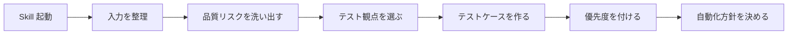

# Test-Design Skill 仕様書 (日本語)

> [🇬🇧 English](./SKILL-DESIGN.md) • [🇯🇵 日本語](./SKILL-DESIGN.ja.md)

kiwa が **テスト設計を自動化・標準化する Claude Code skill** を contract layer (Foundry / Hardhat) と dApp e2e layer (Playwright + kiwa fixture) の両方でどう構造化するかの仕様書。 Phase E 実装 PR が参照する SSOT。

## TL;DR

テスト設計は 3 層で構造化する:

| Layer | Skill (予定) | 目的 |
|---|---|---|
| **1. 汎用テスト設計** | `/kiwa-design` | 機能仕様 / API / 画面 / コード / DB schema を入力に、 品質リスク / テスト観点 / テストケース / 優先度 / 自動化方針を出力 |
| **2. テストランナー特化** | `/kiwa-forge` / `/kiwa-hardhat` / `/kiwa-play` (refactor) | Layer 1 の出力を実 `*.t.sol` / `*.test.ts` / `*.spec.ts` に変換 |
| **3. ドキュメント** | docs cookbook + skill reference | layer 連携で完全な dApp test pyramid を実現する手順を示す |

1 回の skill 起動で 5 段階フローを完走:



---

## なぜこの仕様書が必要か

テスト設計は本質的に **仕様策定の作業** であり、 コーディングではない。 各開発者が機能ごとに「何をテストするか」をゼロから書き直すと工数が爆発する。

kiwa は既に `/kiwa-play` の `Step 1.5` で「先に仕様書を書く」設計が偽陽性を減らし実装を加速することを証明済。 Phase E はこの pattern を **contract / integration / e2e の各層** と **Foundry / Hardhat / Playwright の各ランナー** に汎用化する。

Phase E は新しいテスト分類を発明するわけではない。 Claude Code skill が以下を一貫して出力する基準を作る:

- リスクベースのテスト選定
- 観点網羅 (正常 / 異常 / 境界値 / 状態遷移 / 権限 / バリデーション / 冪等性 / 並行処理 / 性能 / セキュリティ)
- `TC-XXX` 表形式の統一テストケース
- 優先度 (高 / 中 / 低) を影響度基準で
- 自動化推奨 (自動 / 手動 + 推奨ツール)

## 5 段階 skill フロー

全てのテスト設計 skill は以下のセクションを **この順** で生成する。

### 1. 入力を整理する

対象機能について以下を列挙:

- 機能名 + 1 文要約
- ユーザー操作 (UI / CLI / API クライアントの観点)
- API 契約 (HTTP method / path / request / response)
- DB 更新 (触れる table、 変更する column、 transaction 境界)
- 権限モデル (role、 scope、 multi-tenant 隔離)
- 外部連携 (third-party API、 blockchain RPC、 webhook)
- 失敗 mode (timeout、 retry、 partial state、 idempotency key)

仕様に欠けている項目があれば出力末尾の **「不足している仕様」** に明記する。 skill が欠落値を勝手に補完してはいけない。

### 2. 品質リスクを洗い出す

各入力要素に対し 5 基準でリスクを評価 (高 / 中 / 低):

| 基準 | 「高」の例 |
|---|---|
| 売上影響 | チェックアウト / 課金 / 決済 |
| セキュリティ影響 | 認証バイパス、 署名偽造 |
| データ破壊リスク | 不可逆 write、 soft delete なし |
| 利用頻度 | 全 page load、 全 transaction |
| 過去障害履歴 | 過去 6 ヶ月で bug 報告あり |

skill は **リスク要約 table** を出力し、 Step 3 で参照する。

### 3. テスト観点を選ぶ

各機能に対し以下 13 観点から該当するものを選択 (1-11 共通、 12-13 は e2e layer 必須):

| # | 観点 | 適用 |
|---|---|---|
| 1 | 正常系 | 常に |
| 2 | 異常系 | 外部依存があれば必須 |
| 3 | 境界値 | 数値入力 / 文字列長 / 時間範囲 |
| 4 | 状態遷移 | state machine / status field / 有限 state |
| 5 | 権限 | 認証ゲート / role-based UI |
| 6 | 入力バリデーション | user 入力 / API payload |
| 7 | 冪等性 | webhook / payment / blockchain tx |
| 8 | 並行処理 | race condition / multi-tab / multi-user |
| 9 | 性能 | 高負荷 endpoint / 大 payload |
| 10 | セキュリティ | 認証 / 署名 / 暗号化 / secret 管理 |

選択した観点を Step 4 のテストケースカテゴリにする。

### 4. テストケースを作る

各テストケースは統一 table の 1 行:

| 項目 | 内容 |
|---|---|
| テスト ID | `TC-001` |
| テストレベル | 単体 / 統合 / E2E |
| テスト観点 | 境界値 |
| 前提条件 | ユーザーがログイン済み |
| 入力値 | 文字数が上限値ちょうどの名前 |
| 操作手順 | `PUT /api/profile` を実行する |
| 期待結果 | 200 OK、 DB に正しく正規化された値が保存される |
| 優先度 | 高 |
| 自動化 | 推奨 |

skill は 1 ケース 1 行を出力。 観点ごとにグループ化し、 グループ内は優先度順。

### 5. 優先度付け + 自動化方針

優先度は Step 2 のリスク要約 + Step 3 の観点で決定:

- **高**: 売上 / セキュリティ / データ破壊 のいずれかが「高」
- **中**: 利用頻度 / 過去障害 のいずれかが「高」
- **低**: 全基準「低」

自動化のデフォルト方針 (テストレベル別):

- **単体テスト**: 常に自動化 (fast feedback、 deterministic)
- **統合テスト**: 主要 API path のみ自動化、 edge case の網羅は production critical なものだけ
- **E2E テスト**: 重要導線 (login / checkout / on-chain transaction) だけ自動化、 まれな flow は手動確認に回す

skill の最終出力には以下を追記:

- 「自動化推奨テスト」 — 優先度順
- 「手動確認でよいテスト」 — 各ケース理由付き
- 「不足している仕様」 — skill が解消できなかった事項を bullet

## 出力フォーマット

全てのテスト設計 skill はこの markdown skeleton を生成:

```markdown
## 対象機能

## 仕様の要約

## 主な品質リスク

## 推奨テスト構成

## テスト観点一覧

## テストケース一覧

## 自動化すべきテスト

## 手動確認でよいテスト

## 不足している仕様
```

9 section 全て必須。 順序固定。 skill は空の `(なし)` placeholder を返してでも section を省略してはいけない。

## Layer 2 特化

Layer 1 (`/kiwa-design`) が完了したら、 Layer 2 skill が汎用出力をランナー固有 code に変換する:

| Layer 2 skill | 変換先 |
|---|---|
| `/kiwa-forge` | `test/*.t.sol`、 `forge test` 実行、 `forge coverage` 評価 |
| `/kiwa-hardhat` | `test/*.test.ts`、 `npx hardhat test` 実行、 `hardhat-coverage` 評価 |
| `/kiwa-play` (refactored) | `tests/*.spec.ts` + `tests/prepare-env.ts`、 Playwright 実行、 4 round flake check |

各 Layer 2 skill は Layer 1 の仕様 file (`.context/spec/test-spec-{module}.md`) を入力にして実装を出力。 Layer 1 の仕様 file が design と implementation の契約として機能する。

## Skill prompt テンプレ

全テスト設計 skill が `SKILL.md` で使う共通 skeleton:

```text
あなたはアプリケーションテスト設計の専門家です。

入力された仕様、 コード、 API 定義、 画面情報をもとに、 品質リスクを洗い出し、 必要なテスト項目を作成してください。

必ず以下を実施してください:

1. 仕様を要約する
2. 品質リスクを洗い出す
3. 単体テスト / 統合テスト / E2E テストに分類する
4. 観点を確認: 正常系 / 異常系 / 境界値 / 状態遷移 / 権限 / セキュリティ / 性能 / 回帰
5. テストケースごとに 前提条件 / 入力値 / 操作手順 / 期待結果 / 優先度 / 自動化可否 を出す
6. 仕様が不足している場合は不足点を明記する
7. 重要度が高いテストから順番に並べる
```

Layer 2 skill はこの prompt をランナー固有指示で拡張 (例: 「Layer 1 ケースを Foundry `forge test` パターンに変換、 観点 = 境界値の場合は invariant / fuzz を活用」)。

## このフォーマットが活きる用途

同じ 9 section 出力で以下 4 レビュー活動を全てカバー:

| 活動 | この仕様書が活きる場面 |
|---|---|
| 設計レビュー | 実装着手前にテスト計画をレビューで検証 |
| 実装前レビュー | TDD 流に「先にテストを書く」が仕様書から直接できる |
| PR レビュー | reviewer が「高優先度ケースが全て PR に含まれている」を確認 |
| QA 観点チェック | QA team が ad-hoc な探索でなく分類済 checklist で確認 |

## Roadmap

| Phase | Scope | 対象 file |
|---|---|---|
| **E-1** | SKILL-DESIGN.md 仕様書 (本文書) | `docs/SKILL-DESIGN.md` |
| **E-2** | `/kiwa-design` skill (Layer 1) | `.claude/skills/kiwa-design/` |
| **E-3** | `/kiwa-play` refactor (Layer 2 e2e) | 既存 skill に Layer 1 統合 |
| **E-4** | `/kiwa-forge` skill | `.claude/skills/kiwa-forge/` |
| **E-5** | `/kiwa-hardhat` skill | `.claude/skills/kiwa-hardhat/` |
| **E-6** | layer 連携の cookbook 章 | `docs/{ja,en}/cookbook/kiwa-design-flow.md` |

Phase は D → A → B 段階: 仕様書 → 最も価値ある skill (Layer 1) → 既存 e2e skill への統合、 その後 Foundry / Hardhat runner を community contribution で。

## スコープ外

- テスト実行スケジューリング (CI 統合はユーザーの CI tool に任せる)
- mutation testing / formal verification (別 tool)
- テストデータ生成ライブラリ (faker / fast-check / fuzz harness を利用者が選択)
- skill 間メモリ / 状態 (各 skill 起動は stateless、 `.context/spec/` artifact だけが optional な永続化)

## 関連

- [`docs/MOCK-DESIGN.md`](./MOCK-DESIGN.md) — wallet / SDK mock 精度仕様 (「何を fake するか」の関連概念)
- [`.claude/skills/kiwa-play/SKILL.md`](../.claude/skills/kiwa-play/SKILL.md) — 既存 e2e skill (既にこの flow の一部に従っている)
- [`.claude/skills/kiwa-play/references/adversarial-pitfalls.md`](../.claude/skills/kiwa-play/references/adversarial-pitfalls.md) — 偽陽性 self-check
