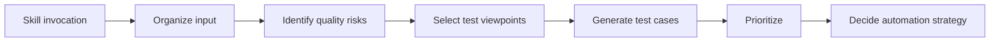

# Test-Design Skill Spec

> [🇬🇧 English](./SKILL-DESIGN.md) • [🇯🇵 日本語](./SKILL-DESIGN.ja.md)

How dapp-e2e structures **Claude Code skills for automating and standardizing test design** across contract (Foundry / Hardhat) and dApp e2e (Playwright + dapp-e2e fixture) layers. This document is the single source of truth referenced by Phase E implementation PRs.

## TL;DR

Test design is split into 3 layers:

| Layer | Skill (planned) | Purpose |
|---|---|---|
| **1. Generic test design** | `/test-design` | Given a feature spec / API / screen / code / DB schema, produce risk list, test viewpoints, test cases, priorities, automation policy |
| **2. Test-runner specialization** | `/contract-test-foundry`, `/contract-test-hardhat`, `/dapp-e2e-test` (refactor) | Convert Layer 1 output into actual `*.t.sol` / `*.test.ts` / `*.spec.ts` files |
| **3. Documentation** | docs cookbook + skill reference | Show how to chain the layers for a complete dApp test pyramid |

A single user-facing skill invocation walks the full 5-step flow:



---

## Why this spec exists

Test design is fundamentally a **specification activity**, not a coding activity. The team would lose hours per feature if every developer rewrote "what to test" from scratch.

dapp-e2e already proved that test-spec-first design (`Step 1.5` in `/dapp-e2e-test`) reduces false positives and accelerates implementation. Phase E generalizes that pattern across **contract / integration / e2e** layers and across **Foundry / Hardhat / Playwright** runners.

Phase E does not invent new test taxonomy. It standardizes how Claude Code skills emit:

- Risk-based test selection
- Viewpoint coverage (normal / abnormal / boundary / state-transition / permission / validation / idempotency / concurrency / performance / security)
- Test cases in a uniform `TC-XXX` table
- Priority (high / medium / low) by impact criteria
- Automation recommendation (auto / manual + tooling)

## 5-step skill flow

Every test-design skill produces the following sections **in this order**.

### 1. Organize input

The skill must enumerate, for the target feature:

- Feature name + one-sentence summary
- User actions (UI / CLI / API client perspective)
- API contract (HTTP method / path / request / response)
- DB updates (tables touched, columns mutated, transaction boundary)
- Permission model (roles, scopes, multi-tenant isolation)
- External integrations (third-party APIs, blockchain RPC, webhooks)
- Failure modes (timeouts, retries, partial state, idempotency keys)

If any of the above is missing from the spec, list it under **"insufficient spec"** in the output. The skill must not invent missing values.

### 2. Identify quality risks

For each input element, score the risk by 5 criteria (high / medium / low for each):

| Criterion | High example |
|---|---|
| Revenue impact | Checkout / billing / settlement |
| Security impact | Auth bypass, signature forgery |
| Data destruction risk | Irreversible write, no soft delete |
| Usage frequency | Every page load, every transaction |
| Past incident history | Bug filed in the last 6 months |

The skill emits a **risk summary table** and feeds it into Step 3.

### 3. Select test viewpoints

For each feature, select applicable viewpoints from the 10-item catalog:

| # | Viewpoint | Apply when |
|---|---|---|
| 1 | Happy path | Always |
| 2 | Failure path | Any external dependency exists |
| 3 | Boundary value | Numeric input, string length, time range |
| 4 | State transition | State machine, status field, finite states |
| 5 | Permission | Auth-gated routes, role-based UI |
| 6 | Input validation | User-typed input, API payload |
| 7 | Idempotency | Webhook handler, payment flow, blockchain tx |
| 8 | Concurrency | Race conditions, multi-tab, multi-user |
| 9 | Performance | High-traffic endpoint, large payload |
| 10 | Security | Auth, signing, encryption, secret handling |

Selected viewpoints become test-case categories in Step 4.

### 4. Generate test cases

Each test case is one row in the unified output table:

| Field | Content |
|---|---|
| Test ID | `TC-001` |
| Test level | Unit / Integration / E2E |
| Viewpoint | Boundary value |
| Precondition | User logged in |
| Input | Name string at exact character limit |
| Steps | Call `PUT /api/profile` with the input |
| Expected | 200 OK, DB stores correctly normalized value |
| Priority | High |
| Automation | Recommended |

The skill emits one such row per case. Cases are grouped by viewpoint and sorted by priority within each group.

### 5. Prioritize + automation strategy

Priority assignment is based on the risk summary from Step 2 + the viewpoint from Step 3:

- **High**: Any cell scored "high" in revenue / security / data destruction
- **Medium**: At least one "high" in frequency / past incidents
- **Low**: All criteria "low"

Automation defaults by test level:

- **Unit tests**: Always automate (fast feedback, deterministic)
- **Integration tests**: Automate the primary API paths, skip exhaustive edge cases unless production-critical
- **E2E tests**: Automate only the critical user flows (login, checkout, on-chain transaction), defer rarely-used flows to manual verification

The skill's final output appends:

- "Tests recommended for automation" — sorted by priority
- "Tests okay for manual verification" — explanation per case
- "Insufficient spec" — bullets the skill could not resolve

## Output format

Every test-design skill emits this markdown skeleton:

```markdown
## Target feature

## Spec summary

## Main quality risks

## Recommended test composition

## Test viewpoints

## Test cases

## Tests recommended for automation

## Tests okay for manual verification

## Insufficient spec
```

These 9 sections are mandatory. Order is fixed. Skills must produce empty `(none)` placeholders rather than omit sections.

## Layer 2 specialization

When Layer 1 (`/test-design`) finishes, Layer 2 skills convert the generic output into runner-specific code:

| Layer 2 skill | Conversion target |
|---|---|
| `/contract-test-foundry` | `test/*.t.sol` files, `forge test` execution, `forge coverage` evaluation |
| `/contract-test-hardhat` | `test/*.test.ts` files, `npx hardhat test` execution, `hardhat-coverage` evaluation |
| `/dapp-e2e-test` (refactored) | `tests/*.spec.ts` + `tests/prepare-env.ts`, Playwright execution, 4-round flake check |

Each Layer 2 skill consumes a Layer 1 spec file (`.context/spec/test-spec-{module}.md`) and writes implementation. The Layer 1 spec acts as the contract between design and implementation.

## Skill prompt template

All test-design skills use this skeleton in `SKILL.md`:

```text
You are a specialist in application test design.

Given the inputs (spec, code, API definitions, screen layouts), identify quality risks and produce a complete test plan.

Always perform these steps:

1. Summarize the spec.
2. Identify quality risks.
3. Classify into unit / integration / E2E layers.
4. Cover viewpoints: normal / abnormal / boundary / state transition / permission / security / performance / regression.
5. For each test case emit: precondition, input, steps, expected outcome, priority, automation recommendation.
6. Flag any spec gaps that prevent confident testing.
7. Sort output by priority, high first.
```

Layer 2 skills extend the prompt with runner-specific instructions (e.g. "convert Layer 1 cases into Foundry `forge test` patterns including invariant / fuzz where viewpoint = boundary").

## Use cases this serves

The same 9-section output covers all four review activities:

| Activity | How the spec helps |
|---|---|
| Design review | Reviewers verify the test plan before implementation starts |
| Pre-implementation review | TDD-style "write tests first" works directly from the spec |
| PR review | Reviewer checks that the PR covers all High-priority cases |
| QA viewpoint check | QA team has a categorized checklist instead of ad-hoc exploration |

## Roadmap

| Phase | Scope | Target file |
|---|---|---|
| **E-1** | SKILL-DESIGN.md spec (this document) | `docs/SKILL-DESIGN.md` |
| **E-2** | `/test-design` skill (Layer 1) | `.claude/skills/test-design/` |
| **E-3** | `/dapp-e2e-test` refactor (Layer 2 e2e) | Existing skill, integrate Layer 1 |
| **E-4** | `/contract-test-foundry` skill | `.claude/skills/contract-test-foundry/` |
| **E-5** | `/contract-test-hardhat` skill | `.claude/skills/contract-test-hardhat/` |
| **E-6** | Cookbook chapter linking the layers | `docs/{ja,en}/cookbook/test-design-flow.md` |

Phases are sequenced D → A → B style: spec → most valuable skill (Layer 1) → integration into the existing e2e skill, then community contributions for Foundry / Hardhat runners.

## Out of scope

- Test execution scheduling (CI integration is left to the user's CI tool)
- Mutation testing or formal verification (separate tooling)
- Test data generation libraries (use faker / fast-check / fuzz harnesses as the user prefers)
- Cross-skill memory / state (each skill invocation is stateless except for the optional `.context/spec/` artifact)

## See also

- [`docs/MOCK-DESIGN.md`](./MOCK-DESIGN.md) — Wallet / SDK mock fidelity spec (related concept for "what to fake")
- [`.claude/skills/dapp-e2e-test/SKILL.md`](../.claude/skills/dapp-e2e-test/SKILL.md) — Existing e2e skill that already follows part of this flow
- [`.claude/skills/dapp-e2e-test/references/adversarial-pitfalls.md`](../.claude/skills/dapp-e2e-test/references/adversarial-pitfalls.md) — Self-check checklist for false positives
