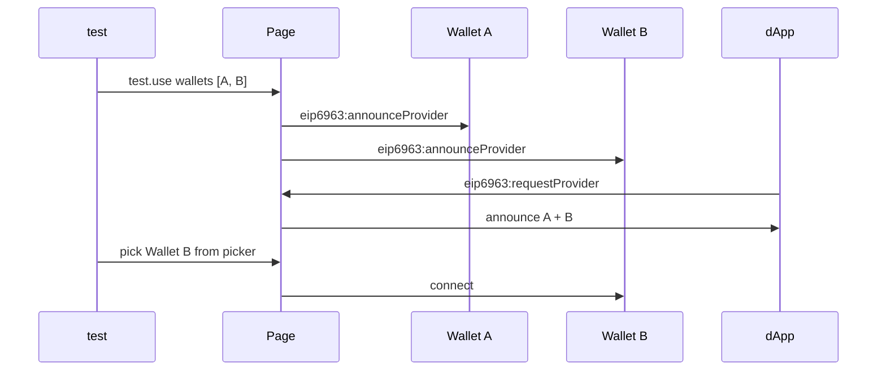

# EIP-6963 Multi-Wallet

## TL;DR

dapp-e2e supports EIP-6963 (Multi Injected Provider Discovery), injecting multiple wallets into a single page so wagmi v2 / RainbowKit v2 wallet pickers can detect them correctly.

## Why

Real dApp users juggle MetaMask, Rabby, Coinbase Wallet, Trust, and others. Wallet picker UI testing is critical.
Reproducing EIP-6963 announce/request events lets you verify the wallet-picker selection flow end-to-end.

## How

## Example

~~~ts
import { dappE2eTest } from '@dapp-e2e/core';

const test = dappE2eTest.extend({});

test.use({
  wallets: [[
    { name: 'MetaMask', rdns: 'io.metamask', icon: 'data:,', privateKey: '0xac09...' },
    { name: 'Rabby',    rdns: 'io.rabby',    icon: 'data:,', privateKey: '0x59c6...' },
  ]],
} as never);

test('multi-wallet picker', async ({ page, dappE2e }) => {
  await dappE2e.wallets!['io.rabby'].connect();
});
~~~

## Related

- [Fixture design](./fixture.md)
- [Cookbook: Multi-Wallet test](../cookbook/multi-wallet.md)
