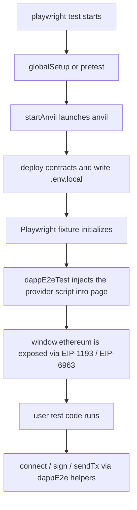
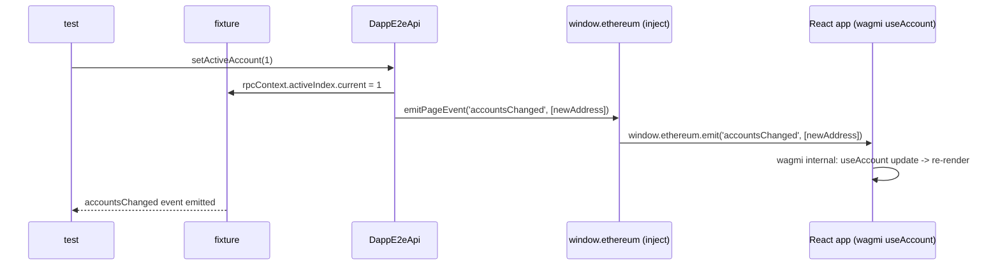

# Fixture design

## TL;DR

`dappE2eTest` is a Playwright `test` extension that bundles anvil launch, wallet injection, and the connect flow into a single fixture.

## Why

dApp E2E tests involve many steps: anvil launch, contract deploy, wallet injection, connect, sign, send tx.
Writing this boilerplate per test produces flakiness.
kiwa offers anvil launch / EIP-1193 injection / Playwright fixture wiring in one path; the user just receives `page` and `dappE2e` to write tests.

## How

## Account-switch event order

`setActiveAccount()` updates internal state before forwarding `accountsChanged` into the page,
so wagmi `useAccount()` observes the flow as "state update -> event delivery -> re-render".

## Example

~~~ts
import { dappE2eTest as test, expect } from '@kiwa/core';

const customTest = test.extend({
  // Override wallet private keys or approval mode as needed
  approvalMode: 'approve',
});

customTest('can sign after connect', async ({ page, dappE2e }) => {
  await page.goto('/');
  await dappE2e.connect();
  const sig = await dappE2e.personalSign('hello');
  expect(sig).toMatch(/^0x[0-9a-f]+$/);
});
~~~

## Related

- [EIP-6963 Multi-Wallet](./eip-6963.md)
- [API Reference: dappE2eTest](../api/kiwa-play.md)
