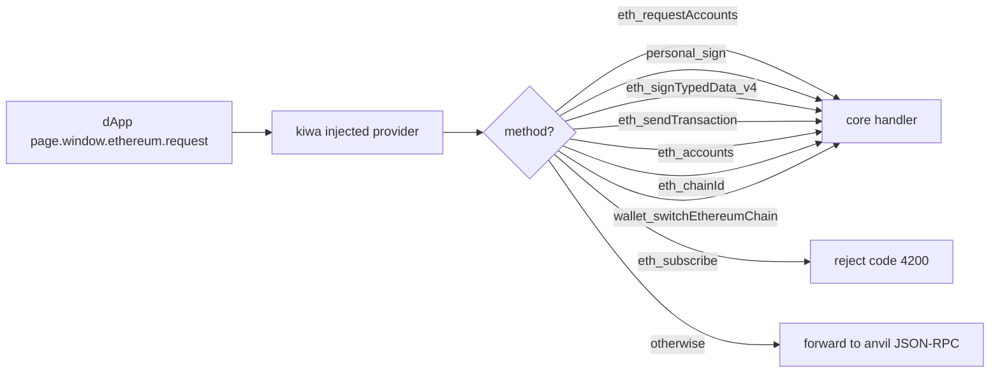

# RPC handling

## TL;DR

kiwa core handles 9 EIP-1193 RPC methods directly and forwards the rest to anvil JSON-RPC.
This lets you exercise flows like `eth_requestAccounts` and `personal_sign` without reproducing wallet popups.

## Why

A real wallet returns RPCs through popup / approve UIs that CI cannot reproduce.
kiwa keeps wallet behavior **inside code**, making it CI-friendly and giving switchable UX paths like `setApprovalMode('reject')` for testing rejection flows.

## The 9 directly-handled RPCs

See [docs/RPC.md](../../RPC.md) for the full reference.

## Example: setApprovalMode

~~~ts
test('user reject path', async ({ page, dappE2e }) => {
  await dappE2e.setApprovalMode('reject');
  await page.goto('/');
  await page.getByRole('button', { name: /connect/i }).click();
  await expect(page.getByTestId('error')).toContainText('User rejected'); // code 4001
});
~~~

## Related

- [RPC.md (Reference)](../../RPC.md)
- [Cookbook: User reject path](../cookbook/user-reject.md)
