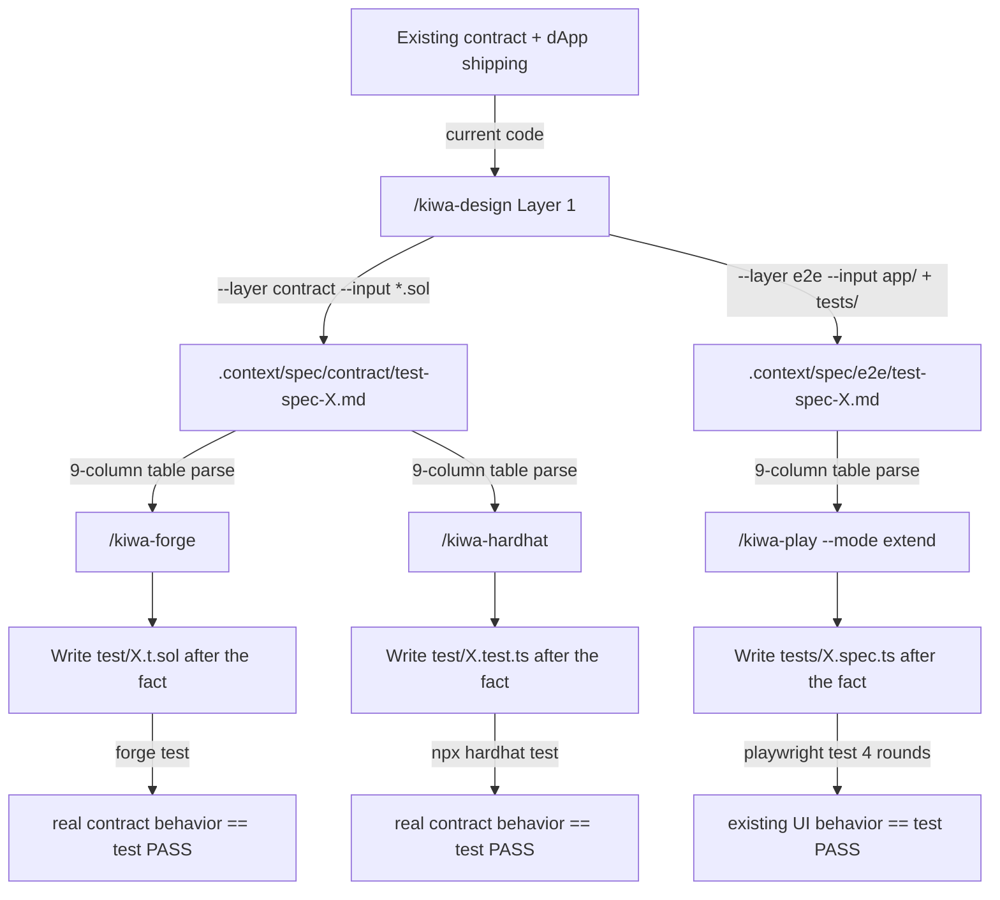

# 3-layer test design flow (Phase E integration cookbook)

> [🇬🇧 English](./kiwa-design-flow.md) • [🇯🇵 日本語](../../ja/cookbook/kiwa-design-flow.md)

A documented walkthrough of the "Layer 1 (test design) → Layer 2 (implementation conversion)" chain established in kiwa Phase E (#171–#181), focused on **retrofitting tests into a contract / dApp that already exists and ships**. We use the real `examples/nextjs-token-gating` contracts as the worked example.

The chain also works for new TDD-first development, but the primary use case is **adding tests after the fact to existing contracts / dApps**. Treat the existing implementation as the de-facto specification, infer the viewpoints from it, and fill in the missing tests.

## Overall diagram



Core idea of the 3-layer chain — the **9-column table inside the Layer 1 output (`.context/spec/{contract,e2e}/test-spec-{module}.md`) acts as the single source of truth**. The three Layer 2 skills (Foundry / Hardhat / Playwright) read the same file and mechanically translate it into runner-specific helpers. In the retrofit flow the "target functionality" section is populated by grep extraction from the existing code.

## Full worked example: nextjs-token-gating (retrofitting an existing dApp)

### Step 0: Survey the existing contract / dApp

`examples/nextjs-token-gating/` already contains:

```bash
ls examples/nextjs-token-gating/contracts/ tests/
# contracts/: GateNFT.sol + GatedContent.sol
# tests/: gating.spec.ts (existing e2e tests) + prepare-env.ts + fixture.ts
```

Functions / errors in the real contracts (what the skill greps for you):

```bash
grep -E "function |event |error " contracts/*.sol
# GateNFT.sol: mint() / transferFrom() / NotOwner / InvalidRecipient
# GatedContent.sol: getSecret() / grantTimedAccess(user, ttl) / hasAccess() / isGated()
#                   NotGated / InvalidTtl / Accessed / TimedAccessGranted
```

Existing test count:

```bash
grep -cE "^test\(|^test\.describe\(" tests/*.spec.ts
# gating.spec.ts: 8 tests (T-GT-000 through T-GT-007)
```

There is no formal spec — the "behavioral spec of the contract" is scattered across docstrings and the actual code. Retrofit testing here "writes the behavior down + adds missing viewpoints".

### Step 1: Reverse-engineer a contract-side spec with Layer 1

```text
/kiwa-design --layer contract --module token-gating --input examples/nextjs-token-gating/contracts/GatedContent.sol

The Layer 1 skill:
- reads the input .sol and greps for function / event / error
- also inspects the sibling contract (GateNFT.sol) through the IGateNFT interface
- reverse-engineers "target functionality" / "spec summary" / "permission model" / "failure modes" from docstrings and real code
- scores quality risk on the 5 criteria, decides apply/skip for each of the 10 viewpoints
- generates a 9-column table at one case per row, grouped by viewpoint, sorted by priority
```

`.context/spec/contract/test-spec-token-gating.md` is produced. The "Insufficient spec" section records the docstring ambiguities (cleanup timing for `timedAccessExpiry`, the duplicate-grant behavior, presence of a max supply, pause functionality).

### Step 2: Reverse-engineer an e2e-side spec with Layer 1

```text
/kiwa-design --layer e2e --module token-gating --input examples/nextjs-token-gating/

The Layer 1 skill:
- reads the existing tests/gating.spec.ts and treats the 8 existing tests as "current coverage"
- extracts the relationship between contract and UI (app/page.tsx or the inline HTML fixture)
- records viewpoints not covered by the existing tests (partial permission verification, multi-grantee simultaneous expiry, self-grant bypass) as "new tests to add"
```

`.context/spec/e2e/test-spec-token-gating.md` is produced, listing existing test IDs (T-GT-NNN) alongside the new test IDs (TC-NNN).

### Step 3: Write contract tests after the fact with Layer 2 (Foundry)

```text
/kiwa-forge --module token-gating --gas-report
```

The skill:

- reads `.context/spec/contract/test-spec-token-gating.md`
- translates viewpoint groupings (1 happy / 2 failure / 3 boundary / 4 state / 5 permission / 10 security) into Solidity test functions, annotated with `// 観点 N: {name}` comments
- viewpoint 3 → `testFuzz_grantTimedAccess_Boundary` (`bound(ttl, 1, 365 days)`), viewpoint 4 → `invariant_TimedAccessExpiryNonZero` + Handler, viewpoint 10 → `test_SelfGrantBypassDefense` + `test_TransferRevokesAll_MultiGrantee`
- **writes `test/GatedContent.t.sol` after the fact** (creates a new file because no prior .t.sol exists; otherwise lives alongside existing files)
- runs `forge build` to compile, then `forge test --gas-report`
- **tests PASS** = the current behavior of the real contract is now recorded as the test's "expected outcome"
- **tests FAIL** = a bug surfaces (docstring vs real code mismatch, or a misreading in the spec)

### Step 3': Write contract tests after the fact with Layer 2 (Hardhat, in parallel)

```text
/kiwa-hardhat --module token-gating --gas-report
```

Reads the same `.context/spec/contract/test-spec-token-gating.md` and writes `test/GatedContent.test.ts` in Hardhat shape, in parallel. Foundry-leaning and Hardhat-leaning developers can hold **parallel tests with the same test IDs** sourced from one spec. Viewpoints and case IDs (TC-001 through TC-013) line up across both layers.

### Step 4: Extend the e2e tests with Layer 2 in `extend` mode (Playwright)

```text
/kiwa-play --mode extend --example nextjs-token-gating
```

The skill:

- in Step 1.5.B, reads `.context/spec/e2e/test-spec-token-gating.md`
- recognises the 8 existing tests (T-GT-000 through T-GT-007) as "current coverage" and guarantees zero regression
- **appends** the missing viewpoints (partial permission verification, multi-grantee simultaneous expiry, self-grant bypass) as new tests (TC-008 onwards) into `tests/gating.spec.ts`
- runs `pnpm test` four times in a row to confirm zero flakes (all 8 existing + N new tests pass)

### Step 5: Coverage evaluation (required, completion blocked on shortfall)

`forge test` / `npx hardhat test` passing is **not enough** for completion; the chain must also measure coverage and check thresholds. As an OSS-publication baseline the default thresholds are:

| Metric | Default threshold | Rationale |
|---|---|---|
| Lines | 90% | Cover the primary paths fully |
| Statements | 90% | Statement-level coverage |
| **Branches** | **80%** | 100% on Solidity require/revert/short-circuit is impractical |
| Funcs | 90% | Cover every public / external function |

```bash
# Foundry
forge coverage --report summary

# Hardhat
npx hardhat coverage
```

Measured values across kiwa's three real examples (achieved in PR #185):

| Example | Runner | Lines | Statements | Branches | Funcs |
|---|---|---|---|---|---|
| nextjs-token-gating | Foundry | 100% | 97.73% | 87.50% | 100% |
| mint-nft | Foundry | 97.70% | 94.57% | 83.33% | 95.24% |
| mint-nft | Hardhat | 93.75% | 92.86% | 80.56% | 100% |
| defi-swap | Foundry | 100% | 97.62% | 87.50% | 100% |

All four metrics clear the default threshold (Lines/Stmts/Funcs ≥ 90%, Branches ≥ 80%), satisfying the publication baseline.

#### Action when coverage falls short

| Result | Action |
|---|---|
| All four metrics ≥ threshold | Done, write the test-passed marker |
| Any metric below threshold | **Not done**. Append "{metric} {N}% < {threshold}% under-covered" to the Layer 1 "Insufficient spec" section, and enumerate uncovered viewpoints / error paths / events as bullets |
| `forge coverage` / `hardhat coverage` itself fails | Do not treat the test pass as completion; report the cause (silent skip is forbidden) |

### Step 6: The completed test pyramid

After Step 5 coverage success:

| Layer | Runner | Output file | Viewpoints covered | Existing vs new |
|---|---|---|---|---|
| contract unit | Foundry | `test/GatedContent.t.sol` | All 10 (fuzz + invariant) | All new (no prior .t.sol) |
| contract unit | Hardhat | `test/GatedContent.test.ts` | All 10 (fast-check + chai) | All new (no prior .test.ts) |
| dApp e2e | Playwright | `tests/gating.spec.ts` | 1 / 2 / 4 / 5 / 10 | 8 existing + N new (extend) |

The existing e2e tests are preserved while the viewpoint gaps are filled, and brand-new contract tests are added. The same Layer 1 spec keeps test IDs in sync across both layers.

## Viewpoint × helper mapping cheat sheet

A quick reference for the 3 layers × 10 viewpoint helper mapping:

| Viewpoint | Foundry | Hardhat | Playwright |
|---|---|---|---|
| 1. Happy path | `test_*` | `it()` + chai expect | `test()` happy path |
| 2. Failure path | `vm.expectRevert(Error.selector)` | `revertedWithCustomError(c, 'Error')` | mock RPC injection (`createRpcHandler`) |
| 3. Boundary | `testFuzz_*` + `vm.assume` / `bound` | `fast-check` `asyncProperty` | parameterized `test.describe.each` |
| 4. State transition | `invariant_*` + Handler pattern | `beforeEach` state seed + `describe.each` | seed state via Playwright fixture |
| 5. Permission | `vm.prank(role)` | `c.connect(signer)` | switch wallet account (`makeClients(port, OTHER_PK)`) |
| 6. Input validation | `testFuzz_*` + revert assertion | `fc.string()` + revert assertion | `getByTestId` form assertion |
| 7. Idempotency | call twice → second `vm.expectRevert` | call twice → second `expect(...)` revert | retry test (`test.describe.serial`) |
| 8. Concurrency | tx ordering test (`vm.warp`) | `Promise.allSettled([tx1, tx2])` | multi-tab (`context.newPage()`) |
| 9. Performance | `forge test --gas-report` | `hardhat-gas-reporter` | Playwright trace + perf metrics |
| 10. Security | `invariant_NoReentrancy` + `vm.signature` | signature recovery + role assertion | end-to-end signature flow (`verifyMessage`) |

For the full reference, see each Layer 2 skill's `references/{foundry,hardhat,playwright}-mapping.md`.

## Retrofitting vs new (TDD-style) development

| Comparison | New development (TDD) | Retrofitting (the primary use case in this chapter) |
|---|---|---|
| `/kiwa-design` input | A feature spec document (no code yet) | Existing `.sol` / `app/` / `tests/` passed via `--input`, mined by grep |
| Layer 1 "target functionality" section | Authored from the spec | Summarised from grep results |
| Layer 1 "insufficient spec" section | Lists ambiguities from the spec | Lists undocumented behavior / implicit assumptions / untested paths |
| When Layer 2 runs `forge test` | Expects RED (tests are written first) | Expects PASS (records the real behavior as canonical) |
| When tests FAIL | Fix the implementation (TDD GREEN) | A bug surfaces (existing behavior differs from expectations) |
| Relationship with existing tests | (n/a) | `--mode extend` guarantees zero regression on the existing test count |

## False-positive self-check checklist

Hotspots where false positives can enter a 3-layer chain, plus how to defend:

- **Missing precondition in the Layer 1 spec** — even when the "precondition" column reads `(none)`, an implicit contract state requirement (for example "NFT must already be held before granting") can cause "state corruption masked as test pass" in Layer 2. When `(none)` is used in Layer 1, verify it is intentional
- **Layer 2 parser miss (column shift)** — if the 9-column header does not match the SSOT (`docs/SKILL-DESIGN.ja.md` Step 4), Layer 2 reads a different column as the viewpoint. Run `grep -c "テスト ID | テストレベル | テスト観点"` to confirm the 9-column header before committing
- **Partial verification of viewpoint 5 (permissions)** — checking only `hasAccess(user)` and ignoring the `grantor` / `msg.sender` paths lets a self-grant bypass slip through. Always exercise every entry point (grantor / grantee / third party)
- **Time-warp side effects in viewpoint 4 (state transition)** — Foundry `vm.warp` and Hardhat `time.increaseTo` both leak time into the next test if you forget to reset. Restore the fixture from `loadFixture` / `snapshotChain` in `setUp`
- **Race conditions in parallel runs** — for viewpoint 8, prefer `Promise.allSettled` over `Promise.all` (so a single reject does not collapse the rest); Foundry is synchronous, so parallel races are not even expressible
- **The trap of treating real behavior as canonical** — even when `forge test` passes, "the real contract has a bug and the test froze that bug into place" remains possible. Cross-check the Layer 1 "main quality risks" section and confirm with the spec author whether "real behavior == intended spec"

The full nine patterns plus a five-question self-check live in `.claude/skills/kiwa-play/references/adversarial-pitfalls.md`.

## Related links

- Phase E SSOT: [`docs/SKILL-DESIGN.md`](../../SKILL-DESIGN.md)
- Layer 1: [.claude/skills/kiwa-design/SKILL.md](../../../.claude/skills/kiwa-design/SKILL.md)
- Layer 2 Foundry: [.claude/skills/kiwa-forge/SKILL.md](../../../.claude/skills/kiwa-forge/SKILL.md)
- Layer 2 Hardhat: [.claude/skills/kiwa-hardhat/SKILL.md](../../../.claude/skills/kiwa-hardhat/SKILL.md)
- Layer 2 Playwright: [.claude/skills/kiwa-play/SKILL.md](../../../.claude/skills/kiwa-play/SKILL.md)
- Related cookbook chapters: [snapshot-revert.md](./snapshot-revert.md) (snapshot pattern shared between Layer 1 / Layer 2), [custom-error-revert.md](./custom-error-revert.md) (viewpoint 2 failure-path helper)
