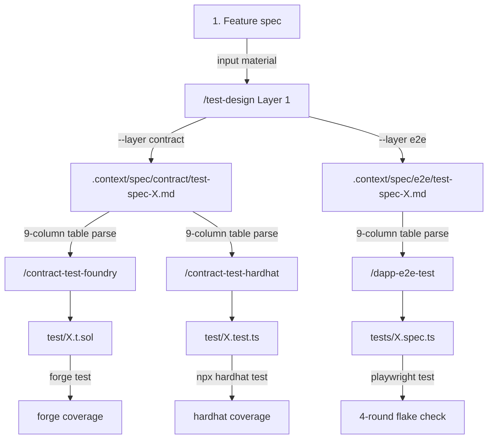

# 3-layer test design flow (Phase E integration cookbook)

> [🇬🇧 English](./test-design-flow.md) • [🇯🇵 日本語](../../ja/cookbook/test-design-flow.md)

A documented walkthrough of the "Layer 1 (test design) → Layer 2 (implementation conversion)" chain established in dapp-e2e Phase E (#171–#180). This chapter walks through generating contract tests (Foundry / Hardhat) and dApp e2e tests (Playwright) from a single spec, using the `mint-nft` example as a vehicle.

## Overall diagram



Core idea of the 3-layer chain — the **9-column table inside the Layer 1 output (`.context/spec/{contract,e2e}/test-spec-{module}.md`) acts as the single source of truth**. The three Layer 2 skills (Foundry / Hardhat / Playwright) read the same file and mechanically translate it into runner-specific helpers.

## Full worked example: mint-nft (Phase E full chain)

### Step 0: Feature spec (input material)

Target `mint()` / `transfer()` / `burn()` on `examples/mint-nft/contracts/MintableNFT.sol`. Any caller can mint 1 NFT for 0.01 ETH; max supply is 10000; only the owner can burn.

### Step 1: Generate a contract-side spec with Layer 1

```text
/test-design --layer contract --module mint-nft

Input material:
- Target functions = MintableNFT.mint() / transfer() / burn() (3 functions)
- Contract = examples/mint-nft/contracts/MintableNFT.sol
- Failure modes = msg.value < 0.01 ETH → InvalidFee / maxSupply reached → MaxSupplyExceeded / owner check failed → NotOwner
```

`.context/spec/contract/test-spec-mint-nft.md` is produced with the 9 sections + 9-column table (the `/test-design` skill renders it automatically based on the SSOT).

### Step 2: Generate an e2e-side spec with Layer 1

```text
/test-design --layer e2e --module mint-nft

Input material:
- Target flow = mint-nft UI flow (Connect → Mint button → display tokenId → Transfer button)
- Target files = examples/mint-nft/app/page.tsx + tests/mint.spec.ts
- Failure modes = wallet reject / RPC timeout / actions while paused
```

`.context/spec/e2e/test-spec-mint-nft.md` is produced with the same 9 sections + 9-column table.

### Step 3: Implement the contract test with Layer 2 (Foundry)

```text
/contract-test-foundry --module mint-nft --gas-report
```

The skill performs:
- Reads `.context/spec/contract/test-spec-mint-nft.md`
- Translates viewpoint groupings (1 happy-path / 2 failure-path / 3 boundary / …) into Solidity test functions with `// 観点 N: {name}` comments
- Viewpoint 3 (boundary) → `testFuzz_*` (`vm.assume` / `bound`), viewpoint 4 (state transition) → `invariant_*` + Handler, viewpoint 10 (security) → reentrancy attacker + signature recovery
- Writes `test/MintableNFT.t.sol`
- Runs `forge test --gas-report` → all functions pass + gas measured
- Runs `forge coverage --report summary` to evaluate line coverage (default threshold 80%)

### Step 3': Implement the contract test with Layer 2 (Hardhat, consumes the same spec in parallel)

```text
/contract-test-hardhat --module mint-nft --gas-report
```

The skill performs:
- Reads the same `.context/spec/contract/test-spec-mint-nft.md`
- Translates viewpoint groupings into `describe('観点 N: {name}', ...)` blocks in TypeScript
- Viewpoint 3 → `fast-check` `asyncProperty`, viewpoint 4 → `loadFixture` + `describe.each(states)`, viewpoint 10 → `signTypedData` + reentrancy attacker
- Writes `test/MintableNFT.test.ts`
- Runs `npx hardhat test` → every `it` block passes
- Runs `npx hardhat coverage` to evaluate line coverage

Because both skills **consume the same Layer 1 spec**, Foundry-leaning and Hardhat-leaning developers share an identical test specification. Viewpoints and case IDs (TC-001 etc.) line up across both layers.

### Step 4: Implement the e2e test with Layer 2 (Playwright)

```text
/dapp-e2e-test --mode new --example mint-nft
```

The skill performs:
- In Step 1.5.B, reads `.context/spec/e2e/test-spec-mint-nft.md`
- Translates viewpoint groupings into `test.describe('観点 N: {name}', ...)` blocks in Playwright
- Viewpoint 1 happy-path → `test('TC-001 mint and display tokenId')`, viewpoint 10 security → wallet signature verification
- Writes `tests/mint.spec.ts` + `tests/prepare-env.ts`
- Runs `pnpm test` four times in a row to confirm zero flaky failures

### Step 5: Integrating coverage across all layers

When the chain finishes, the test pyramid is complete:

| Layer | Runner | Output file | Viewpoints covered |
|---|---|---|---|
| contract unit | Foundry | `test/MintableNFT.t.sol` | All 10 viewpoints (fuzz + invariant + reentrancy) |
| contract unit | Hardhat (parallel) | `test/MintableNFT.test.ts` | All 10 viewpoints (fast-check + chai matchers) |
| dApp e2e | Playwright | `tests/mint.spec.ts` | 1 (happy) / 2 (failure) / 4 (state) / 5 (permission) / 10 (security) |

Contract unit tests fast-fuzz and invariant-check all 10 viewpoints, while the e2e layer covers the UI route (wallet inject / button click → contract → state propagation). The same Layer 1 spec keeps test IDs in sync across layers.

## Viewpoint × helper mapping cheat sheet

A quick reference for the 3 layers × 10 viewpoint helper mapping:

| Viewpoint | Foundry | Hardhat | Playwright |
|---|---|---|---|
| 1. Happy path | `test_*` | `it()` + chai expect | `test()` happy path |
| 2. Failure path | `vm.expectRevert(Error.selector)` | `revertedWithCustomError(c, 'Error')` | mock RPC injection (`createRpcHandler`) |
| 3. Boundary | `testFuzz_*` + `vm.assume` / `bound` | `fast-check` `asyncProperty` | parameterized `test.describe.each` |
| 4. State transition | `invariant_*` + Handler pattern | `beforeEach` state seed + `describe.each` | seed state via Playwright fixture |
| 5. Permission | `vm.prank(role)` | `c.connect(signer)` | switch wallet account (`makeClients(port, OTHER_PK)`) |
| 6. Input validation | `testFuzz_*` + revert assertion | `fc.string()` + revert assertion | `getByTestId` form assertion |
| 7. Idempotency | call twice → second `vm.expectRevert` | call twice → second `expect(...)` revert | retry test (`test.describe.serial`) |
| 8. Concurrency | tx ordering test (`vm.warp`) | `Promise.allSettled([tx1, tx2])` | multi-tab (`context.newPage()`) |
| 9. Performance | `forge test --gas-report` | `hardhat-gas-reporter` | Playwright trace + perf metrics |
| 10. Security | `invariant_NoReentrancy` + `vm.signature` | signature recovery + role assertion | end-to-end signature flow (`verifyMessage`) |

For the full reference, see each Layer 2 skill's `references/{foundry,hardhat,playwright}-mapping.md`.

## False-positive self-check checklist

Hotspots where false positives can enter a 3-layer chain, plus how to defend:

- **Missing precondition in the Layer 1 spec** — even when the "precondition" column reads `(none)`, an implicit contract state requirement (for example "NFT must already be held before granting") can cause "state corruption masked as test pass" in Layer 2. When `(none)` is used in Layer 1, verify it is intentional
- **Layer 2 parser miss (column shift)** — if the 9-column header does not match the SSOT (`docs/SKILL-DESIGN.ja.md` Step 4), Layer 2 reads a different column as the viewpoint. Run `grep -c "テスト ID | テストレベル | テスト観点"` to confirm the 9-column header before committing
- **Partial verification of viewpoint 5 (permissions)** — checking only `hasAccess(user)` and ignoring the `grantor` / `msg.sender` paths lets a self-grant bypass slip through. Always exercise every entry point (grantor / grantee / third party)
- **Time-warp side effects in viewpoint 4 (state transition)** — Foundry `vm.warp` and Hardhat `time.increaseTo` both leak time into the next test if you forget to reset. Restore the fixture from `loadFixture` / `snapshotChain` in `setUp`
- **Race conditions in parallel runs** — for viewpoint 8, prefer `Promise.allSettled` over `Promise.all` (so a single reject does not collapse the rest); Foundry is synchronous, so parallel races are not even expressible

The full nine patterns plus a five-question self-check live in `.claude/skills/dapp-e2e-test/references/adversarial-pitfalls.md`.

## Related links

- Phase E SSOT: [`docs/SKILL-DESIGN.md`](../../SKILL-DESIGN.md)
- Layer 1: [.claude/skills/test-design/SKILL.md](../../../.claude/skills/test-design/SKILL.md)
- Layer 2 Foundry: [.claude/skills/contract-test-foundry/SKILL.md](../../../.claude/skills/contract-test-foundry/SKILL.md)
- Layer 2 Hardhat: [.claude/skills/contract-test-hardhat/SKILL.md](../../../.claude/skills/contract-test-hardhat/SKILL.md)
- Layer 2 Playwright: [.claude/skills/dapp-e2e-test/SKILL.md](../../../.claude/skills/dapp-e2e-test/SKILL.md)
- Related cookbook chapters: [snapshot-revert.md](./snapshot-revert.md) (snapshot pattern shared between Layer 1 / Layer 2), [custom-error-revert.md](./custom-error-revert.md) (viewpoint 2 failure-path helper)
