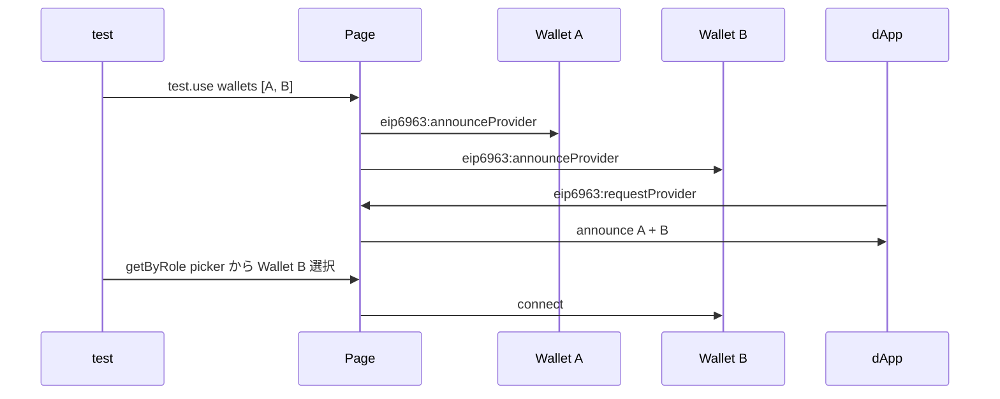

# EIP-6963 Multi-Wallet

> [🇬🇧 English](../../en/concepts/eip-6963.md) • [🇯🇵 日本語](./eip-6963.md)

## TL;DR

kiwa は EIP-6963 (Multi Injected Provider Discovery) に対応し、1 page 内に複数 wallet を inject して wagmi v2 / RainbowKit v2 の wallet picker UI で正しく検出できます。

## なぜ

実際の dApp ユーザーは MetaMask だけでなく Rabby / Coinbase Wallet / Trust などを並用しており、wallet picker UI のテストが重要です。
EIP-6963 announce/request イベントを再現することで wallet picker 経由の選択フローを E2E で検証できます。

## 仕組み

## Example

~~~ts
import { dappE2eTest } from '@kiwa/core';

const test = dappE2eTest.extend({});

test.use({
  wallets: [[
    { name: 'MetaMask', rdns: 'io.metamask', icon: 'data:,', privateKey: '0xac09...' },
    { name: 'Rabby',    rdns: 'io.rabby',    icon: 'data:,', privateKey: '0x59c6...' },
  ]],
} as never);

test('multi-wallet picker', async ({ page, dappE2e }) => {
  await dappE2e.wallets!['io.rabby'].connect();
});
~~~

## 関連

- [Fixture 設計](./fixture.md)
- [Cookbook: Multi-Wallet Test](../cookbook/multi-wallet.md)
