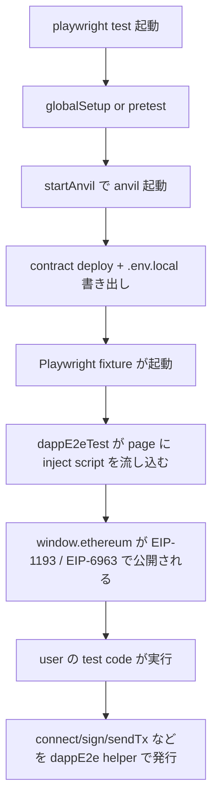

# Fixture 設計

## TL;DR

`dappE2eTest` は Playwright の `test` を拡張した fixture で、anvil 起動・wallet inject・接続フローを 1 つの単位で扱える形にまとめたものです。

## なぜ

dApp の E2E テストは「anvil 起動」「contract deploy」「wallet inject」「connect」「sign」「send tx」と多段で、毎回ボイラープレートを書くと flaky になります。
dapp-e2e は core が anvil 起動 / EIP-1193 inject / Playwright fixture 化を 1 経路で提供し、ユーザーは `page` と `dappE2e` を受け取って test を書くだけにします。

## 仕組み

## Example

~~~ts
import { dappE2eTest as test, expect } from '@dapp-e2e/core';

const customTest = test.extend({
  // 必要に応じて wallet の private key や approval mode を override
  approvalMode: 'auto',
});

customTest('connect 後に署名できる', async ({ page, dappE2e }) => {
  await page.goto('/');
  await dappE2e.connect();
  const sig = await dappE2e.personalSign('hello');
  expect(sig).toMatch(/^0x[0-9a-f]+$/);
});
~~~

## 関連

- [EIP-6963 Multi-Wallet](./eip-6963.md)
- [API Reference: dappE2eTest](../api/dapp-e2e-test.md)
