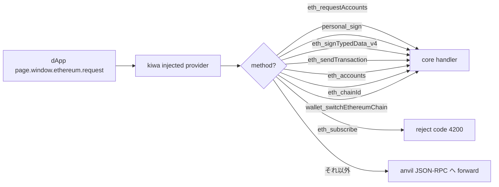

# RPC Handling

> [🇬🇧 English](../../en/concepts/rpc-handling.md) • [🇯🇵 日本語](./rpc-handling.md)

## TL;DR

kiwa core は 9 つの EIP-1193 RPC method を直接処理し、それ以外は anvil JSON-RPC へ forward します。
これにより wallet UI を再現せずに `eth_requestAccounts` や `personal_sign` などのフローを test 内で完結できます。

## なぜ

実 wallet は popup / approve UI を介して RPC を返しますが、CI ではこの UI を再現できません。
kiwa は wallet の挙動を **コード側で完結** させることで CI フレンドリーにし、`setApprovalMode('reject')` のような UX 経路も切り替えで test できるようにしています。

## 直接処理する 9 RPC

詳細は [docs/RPC.md](../../RPC.md) を参照してください。

## Example: setApprovalMode

~~~ts
test('user reject 経路', async ({ page, dappE2e }) => {
  await dappE2e.setApprovalMode('reject');
  await page.goto('/');
  await page.getByRole('button', { name: /connect/i }).click();
  await expect(page.getByTestId('error')).toContainText('User rejected'); // code 4001
});
~~~

## 関連

- [RPC.md (Reference)](../../RPC.md)
- [Cookbook: User Reject 経路](../cookbook/user-reject.md)
