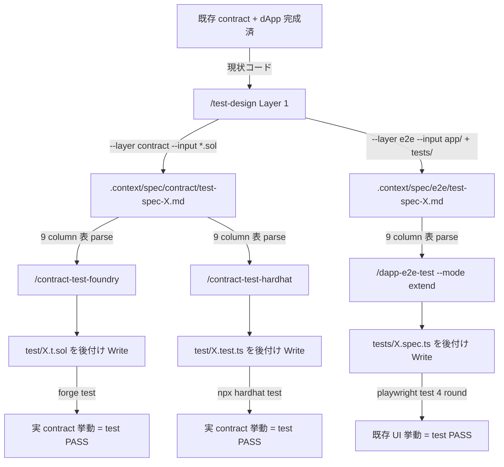

# 3 layer テスト設計 flow (Phase E 統合 cookbook)

> [🇬🇧 English](../../en/cookbook/test-design-flow.md) • [🇯🇵 日本語](./test-design-flow.md)

dapp-e2e Phase E (#171 〜 #181) で確立した「Layer 1 (テスト設計) → Layer 2 (実装変換)」chain で、 **既に動いている contract / dApp に後付けで test を導入する** 手順を documented する章。 `examples/nextjs-token-gating` の実 contract を題材に full flow を歩く。

新規 dApp 開発の TDD 経路でも使えるが、 第 1 用途は **「既存 contract / dApp に対する test 後付け導入」**。 既存実装をそのまま動作仕様として扱い、 そこから観点を逆算して test を埋める。

## 全体図



3 layer 連携の核 — **Layer 1 出力 (`.context/spec/{contract,e2e}/test-spec-{module}.md`) の 9 column 表が単一 SSOT**、 Layer 2 skill 3 種 (Foundry / Hardhat / Playwright) はこれを Read して runner 特化 helper に機械的に変換する。 後付け導入時は実コードから観点を逆算するため、 仕様書の「対象機能」 section は grep 抽出結果で埋まる。

## 完全な実例: nextjs-token-gating (既存 dApp への後付け導入)

### Step 0: 既存 contract / dApp の現状把握

`examples/nextjs-token-gating/` には以下が既に存在する。

```bash
ls examples/nextjs-token-gating/contracts/ tests/
# contracts/: GateNFT.sol + GatedContent.sol
# tests/: gating.spec.ts (既存 e2e test) + prepare-env.ts + fixture.ts
```

実 contract の関数 / error 一覧 (skill が自動で grep する内容):

```bash
grep -E "function |event |error " contracts/*.sol
# GateNFT.sol: mint() / transferFrom() / NotOwner / InvalidRecipient
# GatedContent.sol: getSecret() / grantTimedAccess(user, ttl) / hasAccess() / isGated()
#                   NotGated / InvalidTtl / Accessed / TimedAccessGranted
```

既存 test 件数:

```bash
grep -cE "^test\(|^test\.describe\(" tests/*.spec.ts
# gating.spec.ts: 8 件 (T-GT-000 〜 T-GT-007)
```

仕様書なしで実装されているため、 「contract の挙動仕様」 が docstring + 実コードに分散している状態。 ここに test 後付け導入で「挙動を明文化 + 不足観点を追加」する。

### Step 1: Layer 1 で contract 用仕様書を逆算生成

```text
/test-design --layer contract --module token-gating --input examples/nextjs-token-gating/contracts/GatedContent.sol

Layer 1 skill が以下を実施:
- 入力 .sol を Read し function / event / error を grep 抽出
- 並立 contract (GateNFT.sol) も参照 (IGateNFT interface 経由)
- 既存 docstring と実コードから「対象機能」「仕様の要約」「権限モデル」「失敗 mode」を逆算
- 5 基準で品質リスクスコア、 10 観点で適用 / 非適用を判定
- 1 ケース 1 行で 9 column 表を生成、 観点別 group + 優先度順
```

`.context/spec/contract/test-spec-token-gating.md` が生成される。 「不足している仕様」 section には docstring 不明点 (timedAccessExpiry の cleanup タイミング / 重複 grant の挙動 / max supply の有無 / pause 機能の有無) が記録される。

### Step 2: Layer 1 で e2e 用仕様書を逆算生成

```text
/test-design --layer e2e --module token-gating --input examples/nextjs-token-gating/

Layer 1 skill が以下を実施:
- 既存 tests/gating.spec.ts を Read し既存 test 8 件を「現状カバー」として把握
- contract と UI (app/page.tsx もしくは inline HTML fixture) の対応関係を抽出
- 既存 test がカバーしていない観点 (権限 partial 検証 / multi-grantee 同時失効 / self-grant bypass 等) を「新規追加 test」として記録
```

`.context/spec/e2e/test-spec-token-gating.md` が生成され、 既存 test ID (T-GT-NNN) と新規 test ID (TC-NNN) を併記。

### Step 3: Layer 2 で contract test を後付け Write (Foundry)

```text
/contract-test-foundry --module token-gating --gas-report
```

skill が以下を実施:

- `.context/spec/contract/test-spec-token-gating.md` を Read
- 観点別 grouping (1 正常系 / 2 異常系 / 3 境界値 / 4 状態遷移 / 5 権限 / 10 セキュリティ) を `// 観点 N: {name}` コメントで Solidity test 関数に変換
- 観点 3 境界値 → `testFuzz_grantTimedAccess_Boundary` (`bound(ttl, 1, 365 days)`)、 観点 4 状態遷移 → `invariant_TimedAccessExpiryNonZero` + Handler、 観点 10 セキュリティ → `test_SelfGrantBypassDefense` + `test_TransferRevokesAll_MultiGrantee`
- `test/GatedContent.t.sol` を **後付けで** Write (既存 test ファイルが無いプロジェクトなので新規作成、 ある場合は file を分けて並立)
- `forge build` で compile 確認、 `forge test --gas-report` を実行
- **test PASS** = 実 contract の現在の挙動が test の「期待結果」として正しく記録された状態
- **test FAIL** = bug 発見 (docstring と実コードのズレ、 もしくは仕様書側の誤解)

### Step 3': Layer 2 で contract test を後付け Write (Hardhat 並立)

```text
/contract-test-hardhat --module token-gating --gas-report
```

同 `.context/spec/contract/test-spec-token-gating.md` を Read し、 `test/GatedContent.test.ts` を Hardhat 形式で並列に Write。 Foundry 派 + Hardhat 派が同じ仕様書から **同 test ID で並立 test を持つ** ことができる。 観点 / ケース ID (TC-001 〜 TC-013) は両 layer で一致。

### Step 4: Layer 2 で e2e test を extend mode で後付け Write (Playwright)

```text
/dapp-e2e-test --mode extend --example nextjs-token-gating
```

skill が以下を実施:

- Step 1.5.B で `.context/spec/e2e/test-spec-token-gating.md` を Read
- 既存 test 8 件 (T-GT-000 〜 T-GT-007) を「現状カバー」として認識し regression 0 を保証
- 不足観点 (権限の partial 検証 / multi-grantee 同時失効 / self-grant bypass) を新規 test (TC-008 以降) として `tests/gating.spec.ts` に **追記**
- `pnpm test` を 4 round 連続 PASS 検証 (flaky 0 件、 既存 8 件 + 新規 N 件 = 全 PASS)

### Step 5: test pyramid の完成形

後付け導入完了時点で以下の状態:

| layer | runner | 出力 file | 観点カバー | 既存 vs 新規 |
|---|---|---|---|---|
| contract unit | Foundry | `test/GatedContent.t.sol` | 1-10 全観点 (fuzz + invariant) | 全件新規 (既存 .t.sol なし) |
| contract unit | Hardhat | `test/GatedContent.test.ts` | 1-10 全観点 (fast-check + chai) | 全件新規 (既存 .test.ts なし) |
| dApp e2e | Playwright | `tests/gating.spec.ts` | 1 / 2 / 4 / 5 / 10 | 既存 8 件 + 新規 N 件 (extend) |

既存 e2e test を破壊せず観点不足を埋め、 contract test を完全新規で追加する形。 同じ Layer 1 spec が両 layer の test ID を SSOT 同期する。

## 観点別 helper マッピング早見

3 layer × 10 観点 の helper マッピング early reference:

| 観点 | Foundry | Hardhat | Playwright |
|---|---|---|---|
| 1. 正常系 | `test_*` 通常 | `it()` + chai expect | `test()` happy path |
| 2. 異常系 | `vm.expectRevert(Error.selector)` | `revertedWithCustomError(c, 'Error')` | mock RPC error 注入 (`createRpcHandler`) |
| 3. 境界値 | `testFuzz_*` + `vm.assume` / `bound` | `fast-check` asyncProperty | parameterized `test.describe.each` |
| 4. 状態遷移 | `invariant_*` + Handler pattern | `beforeEach` state seed + `describe.each` | Playwright fixture で state seed |
| 5. 権限 | `vm.prank(role)` | `c.connect(signer)` | wallet account 切替 (`makeClients(port, OTHER_PK)`) |
| 6. 入力バリデーション | `testFuzz_*` + revert assertion | `fc.string()` + revert assertion | form `getByTestId` + assertion |
| 7. 冪等性 | 2 回 call → 2 回目 `vm.expectRevert` | 2 回 call → 2 回目 expect revert | retry test (`test.describe.serial`) |
| 8. 並行処理 | tx ordering test (`vm.warp`) | `Promise.allSettled([tx1, tx2])` | multi-tab (`context.newPage()`) |
| 9. 性能 | `forge test --gas-report` | `hardhat-gas-reporter` | Playwright trace + perf metrics |
| 10. セキュリティ | `invariant_NoReentrancy` + `vm.signature` | signature recovery + role assertion | E2E signature flow (`verifyMessage`) |

完全 reference は各 Layer 2 skill の `references/{foundry,hardhat,playwright}-mapping.md` を参照。

## 後付け導入と新規開発 (TDD) の違い

| 比較項目 | 新規開発 (TDD) | 後付け導入 (本章の主用途) |
|---|---|---|
| `/test-design` の入力 | 機能仕様書 (まだコード無し) | 既存 `.sol` / `app/` / `tests/` を `--input` で渡し grep で逆算 |
| Layer 1 の「対象機能」section | 仕様書から書き起こし | grep 抽出結果を要約 |
| Layer 1 の「不足している仕様」 | 仕様書の曖昧点を列挙 | docstring 不足 / 暗黙挙動 / 未テスト経路を列挙 |
| Layer 2 が `forge test` 実行時 | test 先行で FAIL を期待 (RED) | test 後付けで PASS を期待 (実挙動を正と記録) |
| FAIL したとき | 実装側を直す (TDD GREEN) | bug 発見 (既存挙動が想定と違うことが判明) |
| 既存 test との関係 | (なし) | `--mode extend` で既存 test 件数への regression 0 を保証 |

## 偽陽性 self-check checklist

3 layer chain で偽陽性が混入しやすい箇所と防御:

- **Layer 1 仕様の precondition 欠落** — 「前提条件」 column が `(なし)` でも、 contract state の暗黙前提 (例: NFT 既保有が前提の grant) が抜けると Layer 2 で「state が壊れて test PASS」する。 Layer 1 で `(なし)` 明記時は意図的かを確認
- **Layer 2 parser miss (column shift)** — 9 column 表の column 順序が SSOT (`docs/SKILL-DESIGN.ja.md` Step 4) と一致しないと Layer 2 が違う column を観点に解釈する。 commit 前に必ず `grep -c "テスト ID | テストレベル | テスト観点"` で 9 column header を確認
- **観点 5 権限の partial 検証** — `hasAccess(user)` だけ確認し grantor / msg.sender 経路を叩かないと self-grant bypass を素通り。 全エントリポイント (grantor / grantee / 第三者) を必ず叩く
- **観点 4 状態遷移の time-warp 副作用** — Foundry の `vm.warp` で進めた時間が次 test に残ると flaky 化、 Hardhat の `time.increaseTo` も同様。 setUp で fixture を loadFixture / snapshotChain で復元
- **並列実行時の race** — 観点 8 で `Promise.all` を `Promise.allSettled` に置換 (1 件 reject で全体 reject にならないようにする)、 Foundry は同期実行で並行 race 自体存在しない
- **後付け導入で実挙動を正としすぎる罠** — `forge test` が PASS しても「実 contract に bug があり、 その bug を test も含めて固定化した」可能性が残る。 Layer 1 の「主な品質リスク」 section と spec author 確認で「実挙動 = 仕様」かをレビューする

詳細 9 種 + self-check 5 問は `.claude/skills/dapp-e2e-test/references/adversarial-pitfalls.md` を Read。

## 関連 link

- 親 spec (Phase E SSOT): [`docs/SKILL-DESIGN.ja.md`](../../SKILL-DESIGN.ja.md)
- Layer 1: [.claude/skills/test-design/SKILL.md](../../../.claude/skills/test-design/SKILL.md)
- Layer 2 Foundry: [.claude/skills/contract-test-foundry/SKILL.md](../../../.claude/skills/contract-test-foundry/SKILL.md)
- Layer 2 Hardhat: [.claude/skills/contract-test-hardhat/SKILL.md](../../../.claude/skills/contract-test-hardhat/SKILL.md)
- Layer 2 Playwright: [.claude/skills/dapp-e2e-test/SKILL.md](../../../.claude/skills/dapp-e2e-test/SKILL.md)
- 関連 cookbook 章: [snapshot-revert.md](./snapshot-revert.md) (Layer 1 / Layer 2 で snapshot pattern を共有)、 [custom-error-revert.md](./custom-error-revert.md) (観点 2 異常系 helper)
