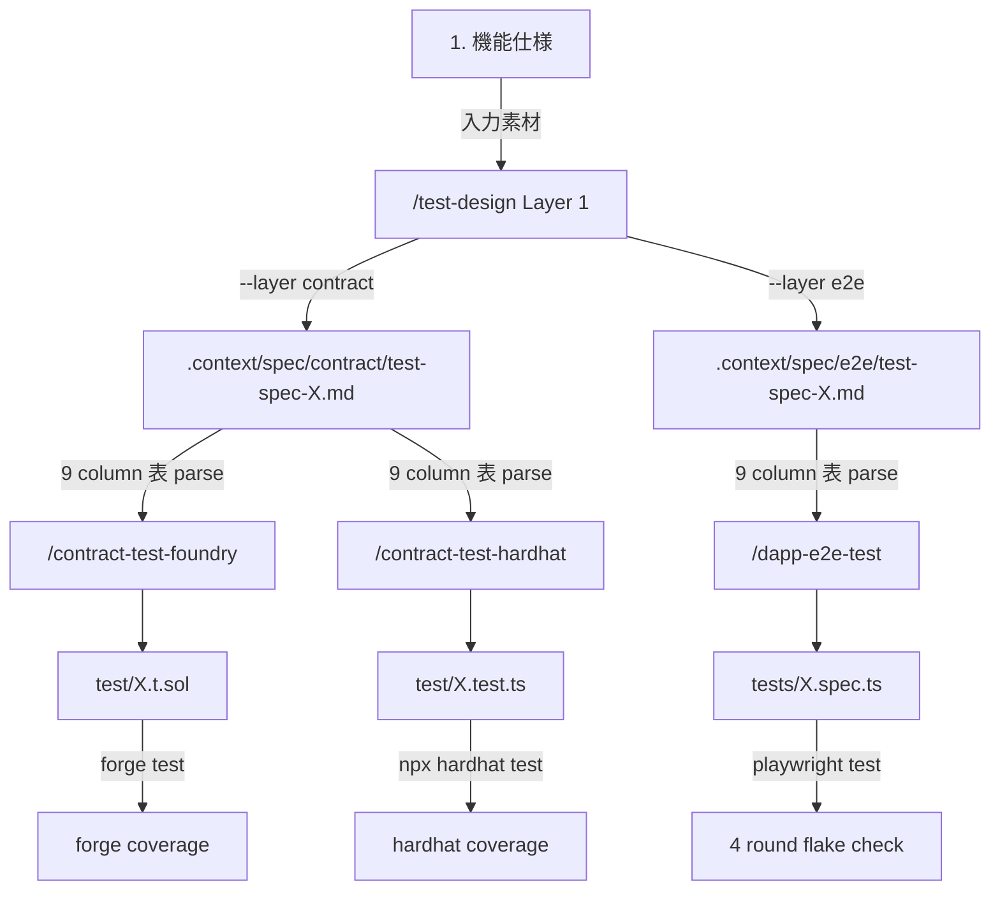

# 3 layer テスト設計 flow (Phase E 統合 cookbook)

> [🇬🇧 English](../../en/cookbook/test-design-flow.md) • [🇯🇵 日本語](./test-design-flow.md)

dapp-e2e Phase E (#171 〜 #180) で確立した「Layer 1 (テスト設計) → Layer 2 (実装変換)」chain で contract test (Foundry / Hardhat) と dApp e2e test (Playwright) を 1 つの仕様書から生成する手順を documented する章。 mint-nft example を題材に full flow を歩く。

## 全体図



3 layer 連携の核 — **Layer 1 出力 (`.context/spec/{contract,e2e}/test-spec-{module}.md`) の 9 column 表が単一 SSOT**、 Layer 2 skill 3 種 (Foundry / Hardhat / Playwright) はこれを Read して runner 特化 helper に機械的に変換する。

## 完全な実例: mint-nft (Phase E full chain)

### Step 0: 機能仕様 (入力素材)

`examples/mint-nft/contracts/MintableNFT.sol` の `mint()` / `transfer()` / `burn()` を題材とする。 1 NFT = 0.01 ETH で誰でも mint 可能、 max supply = 10000、 owner のみ burn 可能。

### Step 1: Layer 1 で仕様書生成 (contract 用)

```text
/test-design --layer contract --module mint-nft

入力情報:
- 対象機能 = MintableNFT.mint() / transfer() / burn() (3 function)
- contract = examples/mint-nft/contracts/MintableNFT.sol
- 失敗 mode = msg.value < 0.01 ETH → InvalidFee / maxSupply 到達 → MaxSupplyExceeded / owner check failed → NotOwner
```

`.context/spec/contract/test-spec-mint-nft.md` が 9 section + 9 column 表で生成される (内容は `/test-design` skill が SSOT に従って自動生成)。

### Step 2: Layer 1 で仕様書生成 (e2e 用)

```text
/test-design --layer e2e --module mint-nft

入力情報:
- 対象機能 = mint-nft の UI flow (Connect → Mint button → tokenId 表示 → Transfer button)
- 対象 file = examples/mint-nft/app/page.tsx + tests/mint.spec.ts
- 失敗 mode = wallet reject / RPC timeout / pause 中の操作
```

`.context/spec/e2e/test-spec-mint-nft.md` が同じく 9 section + 9 column 表で生成。

### Step 3: Layer 2 で contract test 実装 (Foundry)

```text
/contract-test-foundry --module mint-nft --gas-report
```

skill が以下を実施:
- `.context/spec/contract/test-spec-mint-nft.md` を Read
- 観点別 grouping (1 正常系 / 2 異常系 / 3 境界値 ...) を `// 観点 N: {name}` コメントで Solidity test 関数に変換
- 観点 3 境界値 → `testFuzz_*` (vm.assume / bound)、 観点 4 状態遷移 → `invariant_*` + Handler、 観点 10 セキュリティ → reentrancy attacker + signature recovery
- `test/MintableNFT.t.sol` を Write
- `forge test --gas-report` を実行 → 全関数 PASS + gas 測定
- `forge coverage --report summary` で line coverage 評価 (default 80% threshold)

### Step 3': Layer 2 で contract test 実装 (Hardhat 並立、 同 spec を消費)

```text
/contract-test-hardhat --module mint-nft --gas-report
```

skill が以下を実施:
- 同 `.context/spec/contract/test-spec-mint-nft.md` を Read
- 観点別 grouping を `describe('観点 N: {name}', ...)` で TypeScript test に変換
- 観点 3 → `fast-check` asyncProperty、 観点 4 → `loadFixture` + `describe.each(states)`、 観点 10 → `signTypedData` + reentrancy attacker
- `test/MintableNFT.test.ts` を Write
- `npx hardhat test` を実行 → 全 it block PASS
- `npx hardhat coverage` で line coverage 評価

両 skill が **同じ Layer 1 spec を Read** することで、 Foundry 派と Hardhat 派が同じ test 仕様を共有できる。 観点 / ケース ID (TC-001 等) は両 layer で一致。

### Step 4: Layer 2 で e2e test 実装 (Playwright)

```text
/dapp-e2e-test --mode new --example mint-nft
```

skill が以下を実施:
- Step 1.5.B で `.context/spec/e2e/test-spec-mint-nft.md` を Read
- 観点別 grouping を `test.describe('観点 N: {name}', ...)` で Playwright test に変換
- 観点 1 正常系 → `test('TC-001 mint and display tokenId')`、 観点 10 セキュリティ → wallet signature verify
- `tests/mint.spec.ts` + `tests/prepare-env.ts` を Write
- `pnpm test` を 4 round 連続 PASS 検証 (flaky 0 件確認)

### Step 5: 全 layer の coverage 統合

最終的に以下の状態で test pyramid が完成:

| layer | runner | 出力 file | 観点カバー |
|---|---|---|---|
| contract unit | Foundry | `test/MintableNFT.t.sol` | 1-10 全観点 (fuzz + invariant + reentrancy) |
| contract unit | Hardhat (並立) | `test/MintableNFT.test.ts` | 1-10 全観点 (fast-check + chai matchers) |
| dApp e2e | Playwright | `tests/mint.spec.ts` | 1 (正常系) / 2 (異常系) / 4 (状態遷移) / 5 (権限) / 10 (セキュリティ) |

contract 単体テストで 1-10 全観点を高速 fuzz / invariant で潰し、 e2e で UI 経路 (wallet inject / button click → contract → state 反映) を覆う形。 同じ Layer 1 spec が両 layer の test ID を SSOT 同期する。

## 観点別 helper マッピング早見

3 layer × 10 観点 の helper マッピング early reference:

| 観点 | Foundry | Hardhat | Playwright |
|---|---|---|---|
| 1. 正常系 | `test_*` 通常 | `it()` + chai expect | `test()` happy path |
| 2. 異常系 | `vm.expectRevert(Error.selector)` | `revertedWithCustomError(c, 'Error')` | mock RPC error 注入 (`createRpcHandler`) |
| 3. 境界値 | `testFuzz_*` + `vm.assume` / `bound` | `fast-check` asyncProperty | parameterized `test.describe.each` |
| 4. 状態遷移 | `invariant_*` + Handler pattern | `beforeEach` state seed + `describe.each` | Playwright fixture で state seed |
| 5. 権限 | `vm.prank(role)` | `c.connect(signer)` | wallet account 切替 (`makeClients(port, OTHER_PK)`) |
| 6. 入力バリデーション | `testFuzz_*` + revert assertion | `fc.string()` + revert assertion | form `getByTestId` + assertion |
| 7. 冪等性 | 2 回 call → 2 回目 `vm.expectRevert` | 2 回 call → 2 回目 expect revert | retry test (`test.describe.serial`) |
| 8. 並行処理 | tx ordering test (`vm.warp`) | `Promise.allSettled([tx1, tx2])` | multi-tab (`context.newPage()`) |
| 9. 性能 | `forge test --gas-report` | `hardhat-gas-reporter` | Playwright trace + perf metrics |
| 10. セキュリティ | `invariant_NoReentrancy` + `vm.signature` | signature recovery + role assertion | E2E signature flow (`verifyMessage`) |

完全 reference は各 Layer 2 skill の `references/{foundry,hardhat,playwright}-mapping.md` を参照。

## 偽陽性 self-check checklist

3 layer chain で偽陽性が混入しやすい箇所と防御:

- **Layer 1 仕様の precondition 欠落** — 「前提条件」 column が `(なし)` でも、 contract state の暗黙前提 (例: NFT 既保有が前提の grant) が抜けると Layer 2 で「state が壊れて test PASS」する。 Layer 1 で `(なし)` 明記時は意図的かを確認
- **Layer 2 parser miss (column shift)** — 9 column 表の column 順序が SSOT (`docs/SKILL-DESIGN.ja.md` Step 4) と一致しないと Layer 2 が違う column を観点に解釈する。 commit 前に必ず `grep -c "テスト ID | テストレベル | テスト観点"` で 9 column header を確認
- **観点 5 権限の partial 検証** — `hasAccess(user)` だけ確認し grantor / msg.sender 経路を叩かないと self-grant bypass を素通り。 全エントリポイント (grantor / grantee / 第三者) を必ず叩く
- **観点 4 状態遷移の time-warp 副作用** — Foundry の `vm.warp` で進めた時間が次 test に残ると flaky 化、 Hardhat の `time.increaseTo` も同様。 setUp で fixture を loadFixture / snapshotChain で復元
- **並列実行時の race** — 観点 8 で `Promise.all` を `Promise.allSettled` に置換 (1 件 reject で全体 reject にならないようにする)、 Foundry は同期実行で並行 race 自体存在しない

詳細 9 種 + self-check 5 問は `.claude/skills/dapp-e2e-test/references/adversarial-pitfalls.md` を Read。

## 関連 link

- 親 spec (Phase E SSOT): [`docs/SKILL-DESIGN.ja.md`](../../SKILL-DESIGN.ja.md)
- Layer 1: [.claude/skills/test-design/SKILL.md](../../../.claude/skills/test-design/SKILL.md)
- Layer 2 Foundry: [.claude/skills/contract-test-foundry/SKILL.md](../../../.claude/skills/contract-test-foundry/SKILL.md)
- Layer 2 Hardhat: [.claude/skills/contract-test-hardhat/SKILL.md](../../../.claude/skills/contract-test-hardhat/SKILL.md)
- Layer 2 Playwright: [.claude/skills/dapp-e2e-test/SKILL.md](../../../.claude/skills/dapp-e2e-test/SKILL.md)
- 関連 cookbook 章: [snapshot-revert.md](./snapshot-revert.md) (Layer 1 / Layer 2 で snapshot pattern を共有)、 [custom-error-revert.md](./custom-error-revert.md) (観点 2 異常系 helper)
