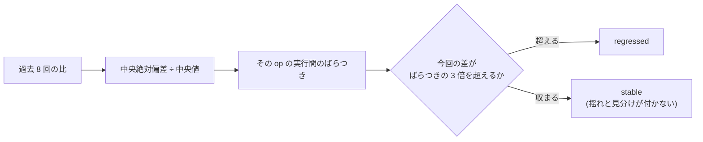

# Perf thresholds — SSOT

## Why this file exists

The previous perf-harness rollout (v1.13-1 / v1.14-1) picked p95 thresholds by feel — `20ms` for realtime, `40ms` for AI-LLM mocks, `50ms` for dogfood adapter joins. Those numbers had no external justification, so a passing report proved nothing beyond "the mock is not catastrophically slow".

This doc pins **every** perf threshold in kiwa to one of three grounded rationales:

1. **Provider SLA** — the third-party API kiwa mocks documents its own p99 latency. The kiwa threshold sits at or under that so a passing mock behaves at least as fast as the real thing.
2. **Human-perception target** — for user-facing SaaS surfaces (chat, cursor, notification), Jakob Nielsen's classic thresholds apply: 100 ms feels instant, 1 s keeps flow, 10 s loses users. Kiwa targets the strictest applicable band.
3. **Mock-invariant** — a mock is in-memory code. Its perf floor is the JS engine's own event-loop tick + heap allocation cost. When a mock's p95 exceeds this floor by more than one order of magnitude, something is architecturally wrong (e.g. accidentally awaiting a promise chain per call). Kiwa targets < 10 × the JS floor.

## Threshold table

| Target | Op | p95 threshold | Rationale |
|---|---|---|---|
| `@kiwa-lab/quality-metrics` | `evaluateReleaseGate` | 5 ms | mock-invariant (pure calculation, one heap object per call) |
| `@kiwa-lab/quality-metrics` | `diffReports` | 5 ms | mock-invariant |
| `@kiwa-lab/ai-llm` | `anthropic.messages.create` (mock) | 40 ms | provider SLA — Anthropic Messages p95 non-streaming is ~600ms; mock must be < 10 % of live so tests do not become the bottleneck |
| `@kiwa-lab/ai-llm` | `openai.chat.completions.create` (mock) | 40 ms | provider SLA — OpenAI Chat Completions p95 is ~500-1200ms depending on model; same 10 % rule |
| `@kiwa-lab/ai-llm` | `vercel.generateText` (mock) | 40 ms | provider SLA — proxies to Anthropic / OpenAI, same target |
| `@kiwa-lab/ai-llm` | `langchain.invoke` (mock) | 40 ms | provider SLA — same |
| `@kiwa-lab/realtime` | `supabase.channel.track` (mock) | 20 ms | mock-invariant (channel registry lookup + presence Map insert) |
| `@kiwa-lab/realtime` | `ably.channel.publish` (mock) | 20 ms | mock-invariant |
| `@kiwa-lab/realtime` | `pusher.subscribeChannel` (mock) | 20 ms | mock-invariant |
| `@kiwa-lab/realtime` | `socketio.emit` (mock) | 20 ms | mock-invariant |
| `@kiwa-lab/payment` | `signWebhook` (mock) | 10 ms | mock-invariant (HMAC-SHA256 over ~500 bytes is < 1 ms on modern hardware) |
| `@kiwa-lab/payment` | `verifyWebhook` (mock) | 10 ms | mock-invariant |
| `@kiwa-lab/search` | `search` on 20-doc index (mock) | 5 ms | mock-invariant (linear scan over 20 docs) |
| `dogfood-anthropic-chatbot` | `reply` (mock mode) | 30 ms | mock-invariant + one @kiwa-lab/ai-llm call ⇒ threshold matches ai-llm + adapter overhead budget |
| `dogfood-anthropic-chatbot` | `replyStream` (mock mode) | 50 ms | mock-invariant + streaming chunk fan-out (~5 chunks) ⇒ 5 × single-call budget |
| `dogfood-anthropic-chatbot` | `toolLoop` (mock mode) | 100 ms | mock-invariant + tool loop up to 5 iterations |
| `dogfood-openai-tool-agent` | `validateToolSchemas` | 50 ms | mock-invariant (JSON Schema validate over 3 tools) |
| `dogfood-openai-tool-agent` | `runToolLoop` | 100 ms | tool loop up to 5 iterations, matches Anthropic loop budget |
| `dogfood-openai-tool-agent` | `runParallelToolCall` | 100 ms | 2 parallel tools + finaliser turn |
| `dogfood-vercel-ai-rag` | `embed` (mock) | 20 ms | mock-invariant (hashing embedder) |
| `dogfood-vercel-ai-rag` | `retrieve` (mock) | 30 ms | mock-invariant + cosine similarity over ~5 docs |
| `dogfood-vercel-ai-rag` | `answer` (mock) | 100 ms | retrieve + LLM call budget |
| `dogfood-supabase-realtime-chat` | `joinRoom` | 50 ms | Nielsen "instant" — chat presence must feel snappy |
| `dogfood-supabase-realtime-chat` | `sendMessage` | 30 ms | Nielsen "instant" tightened — message send is on the critical hot path |
| `dogfood-supabase-realtime-chat` | `getPresence` | 30 ms | Nielsen "instant" |
| `dogfood-supabase-realtime-chat` | `sendTyping` | 100 ms | typing debounce absorbs 500 ms; single-call p95 has more headroom |
| `dogfood-ably-collab-cursor` | `joinBoard` | 50 ms | Nielsen "instant" |
| `dogfood-ably-collab-cursor` | `moveCursor` | 100 ms | 60 fps throttle window is 16 ms; single call inside the throttle allowed 100 ms because it burst-fires |
| `dogfood-ably-collab-cursor` | `rewindHistory` | 30 ms | in-memory ring buffer scan |
| `dogfood-ably-collab-cursor` | `getPresence` | 30 ms | Nielsen "instant" |
| `dogfood-socketio-notification` | `subscribeRoom` | 50 ms | Nielsen "instant" |
| `dogfood-socketio-notification` | `deliverNotification` | 30 ms | Nielsen "instant" |
| `dogfood-socketio-notification` | `getPending` | 30 ms | Nielsen "instant" |
| `dogfood-socketio-notification` | `simulateReconnect` | 100 ms | reconnect ceremony (disconnect + queue drain + reconnect) |
| `@kiwa-lab/core` | `parseSpec` | 5 ms | mock-invariant (linear scan over meta lines + one table walk) |
| `@kiwa-lab/core` | `createPool` (size 4) | 5 ms | mock-invariant (Promise.all fan-out over 4 acquires + one borrow/release) |
| `@kiwa-lab/dapp` | `eventEmitterEmit` | 5 ms | mock-invariant (node:events dispatch + listener count) |
| `@kiwa-lab/dapp` | `anvilKeyLookup` | 5 ms | mock-invariant (readonly array indexing) |
| `@kiwa-lab/api` | `requestClientGet` | 5 ms | mock-invariant (url join + Response snapshot with stub fetcher) |
| `@kiwa-lab/api` | `requestClientPost` | 5 ms | mock-invariant (adds JSON.stringify encode over the GET path) |
| `@kiwa-lab/ui` | `setupComponentEnvSnapshot` | 30 ms | jsdom mount + React render + innerHTML capture — the lightest UI test path |
| `@kiwa-lab/ui` | `setupComponentEnvRender` | 30 ms | same jsdom + React mount cost baseline as snapshot |
| `@kiwa-lab/data` | `queueSend` | 5 ms | mock-invariant (dedup Set lookup + array push + consumer notify) |
| `@kiwa-lab/data` | `fakeClockAdvance` | 5 ms | mock-invariant (walk 2-entry cron table + fire due callbacks) |
| `@kiwa-lab/cli-test` | `writeFile` | 20 ms | fs write syscall + relative path resolution over an isolated tempdir |
| `@kiwa-lab/cli-test` | `readFile` | 10 ms | fs read syscall over an isolated tempdir |
| `@kiwa-lab/observability` | `collectRunHistory` | 5 ms | O(N) walk + per-test cap map over 200 records |
| `@kiwa-lab/observability` | `detectFlaky` | 5 ms | O(N) aggregation over 200 records |
| `@kiwa-lab/observability` | `checkThresholds` | 5 ms | mock-invariant (fixed 4-metric compare) |
| `@kiwa-lab/observability` | `renderDashboard` | 5 ms | markdown string concat over a 200-record summary |
| `@kiwa-lab/e2e` | `fetchOverLoopback` | 20 ms | node http server dispatch + fetch-handler adapter over loopback (no network) |
| `@kiwa-lab/cli` | `runSpecToTest` | 20 ms | md read + parseSpec + template render + file write |

## Measurement isolation — the suite runs one package at a time

Root `package.json > scripts.test:perf` runs the workspace pass with `--workspace-concurrency=1`. It must never use `--parallel`.

`--parallel` means "no concurrency limit", so the root script used to start the perf suites of every workspace package that has a `test:perf` script at once — 177 packages (63 under `packages/`, 114 under `examples/`), not the 63 the name suggests. Every measurement then competes for the same cores, and p95 moves with the load of whatever else happened to be running rather than with the code under test. That is the reason the same commit produced different verdicts on consecutive runs, and it makes every downstream mechanism in this file dishonest: the 20 % regression rule compares against a baseline recorded under a different amount of contention, and the concurrent-load target below stops measuring the mock's own shared state.

Dropping `--parallel` alone is not enough. Without it pnpm still defaults to one worker per CPU core, so the numeric limit is written explicitly.

The trade-off is wall-clock time: a serial pass over all 177 packages took 8-22 minutes across the seven passes measured in #1708, against a few minutes when they ran concurrently. That is accepted deliberately — the suite exists to produce comparable numbers, not to finish quickly. `tests/release-smoke/tests/perf-serial-execution.test.ts` fails the release smoke suite if the flag comes back.

## Regression detection defaults

Threshold: **20 % delta in the op's p10 relative to a reference op measured in the same run**, compared against the stored baseline (`.perf-baseline/{module}.json`), with a bootstrap confidence interval on the difference for significance (CI excluding 0 ⇒ significant).

- baseline is created automatically on the first run (no `--baseline` flag needed since v1.14-post)
- subsequent runs compare against baseline; a > 20 % increase with a significant CI fails the gate
- the difference must also clear an absolute floor derived from the measurement system itself (see below). A relative-only rule gets stricter as the measured value shrinks: 0.03 ms → 0.04 ms is a "significant 33 % regression" on stable samples, yet nothing is actually slower. Ops measured in microseconds would fail on jitter alone.
- what is compared is a ratio, not a duration. Each op is measured alternating call-by-call with a harness-owned reference op, and the baseline records that reference's p10 alongside the op's own. See § In-run normalization.

### Why the verdict reads the bottom of the distribution

Every source of measurement noise — a scheduler preemption, a GC pause, a page-cache miss, another process on the machine — makes a call take **longer**. None make it shorter. So the top of the distribution measures the machine's state on the day, and the bottom measures what the work costs when nothing interferes. Only the second one can be compared across runs.

That is why the p95-based verdict flipped on unchanged code. Measuring the same implementation repeatedly and comparing the two ends:

| op | p95 spread | p10 spread |
|---|---|---|
| `@kiwa-lab/cli-test` `readFile` | 134 % | 6 % |
| `@kiwa-lab/cli-test` `writeFile` | 289 % | 12 % |
| a trivial property read | 18 % | 51 %¹ |
| `JSON.parse(JSON.stringify(…))` | 101 % | 8 % |

¹ The trivial op sits below the harness's own call cost, so both figures are noise around the timer quantum. That case is handled by the floor, not by the statistic.

`min` was rejected in favour of `p10`: a minimum is decided by a single sample, so it is exposed to the timer quantum and to one lucky call. At n = 200, p10 has twenty samples of depth behind it.

Three alternatives from the same measurement round were rejected. **Batching** (making one sample the mean of B calls, with B calibrated so a sample lands near 1 ms) did not converge — `fsWrite` still moved 136 % at the p50 of batched samples, because the per-call cost itself differs between processes. **Median / trimmed mean** of raw samples moved 115-200 % and 147-256 % on the same ops. **Measurement of measurements** (median of five sub-run p95s) moved 210-517 %.

### The absolute floor is measured, not fixed

The floor is no longer the fixed 0.5 ms. Before the ops run, `measureHarnessResolution` times an empty function through the same call path (`async () => { await empty(); }`) and takes its p10. A difference smaller than that is not attributable to the op — it is the harness's own round trip. The floor is set at **twice** that value (`RESOLUTION_FLOOR_MULTIPLE`).

The multiplier is load-bearing. `@kiwa-lab/cache`'s env accessors measure 0.00013 ms, which is *faster* than the empty call's 0.00017 ms. With the floor at exactly the resolution, one of four unchanged runs moved p10 to 0.00033 ms and the 0.0002 ms difference cleared the floor, producing `regressed`. At twice the resolution it does not. The deliberate-slowdown check still passes: injecting three times the baseline p95 into one op produces a 0.0034 ms shift, ten times the floor.

The fixed floor was doing real damage. It made every op with a baseline under 0.5 ms permanently unjudgeable, which was the whole of `cache`, `dapp`, `api`, and `data`. On this machine the measured floor lands near 0.0003 ms, roughly three orders of magnitude lower, so those ops became judgeable for the first time.

### In-run normalization

The verdict does not read the op's duration. It reads the op's duration **divided by a reference op measured in the same run**, alternating call by call.

Four statistics over a single run's samples — p95, p10, median, trimmed mean — were tried and none removed the run-to-run spread; it tracks *when* the measurement was taken rather than the shape of the sample (§ The regression verdict is gated by default records the sweep that established this). A drift the whole run inherits cancels in a ratio, because the numerator and the denominator inherit it together.

What is stored is still a duration. `MeasureResult.reference` carries the reference's kind and its p10, and the comparison multiplies the current measurement by `baseline reference p10 ÷ current reference p10` before comparing against the stored baseline. That is arithmetically the same as comparing the two ratios, but the judged quantity stays in milliseconds, so the absolute floor and every number in the report keep the meaning they had. The reference's own samples are not stored — only the kind, the implementation version, and the one value that acts as the denominator. That keeps the addition to a few dozen bytes per op rather than another array of samples; the whole tracked set went from 2.9 MB to 3.0 MB. Storing the reference's samples would have tripled it.

The implementation version is load-bearing. `cpu` stays `cpu` if `CPU_ROUNDS` changes, so without a version a retuned reference would silently halve or double every stored denominator and report the difference as a code change. A record whose version differs from the current one is not compared; it is replaced.

Both sides must carry a reference of the same kind or no comparison happens: the op reports `n/a` with the reason, and the stored entry is rewritten in that same run **provided the run is itself valid** — a run that cannot call GC, or in which any op breached a cap, writes nothing at all, so the same op is uncomparable again next time. The report says which of the two happened. Falling back to comparing raw durations would silently reintroduce exactly the drift this exists to remove, and nothing in the report would say so.

#### The reference has to share the disturbance

`scripts/reference-op-probe.mjs` measures each candidate. Eight passes, each in its own process, with background load (six CPU-spinning, fs-churning processes) during half of them — the point is to move the machine's state between passes, since a probe run on an idle machine cannot show whether run-to-run drift cancels.

Each cell is `raw spread → ratio spread` for that pairing. The raw figure differs between columns because the target is re-measured alongside each candidate, at a different point in the pass:

| target op | ÷ empty call | ÷ cpu | ÷ fs-read | ÷ fs-write | ÷ fs read+write |
|---|---|---|---|---|---|
| fs read (`cli-test` `readFile` shape) | 84 → 41 % | 170 → 171 % | 135 → **17 %** | 306 → 51 % | 198 → 28 % |
| fs write (`cli-test` `writeFile` shape) | 183 → 73 % | 270 → 313 % | 127 → 75 % | 123 → **32 %** | 177 → 37 % |
| 20 consecutive writes (`file_scaffold_workflow` shape) | 365 → 171 % | 332 → 379 % | 322 → 62 % | 63 → **15 %** | 208 → 46 % |
| 2 ms of arithmetic | 16 → 163 % | 16 → **8 %** | 12 → 175 % | 4 → 172 % | 3 → 242 % |
| `JSON.parse(JSON.stringify(…))` | 170 → 38 % | 20 → **10 %** | 200 → 124 % | 61 → 67 % | 204 → 69 % |
| a trivial property read | 98 → 98 % | 2 → 18 % | 248 → 78 % | 196 → 138 % | 296 → 82 % |

Matching the kind is the whole mechanism. A CPU reference against an fs op leaves the spread where it was or worse (`170 → 171 %` on the read-shaped op, `270 → 313 %` on the write-shaped one), and an fs reference against a CPU op makes it far worse (`12 → 175 %`). Read the two numbers in a cell as a pair — comparing the raw figure of one column against the ratio of another is not a comparison, because the target was re-measured for each column. Read and write are worth separating too: the read-shaped op lands at 17 % against `fs-read` and 51 % against `fs-write`.

So each op declares a kind — `referenceKind: 'cpu' | 'fs-read' | 'fs-write'`, default `cpu` — and the harness owns the reference implementations. Callers do not pass a reference function. If they could, each op would pick the denominator that flatters it and the stored ratios would stop being comparable between ops. What the measurement says has to be chosen from is the *kind*, not the code.

The measured effect on the ops this was built for, six consecutive runs of `pnpm --filter @kiwa-lab/cli-test exec vitest run -c vitest.perf.config.ts` after the baseline was reseeded:

| op | reference | raw p10 spread | ratio spread |
|---|---|---|---|
| `cli-test` `readFile` | `fs-read` | 25 % | **9 %** |
| `cli-test` `writeFile` | `fs-write` | 20 % | **11 %** |
| `cli-test-app-scenario` `file_scaffold_workflow` | `fs-write` | 77 % | **9 %** |
| `cli-test-app-scenario` `setup_cleanup_cycle` | `fs-write` | 27 % | **17 %** |
| `cli-test-app-scenario` `batch_cli_run` | `cpu` | 28 % | 41 % |

#### What was rejected, and what it measured

**A reference declared as a function by the caller.** Rejected on the evidence above: what has to match is the kind of disturbance, and a fixed set of kinds delivers that. A per-op function additionally makes the stored ratio meaningless across ops, and there are 492 ops to maintain.

**The empty call already measured for the floor** (`measureHarnessResolution`). Rejected: at ~0.0002 ms it sits at the timer quantum and its own run-to-run spread is 83 %, so the ratio reports the denominator's noise rather than the op's. The `÷ empty call` column above is what that looks like — a 2 ms arithmetic op goes from 16 % to 163 %.

**Per-call ratios** — pairing each call with its adjacent reference call, `p10({tᵢ / refᵢ})`, instead of `p10(t) / p10(ref)`. Rejected: measured worse in every row of the same probe, sometimes catastrophically. Dividing two noisy numbers per call puts the reference's unlucky calls into the *bottom* of the ratio distribution, which is exactly where the verdict reads. The 2 ms arithmetic op measured 14 % against a CPU reference this way but 754-6281 % against the fs references, against 8 % / 172-242 % for the ratio of p10s.

**A combined read+write fs reference.** Rejected: never the best column for any target (28 % where `fs-read` gives 17 %, 37 % where `fs-write` gives 32 %, 46 % where `fs-write` gives 15 %). It costs two syscalls per call to be worse than either half.

**A child-process reference for `batch_cli_run`.** Not added. The op spawns five processes per iteration and no existing kind shares that disturbance — `cpu` measured 28 → 41 % and `fs-write` measured 13 → 20 %, both worse than the raw value. A reference that spawned a process would cost milliseconds per call against an op measured 200 times, adding seconds per op across the suite, and it would serve one op. The op keeps its `regressionGateWaived`; the honest reading is that this mechanism does not cover process-spawn workloads.

#### What it fixed, and what it did not

Measured over the whole suite: one reseeding pass followed by three analysis passes across all 177 packages, every analysis pass comparing against the same reseeded baseline. Each pass ran 7-11 minutes.

The run-level drift is gone. **The median change in ratio across all 492 ops is 0.0 % in every pass** — the thing that made whole runs read systematically slow against their baseline no longer happens. That was the failure this mechanism was built for.

A per-op residual remains, and it is what the distribution looks like after the shared part is removed:

| | pass A | pass B | pass C |
|---|---|---|---|
| median ratio change | 0.0 % | 0.0 % | 0.0 % |
| 10th / 90th percentile | -4.3 % / +16.7 % | -7.9 % / +19.8 % | -7.5 % / +9.6 % |
| ops moving more than 20 % | 44 | 71 | 30 |
| ops reported `regressed` on unchanged code | 27 | 38 | 13 |
| packages that would fail with the gate on | 22 | 29 | 0¹ |

¹ Pass C ran with the gate off, so the count is of `regressed` rows rather than of failures; 13 rows across 12 packages.

112 ops exceeded 20 % in at least one pass. **85 of them did so in exactly one, 21 in two, and 6 in all three.** An op that changes places between passes is showing its own run-to-run variation, not something the machine did to every op at once — which is exactly the part no reference can cancel.

Sample count explains part of it and not the rest — 14 % of ops with more than 150 iterations exceeded 20 %, against 24 % of ops with 20 or fewer. Raising iteration counts was already measured and reverted in #1708, because at higher counts some ops grow in cost and breach caps they had passed.

Verdict agreement between passes is **440, 458 and 444 out of 492** for the three pairings, and **425 / 492** across all three at once. One pairing clears the 450 that #1737 set as its target and the other two do not, which is the same lesson as the four-pass selection above: a number taken from one pairing is a number about that pairing.
- baselines are discarded and reseeded when the measurement premise changes (Node version, platform, CPU, or whether `--expose-gc` was available). Comparing across those boundaries reports regressions that no code change caused. The first valid run under the new premise reseeds; comparison resumes from the run after that. A run that is not itself valid — `requireGc: true` with no GC available, or one that fails a hard cap — leaves the stored baseline untouched, so a broken environment cannot become the new reference.
- to intentionally accept the new baseline (e.g. after a deliberate optimisation regression), delete `.perf-baseline/{env-profile}/{module}.json` (some modules sit under a layer directory, e.g. `.perf-baseline/{env-profile}/saas/{module}.json`) and rerun

### Where baselines live

All baselines sit in `.perf-baseline/` **at the repo root**, and they are tracked in git.

The path used to be derived from `process.cwd()`, so the same module wrote to `packages/{name}/.perf-baseline/` when invoked through `pnpm --filter`, and to `<root>/.perf-baseline/` when invoked from the repo root. Each invocation only ever read one of the two, decided there was no baseline, and reseeded — so a comparison never happened. The path is now anchored to the nearest ancestor holding `pnpm-workspace.yaml` or `.git`. A standalone consumer of the package outside a repo still falls back to the working directory.

They are tracked because an untracked baseline means the first run on any checkout has nothing to compare against. "Whoever measures first cannot detect a regression" is not a property worth keeping.

That help is limited to machines matching the one that recorded them. `isComparableEnv` requires the same Node version, platform, CPU model and core count, so a different machine gets no comparison on its first run and reseeds locally.

Baselines therefore live under a directory naming the environment that produced them:

```
.perf-baseline/
  darwin-arm64--apple-m4-pro-43c7d7--node24/
    cache.json
    ...
```

The name carries platform, CPU model, and Node **major**. Including the patch version would produce a new directory on every Node upgrade; core count is left out because it moves with load and container allocation on the same machine.

**The directory name and the comparison rule are separate things.** The directory only has to be coarse enough that two machines never write to the same file. `isComparableEnv` is what decides whether a stored measurement can be compared, and it stays strict: exact Node version, platform, CPU model, and core count. A Node patch changes V8's optimisation decisions, and a core count below the fixed concurrency (10 serial, 20 for app scenarios) puts workers in a queue — both move the numbers.

When they disagree, the run reads the directory, finds the premise does not match, and reseeds. That is correct: no other machine's record is at risk, because the directory already separated them.

**One profile is tracked**: `darwin-arm64--apple-m4-pro-43c7d7--node24`. Tracking every profile would multiply 148 files by the number of machines, and most copies would never be read. Other environments write to their own directory, which `.gitignore` excludes, so running `test:perf` elsewhere leaves the tracked files untouched — the earlier "do not commit your reseed" rule no longer depends on anyone remembering it.

The cost is that a checkout only compares from the first run on the canonical environment. Anywhere else seeds locally first.

That profile name appears in three places: `CANONICAL_ENV_PROFILE` in `packages/perf-harness/src/baseline.ts`, the `.gitignore` exception, and this paragraph. `packages/perf-harness/tests/canonical-profile.test.ts` fails if they drift apart.

The machine's hostname is not recorded. It plays no part in the comparison, and a tracked file is the wrong place for it.

### When measurements stop being comparable

`BaselineEnv.measurementPremise` records the version of *how* the measurement is taken, separate from the machine it ran on. A baseline recorded under a different version is not compared against; the next run that is itself valid reseeds it. Version 2 is the serial regime described above — values recorded under the older parallel regime carry the load of ~177 concurrent suites and mean something different. Version 4 adds the resolution measurement that now precedes every suite, which warms the call path before the first op reaches it. Version 5 interleaves a reference op with every measured call, so each call runs with a different cache and branch-predictor state than it did under version 4.

The stored file also has a schema version, and the two answer different questions. `schema: 2` says the file *can* carry `MeasureResult.reference`; `measurementPremise: 5` says the values inside were produced by the interleaved measurement. Schema 1 files still load — refusing to parse them would make every run with a stored baseline report "the baseline could not be read", which fails the gate — they are simply not comparable.

Bump the premise only when the same implementation would measure differently. Threshold and verdict changes are not measurement changes — the move from p95 to p10 did not by itself require a bump, since it reads the same stored samples.

### What the report shows when no verdict is reached

The regression column distinguishes four cases that would otherwise all render as `stable`:

| what happened | how it renders |
|---|---|
| measured, no meaningful change | `stable` |
| relative rule fired, absolute delta below the floor | `stable (差 …ms が下限 …ms 未満で判定を保留)` |
| baseline is under the floor, so detection needs an outsized change | `stable (検知には +…ms (baseline 比 +…%) 以上の悪化が必要)` |
| the bottom held still and only the tail grew | `stable (下側は動かず p95 のみ +…%)` |

The third case says what it would take, not that detection is impossible — an op that slows by more than the floor is still reported as regressed. Notes are attached only to rows that did *not* reach a verdict; a `regressed` row carries no sensitivity note, because pairing the two reads as a contradiction.

The fourth case is the cost of judging on the bottom of the distribution. A change that makes only *some* calls slower — a rarely-taken branch, an occasional cache miss — does not move p10. `RegressionResult.tailDeltaPct` carries the p95 change so the fact is not lost, but it cannot be gated: on unchanged code that same axis moves by hundreds of percent between runs, so a real tail regression and a busy machine are indistinguishable there.

### The regression verdict is reported but not gated

Regression detection compares two separate runs, so it only works when an op's own run-to-run spread is smaller than the 20 % threshold. Under the p95 verdict **no** op in this set qualified — the spreads started at 134 %. Moving the verdict to p10 brought five of the seventeen inside the bound. That is the honest figure: the set below is not a sample of all ops, it is the collection of ops that were already known to be unstable, so five surviving it is a floor on the improvement, not a ceiling.

Measured across two independent rounds of four consecutive unchanged runs (the second round reseeding its baseline on a machine already warmed by the first, so the reference is representative of how the suite actually runs):

| op | p10 spread | gateable |
|---|---|---|
| `visual-app-scenario` `baseline_compare` | 2-6 % | yes |
| `a11y-app-scenario` `audit_error_handling` | 8-14 % | yes |
| `@kiwa-lab/cli` `runSpecToTest` | 12 % | yes |
| `cli-app-scenario` `spec_to_test_batch` | 16-17 % | yes |
| `visual-app-scenario` `large_image_diff` | 3-18 % | yes |
| `cli-app-scenario` `init_error_handling` | 18-32 % | no |
| `a11y` `runAxeDirtyReport` | 22-24 % | no |
| `cli-app-scenario` `init_workflow` | 21-24 % | no |
| `a11y-app-scenario` `violation_report_batch` | 21-29 % | no |
| `visual` `comparePngBuffersFullDiff` | 17-41 % | no |
| `a11y-app-scenario` `audit_workflow` | 11-44 % | no |
| `cli-test` `readFile` | 60-100 % | no |
| `cli-test-app-scenario` `batch_cli_run` | 42-108 % | no |
| `cli-test-app-scenario` `file_scaffold_workflow` | 35-110 % | no |
| `visual` `comparePngBuffersIdentical` | 49-169 % | no |
| `cli-test-app-scenario` `setup_cleanup_cycle` | 65-244 % | no |
| `cli-test` `writeFile` | 100-322 % | no |

Two ranges are reported per op because the two rounds disagreed, sometimes widely: `audit_workflow` measured 11 % in one and 44 % in the other. **Four runs is not enough to certify an op.** An op qualifies only if it stayed under the threshold in both rounds, which is why `audit_workflow` keeps its waiver despite a passing round. The disagreement tracks when in the sweep a measurement was taken: the first round's baseline was recorded on a machine that had been idle, and everything measured afterwards read systematically slower against it. That is what made the first round's numbers unusable and forced the reseed described above. What in the machine changes over a sweep was not measured here — see the note under § The regression verdict is reported but not gated.

Sample count is not the cause of the residual spread. Raising `serialIterations` from 15-30 to 60-200 across the fourteen affected files changed which packages failed rather than how many, and at the higher counts it exposed ops whose cost grows with iteration count — `a11y`'s `audit_workflow` went from 23 ms to 216 ms, breaching a cap it had passed. That change was reverted.

So `runPerf3Layer` computes the verdict, writes it into the report, and leaves it out of `allPassed` unless the caller passes `regressionGate: true`. Turning the default on requires measuring the remaining packages the same way, which is tracked in #1708.

The caps (serial, concurrent, memory) are still gated. A cap is decided inside a single run and does not depend on run-to-run spread — that is how the `vector` breach in this suite was found.

#### Measured across the whole suite, and why the gate still cannot be switched on

The `@kiwa-lab/cache` measurements above cover one package. The full suite was then measured the same way: one reseeding pass plus six analysis passes over all 177 workspace packages, recording every op's p10 each time. Individual passes ran 8m21s to 19m07s, 79 minutes of measurement inside a 94-minute window — the variation in pass duration is itself part of what the numbers below describe.

`detectRegression` requires three things: the absolute difference clears the floor, the relative change clears 20 %, and the bootstrap CI excludes zero. The counts below apply the first two and assume the third — a deliberate upper bound, since CI significance depends on the sample and cannot be recovered from stored p10 alone. Classified that way over 492 ops:

| passes used | ops that could fail the gate | modules with no such op |
|---|---|---|
| 4 | 190 | 45 (28 with 2× margin) |
| 6 | 217 | 35 (21 with 2× margin) |

The qualifying set shrank as passes were added. That direction is partly mechanical — the classification uses each op's observed extrema, so more passes can only widen them — and on its own it does not establish that the set never settles.

What does carry weight is what happened when the set was used. The gate was enabled for the 28 modules that looked safe over four passes; two verification passes followed, and on the second one three of them (`qwikcity`, `dogfood-postgres-cdc-outbox-app`, `dogfood-vector-search-app`) failed on unchanged code. Their p10 had been flat across passes 2-5 and then drifted upward — `driveIndexBuild` went 0.0015 / 0.0014 / 0.0015 / 0.0015 and then 0.0015 / 0.0023. A selection made from four passes was falsified by the next two. Whether a longer window would produce a stable set is not something these measurements answer either way.

What was recorded is narrow: p10 per op per pass, and nothing else. No temperature, clock, or background-load telemetry, so thermal state, page cache, and scheduler pressure cannot be separated. What the numbers do show is that an op reads flat for four passes and then shifts, and that switching statistic (p95 → p10) moved the spread without removing it — the earlier `cache` experiment ruled out median, trimmed mean, and batching the same way. That is consistent with a drift the whole run inherits rather than something in the shape of the sample, but a drift shared by *every* statistic is an inference from three of them, not a measurement.

That drift is what in-run normalization removed (§ In-run normalization): across the whole suite the median change in ratio is now 0.0 % per pass, where before an entire run could read slow against its baseline. What it did not remove is each op's own run-to-run variation, and that is enough to keep the default off — with the gate on, 22 and 29 packages failed on unchanged code in the two passes measured that way.

So `regressionGate` stays false everywhere. Turning it on for a subset is not a safe halfway step: the subset is defined by how long you happened to watch. That applies to the post-normalization numbers too — of the 112 ops that moved past 20 %, 85 did so in exactly one of three passes, so a waiver list built from any two of them is falsified by the third, exactly as the four-pass selection above was.

Two alternatives were rejected. Relaxing the relative threshold to 50 % hides real regressions on ops with large measured values, and would not be enough anyway (the spreads above reach 322 %). Raising the per-op `minDeltaMs` to the observed spread produces a floor of +12 ms on a 1.4 ms op, which nominally keeps the gate on while guaranteeing it never fires — and unlike an explicit opt-out, nothing in the report says so.

`regressionGateWaived: '<reason>'` marks the twelve ops still above the threshold, so the list survives until the gate can be switched on for them. The reason string carries the measured spread. Adding one requires measured evidence; do not add one because a run happened to fail. Every row marked `no` above carries a waiver — a row that is not gateable and not waived would fail the gate the moment `regressionGate` is turned on.

Those twelve reasons quote **pre-normalization** spreads, measured on the raw p10 rather than the ratio the verdict now reads. Several of them are inside the threshold under the ratio — `cli-test`'s `readFile` and `writeFile` measure 9 % and 11 % over six runs. The list has not been re-derived, because two analysis passes are not enough to move an op off it and the gate they guard is off in either case. Re-deriving it belongs with whatever turns the gate on.

#### Each op carries its own run-to-run spread

The waiver list above is a list of names, and the section that builds it says why that cannot work: of the 112 ops that moved past 20 %, 85 did so in exactly one pass out of three. A list derived from any two passes is falsified by the third. The problem is not which names are on the list — it is that a single global threshold is being asked to describe ops whose run-to-run spread ranges from 2 % to 322 %.

So the threshold stops being global. Each op's baseline record carries `ratioHistory`, the last eight observations of `p10 ÷ reference p10`, and the verdict compares against that op's own measured spread instead of a number chosen for the suite.



The effective threshold is `max(20 %, spread × 3)`. It never goes below the relative threshold — an op that reads perfectly flat for eight runs would otherwise start failing on a 1 % change.

Three choices in that formula were made deliberately.

**Median absolute deviation, not standard deviation.** Run-to-run variation has a long tail on one side only; interference makes a measurement slower, never faster. A single interfered run would set the width for every subsequent comparison if the mean and standard deviation were used, and that op's gate would never fire again. The MAD of `[1.0, 1.0, 1.0, 1.0, 5.0]` is 0, so the outlier is described rather than absorbed.

**Three observations minimum.** With two, the estimated width is whatever the single difference between them happens to be. Below the minimum the verdict falls back to the relative threshold alone, which is the pre-existing behaviour.

**Three times the spread.** For a normal distribution 1 MAD ≈ 0.67 σ, so 3 MAD ≈ 2 σ. Against the measured per-pass distribution of ratio changes (p90 of +9.6 %, +16.7 %, +19.8 % over three passes), this suppresses the ops whose own spread exceeds the relative threshold and leaves the rest judged as before.

The history resets when a verdict lands on `regressed` or `improved`, because the values before and after a real implementation change do not describe the same thing, and mixing them inflates the width until the gate stops firing.

That reset had to be narrowed. Applied to every non-`stable` verdict it is circular: an op whose verdict flips from run-to-run noise has its history cleared each time it flips, never reaches three observations, and never gets the protection — the ops that need it most are the ones that never receive it. So the reset only applies once the width is actually being used, on the grounds that a verdict produced without it is not evidence of anything.

Two alternatives were rejected.

**Raising `minDeltaMs` to the observed spread** is the same proposal already rejected above: it produces a floor of +12 ms on a 1.4 ms op, which keeps the gate nominally on while guaranteeing it never fires, and nothing in the report says so. Storing the spread separately keeps it visible — the report prints each op's measured spread and the effective threshold beside the verdict, so an op that is being suppressed says which of the two bounds is doing it.

**Storing several full measurements per op** rather than the ratio alone. The ratio is one number; a `MeasureResult` carries its whole sample array. At 130 baseline files and 2.9 MB today, keeping eight measurements per op multiplies the file rather than adding a bounded field to it, and nothing in the estimate needs the samples.

This raises `MEASUREMENT_PREMISE` to 6. The way measurements are taken is unchanged from version 5, but a baseline written before this has no history, so no op in it can have its width estimated. Records from that generation are rebuilt rather than compared.

##### Choosing the estimator, and the one that did not work

The first version measured the width as the median absolute deviation around the history's own median. It read about five times too small — over all 493 ops, p50 1.6 % and p90 4.9 %, against a per-pass change distribution whose p90 the earlier sections put at 10-20 %. Three times a number that small stays under the 20 % relative threshold, so the mechanism almost never engaged: six passes over the whole suite left 10-15 ops reading `regressed` on unchanged code, barely better than before.

The error was in what the width was measured against. The verdict compares this run's ratio to **the baseline's** ratio, but the width was describing how the history scattered around **its own** centre. A history that sits tightly together but uniformly away from the baseline reads as zero width while the verdict reads a large change. Measuring each history entry's distance from the baseline ratio instead gives p50 7.9 %, p90 22.4 %, p99 79 %, max 248.5 % — the same order as the changes being judged.

The multiplier was then chosen against the real histories, treating each op's last entry as "the next run" and counting how many would cross their own bound:

| multiplier | ops crossing | ops whose width exceeds 20 % |
|---|---|---|
| 1.0 | 2 / 454 | 44 |
| 1.2 | 2 / 454 | 66 |
| 1.5 | 2 / 454 | 91 |
| 2.0 | 1 / 454 | 143 |
| 3.0 | 1 / 454 | 239 |

Two is the knee. Three does not reduce crossings further and only widens the range over which real regressions would be missed.

##### Measured effect, and why the gate is still off

Six passes over all 254 projects rebuilt the histories, then the gate was switched on and three more passes run with `--no-bail`, so that every package still ran and its history still grew:

| pass | non-`stable` verdicts | packages failing on unchanged code |
|---|---|---|
| 1 | 11 | 5 |
| 2 | 7 | 4 |
| 3 | 5 | 3 |

Verdicts agreed across all three passes for **486 of 493 ops**. The seven that moved are listed below; six of them settled after the first pass, which is the history reaching three entries.

Against the 22 and 29 packages recorded before this change, three to five is a large reduction, and it is not zero. `astro`, `remix` and `vector` failed in every pass; `dapp-app-scenario` in two, `astro-app-scenario` in one. Some of that is self-inflicted — `vector`'s ops were split into insert and update in a neighbouring change, so their histories are the youngest in the suite.

Two mechanisms account for the residue. An op whose record is replaced starts its history over and spends three passes judged on the relative threshold alone. And an op that is genuinely steady can still jump: `dogfood-trace-flame-graph`'s `drillDown` measured a width of 2.8 % and produced a 23.8 % excursion, which no estimate drawn from its own history can anticipate.

So `regressionGate` stays false by default. What changed is the size of the problem, not its nature.

The waiver list drops from twelve to nine. Three ops are removed because the ratio width now measured over eight runs contradicts the raw-p10 figure their reason quoted: `cli-test`'s `readFile` (3.9 %, quoted 60-100 %), `cli-test`'s `writeFile` (7.9 %, quoted 100-322 %), and `visual`'s `comparePngBuffersFullDiff` (11.0 %, quoted 17-41 %). The remaining nine keep their waivers; their widths are real, and the mechanism widens their thresholds rather than removing the need for the marker.

##### What the history may contain

Only observations whose verdict was `stable`, plus the run that seeded the record. A run judged `regressed` is not evidence of how far the op drifts while unchanged, and storing it is actively harmful: an op that doubled would record a ratio 100 % from its anchor, which widens its own threshold to 200 % and makes the same doubling read `stable` on the next run. The regression would be reported once and then silently accepted. This was reproduced directly before being fixed.

Because regressions never enter the history, there is no need to discard it when one is detected — an earlier version did, and that turned out to be circular: an op whose verdict flipped from noise had its history cleared each time, never reached three entries, and never received the protection it needed. The ops with the shortest histories were exactly the ones failing the gate.

### The experiment that led to in-run normalization

Four statistics were tried over a single run's samples — p95, p10, median, trimmed mean — and none of them removed the spread; it tracks when the measurement was taken. What did reduce it, measured on one package before the mechanism existed:

| op | raw p10 spread | ratio to a CPU-only reference | ratio to an fs reference |
|---|---|---|---|
| `fsRead` | 141 % | 88 % | **3 %** |
| `fsWrite` | 43 % | 34 % | **13 %** |

The 3 % figure is the best case recorded and should not be read as what the shipped mechanism delivers. The full probe, run afterwards with deliberate background load and across six op shapes, puts the matched-reference figure at 15-32 % rather than 3 % (§ In-run normalization). Both were measured; the difference is that the second one moved the machine's state on purpose.

The CPU reference used in this first experiment measured 2406 % spread across runs, which is why the column above helps nothing. That reference was near the timer quantum. Sizing a CPU reference at ~0.09 ms — several hundred times the quantum — brings its own spread to 10 % and makes it usable for CPU-bound ops, which is what shipped.

### An `a11y` cap breach that no longer reproduces

`a11y`'s `audit_error_handling` was recorded breaching its 100 ms cap intermittently — 195 / 163 / 145 / 17.6 / 17.3 ms across five runs, a tail ten times the usual value — and `audit_workflow` was recorded between 23 ms and 394 ms (#1728). Three explanations were proposed: jsdom accumulating across iterations, axe-core taking a slow path on invalid input, or a GC pause landing inside the measured window.

None of that reproduces now. Five consecutive runs on the current configuration give `audit_error_handling` a p95 of 14.4-26.2 ms against its 100 ms cap, and `audit_workflow` 23.8-42.0 ms, with the same gate verdict every time.

What the investigation did establish is narrow, and worth stating precisely because the gap between it and "we found the cause" is where the temptation lies.

Sample positions do not support accumulation across iterations: the slowest iterations land at 10 / 8 / 0 / 1 / 11 out of 20, scattered rather than weighted toward the end. That is evidence against the first candidate.

The other two were not tested. Axe-core's path selection and GC activity were never instrumented, so "the slow path" and "a GC pause" remain open — and neither is exclusive with load, so a breach under contention could still have been either of them.

Parallelism was the initial hypothesis and it did not hold up. The runs that recorded the outliers sit downstream of the serialization commits, so the tree at that point already had `--workspace-concurrency=1` and `fileParallelism: false`; the older 177-suite configuration cannot have been in effect unless the runner was overridden, and no record of that survives. Re-enabling `fileParallelism` for `a11y` alone was then tried as a controlled comparison and produced 23 / 44 / 42 ms for `audit_workflow` — inside the 23.8-42.0 ms the serial configuration produces anyway. The ranges overlap, so the experiment separates nothing.

So the honest position is that a breach was observed, is not reproducible today, and has no identified cause. It is recorded rather than closed as fixed, because a tail that appears only under some condition looks identical in the samples to a tail intrinsic to the code — and an unreproducible breach is the case where that ambiguity is hardest to resolve. If it returns, instrument axe-core's path and GC before reaching for an explanation.

### The first run after a rebuild can breach a cap

The suite rebuilds `@kiwa-lab/perf-harness` before each package's perf run, so the first pass after a code change starts cold. On jsdom-heavy ops that shows up in the concurrent axis: `a11y`'s `runAxeDirtyReport` breached its 800 ms cap on a first pass and measured 117 ms on the next one, unchanged. The two warmup rounds the concurrent layer performs do not cover the JIT and jsdom setup cost at that scale.

Treat a cap breach on a first pass as unconfirmed. Re-run the package before acting on it; a real breach reproduces. The `vector` breach fixed in #1708 reproduced on every pass, which is how it was distinguished from this.

## Real-API measurement mode

Live-mode perf tests coexist with mock perf tests under `tests/perf/`. The `*.live.perf.ts` files use `runPerf3LayerLive` from `@kiwa-lab/perf-harness` and declare their required env vars via the `requiredEnv` option. Missing env vars trigger the skip path — the run still emits a report, but with `LIVE_ENV_MISSING` markers instead of gate results. This keeps CI-less environments honest: an empty report row is attributed to missing credentials, not silent success.

Enable live mode by setting the required env vars and rerunning the perf suite:

```bash
# Live mode for one provider
export ANTHROPIC_API_KEY=sk-ant-...
pnpm --filter dogfood-anthropic-chatbot test:perf
# Mock 3-layer runs alongside; live 3-layer runs against the real API

# All 6 dogfood live envs
export ANTHROPIC_API_KEY=sk-ant-... OPENAI_API_KEY=sk-... \
  SUPABASE_URL=https://... SUPABASE_ANON_KEY=... \
  ABLY_API_KEY=... SOCKETIO_URL=https://... \
  RAG_VECTOR_STORE_URL=https://... RAG_VECTOR_STORE_API_KEY=...
pnpm -r --workspace-concurrency=1 run test:perf --if-present
```

Live iteration count defaults to 10 (vs 200 for mock) — live calls cost money and are slow, so a full pass fits in a coffee break. Concurrency defaults to 3 to avoid rate-limiting.

Live thresholds are provider-SLA sourced — not mock-invariant — and sit at the provider's own p95 target:

| provider | live p95 threshold | source |
|---|---|---|
| Anthropic Messages (non-streaming) | 1500 ms | Anthropic status page + latency dashboards |
| OpenAI Chat Completions (non-streaming, gpt-4o) | 1500 ms | OpenAI status page |
| Supabase Realtime publish | 250 ms | Supabase Realtime WebSocket round-trip target |
| Ably publish (round-trip) | 200 ms | Ably SLA — 99.999 % delivery within 200 ms |
| Socket.io emit (loopback) | 100 ms | in-cluster network + Redis adapter round-trip |

## Concurrent load target

Every mock target has a serial baseline (concurrency = 1) and a concurrent stress run (concurrency = 10, iterations per worker = 50 ⇒ 500 samples). The concurrent p95 threshold is **2 × the serial threshold** — mocks share in-memory state (engines, recorders), so some contention is expected but > 2 × means the shared state is a bottleneck.

## Memory delta target

Every mock op is checked for growth in retained `ArrayBuffer` backing stores. Threshold: **< 100 KB retained across 200 iterations** (i.e. < 500 bytes / call on average). Ordinary JS-heap retention — an unbounded Map, array, or listener list — is **not** gated; `heapUsed` is reported alongside it but nothing is compared against it. Why, and at what cost, is below.

The measured window is preceded by a warmup (a tenth of the iteration count, minimum 3). Without it the first call's one-off allocations land in the delta and get divided by the iteration count as if they recurred. Node grows its Buffer pool in 8 KB steps, so an fs-touching op showed 24 KB of "retention" over 15 iterations that dropped to 0 B once the pool had settled.

The warmup is a fixed count, which is not enough on its own: the pool keeps growing with the cumulative number of allocations, so a larger iteration count reaches further into it. The measured window is therefore run **twice** and only the second is judged. See § The measured window is split in two below for the numbers.

Measuring memory at all requires `--expose-gc`. Without it `measureMemory` cannot call `global.gc()`, so the delta includes allocations that were about to be released, and the comparison against a cap is not a comparison of retention. 117 of the 180 perf configs were missing it. `dogfood-nats-jetstream`'s `driveObject` reported 215,800 B against a 100 KB cap — reproducibly, to the byte, on every run — and 20,555 B once GC was available. The breach was an artefact of the measurement.

Three things have to be present together. `--expose-gc` in `execArgv`, `pool: 'forks'`, and `requireGc: true` on the call. `worker_threads` silently ignores `execArgv`, so a config that sets the flag under the default pool looks configured and measures without GC. And a call that does not ask for GC will accept a run without it — the config only makes GC *available*, `requireGc` is what makes its absence a failure. 34 example suites were passing `runPerf3Layer` without it, so a run under a different config would have reported memory numbers that mean nothing and still passed. `tests/release-smoke/tests/perf-gate-coverage.test.ts` checks all three.

### The axis sees only half of what it should, and the other half has no usable channel

`arrayBuffers` counts `ArrayBuffer` backing stores. Anything backed by one moves it; anything living purely on the JS heap does not.

`packages/perf-harness/scripts/memory-axis-probe.mjs` reproduces the split — retain 10 KB per iteration, 15 iterations after 3 warmup, each kind in its own process:

| what is retained | `arrayBuffers` |
|---|---|
| nothing | ~0 B |
| a `Buffer` | ~153,600 B — caught |
| an `ArrayBuffer` | ~153,600 B — caught |
| a `Uint8Array` | ~153,600 B — caught |
| a JS array of numbers | ~0 B — **passes the gate** |
| entries in a `Map` | ~0 B — **passes the gate** |

The rows are separated by five orders of magnitude, which is what makes the split legible. The values are not exact — across four runs of the script each row varies by up to 36 B (an occasional -36 B where 0 B is expected, 153,564 B where 153,600 B is). Against a 150 KB signal that is noise, and against the 100 KB cap it is irrelevant; it is mentioned so the table is not read as more precise than it is.

The script also prints `heapUsed`. That column does not behave this way at all: across the same runs the `nothing` row ranged from -3,392 B to -254,520 B, and `arraybuffer` from 2,472 B to -244,720 B — swings larger than the cap, on rows that retain nothing or retain something the other axis already catches. Only `arrayBuffers` is load-bearing here, which is why the table shows it alone.

So the gate covers the whole `ArrayBuffer` family and is blind to ordinary JS-heap retention — which is the shape most "unbounded internal Map" bugs actually take. `tests/three-layer-strict.test.ts` pins that blindness with an explicit assertion rather than leaving it implied.

Adding `heapUsed` as a second axis was the obvious fix and it does not work. The two sweeps recorded in this repo (the `docs/quality-reports/perf/**` state at `ea99caa0a` and at `a1a77cf9c`, both on unchanged code) differ by more than the entire 100 KB cap on **41 of 492 ops** — median movement 1,632 B, mean 24,901 B, max 474,016 B. More directly: **18 ops sit on opposite sides of the cap in the two sweeps**, so a gate reading `heapUsed` would have produced a different verdict for each of them without a line of code changing.

Gating on that would fail ops at random. It is the same failure the `arrayBuffers` axis already has on fs-heavy work, in a different place.

The instability is not confined to long sweeps. A single unit test that retained 10 KB per iteration and asserted `heapUsedDeltaBytes > 100 KB` failed 2 runs out of 5, reporting **-4,071,968 B** on the failures — a large negative delta, because the forced GC after the measured window collected objects allocated before it. The assertion was removed; a test that depends on `heapUsed` inherits exactly the property that disqualifies it from the gate.

Measured on its own the picture looks fine — eight consecutive standalone runs of an fs workload gave `heapUsed` 22,080 B every time, identical to the byte. That reading is what made the two-axis change look correct at first. It only breaks under the full sweep, which is the condition the gate actually runs in. **Standalone stability is not evidence about a gate that runs inside a 90-minute sweep.**

In-run normalization was the third candidate, and in the one shape measured here it makes the axis worse. #1737 removed run-to-run drift from the timing axis by measuring each op alternately with a harness-owned reference op and judging on the ratio; the same shape applied here would subtract a reference op's retention from the target's, on the theory that allocator behaviour lands on both.

`packages/perf-harness/scripts/memory-inrun-probe.mjs` measures it — an fs-touching target and a reference that touches fs the same way but retains nothing, measured alternately in one process (target, reference, reference, target per pass), six processes per condition. Building `@kiwa-lab/cli-test` first is required; the probe imports its `dist/`, which is untracked. Raw bytes, and the same numbers after subtracting the reference:

| axis | spread, idle | spread, machine saturated |
|---|---|---|
| `arrayBuffers` raw | 0 B | 0 B |
| `arrayBuffers` minus reference | 0 B | 0 B |
| `heapUsed` raw | 16 B | 16 B |
| `heapUsed` minus reference | 16 B | **208,952 B** |

The subtraction is stable while the machine is idle and swings by twice the cap once it is not. What moves is the reference measurement, not the target's: subtracting it injects instability that the raw reading does not have. The disturbance the timing axis cancels is multiplicative and lands on both measurements at once. Here it did not land on both: the reference's variance entered the difference on its own.

That is the limit of what this measurement shows. It rules out **this** reference and **this** ordering, not subtraction in general — additive noise shared by target and reference would still cancel, and a reference whose allocation profile tracks the target's more closely might produce one. What is established is that the obvious construction, built the same way the timing axis was, is worse than reading the raw number. Anyone proposing another reference should measure it the same way before adopting it.

The load in that run was synthetic — CPU and allocation pressure from sibling processes, not a 90-minute sweep. It is enough to disqualify the subtraction (a candidate that fails under the easier condition will not survive the harder one) but it is not evidence that `heapUsed` raw is stable under a sweep. The sweep data above says it is not.

Ignoring differences under Node's 8 KB pool granularity was rejected without needing a full measurement: it would quiet the `arrayBuffers` noise but leave an 8 KB-per-iteration `Buffer` leak invisible.

### The measured window is split in two, and the first half is discarded

The remaining candidate — letting the pool saturate before judging — was also rejected here on the reasoning that it "makes every measurement slower without addressing either the blindness or the drift." **The second half of that is wrong, and the measurement below is what corrects it.** It does not address the blindness, which is why the paragraphs above still stand. It does address the fs drift.

The correction matters because the earlier claim was reasoning, not measurement, and it was the one candidate that had not been measured.

Raising the iteration count is not quite the shape that works. The pool grows with the *cumulative* number of allocations, so a longer measured window contains more pool growth, not less — 5 and 15 iterations after 3 warmup both gave 0 B while 45 gave 29,568 B. What works is running the window twice and reading only the second. The first window absorbs whatever the pool does at that iteration count; the second sees a pool that has already reached it.

`measureMemory` takes `windows` (default 1, unchanged for direct callers of the published API) and `runPerf3Layer` takes `memoryWindows` (default 2). The reported delta is the last window's; every window's delta is kept in `arrayBuffersDeltaByWindowBytes` and printed in the report's `区間 Δ` column, so a small final window can be told apart from an op that never allocated.

Eight consecutive runs of `pnpm --filter @kiwa-lab/cli-test test:perf` on unchanged code, reading the judged (last-window) `arrayBuffers` value:

| op | before (1 window) | after (2 windows) |
|---|---|---|
| `file_scaffold_workflow` | 118,387 / 136,796 / 198,899 B | 0 / 0 / 0 / 0 / 0 / 16,082 / 18,942 / 18,942 B |
| `setup_cleanup_cycle` | -19,318 / +49,460 B | 0 / 0 / 0 / 0 / 0 / 16,082 / 16,082 B |
| `batch_cli_run` | -14,745 / -1,743 / +2,863 B | 0 / 0 / 0 / 0 / 0 / 0 / 525 B |

The cap is 102,400 B. Before, `file_scaffold_workflow` straddled it — same code, verdict decided by which run you looked at. After, the widest observed value is 18,942 B and all eight runs read PASS.

The residual is quantized to Node's pool step: 16,082 and 18,942 B are one and two 8 KB blocks plus change. What is left is the allocator moving by a block or two, not a value that scales with the workload.

The first window's own delta shows why it had to be discarded — across the same runs it ranged from -47,535 B to +18,742 B on the identical op. That is the number the gate used to read.

`memoryGateWaived` is gone from `packages/cli-test/tests/perf/cli-test-app-scenario.perf.ts`.

The cost is that `fn` runs twice as many times. For an op with side effects that is a change in what is measured, not just in duration, which is why the published API keeps its 1-window default and why `memoryWindows: 1` remains available.

Retention that is real still fails. `tests/three-layer-strict.test.ts` retains 10 KB per iteration and asserts both that the gate fails and that **every** window exceeds the cap — a leak that only showed in the last window would mean the gate was reading leftover saturation rather than retention.

The live path (`runPerfLive`) stays at one window. Doubling the call count there doubles real API calls, and the ops it measures are not the fs-heavy shape this fixes.

The split settles the pool-granularity case and nothing wider. `visual`'s megabyte-per-call ops are not fixed by it and keep their waiver — the numbers are in the `visual` paragraph below.

Five ops exceeded the cap on `heapUsed` in both recorded sweeps. Raw bytes, `ea99caa0a` then `a1a77cf9c`:

| op | sweep 1 | sweep 2 |
|---|---|---|
| `ui-app-scenario` `mount_error_handling` | 4,477,744 B | 4,475,712 B |
| `visual-app-scenario` `burst_compare` | 478,368 B | 477,352 B |
| `vector-app-scenario` `batch_upsert_1000` | 267,296 B | 267,392 B |
| `e2e` `fetchOverLoopback` | 216,368 B | 215,592 B |
| `chart` `renderChart` | 203,168 B | 199,640 B |

Two observations do not separate retained application state from a repeatable runtime or allocator effect, so this is a list of candidates rather than a finding. None are gated today.

The channel therefore stays as it is — `arrayBuffers` only — while the *window* it is read over changed to two, with the second judged. What would replace the channel needs one that is both complete and stable under load, and neither of the two Node exposes is. `memoryGateWaived` stays available for ops the split does not settle.

`crypto`'s `ed25519_batch` shows the same axis reacting to load rather than to code. Run on its own it reports 0 B three times in a row; during one full-suite sweep it reported 168,960 B against a 100 KB cap, and the next sweep put it back at 0 B. It carries no waiver — a single non-reproducing breach is not evidence about the op — but it is worth recording that the axis moves with what else is running, which is the same reason the ops below carry one.

The same shape appears at a larger scale in `visual`'s `comparePngBuffersFullDiff`. Running `pnpm --filter @kiwa-lab/visual test:perf` four times with no code change and reading the `arrayBuffers` column of `docs/quality-reports/perf/visual.md` after each gives roughly +10.5 MB / -6.0 MB / +13.7 MB / +0.8 MB, and a separate full-suite pass recorded +20.1 MB. A spread wider than the 16.7 MB cap means the verdict is decided by allocator behaviour rather than by the library, and it failed at least one full-suite pass on unchanged code. It carries a waiver rather than a raised cap for the reason above. (The per-pass memory numbers are not in the stored sweep artifacts — those hold p10 only — so the figures above are reproduced by re-running the command, not read back from a log.)

**The two-window split does not settle this op, which is the boundary of what the split fixes.** Four runs under two windows give a judged value of 16,482,784 / 5,639,510 / 5,812,310 / 9,552,613 B — a 10.8 MB spread against a 16.7 MB cap, with one run inside 300 KB of it. The waiver stays.

The two cases differ in what is moving. In the fs case the residual is one or two 8 KB pool blocks, and the first window is where the large numbers live. Here the op allocates megabytes per call, the residual is megabytes, and the **second** window is consistently the larger of the two (+1,318,989 → +16,482,784 and +3,129,386 → +5,639,510 are typical). Saturating a pool is not what is happening, so a window that waits for saturation has nothing to wait for. `comparePngBuffersIdentical` behaves the same way (1.4-3.3 MB then 3.3-5.0 MB) and passes only because its cap is set well above where it lands.

What the split fixes is the pool-granularity drift. Large-buffer ops need something else, and this measurement does not say what.

## Change control

If a threshold in the table changes, the PR body must document:

1. Which threshold changed and by how much
2. Which of the 3 rationales (provider SLA / human perception / mock-invariant) still applies
3. If none apply, a new rationale row must be added to this file

The rules/quality.md § test-passed marker gate forwards to this doc for perf assertions.
