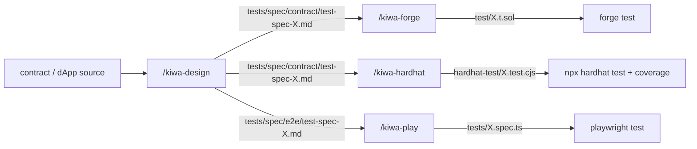

# tests/docs

> [🇬🇧 English](./README.md) • [🇯🇵 日本語](./README.ja.md)

kiwa contributor / kiwa repo 内で skill chain を回したい人向けの内部テスト docs。 OSS user 向け入門 (`docs/`) とは分離した位置づけ。

ここに置く docs。

- 🚀 [run-tests.ja.md](./run-tests.ja.md) — **`/kiwa-test` 1 コマンドで全 chain 一括実行** (kiwa-design → kiwa-forge / kiwa-hardhat / kiwa-play → kiwa-review)、 contract / dapp / 両方を起動時に選択。 個別 skill を順次叩く負担なし。 **最初に試すならこれ** (Recommended)
- ✍️ [write-tests-manually.ja.md](./write-tests-manually.ja.md) — **skill を使わず `@kiwa/core` を library として手書きで import** する手順 (既存 dApp に test を後付け追加 / fixture のみ流用 / 一部 helper だけ kiwa に置換 等の use case)。 1 file 完結 sample 4 種 (mint / marketplace / snapshot / custom error) 込み
- 🛠️ [skill-chain-tutorial.ja.md](./skill-chain-tutorial.ja.md) — 4 skill chain (`/kiwa-design` → `/kiwa-forge` / `/kiwa-hardhat` → `/kiwa-play`) で contract test + e2e test を仕様書から生成 → 実走まで full flow
- 🧩 [retrofit-existing-dapp.ja.md](./retrofit-existing-dapp.ja.md) — 既に動いている dApp + Foundry project に skill chain を後付け導入する手順 (nextjs-token-gating の実例で歩く)
- ⚒️ [run-contract-tests.ja.md](./run-contract-tests.ja.md) — `contracts/` 配下の **複数 contract を一括** で個別 skill (`/kiwa-design` → `/kiwa-forge` / `/kiwa-hardhat`) で test を生成 → 実走する手順 (nft-marketplace 2 contract を題材、 連携 scenario は主体 contract test file 内に含める、 単一 contract も同 flow)
- 🎭 [run-dapp-e2e-tests.ja.md](./run-dapp-e2e-tests.ja.md) — **UI (app/) を起点に** 個別 skill (`/kiwa-design --input app/` → `/kiwa-play`) で Playwright spec を生成 → 実走する手順 (フロントから呼ばれない contract function は test 対象外)

> 注 — 全 file の英語版が `tests/docs/{name}.md` (run-tests / write-tests-manually / skill-chain-tutorial / retrofit-existing-dapp / run-contract-tests / run-dapp-e2e-tests) で並列に揃っている。 個別 skill を 1 つだけ使いたい人は run-contract-tests / run-dapp-e2e-tests、 全 chain を 1 コマンドで回したい人は **run-tests** を読む。

## kiwa の skill 群

| Skill | layer | 役割 | SSOT |
|---|---|---|---|
| `/kiwa-test` | orchestrator | 全 skill chain を 1 コマンドで一括実行 (contract / dapp / 両方) | `.claude/skills/kiwa-test/SKILL.md` |
| `/kiwa-design` | Layer 1 | 機能仕様 / API / contract コードから 9 section 統一フォーマットの test 仕様書を生成 | `.claude/skills/kiwa-design/SKILL.md` |
| `/kiwa-forge` | Layer 2 contract | Layer 1 仕様書を Foundry `test/*.t.sol` に変換 + `forge test` + coverage auto loop | `.claude/skills/kiwa-forge/SKILL.md` |
| `/kiwa-hardhat` | Layer 2 contract | Layer 1 仕様書を Hardhat `test/*.test.cjs` に変換 + `npx hardhat test` + coverage auto loop | `.claude/skills/kiwa-hardhat/SKILL.md` |
| `/kiwa-vitest` | Layer 2 unit | Layer 1 仕様書を Vitest `test/unit/*.test.{ts,tsx}` に変換 (TS 関数 / TSX hook の単体テスト、 F-3) | `.claude/skills/kiwa-vitest/SKILL.md` |
| `/kiwa-api` | Layer 2 integration | Layer 1 仕様書を msw / supertest / Playwright `request` の API integration test に変換 (F-3) | `.claude/skills/kiwa-api/SKILL.md` |
| `/kiwa-play` | Layer 3 e2e | `@kiwa/core` fixture を使った Playwright `tests/*.spec.ts` の設計 / 実装 / 実行 | `.claude/skills/kiwa-play/SKILL.md` |
| `/kiwa-review` | reviewer | spec / test code / 実行結果を 3 mode (spec-review / test-review / result-review) で品質判定 | `.claude/skills/kiwa-review/SKILL.md` |

## 全体図

3 layer 連携の核は **Layer 1 出力 (`tests/spec/{contract,e2e}/test-spec-{module}.md`) の 9 column 表が単一 SSOT** で、 Layer 2 / 3 の skill 3 種 (Foundry / Hardhat / Playwright) はこれを Read して runner 特化 helper に機械的に変換する。

## どこから読むか

- 🚀 **とりあえず全 chain を 1 コマンドで動かしたい** (推奨入り口) → [run-tests.ja.md](./run-tests.ja.md) を上から実行
- ✍️ **skill を使わず手書きで test を追加したい** (library 直接利用) → [write-tests-manually.ja.md](./write-tests-manually.ja.md) を読む
- 🆕 **kiwa の skill chain 概念を 0 から理解したい** → [skill-chain-tutorial.ja.md](./skill-chain-tutorial.ja.md)
- 🧩 **既存 dApp + Foundry project に後付けで test を入れたい** → [retrofit-existing-dapp.ja.md](./retrofit-existing-dapp.ja.md) を実例ベースで読む
- ⚒️ **contract 単体 (Foundry + Hardhat) だけ手順詳細を見たい** → [run-contract-tests.ja.md](./run-contract-tests.ja.md)
- 🎭 **dApp e2e (Playwright + UI 起点) だけ手順詳細を見たい** → [run-dapp-e2e-tests.ja.md](./run-dapp-e2e-tests.ja.md)
- 📚 **特定 skill の詳細仕様だけ確認したい** → `.claude/skills/kiwa-{test,design,forge,hardhat,play,review}/SKILL.md` を直読

## 関連 docs

- [docs/ja/quickstart.md](../../docs/ja/quickstart.md) — OSS user 向け入門 (`@kiwa/cli init` での新規 dApp 立ち上げ)
- [docs/ja/cookbook/with-deploy.md](../../docs/ja/cookbook/with-deploy.md) — `kiwa init --with-deploy` の 4 file boilerplate を使った framework 統合
- [docs/ja/examples/README.md](../../docs/ja/examples/README.md) — 20 example の機能逆引きマップ (skill chain の出力 reference)
- [docs/EXAMPLE-FIXTURES.ja.md](../../docs/EXAMPLE-FIXTURES.ja.md) — どの example が `tests/fixtures/` に完成形 fixture を持つか、 e2e only 16 example を対象外にしている理由

## 言語

- 🇯🇵 [README.ja.md](./README.ja.md) — このページ
- 🇬🇧 [README.md](./README.md) — English version
