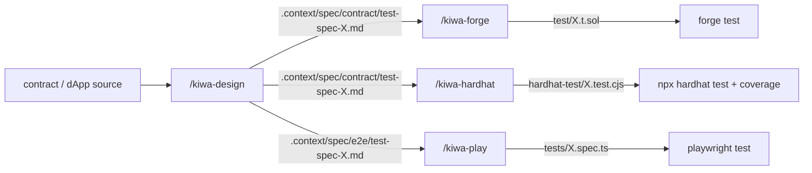

# tests/docs

kiwa contributor / kiwa repo 内で skill chain を回したい人向けの内部テスト docs。 OSS user 向け入門 (`docs/`) とは分離した位置づけ。

ここに置く docs。

- 🛠️ [skill-chain-tutorial.ja.md](./skill-chain-tutorial.ja.md) — 4 skill chain (`/kiwa-design` → `/kiwa-forge` / `/kiwa-hardhat` → `/kiwa-play`) で contract test + e2e test を仕様書から生成 → 実走まで full flow
- 🧩 [retrofit-existing-dapp.ja.md](./retrofit-existing-dapp.ja.md) — 既に動いている dApp + Foundry project に skill chain を後付け導入する手順 (nextjs-token-gating の実例で歩く)
- ⚒️ [run-contract-tests.ja.md](./run-contract-tests.ja.md) — `contracts/` 配下の **複数 contract を一括** で `/kiwa-design` → `/kiwa-forge` / `/kiwa-hardhat` で test を生成 → 実走する手順 (nft-marketplace 2 contract を題材、 連携 scenario は主体 contract test file 内に含める、 単一 contract も同 flow)
- 🎭 [run-dapp-e2e-tests.ja.md](./run-dapp-e2e-tests.ja.md) — **UI (app/) を起点に** `/kiwa-design --input app/` で e2e 仕様書を生成 → `/kiwa-play` で Playwright spec を生成 → 実走する手順 (フロントから呼ばれない contract function は test 対象外)

> 注 — `run-*.ja.md` は日本語版のみ。 英語版はローカル検証完了後に追加予定。

## kiwa の 4 skill

| Skill | layer | 役割 | SSOT |
|---|---|---|---|
| `/kiwa-design` | Layer 1 | 機能仕様 / API / contract コードから 9 section 統一フォーマットの仕様書を生成 | `.claude/skills/kiwa-design/SKILL.md` |
| `/kiwa-forge` | Layer 2 contract | Layer 1 仕様書を Foundry `test/*.t.sol` に変換 + `forge test` で動作確認 | `.claude/skills/kiwa-forge/SKILL.md` |
| `/kiwa-hardhat` | Layer 2 contract | Layer 1 仕様書を Hardhat `test/*.test.cjs` に変換 + `npx hardhat test` + coverage | `.claude/skills/kiwa-hardhat/SKILL.md` |
| `/kiwa-play` | Layer 3 e2e | `@kiwa/core` fixture を使った Playwright `tests/*.spec.ts` の設計 / 実装 / 実行 | `.claude/skills/kiwa-play/SKILL.md` |

## 全体図

3 layer 連携の核は **Layer 1 出力 (`.context/spec/{contract,e2e}/test-spec-{module}.md`) の 9 column 表が単一 SSOT** で、 Layer 2 / 3 の skill 3 種 (Foundry / Hardhat / Playwright) はこれを Read して runner 特化 helper に機械的に変換する。

## どこから読むか

- 🆕 **これから kiwa で test を書きたい** → [skill-chain-tutorial.ja.md](./skill-chain-tutorial.ja.md) を 0 から読む
- 🧩 **既存 dApp + Foundry project に後付けで test を入れたい** → [retrofit-existing-dapp.ja.md](./retrofit-existing-dapp.ja.md) を実例ベースで読む
- 📚 **特定 skill の詳細仕様だけ確認したい** → `.claude/skills/kiwa-{design,forge,hardhat,play}/SKILL.md` を直読

## 関連 docs

- [docs/ja/quickstart.md](../../docs/ja/quickstart.md) — OSS user 向け入門 (`@kiwa/cli init` での新規 dApp 立ち上げ)
- [docs/ja/cookbook/with-deploy.md](../../docs/ja/cookbook/with-deploy.md) — `kiwa init --with-deploy` の 4 file boilerplate を使った framework 統合
- [docs/ja/examples/README.md](../../docs/ja/examples/README.md) — 20 example の機能逆引きマップ (skill chain の出力 reference)

## 言語

- 🇯🇵 [README.ja.md](./README.ja.md) — このページ
- 🇬🇧 [README.md](./README.md) — English version
