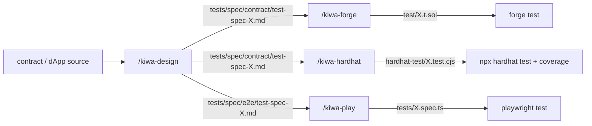

# tests/docs

> [🇬🇧 English](./README.md) • [🇯🇵 日本語](./README.ja.md)

Internal test docs for kiwa contributors and anyone working inside the kiwa repo with the skill chain. Separate from the OSS user-facing docs (`docs/`).

What lives here.

- 🚀 [run-tests.md](./run-tests.md) — **Run the full chain in one command with `/kiwa-test`** (`kiwa-design` → `kiwa-forge` / `kiwa-hardhat` / `kiwa-play` → `kiwa-review`), choosing contract / dApp / both at startup. **Start here first** (Recommended)
- ✍️ [write-tests-manually.md](./write-tests-manually.md) — **Hand-write tests by importing `@kiwa/core` as a library instead of using skills** (retrofitting tests into an existing dApp, reusing only fixtures, swapping only some helpers over to kiwa, etc.). Includes four single-file samples (mint / marketplace / snapshot / custom error)
- 🛠️ [skill-chain-tutorial.md](./skill-chain-tutorial.md) — Full flow through the four-skill chain (`/kiwa-design` → `/kiwa-forge` / `/kiwa-hardhat` → `/kiwa-play`) — from spec generation to contract test + e2e test all the way to running them
- 🧩 [retrofit-existing-dapp.md](./retrofit-existing-dapp.md) — Bolt the skill chain onto a dApp + Foundry project that already works (walked through with the nextjs-token-gating example)
- ⚒️ [run-contract-tests.md](./run-contract-tests.md) — Generate and run tests for **multiple contracts under `contracts/` at once** using the individual skills (`/kiwa-design` → `/kiwa-forge` / `/kiwa-hardhat`) (uses the two-contract nft-marketplace example; collaboration scenarios live in the primary contract test file; the same flow applies to a single contract too)
- 🎭 [run-dapp-e2e-tests.md](./run-dapp-e2e-tests.md) — Generate and run Playwright specs using the individual skills **from the UI (`app/`) side** (`/kiwa-design --input app/` → `/kiwa-play`) (contract functions never called from the frontend are out of scope)

## The kiwa skills

| Skill | Layer | Role | SSOT |
|---|---|---|---|
| `/kiwa-test` | orchestrator | Run the entire skill chain in one command (contract / dApp / both) | `.claude/skills/kiwa-test/SKILL.md` |
| `/kiwa-design` | Layer 1 | From feature spec / API / contract code, produce a nine-section unified spec | `.claude/skills/kiwa-design/SKILL.md` |
| `/kiwa-forge` | Layer 2 contract | Convert the Layer 1 spec into Foundry `test/*.t.sol` and run `forge test` | `.claude/skills/kiwa-forge/SKILL.md` |
| `/kiwa-hardhat` | Layer 2 contract | Convert the Layer 1 spec into Hardhat `test/*.test.cjs`, run `npx hardhat test`, gather coverage | `.claude/skills/kiwa-hardhat/SKILL.md` |
| `/kiwa-vitest` | Layer 2 unit | Convert the Layer 1 spec into Vitest `test/unit/*.test.{ts,tsx}` for TS / TSX functions and hooks (F-3) | `.claude/skills/kiwa-vitest/SKILL.md` |
| `/kiwa-api` | Layer 2 integration | Convert the Layer 1 spec into msw / supertest / Playwright `request` API integration tests (F-3) | `.claude/skills/kiwa-api/SKILL.md` |
| `/kiwa-play` | Layer 3 e2e | Design / implement / run Playwright `tests/*.spec.ts` on top of the `@kiwa/core` fixture | `.claude/skills/kiwa-play/SKILL.md` |
| `/kiwa-review` | reviewer | Judge spec / test code / execution results in three modes (spec-review / test-review / result-review) | `.claude/skills/kiwa-review/SKILL.md` |

## Big picture

The whole chain hinges on **the nine-column table inside the Layer 1 output (`tests/spec/{contract,e2e}/test-spec-{module}.md`) acting as the single source of truth** — the Layer 2 / 3 skills (Foundry / Hardhat / Playwright) read it and mechanically translate it into runner-specific helpers.

## Where to start

- 🚀 **You want to run the full chain in one command first** (recommended entry point) → start at [run-tests.md](./run-tests.md)
- ✍️ **You want to add tests by hand without using skills** (direct library usage) → read [write-tests-manually.md](./write-tests-manually.md)
- 🆕 **You want to understand kiwa's skill-chain model from zero** → read [skill-chain-tutorial.md](./skill-chain-tutorial.md)
- 🧩 **You want to retrofit tests into an existing dApp + Foundry project** → walk through [retrofit-existing-dapp.md](./retrofit-existing-dapp.md)
- ⚒️ **You only want the contract-side procedure** (Foundry + Hardhat) → read [run-contract-tests.md](./run-contract-tests.md)
- 🎭 **You only want the dApp e2e procedure** (Playwright + UI-first) → read [run-dapp-e2e-tests.md](./run-dapp-e2e-tests.md)
- 📚 **You only need the full spec for a specific skill** → open `.claude/skills/kiwa-{test,design,forge,hardhat,play,review}/SKILL.md` directly

## Related docs

- [docs/en/quickstart.md](../../docs/en/quickstart.md) — OSS user introduction (`@kiwa/cli init` for a brand-new dApp)
- [docs/en/cookbook/with-deploy.md](../../docs/en/cookbook/with-deploy.md) — Framework integration via the four-file `kiwa init --with-deploy` boilerplate
- [docs/en/examples/README.md](../../docs/en/examples/README.md) — Reverse lookup over the 20 examples (reference output of the skill chain)
- [docs/EXAMPLE-FIXTURES.md](../../docs/EXAMPLE-FIXTURES.md) — Which examples have a completed fixture under `tests/fixtures/`, and why the e2e-only examples are out of scope

## Language

- 🇬🇧 [README.md](./README.md) — this page
- 🇯🇵 [README.ja.md](./README.ja.md) — Japanese version
