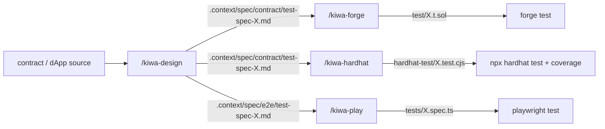

# tests/docs

Internal test docs for kiwa contributors and anyone working inside the kiwa repo with the skill chain. Separate from the OSS user-facing docs (`docs/`).

What lives here.

- 🛠️ [skill-chain-tutorial.md](./skill-chain-tutorial.md) — Full flow through the four-skill chain (`/kiwa-design` → `/kiwa-forge` / `/kiwa-hardhat` → `/kiwa-play`) — from spec generation to contract test + e2e test all the way to running them
- 🧩 [retrofit-existing-dapp.md](./retrofit-existing-dapp.md) — Bolt the skill chain onto a dApp + Foundry project that already works (walked through with the nextjs-token-gating example)

> Note — The Japanese versions `run-contract-tests.ja.md` and `run-dapp-e2e-tests.ja.md` contain the step-by-step "use the skill to create tests" guides covering the two test surfaces (contract group / dApp e2e). English translations will follow once the Japanese guides have been verified end-to-end locally.

## The four kiwa skills

| Skill | Layer | Role | SSOT |
|---|---|---|---|
| `/kiwa-design` | Layer 1 | From feature spec / API / contract code, produce a nine-section unified spec | `.claude/skills/kiwa-design/SKILL.md` |
| `/kiwa-forge` | Layer 2 contract | Convert the Layer 1 spec into Foundry `test/*.t.sol` and run `forge test` | `.claude/skills/kiwa-forge/SKILL.md` |
| `/kiwa-hardhat` | Layer 2 contract | Convert the Layer 1 spec into Hardhat `test/*.test.cjs`, run `npx hardhat test`, gather coverage | `.claude/skills/kiwa-hardhat/SKILL.md` |
| `/kiwa-play` | Layer 3 e2e | Design / implement / run Playwright `tests/*.spec.ts` on top of the `@kiwa/core` fixture | `.claude/skills/kiwa-play/SKILL.md` |

## Big picture

The whole chain hinges on **the nine-column table inside the Layer 1 output (`.context/spec/{contract,e2e}/test-spec-{module}.md`) acting as the single source of truth** — the Layer 2 / 3 skills (Foundry / Hardhat / Playwright) read it and mechanically translate it into runner-specific helpers.

## Where to start

- 🆕 **First time writing tests with kiwa** → read [skill-chain-tutorial.md](./skill-chain-tutorial.md) from the top
- 🧩 **Adding tests to an existing dApp + Foundry project** → walk through [retrofit-existing-dapp.md](./retrofit-existing-dapp.md)
- 📚 **Need a specific skill's full spec** → open `.claude/skills/kiwa-{design,forge,hardhat,play}/SKILL.md` directly

## Related docs

- [docs/en/quickstart.md](../../docs/en/quickstart.md) — OSS user introduction (`@kiwa/cli init` for a brand-new dApp)
- [docs/en/cookbook/with-deploy.md](../../docs/en/cookbook/with-deploy.md) — Framework integration via the four-file `kiwa init --with-deploy` boilerplate
- [docs/en/examples/README.md](../../docs/en/examples/README.md) — Reverse lookup over the 20 examples (reference output of the skill chain)

## Language

- 🇬🇧 [README.md](./README.md) — this page
- 🇯🇵 [README.ja.md](./README.ja.md) — Japanese version
