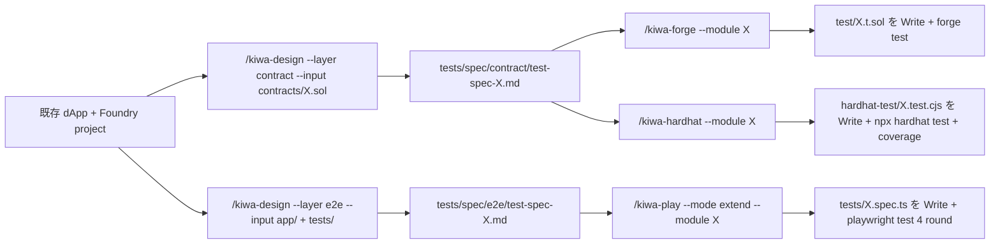

# 既存 dApp に skill chain を後付け導入する

> [🇬🇧 English](./retrofit-existing-dapp.md) • [🇯🇵 日本語](./retrofit-existing-dapp.ja.md)

既に動いている dApp + Foundry project に対して kiwa の skill chain (`/kiwa-design` → `/kiwa-forge` / `/kiwa-hardhat` → `/kiwa-play`) を後付け導入する手順。 `examples/nextjs-token-gating` を題材に、 「Phase E 完成時点で Foundry test + Playwright e2e のみだった example」を「Hardhat 経路も並立した F-1 第 1 弾完成形」まで持っていく流れを歩く。

新規 TDD 経路との違いは「既存実装をそのまま動作仕様として扱う」点。 contract や spec を作るところは省き、 既存コードから観点を逆算して test を埋める。

## 想定読者

- 既に Foundry project (`forge build` が通る) を持っている
- dApp 側に `playwright.config.ts` + 既存 e2e test がある
- kiwa repo の clone 済 + `pnpm install` 完了

## 全体像



## 完全な実例 — nextjs-token-gating に Hardhat 経路を後付け

### Step 0: 既存状態の把握

```bash
ls examples/nextjs-token-gating/{contracts,tests,test}
# contracts/: GateNFT.sol + GatedContent.sol
# tests/: gating.spec.ts (既存 e2e test) + prepare-env.ts + fixture.ts
# test/: GatedContent.t.sol (既存 Foundry test)
```

contract / e2e test / Foundry test は揃っているが、 Hardhat 経路が無い (= F-1 第 1 弾の課題)。 仕様書も `tests/spec/` には未生成。

### Step 1: `/kiwa-design --layer contract --input` で Layer 1 仕様書生成

```
/kiwa-design --layer contract --input examples/nextjs-token-gating/contracts/GatedContent.sol --module gated-content
```

出力。

```
tests/spec/contract/test-spec-gated-content.md
```

9 section 統一テンプレで仕様書が書き出される。 主要 section。

| Section | 内容 |
|---|---|
| `## 対象機能` | grep 抽出した state / function 一覧 |
| `## 品質リスク` | rentry / auth / 数値 overflow 等の 10 リスク観点 |
| `## テスト観点` | 6 grouping (正常系 / 異常系 / 境界値 / 状態遷移 / 権限 / セキュリティ) |
| `## テストケース` | 9 column 表 (case-id / 観点 / 入力 / 期待結果 / 優先度 等) |
| `## 不足している仕様` | grep だけで埋まらない箇所 (author 確認推奨) |

仕様書末尾の「不足している仕様」は contract author が補完する。 ただし後付け導入では「既存実装が事実上の仕様」なので、 明らかな入力誤りだけ確認すれば残りは Layer 2 で test PASS することで自然に埋まる。

### Step 2: `/kiwa-hardhat --module` で Hardhat test 生成

```
/kiwa-hardhat --module gated-content --target examples/nextjs-token-gating
```

出力。

```
examples/nextjs-token-gating/hardhat-test/GatedContent.test.cjs
```

9 column 表を Read して、 `@nomicfoundation/hardhat-toolbox` の `loadFixture` / `time` helper、 `chai` matcher、 `fast-check` の fuzz に機械的に変換する。

### Step 3: 必要なら hardhat.config.cjs + package.json 整備

例で初めて Hardhat を入れる場合は config と script を追加。

```javascript
// examples/nextjs-token-gating/hardhat.config.cjs
require('@nomicfoundation/hardhat-toolbox');

module.exports = {
  solidity: { version: '0.8.24', settings: { optimizer: { enabled: true, runs: 200 } } },
  paths: {
    sources: './contracts',
    tests: './hardhat-test',
    cache: './hardhat-cache',
    artifacts: './hardhat-artifacts',
  },
};
```

package.json に script 追加。

```json
{
  "scripts": {
    "test:hardhat": "hardhat test --config hardhat.config.cjs",
    "test:hardhat:coverage": "hardhat coverage --config hardhat.config.cjs"
  },
  "devDependencies": {
    "@nomicfoundation/hardhat-toolbox": "^5.0.0",
    "hardhat": "^2.28.6",
    "chai": "^4.5.0",
    "ethers": "^6.16.0",
    "fast-check": "^4.8.0",
    "solidity-coverage": "^0.8.17"
  }
}
```

repo root で `pnpm install` を再走、 ignore する成果物を `.gitignore` に追加。

```
hardhat-cache/
hardhat-artifacts/
coverage/
coverage.json
```

### Step 4: 4 round 実走 + coverage 確認

```bash
# 4 round 連続 PASS で flaky 0 を確認
for r in 1 2 3 4; do echo "=== Round $r ==="; pnpm -F examples-nextjs-token-gating test:hardhat 2>&1 | grep -E "passing|failing"; done

# coverage 80%+ を確認
pnpm -F examples-nextjs-token-gating test:hardhat:coverage
```

期待 — 23 件 PASS × 4 round / coverage Stmts 94.74% / Branch 88.89% / Funcs 100% / Lines 100% (F-1 第 1 弾実測値)。

### Step 5: e2e test 側も後付けしたい場合

Playwright 側は既存 `gating.spec.ts` が動いているのでそのままで OK。 観点漏れを足したいときだけ `/kiwa-play --mode extend --module gated-content` で既存 spec に test ケースを追記する。

```
/kiwa-play --mode extend --module gated-content --target examples/nextjs-token-gating
```

`--mode extend` は既存 spec を上書きせず append する設計。

## 観点別の選び方 — Foundry / Hardhat / Playwright

| 観点 | 選ぶ skill | 理由 |
|---|---|---|
| invariant / fuzz / gas profile | `/kiwa-forge` | Foundry の `vm.*` helper + `forge --gas-report` が強力 |
| coverage を 4 metric (Stmts / Branch / Funcs / Lines) で見たい | `/kiwa-hardhat` | `solidity-coverage` の出力が読みやすい |
| dApp UI 越しの flow (click → wallet → contract → state) | `/kiwa-play` | `@kiwa-test/core` fixture で wallet inject |
| 同 contract に対する Foundry + Hardhat 並立 | `/kiwa-forge` + `/kiwa-hardhat` | 観点 grouping を Layer 1 で共有 |

## 詰まりやすい点

- **`tests/spec/contract/` が無い** — `/kiwa-design --layer contract` を先に走らせる。 既存 spec を再利用したい場合は手で `tests/spec/contract/test-spec-{module}.md` に置けば skill が読む。
- **Hardhat の compile が失敗** — `hardhat.config.cjs` の `solidity.version` が contract の `pragma solidity` と整合しているか確認。 `paths.sources` も Foundry の `contracts/` を指せているか。
- **`pnpm -F examples-X test:hardhat` で script not found** — package.json に `test:hardhat` script を追加し忘れている。 上記 Step 3 参照。
- **coverage が 80% に届かない** — uncovered branch を README で Read、 「I = if-path-not-taken」マークは else 側 / revert path が untaken。 該当する test ケースを追加。

## 完成形例

| Example | Foundry | Hardhat | Playwright | PR |
|---|---|---|---|---|
| mint-nft | 27/27 | 24/24 | 8/8 | [#184](https://github.com/cardene777/kiwa/pull/184) |
| defi-swap | 17/17 | 23/23 | 7/7 | [#196](https://github.com/cardene777/kiwa/pull/196) |
| nextjs-token-gating | 20/20 | 23/23 | 8/8 | [#196](https://github.com/cardene777/kiwa/pull/196) |
| nft-marketplace | 30+ | 51/51 | 12/12 | [#198](https://github.com/cardene777/kiwa/pull/198) |

`mint-nft` の完成形 reference suite は `tests/fixtures/mint-nft/` にあり、 example 側の test directories は retrofit walkthrough 用の gitignored 作業台として扱う。

それぞれの diff を読めば本 tutorial の Step 1-4 がどう実装に落ちたか具体例で確認できる。

## 関連 docs

- [skill-chain-tutorial.ja.md](./skill-chain-tutorial.ja.md) — 0 から skill chain を動かす full flow (新規 TDD 経路含む)
- [README.ja.md](./README.ja.md) — 4 skill 案内 + chapter 動線
- [docs/ja/cookbook/with-deploy.md](../../docs/ja/cookbook/with-deploy.md) — 外部 user 向け、 自分の Foundry project に `kiwa init --with-deploy` で boilerplate 生成
