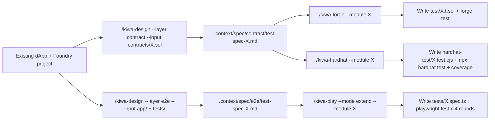

# Retrofit the skill chain onto an existing dApp

> [🇬🇧 English](./retrofit-existing-dapp.md) • [🇯🇵 日本語](./retrofit-existing-dapp.ja.md)

How to bolt kiwa's skill chain (`/kiwa-design` → `/kiwa-forge` / `/kiwa-hardhat` → `/kiwa-play`) onto a dApp + Foundry project that already works. We walk through bringing `examples/nextjs-token-gating` — which only had Foundry test + Playwright e2e at the end of Phase E — up to the F-1 wave 1 shape with Hardhat running alongside.

The big difference from new TDD: **the existing implementation is treated as the de-facto specification**. Skip writing the contract / spec from scratch; infer viewpoints from the existing code and fill in the missing tests.

## Audience

- You already have a Foundry project (`forge build` passes)
- The dApp side has `playwright.config.ts` + existing e2e tests
- The kiwa repo is cloned + `pnpm install` is done

## Overview



## Worked example — add Hardhat to nextjs-token-gating

### Step 0: Snapshot what already exists

```bash
ls examples/nextjs-token-gating/{contracts,tests,test}
# contracts/: GateNFT.sol + GatedContent.sol
# tests/:    gating.spec.ts (existing e2e test) + prepare-env.ts + fixture.ts
# test/:     GatedContent.t.sol (existing Foundry test)
```

Contracts / e2e tests / Foundry tests are all there, but the Hardhat lane is missing (= F-1 wave 1 gap). No spec under `.context/spec/` yet.

### Step 1: Generate the Layer 1 spec with `/kiwa-design --layer contract --input`

```
/kiwa-design --layer contract --input examples/nextjs-token-gating/contracts/GatedContent.sol --module gated-content
```

Output.

```
.context/spec/contract/test-spec-gated-content.md
```

The spec is emitted using the nine-section unified template. Key sections.

| Section | Content |
|---|---|
| `## Target feature` | State / function list extracted via grep |
| `## Quality risks` | Ten risk lenses — reentry / auth / numeric overflow, etc. |
| `## Test viewpoints` | Six groupings (happy / error / boundary / state transition / authorization / security) |
| `## Test cases` | Nine-column table (case-id / viewpoint / input / expected / priority etc.) |
| `## Missing spec` | Holes that `grep` cannot fill (flag for author confirmation) |

The "Missing spec" section is for the contract author to fill in later. In a retrofit, however, "the existing implementation is the de-facto spec," so as long as the obvious mistakes are checked, the rest gets pinned down naturally as Layer 2 tests pass.

### Step 2: Generate Hardhat tests with `/kiwa-hardhat --module`

```
/kiwa-hardhat --module gated-content --target examples/nextjs-token-gating
```

Output.

```
examples/nextjs-token-gating/hardhat-test/GatedContent.test.cjs
```

The skill reads the nine-column table and mechanically translates it into `@nomicfoundation/hardhat-toolbox`'s `loadFixture` / `time` helpers, `chai` matchers, and `fast-check` fuzz.

### Step 3: Add `hardhat.config.cjs` + `package.json` if this is your first Hardhat lane

When this example has no Hardhat config yet, add it.

```javascript
// examples/nextjs-token-gating/hardhat.config.cjs
require('@nomicfoundation/hardhat-toolbox');

module.exports = {
  solidity: { version: '0.8.24', settings: { optimizer: { enabled: true, runs: 200 } } },
  paths: {
    sources: './contracts',
    tests: './hardhat-test',
    cache: './hardhat-cache',
    artifacts: './hardhat-artifacts',
  },
};
```

Add scripts to `package.json`.

```json
{
  "scripts": {
    "test:hardhat": "hardhat test --config hardhat.config.cjs",
    "test:hardhat:coverage": "hardhat coverage --config hardhat.config.cjs"
  },
  "devDependencies": {
    "@nomicfoundation/hardhat-toolbox": "^5.0.0",
    "hardhat": "^2.28.6",
    "chai": "^4.5.0",
    "ethers": "^6.16.0",
    "fast-check": "^4.8.0",
    "solidity-coverage": "^0.8.17"
  }
}
```

Re-run `pnpm install` at the repo root, and add the build artefacts to `.gitignore`.

```
hardhat-cache/
hardhat-artifacts/
coverage/
coverage.json
```

### Step 4: Four-round runs + coverage check

```bash
# Confirm flaky-0 with four consecutive green rounds
for r in 1 2 3 4; do echo "=== Round $r ==="; pnpm -F examples-nextjs-token-gating test:hardhat 2>&1 | grep -E "passing|failing"; done

# Verify coverage is at least 80%
pnpm -F examples-nextjs-token-gating test:hardhat:coverage
```

Expected — 23 passing × 4 rounds / coverage Stmts 94.74% / Branch 88.89% / Funcs 100% / Lines 100% (the F-1 wave 1 figures).

### Step 5: Optionally retrofit e2e tests too

Playwright already has `gating.spec.ts` working, so leave it alone. When you want to fill viewpoint gaps, run `/kiwa-play --mode extend --module gated-content` to append cases to the existing spec.

```
/kiwa-play --mode extend --module gated-content --target examples/nextjs-token-gating
```

`--mode extend` is designed to append rather than overwrite the existing spec.

## Picking between Foundry / Hardhat / Playwright

| Goal | Skill | Why |
|---|---|---|
| invariant / fuzz / gas profile | `/kiwa-forge` | Strong Foundry `vm.*` helpers + `forge --gas-report` |
| Four-metric coverage (Stmts / Branch / Funcs / Lines) | `/kiwa-hardhat` | `solidity-coverage` output is easy to read |
| dApp flow through the UI (click → wallet → contract → state) | `/kiwa-play` | `@kiwa/core` fixture injects the wallet |
| Foundry + Hardhat side by side on the same contract | `/kiwa-forge` + `/kiwa-hardhat` | Viewpoints are shared via Layer 1 |

## Common pitfalls

- **`.context/spec/contract/` is empty** — run `/kiwa-design --layer contract` first. To reuse an existing spec, drop it into `.context/spec/contract/test-spec-{module}.md` by hand and the skill will read it.
- **Hardhat compile fails** — make sure `hardhat.config.cjs`'s `solidity.version` matches the contract's `pragma solidity` and that `paths.sources` points at Foundry's `contracts/`.
- **`pnpm -F examples-X test:hardhat` says "script not found"** — you forgot to add `test:hardhat` to `package.json`. See Step 3.
- **Coverage falls short of 80%** — Read the uncovered-branch markup in the HTML report. The `I = if-path-not-taken` marker means the else / revert path was not taken. Add a test case for it.

## Reference implementations

| Example | Foundry | Hardhat | Playwright | PR |
|---|---|---|---|---|
| mint-nft | 27/27 | 24/24 | 8/8 | [#184](https://github.com/cardene777/kiwa/pull/184) |
| defi-swap | 17/17 | 23/23 | 7/7 | [#196](https://github.com/cardene777/kiwa/pull/196) |
| nextjs-token-gating | 20/20 | 23/23 | 8/8 | [#196](https://github.com/cardene777/kiwa/pull/196) |
| nft-marketplace | 30+ | 51/51 | 12/12 | [#198](https://github.com/cardene777/kiwa/pull/198) |

The diffs of those PRs show exactly how Steps 1–4 translate into real code.

## Related docs

- [skill-chain-tutorial.md](./skill-chain-tutorial.md) — Full skill-chain flow from zero (covers the new-TDD path too)
- [README.md](./README.md) — The four-skill index + chapter navigation
- [docs/en/cookbook/with-deploy.md](../../docs/en/cookbook/with-deploy.md) — User-facing recipe: generate boilerplate for your own Foundry project via `kiwa init --with-deploy`
