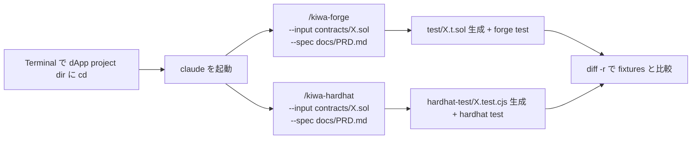

# Contract test を skill で作って実走する手順 (Foundry + Hardhat)

> 🇯🇵 日本語のみ (英語版は本手順をローカルで検証した後に追加予定)

自分の dApp project に既にある **contract code + 仕様書 (PRD / 設計書 / docstring 等)** を入力に、 kiwa の `/kiwa-forge` (Foundry) と `/kiwa-hardhat` (Hardhat) で contract test を 0 から生成して実走する手順。 本手順では `examples/mint-nft` を「自分の dApp project」に見立てて歩く (`MintNft.sol` + `tests/fixtures/mint-nft/README.md` の挙動説明を仕様書代わりに使う)。

## 全体図



## 前提イメージ — 自分の dApp project の構成

自分の project が以下のような構成になっていれば skill chain が走る。

```text
my-defi-app/                            ← Terminal で cd して claude を起動する dir
├─ contracts/MyToken.sol                ← /kiwa-forge / /kiwa-hardhat の --input
├─ docs/PRD.md                          ← /kiwa-forge / /kiwa-hardhat の --spec
├─ foundry.toml                         ← Foundry 用 config (src/test/libs)
├─ hardhat.config.cjs                   ← Hardhat 用 config (paths.sources/tests)
├─ package.json                         ← test:foundry / test:hardhat script
├─ lib/forge-std/                       ← Foundry submodule
└─ (test/ や hardhat-test/ はまだ無い)   ← skill chain で 0 から生成する場所
```

mint-nft の場合、 上記の "my-defi-app" は `examples/mint-nft/` に該当し、 仕様書は `tests/fixtures/mint-nft/README.md` (完成形 reference の出自説明) や `MintNft.sol` の docstring を使う。

## Step 0 — 前提環境

```bash
# 1. dApp project dir に移動 (mint-nft の場合)
cd /Users/cardene/Desktop/projects/kiwa/examples/mint-nft

# 2. 自分の project 全体で依存 install (monorepo の場合は root で実行)
cd /Users/cardene/Desktop/projects/kiwa && pnpm install
cd /Users/cardene/Desktop/projects/kiwa/examples/mint-nft

# 3. Foundry が PATH 上 (forge / anvil)
forge --version    # forge x.y.z
anvil --version    # anvil x.y.z

# 4. Node.js 22+ (Hardhat 用)
node --version     # v22.x.x
```

Foundry 未 install なら [foundry.paradigm.xyz](https://foundry.paradigm.xyz) の手順で先に install する。

## Step 1 — test dir が空 (or 未存在) であることを確認

skill が「既存 test なし」状態を要求する (`/kiwa-forge` などは既存 file 検出時 skip or 上書きの挙動になる)。

```bash
# 現 dir が examples/mint-nft であることを確認
pwd

# test dir が空 or 未存在
ls test 2>&1            # "No such file" or 空
ls hardhat-test 2>&1    # "No such file" or 空

# .gitignore で gitignored であることを確認 (mint-nft では既にこの設定済)
grep -E "^(test|hardhat-test)/" .gitignore
```

`.gitignore` に `test/` `hardhat-test/` 行が出ていれば作業台として正しい状態。

## Step 2 — その dir で Claude Code を起動

別 Terminal を開いて (元 Terminal は実走用に残す)、 自分の dApp project dir で `claude` を起動。

```bash
cd /Users/cardene/Desktop/projects/kiwa/examples/mint-nft
claude
```

`claude code` が起動し prompt が出る。 ここから skill コマンドを叩く。 **cwd が examples/mint-nft であることが重要** — skill は cwd を基準に contract / docs / config を探す。

## Step 3 — `/kiwa-forge` で Foundry test を生成 (`MintNft.sol` + 仕様書を入力)

claude prompt で以下を叩く。

```text
/kiwa-forge --input contracts/MintNft.sol --spec ../../tests/fixtures/mint-nft/README.md
```

引数の意味。

- `--input contracts/MintNft.sol` — test 対象の contract code (cwd 起点の相対 path)
- `--spec ../../tests/fixtures/mint-nft/README.md` — 仕様書 (mint-nft では完成形 reference の README を仕様書代わりに使う、 自分の project なら `docs/PRD.md` や `docs/design.md` を渡す)

skill が以下を実施する。

- `contracts/MintNft.sol` を Read して function / event / error を grep 抽出
- 仕様書を Read して挙動 / 不変条件 / エラー仕様を把握
- 10 観点 (正常系 / 異常系 / 境界値 / 状態遷移 / 権限 / 入力バリデーション / 冪等性 / 並行処理 / 性能 / セキュリティ) を Foundry helper (`vm.prank` / `vm.expectRevert` / `vm.warp` / fuzz / invariant) に変換
- `test/MintNft.t.sol` を Write
- `forge build` で compile 確認
- `forge test --gas-report` で動作確認

完了すると claude が test 件数と PASS 数を報告する (期待は約 27 件全 PASS、 完成形 fixtures と同数程度)。

### macOS で panic する場合

`Attempted to create a NULL object` panic が出たら Foundry の system_configuration バグ。 環境変数で回避できる。

```bash
# claude を一旦 exit (Ctrl+D) して別 Terminal で実行
cd /Users/cardene/Desktop/projects/kiwa/examples/mint-nft
FOUNDRY_OFFLINE=true forge test
```

PASS 確認できたら claude を再起動して次 Step へ。

## Step 4 — `/kiwa-hardhat` で Hardhat test を生成

```text
/kiwa-hardhat --input contracts/MintNft.sol --spec ../../tests/fixtures/mint-nft/README.md
```

skill が以下を実施する。

- 同じ contract + 仕様書を Read
- 10 観点を chai matchers + `fast-check` + `hardhat-toolbox` に変換
- `hardhat-test/MintNft.test.cjs` を Write
- `npx hardhat test --config hardhat.config.cjs` で動作確認

完了すると claude が test 件数と PASS 数を報告する (期待 24 件前後)。

## Step 5 — 生成 test を手動実走 (flaky 検査込み)

claude を抜けて別 Terminal、 または claude 上で Bash tool を呼ぶ。

```bash
cd /Users/cardene/Desktop/projects/kiwa/examples/mint-nft

# Foundry test
FOUNDRY_OFFLINE=true forge test
# 期待: XX passed, 0 failed

# Hardhat test を 4 round 連続で flaky 検査 (repo root に戻って pnpm filter で叩く方が楽)
cd /Users/cardene/Desktop/projects/kiwa
for r in 1 2 3 4; do
  echo "=== Round $r ==="
  pnpm -F examples-mint-nft test:hardhat 2>&1 | grep -E "passing|failing"
done
# 期待: 各 round XX passing, failing 0
```

4 round 全て `failing 0` なら flaky 0 で合格。 1 round でも failing 出たら該当 test を確認 (時間依存 / state リーク)。

## Step 6 — Coverage 評価 (threshold 確認)

```bash
# Foundry coverage
cd /Users/cardene/Desktop/projects/kiwa/examples/mint-nft
FOUNDRY_OFFLINE=true forge coverage --report summary

# Hardhat coverage
cd /Users/cardene/Desktop/projects/kiwa
pnpm -F examples-mint-nft test:hardhat:coverage
```

期待 threshold (完成形 fixtures の実測値)。

| metric | threshold | 完成形 fixtures 実測 |
|---|---|---|
| Lines | 90% | 97.70% |
| Statements | 90% | 94.57% |
| Branches | 80% | 83.33% |
| Functions | 90% | 95.24% |

未達なら仕様書側に未 cover error path / event / 観点を追記して、 Step 3 / Step 4 を再起動して追加 test を生成する。

## Step 7 — 完成形 fixtures との diff 比較 (答え合わせ)

`tests/fixtures/mint-nft/` には PR #184 / #185 で完成済の reference suite が置いてある。 自分で skill chain で生成した test と比較する。

```bash
cd /Users/cardene/Desktop/projects/kiwa

# Foundry test の diff
diff -r examples/mint-nft/test tests/fixtures/mint-nft/contract-test

# Hardhat test の diff
diff -r examples/mint-nft/hardhat-test tests/fixtures/mint-nft/hardhat-test
```

完成形と **完全一致は期待しない** (skill が生成する test の順序 / 命名 / helper 選択は run ごとにブレる)。 重要なのは以下 3 点。

- 10 観点が全 cover されている
- 全 test PASS (Step 5 で確認済)
- coverage が threshold 以上 (Step 6 で確認済)

### 完成形 reference を skill chain なしで実走したい場合 (補足)

完成形だけ走らせたいなら、 fixtures 側 (独立 pnpm workspace) を直接叩ける (skill chain 起動不要)。

```bash
cd /Users/cardene/Desktop/projects/kiwa
pnpm --dir tests/fixtures/mint-nft test:foundry      # 27/27
pnpm --dir tests/fixtures/mint-nft test:hardhat      # 24/24
```

## トラブルシューティング

| 症状 | 原因 | 対処 |
|---|---|---|
| `Attempted to create a NULL object` panic (Foundry) | macOS system_configuration バグ | `FOUNDRY_OFFLINE=true forge test` で signature lookup を skip |
| `forge-std/Test.sol` not found | lib/forge-std submodule 未取得 | `git submodule update --init` (dApp dir で実行) |
| Hardhat `Cannot find module` | pnpm install 未実行 or workspace 認識失敗 | monorepo root で `pnpm install` 再実行 |
| Hardhat 4 round 中 1 round だけ failing | flaky test (時間依存 / 並行依存) | 該当 test の `time.increaseTo` を `setUp` で fixture 化 |
| Foundry 4 round 中 1 round だけ failing | flaky test (`vm.warp` 残留) | `setUp` で snapshot / revert を使う |
| coverage が 80% に届かない | uncovered branch | `solidity-coverage` の output で `I = if-path-not-taken` マーク箇所を確認、 else 側 / revert path の test を追加 |
| skill が「既存 test あり」で skip する | `.gitignore` が効いていない or `git status` で tracking | Step 1 で `.gitignore` 設定を確認、 `git rm --cached` で staging から外す |
| `--spec` の path 解決失敗 | cwd 起点の相対 path が間違い | `pwd` で cwd を確認、 仕様書 file の path を `ls` で正確に確認 |

## 自分の dApp project で使うときの注意

mint-nft は kiwa repo 内の example として「`tests/fixtures/mint-nft/README.md` を仕様書代わり」に使っているが、 自分の project の場合は通常 `docs/PRD.md` `docs/design.md` `docs/spec/X.md` 等を `--spec` に渡す。 仕様書には以下を含めると skill が良い test を生成しやすい。

- 機能の目的 (なぜ存在するか)
- 入力 / 出力 / 状態遷移
- 不変条件 (invariant)
- エラー条件 (どんな入力で revert するか)
- 権限モデル (誰が何を呼べるか)
- 既知の制約 (gas limit / max supply 等)

仕様書がまだ無い場合は contract docstring と function 名から推測する形で skill が動くが、 出力 test 品質は下がる (`/kiwa-forge --input contracts/X.sol` のみ、 `--spec` 省略)。

## 関連 docs

- 完成形 reference の出自と provenance: `tests/fixtures/mint-nft/README.md`
- retrofit walkthrough 全体 flow (token-gating 題材): `tests/docs/retrofit-existing-dapp.ja.md`
- skill chain tutorial (4 skill 連携の概念図): `tests/docs/skill-chain-tutorial.ja.md`
- dApp e2e test 手順: `tests/docs/run-dapp-e2e-tests.ja.md`
- Layer 2 Foundry skill: `.claude/skills/kiwa-forge/SKILL.md`
- Layer 2 Hardhat skill: `.claude/skills/kiwa-hardhat/SKILL.md`
