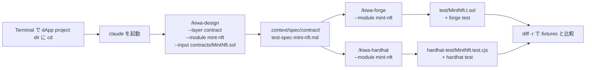

# Contract test を skill で作って実走する手順 (Foundry + Hardhat)

> 🇯🇵 日本語のみ (英語版は本手順をローカルで検証した後に追加予定)

自分の dApp project に既にある **contract code + 機能仕様 (PRD / 設計書 / docstring 等)** を入力に、 kiwa の 2-skill chain (`/kiwa-design` → `/kiwa-forge` / `/kiwa-hardhat`) で contract test を 0 から生成して実走する手順。 本手順では `examples/mint-nft` を「自分の dApp project」に見立てて歩く (`MintNft.sol` + 完成形 reference の README を仕様書代わりに使う)。

## kiwa skill の役割分担

| Layer | skill | 担当 | 入力 | 出力 |
|---|---|---|---|---|
| Layer 1 | `/kiwa-design` | **test 仕様書を生成** (機能仕様 → 9 column test case 表) | contract code / 機能仕様 (PRD / docstring) | `.context/spec/contract/test-spec-{module}.md` |
| Layer 2 | `/kiwa-forge` | Layer 1 の test 仕様書を **Foundry test code に変換** | `.context/spec/contract/test-spec-{module}.md` | `test/*.t.sol` + `forge test` 実走 |
| Layer 2 | `/kiwa-hardhat` | 同じ test 仕様書を **Hardhat test code に変換** | 同上 | `hardhat-test/*.test.cjs` + `hardhat test` + coverage |

**重要 — ユーザーは機能仕様 (PRD) のみ用意、 test 仕様書は kiwa-design が生成**。 test 仕様書 (test case 9 column 表) を手で書く必要はない。

## 全体図



## 前提イメージ — 自分の dApp project の構成

自分の project が以下のような構成になっていれば skill chain が走る。

```text
my-defi-app/                            ← Terminal で cd して claude を起動する dir
├─ contracts/MyToken.sol                ← /kiwa-design の --input
├─ docs/PRD.md (or 設計書)              ← (任意) /kiwa-design に補助情報として渡す
├─ foundry.toml                         ← Foundry 用 config (src/test/libs)
├─ hardhat.config.cjs                   ← Hardhat 用 config (paths.sources/tests)
├─ package.json                         ← test:foundry / test:hardhat script
├─ lib/forge-std/                       ← Foundry submodule
└─ (test/ や hardhat-test/ はまだ無い)   ← skill chain で 0 から生成する場所
```

mint-nft の場合、 上記の "my-defi-app" は `examples/mint-nft/` に該当する。 機能仕様の代わりに `tests/fixtures/mint-nft/README.md` と `MintNft.sol` の docstring を使う。

## Step 0 — 前提環境

```bash
# 1. dApp project dir に移動 (mint-nft の場合)
cd /Users/cardene/Desktop/projects/kiwa/examples/mint-nft

# 2. 自分の project 全体で依存 install (monorepo の場合は root で実行)
cd /Users/cardene/Desktop/projects/kiwa && pnpm install
cd /Users/cardene/Desktop/projects/kiwa/examples/mint-nft

# 3. Foundry が PATH 上 (forge / anvil)
forge --version    # forge x.y.z
anvil --version    # anvil x.y.z

# 4. Node.js 22+ (Hardhat 用)
node --version     # v22.x.x
```

Foundry 未 install なら [foundry.paradigm.xyz](https://foundry.paradigm.xyz) の手順で先に install する。

## Step 1 — test dir が空 (or 未存在) であることを確認

skill が「既存 test なし」状態を要求する (`/kiwa-forge` などは既存 file 検出時 skip or 上書きの挙動になる)。

```bash
# 現 dir が examples/mint-nft であることを確認
pwd

# test dir が空 or 未存在
ls test 2>&1            # "No such file" or 空
ls hardhat-test 2>&1    # "No such file" or 空

# .gitignore で gitignored であることを確認 (mint-nft では既にこの設定済)
grep -E "^(test|hardhat-test)/" .gitignore
```

`.gitignore` に `test/` `hardhat-test/` 行が出ていれば作業台として正しい状態。

## Step 2 — その dir で Claude Code を起動

別 Terminal を開いて (元 Terminal は実走用に残す)、 自分の dApp project dir で `claude` を起動。

```bash
cd /Users/cardene/Desktop/projects/kiwa/examples/mint-nft
claude
```

`claude code` が起動し prompt が出る。 ここから skill コマンドを叩く。 **cwd が examples/mint-nft であることが重要** — skill は cwd を基準に contract / docs / config を探す。

## Step 3 — Layer 1: `/kiwa-design` で test 仕様書を生成

claude prompt で以下を叩く。

```text
/kiwa-design --layer contract --module mint-nft --input contracts/MintNft.sol
```

引数の意味。

- `--layer contract` — 出力 path を `.context/spec/contract/` に分岐
- `--module mint-nft` — 出力 file 名のキー (`.context/spec/contract/test-spec-mint-nft.md`)
- `--input contracts/MintNft.sol` — 対象 contract code (機能仕様の source)

`--input` には機能仕様 file (例 `docs/PRD.md`) も渡せる。 contract code と機能仕様を両方持っているなら両方渡す形が理想 (現 skill 仕様では `--input` は 1 つだが、 prompt に PRD を併記しても skill が拾う)。

skill が以下を実施する (5 段階フロー)。

1. 入力整理 — contract code を Read して function / event / error を抽出、 機能名 / ユーザー操作 / 失敗 mode を構造化
2. 品質リスク評価 — 5 基準 (売上 / セキュリティ / データ破壊 / 利用頻度 / 過去障害) で 高/中/低 スコア
3. テスト観点選択 — 10 観点 catalog (正常系 / 異常系 / 境界値 / 状態遷移 / 権限 / 入力 / 冪等性 / 並行 / 性能 / セキュリティ) から該当を選ぶ
4. テストケース生成 — 9 column 表 (テスト ID / レベル / 観点 / 前提 / 入力 / 操作 / 期待結果 / 優先度 / 自動化) で 1 ケース 1 行
5. 優先度付け + 自動化方針 — リスク表から導出

出力 — `.context/spec/contract/test-spec-mint-nft.md`。

生成完了したら中身を `cat` で軽く確認。

```bash
# 別 Terminal で確認 (claude session を維持するため)
cat .context/spec/contract/test-spec-mint-nft.md | head -60
```

9 section (対象機能 / 仕様の要約 / 主な品質リスク / 推奨テスト構成 / テスト観点一覧 / テストケース一覧 / 自動化すべきテスト / 手動確認でよいテスト / 不足している仕様) が並んでいれば OK。

### 機能仕様 (PRD / 設計書) を明示的に渡したい場合

mint-nft では完成形 reference の README を仕様書代わりに使えるので、 claude prompt 内で参照させる。

```text
/kiwa-design --layer contract --module mint-nft --input contracts/MintNft.sol

機能仕様 (PRD 代わり) として ../../tests/fixtures/mint-nft/README.md を参照してください。
contract の挙動仕様 (ERC721 mint flow / royalty 5% / MAX_SUPPLY / supportsInterface) はこの README に書かれています。
```

自分の project の場合は `docs/PRD.md` を同様に prompt に書き添える形で渡す (現 skill 仕様では `--input` 1 つだが、 prompt 内記述で kiwa-design が拾う)。

## Step 4 — Layer 2 (Foundry): `/kiwa-forge` で `.t.sol` を生成

claude prompt に戻って以下を叩く。

```text
/kiwa-forge --module mint-nft --gas-report
```

引数の意味。

- `--module mint-nft` — Step 3 で生成した `.context/spec/contract/test-spec-mint-nft.md` を Read
- `--gas-report` — `forge test --gas-report` で gas 測定込み実行

skill が以下を実施する (5 段階フロー)。

1. Layer 1 spec 読込 — 9 column 表を行単位で parse
2. contract 実体確認 — `contracts/MintNft.sol` の function / error と spec の整合 check
3. 観点別 forge helper 変換 — `vm.prank` / `vm.expectRevert` / `vm.warp` / fuzz / invariant に variant
4. `test/MintNft.t.sol` を Write + `forge test` 実行
5. `forge coverage` 評価 — 4 metric (Lines 90% / Stmts 90% / Branches 80% / Funcs 90%) を check

完了すると claude が test 件数 / PASS 数 / coverage を報告。

### macOS で panic する場合

`Attempted to create a NULL object` panic が出たら Foundry の system_configuration バグ。 環境変数で回避できる。

```bash
# claude を一旦 exit (Ctrl+D) して別 Terminal で実行
cd /Users/cardene/Desktop/projects/kiwa/examples/mint-nft
FOUNDRY_OFFLINE=true forge test
```

PASS 確認できたら claude を再起動して次 Step へ。

## Step 5 — Layer 2 (Hardhat): `/kiwa-hardhat` で `.test.cjs` を生成

```text
/kiwa-hardhat --module mint-nft --gas-report
```

skill が以下を実施する。

- 同 `.context/spec/contract/test-spec-mint-nft.md` を Read
- 10 観点を chai matchers + `fast-check` + `hardhat-toolbox` に変換
- `hardhat-test/MintNft.test.cjs` を Write
- `npx hardhat test --config hardhat.config.cjs` で動作確認

完了すると claude が test 件数 / PASS 数 / coverage を報告。

## Step 6 — 生成 test を手動実走 (flaky 検査込み)

claude を抜けて別 Terminal、 もしくは claude 上で Bash tool を呼ぶ。

```bash
cd /Users/cardene/Desktop/projects/kiwa/examples/mint-nft

# Foundry test
FOUNDRY_OFFLINE=true forge test
# 期待: XX passed, 0 failed

# Hardhat test を 4 round 連続で flaky 検査 (repo root に戻って pnpm filter で叩く方が楽)
cd /Users/cardene/Desktop/projects/kiwa
for r in 1 2 3 4; do
  echo "=== Round $r ==="
  pnpm -F examples-mint-nft test:hardhat 2>&1 | grep -E "passing|failing"
done
# 期待: 各 round XX passing, failing 0
```

4 round 全て `failing 0` なら flaky 0 で合格。 1 round でも failing 出たら該当 test を確認 (時間依存 / state リーク)。

## Step 7 — Coverage 評価 (threshold 確認)

```bash
# Foundry coverage
cd /Users/cardene/Desktop/projects/kiwa/examples/mint-nft
FOUNDRY_OFFLINE=true forge coverage --report summary

# Hardhat coverage
cd /Users/cardene/Desktop/projects/kiwa
pnpm -F examples-mint-nft test:hardhat:coverage
```

期待 threshold (`/kiwa-forge` `/kiwa-hardhat` default で達成すべき水準)。

| metric | threshold | 完成形 fixtures 実測 |
|---|---|---|
| Lines | 90% | 97.70% |
| Statements | 90% | 94.57% |
| Branches | 80% | 83.33% |
| Functions | 90% | 95.24% |

未達なら `.context/spec/contract/test-spec-mint-nft.md` の「不足している仕様」section に未 cover error path / event / 観点を bullet で追記し、 Step 4 / Step 5 を再起動して追加 test を生成する。

## Step 8 — 完成形 fixtures との diff 比較 (答え合わせ)

`tests/fixtures/mint-nft/` には PR #184 / #185 で完成済の reference suite が置いてある。 自分で skill chain で生成した test と比較する。

```bash
cd /Users/cardene/Desktop/projects/kiwa

# Foundry test の diff
diff -r examples/mint-nft/test tests/fixtures/mint-nft/contract-test

# Hardhat test の diff
diff -r examples/mint-nft/hardhat-test tests/fixtures/mint-nft/hardhat-test
```

完成形と **完全一致は期待しない** (skill が生成する test の順序 / 命名 / helper 選択は run ごとにブレる)。 重要なのは以下 3 点。

- 10 観点が全 cover されている (Layer 1 spec で確認)
- 全 test PASS (Step 6 で確認済)
- coverage が threshold 以上 (Step 7 で確認済)

### 完成形 reference を skill chain なしで実走したい場合 (補足)

完成形だけ走らせたいなら、 fixtures 側 (独立 pnpm workspace) を直接叩ける (skill chain 起動不要)。

```bash
cd /Users/cardene/Desktop/projects/kiwa
pnpm --dir tests/fixtures/mint-nft test:foundry      # 27/27
pnpm --dir tests/fixtures/mint-nft test:hardhat      # 24/24
```

## 複数 contract がある dApp の場合

現 `/kiwa-design` / `/kiwa-forge` / `/kiwa-hardhat` は **1 module 単位** で起動する。 module を contract 群の単位 (例 token / staking / governance) で切り、 contract ごとに skill chain を回す。

```bash
# 例 — 3 contract を持つ dApp での全 test 生成
for module in token staking governance; do
  # claude 内で順次叩く
  # /kiwa-design --layer contract --module $module --input contracts/${module^}.sol
  # /kiwa-forge --module $module
  # /kiwa-hardhat --module $module
  echo "Run skill chain for $module"
done
```

複数 contract を **1 module にまとめる** 場合 (token + staking が密結合な dApp など) は `--input contracts/` (dir 指定) で渡し、 spec 内で複数 contract を扱う形になる。 contract 間の integration test は spec の「観点 4 状態遷移」 / 「観点 8 並行処理」 / 統合テスト level として記述される。

batch 起動 (`--modules token,staking,governance` 一括) は **現 skill では未対応**。 今後 Issue として起票して拡張予定 (進捗は本 docs を参照)。

## トラブルシューティング

| 症状 | 原因 | 対処 |
|---|---|---|
| `Layer 1 spec が未生成` で `/kiwa-forge` が停止 | Step 3 の `/kiwa-design` を skip した | Step 3 を先に実行 |
| `Attempted to create a NULL object` panic (Foundry) | macOS system_configuration バグ | `FOUNDRY_OFFLINE=true forge test` で signature lookup を skip |
| `forge-std/Test.sol` not found | lib/forge-std submodule 未取得 | `git submodule update --init` (dApp dir で実行) |
| Hardhat `Cannot find module` | pnpm install 未実行 or workspace 認識失敗 | monorepo root で `pnpm install` 再実行 |
| Hardhat 4 round 中 1 round だけ failing | flaky test (時間依存 / 並行依存) | 該当 test の `time.increaseTo` を `setUp` で fixture 化 |
| Foundry 4 round 中 1 round だけ failing | flaky test (`vm.warp` 残留) | `setUp` で snapshot / revert を使う |
| coverage が 80% に届かない | uncovered branch | Layer 1 spec の「不足している仕様」に追記して `/kiwa-forge` 再起動 |
| skill が「既存 test あり」で skip する | `.gitignore` が効いていない or `git status` で tracking | Step 1 で `.gitignore` 設定を確認、 `git rm --cached` で staging から外す |
| `--input` の path 解決失敗 | cwd 起点の相対 path が間違い | `pwd` で cwd を確認、 file path を `ls` で正確に確認 |

## 自分の dApp project で使うときの注意

mint-nft は kiwa repo 内の example として「`tests/fixtures/mint-nft/README.md` を仕様書代わり」に使っているが、 自分の project の場合は通常 `docs/PRD.md` `docs/design.md` `docs/spec/X.md` 等を `/kiwa-design --input` で渡す。 機能仕様には以下を含めると `/kiwa-design` が良い test 仕様書を生成しやすい。

- 機能の目的 (なぜ存在するか)
- 入力 / 出力 / 状態遷移
- 不変条件 (invariant)
- エラー条件 (どんな入力で revert するか)
- 権限モデル (誰が何を呼べるか)
- 既知の制約 (gas limit / max supply 等)

機能仕様がまだ無い場合は contract docstring と function 名から `/kiwa-design` が逆算する形で動くが、 出力 test 仕様書の品質は下がる。

## 関連 docs

- 完成形 reference の出自と provenance: `tests/fixtures/mint-nft/README.md`
- retrofit walkthrough 全体 flow (token-gating 題材): `tests/docs/retrofit-existing-dapp.ja.md`
- skill chain tutorial (4 skill 連携の概念図): `tests/docs/skill-chain-tutorial.ja.md`
- dApp e2e test 手順: `tests/docs/run-dapp-e2e-tests.ja.md`
- Layer 1 skill: `.claude/skills/kiwa-design/SKILL.md`
- Layer 2 Foundry skill: `.claude/skills/kiwa-forge/SKILL.md`
- Layer 2 Hardhat skill: `.claude/skills/kiwa-hardhat/SKILL.md`
