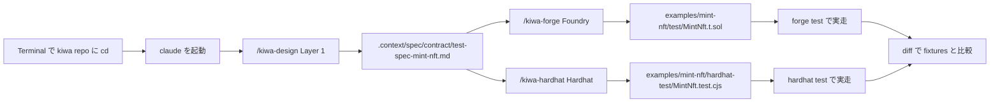

# Contract test を skill で作って実走する手順 (Foundry + Hardhat)

> 🇯🇵 日本語のみ (英語版は本手順をローカルで検証した後に追加予定)

`examples/mint-nft` の ERC721 contract (`MintNft.sol`) を題材に、 **kiwa の skill chain (`/kiwa-design` → `/kiwa-forge` / `/kiwa-hardhat`) を使って contract test を 0 から作って実走する** 手順を歩く。 完成形 reference (`tests/fixtures/mint-nft/`) は答え合わせと挙動確認用に末尾で diff 比較する。

## 全体図



## Step 0 — 前提環境

すでに整っているか確認。

```bash
# 1. Terminal を開いて kiwa repo に移動
cd /Users/cardene/Desktop/projects/kiwa

# 2. branch を確認 (main または feature/* どちらでも OK)
git branch --show-current

# 3. 依存 install
pnpm install

# 4. Foundry が PATH 上 (forge / anvil)
forge --version    # forge x.y.z
anvil --version    # anvil x.y.z

# 5. Node.js 22+ (Hardhat 用)
node --version     # v22.x.x
```

Foundry 未 install なら [foundry.paradigm.xyz](https://foundry.paradigm.xyz) の手順で先に install する。

## Step 1 — examples/mint-nft が空 dir 状態であることを確認

retrofit walkthrough は examples 側を空 dir から始める前提。

```bash
# test dir が存在しない or 空であることを確認
ls examples/mint-nft/test 2>&1            # "No such file" or 空
ls examples/mint-nft/hardhat-test 2>&1    # "No such file" or 空

# .gitignore で対象 dir が tracking 対象外になっていることを確認
grep -E "^(test|hardhat-test|tests)/" examples/mint-nft/.gitignore
```

`.gitignore` に `test/` `hardhat-test/` `tests/` 行が出ていれば作業台として正しい状態。

## Step 2 — Claude Code を起動

別 Terminal を開く (または現 Terminal で background pnpm install 待ち中に新規 tab)、 kiwa repo 内で claude を起動する。

```bash
cd /Users/cardene/Desktop/projects/kiwa
claude
```

`claude code` が起動し prompt が出る。 ここから skill コマンドを叩く。

## Step 3 — Layer 1: 仕様書を生成 (`/kiwa-design`)

claude prompt で以下を叩く。

```text
/kiwa-design --layer contract --module mint-nft --input examples/mint-nft/contracts/MintNft.sol
```

skill が以下を実施する。

- `examples/mint-nft/contracts/MintNft.sol` を Read して function / event / error を grep 抽出
- 既存 docstring と実コードから「対象機能」「権限モデル」「失敗 mode」を逆算
- 5 基準で品質リスクスコア、 10 観点 (正常系 / 異常系 / 境界値 / 状態遷移 / 権限 / 入力バリデーション / 冪等性 / 並行処理 / 性能 / セキュリティ) で適用判定
- 1 ケース 1 行で 9 column 表を生成

出力 — `.context/spec/contract/test-spec-mint-nft.md`。 生成完了したら中身を `cat` で軽く確認。

```bash
# 別 Terminal で確認 (claude session を維持するため)
cat .context/spec/contract/test-spec-mint-nft.md | head -60
```

「対象機能」 / 「主な品質リスク」 / 「テスト観点」 / 「テストケース (9 column)」 の section が並んでいれば OK。

## Step 4 — Layer 2 (Foundry): `/kiwa-forge` で `.t.sol` を生成

claude prompt に戻って以下を叩く。

```text
/kiwa-forge --module mint-nft --gas-report
```

skill が以下を実施する。

- Step 3 で生成した `.context/spec/contract/test-spec-mint-nft.md` を Read
- 10 観点を Foundry helper (`vm.prank` / `vm.expectRevert` / `vm.warp` / fuzz / invariant) に変換
- `examples/mint-nft/test/MintNft.t.sol` を Write
- `forge build` で compile 確認
- `forge test --gas-report` で動作確認

完了すると claude が test 件数と PASS 数を報告する。 期待は約 27 件全 PASS (完成形 fixtures と同数程度)。

### macOS で panic する場合

`Attempted to create a NULL object` panic が出たら Foundry の system_configuration バグ。 環境変数で回避できる。

```bash
# claude を一旦 exit (Ctrl+D) して別 Terminal で実行
cd /Users/cardene/Desktop/projects/kiwa/examples/mint-nft
FOUNDRY_OFFLINE=true forge test
```

PASS 確認できたら claude を再起動して次 Step へ。

## Step 5 — Layer 2 (Hardhat): `/kiwa-hardhat` で `.test.cjs` を生成

```text
/kiwa-hardhat --module mint-nft --gas-report
```

skill が以下を実施する。

- 同 `.context/spec/contract/test-spec-mint-nft.md` を Read
- 10 観点を chai matchers + `fast-check` + `hardhat-toolbox` に変換
- `examples/mint-nft/hardhat-test/MintNft.test.cjs` を Write
- `npx hardhat test --config hardhat.config.cjs` で動作確認

完了すると claude が test 件数と PASS 数を報告する (期待 24 件前後)。

## Step 6 — 生成 test を手動実走 (flaky 検査込み)

claude を抜けて別 Terminal、 もしくは Bash tool で実走する。

```bash
cd /Users/cardene/Desktop/projects/kiwa

# Foundry test
cd examples/mint-nft && FOUNDRY_OFFLINE=true forge test
# 期待: XX passed, 0 failed

# repo root に戻る
cd /Users/cardene/Desktop/projects/kiwa

# Hardhat test を 4 round 連続で flaky 検査
for r in 1 2 3 4; do
  echo "=== Round $r ==="
  pnpm -F examples-mint-nft test:hardhat 2>&1 | grep -E "passing|failing"
done
# 期待: 各 round XX passing, failing 0
```

4 round 全て `failing 0` なら flaky 0 で合格。 1 round でも failing 出たら該当 test を確認 (時間依存 / state リーク)。

## Step 7 — Coverage 評価 (threshold 確認)

```bash
# Foundry coverage
cd /Users/cardene/Desktop/projects/kiwa/examples/mint-nft
FOUNDRY_OFFLINE=true forge coverage --report summary

# Hardhat coverage
cd /Users/cardene/Desktop/projects/kiwa
pnpm -F examples-mint-nft test:hardhat:coverage
```

期待 threshold (PR #185 で達成済の基準)。

| metric | threshold | 完成形 fixtures 実測 |
|---|---|---|
| Lines | 90% | 97.70% |
| Statements | 90% | 94.57% |
| Branches | 80% | 83.33% |
| Functions | 90% | 95.24% |

未達なら Step 3 の `.context/spec/contract/test-spec-mint-nft.md` の「不足している仕様」section に未 cover error path / event / 観点を bullet で追記し、 Step 4 / Step 5 を再起動して追加 test を生成する。

## Step 8 — 完成形 fixtures との diff 比較 (答え合わせ)

`tests/fixtures/mint-nft/` には PR #184 / #185 で完成済の reference suite が置いてある。 自分で skill chain で生成した test と比較する。

```bash
cd /Users/cardene/Desktop/projects/kiwa

# Foundry test の diff
diff -r examples/mint-nft/test tests/fixtures/mint-nft/contract-test

# Hardhat test の diff
diff -r examples/mint-nft/hardhat-test tests/fixtures/mint-nft/hardhat-test
```

完成形と **完全一致は期待しない** (skill が生成する test の順序 / 命名 / helper 選択は run ごとにブレる)。 重要なのは以下 3 点。

- 観点 1-10 が全 cover されている (9 column 表で確認)
- 全 test PASS (Step 6 で確認済)
- coverage が threshold 以上 (Step 7 で確認済)

### 完成形 reference を直接実走したい場合 (補足)

skill chain なしで完成形だけ走らせたいなら、 fixtures 側 (独立 pnpm workspace) を直接叩ける。

```bash
cd /Users/cardene/Desktop/projects/kiwa
pnpm --dir tests/fixtures/mint-nft test:foundry      # 27/27
pnpm --dir tests/fixtures/mint-nft test:hardhat      # 24/24
```

## トラブルシューティング

| 症状 | 原因 | 対処 |
|---|---|---|
| `Attempted to create a NULL object` panic (Foundry) | macOS system_configuration バグ | `FOUNDRY_OFFLINE=true forge test` で signature lookup を skip |
| `forge-std/Test.sol` not found | lib/forge-std submodule 未取得 | `cd examples/mint-nft && git submodule update --init` |
| Hardhat `Cannot find module` | pnpm install 未実行 or workspace 認識失敗 | repo root で `pnpm install` 再実行 |
| Hardhat 4 round 中 1 round だけ failing | flaky test (時間依存 / 並行依存) | 該当 test の `time.increaseTo` を `setUp` で fixture 化 |
| Foundry 4 round 中 1 round だけ failing | flaky test (`vm.warp` 残留) | `setUp` で snapshot / revert を使う |
| coverage が 80% に届かない | uncovered branch | `solidity-coverage` の output で `I = if-path-not-taken` マーク箇所を確認、 else 側 / revert path の test を追加 |
| skill が「既存 test あり」で skip する | `.gitignore` が効いていない or `git status` で tracking | Step 1 で `.gitignore` 設定を確認、 `git rm --cached` で staging から外す |

## 関連 docs

- 完成形 reference の出自と provenance: `tests/fixtures/mint-nft/README.md`
- retrofit walkthrough 全体 flow (token-gating 題材): `tests/docs/retrofit-existing-dapp.ja.md`
- skill chain tutorial (4 skill 連携の概念図): `tests/docs/skill-chain-tutorial.ja.md`
- dApp e2e test 手順: `tests/docs/run-dapp-e2e-tests.ja.md`
- Layer 1 skill: `.claude/skills/kiwa-design/SKILL.md`
- Layer 2 Foundry skill: `.claude/skills/kiwa-forge/SKILL.md`
- Layer 2 Hardhat skill: `.claude/skills/kiwa-hardhat/SKILL.md`
