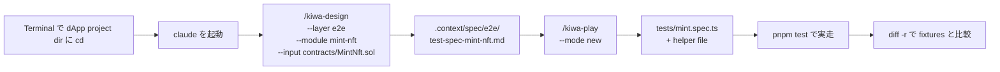

# dApp e2e test を skill で作って実走する手順 (Playwright + viem)

> 🇯🇵 日本語のみ (英語版は本手順をローカルで検証した後に追加予定)

自分の dApp project に既にある **contract code + UI code + 機能仕様 (PRD / 設計書 / docstring 等)** を入力に、 kiwa の 2-skill chain (`/kiwa-design` → `/kiwa-play`) で dApp e2e test (Playwright + viem + `@kiwa/core` fixture) を 0 から生成して実走する手順。 本手順では `examples/mint-nft` を「自分の dApp project」に見立てて歩く (`MintNft.sol` + `app/page.tsx` + 完成形 reference の README を仕様書代わりに使う)。

## kiwa skill の役割分担

| Layer | skill | 担当 | 入力 | 出力 |
|---|---|---|---|---|
| Layer 1 | `/kiwa-design` | **test 仕様書を生成** (機能仕様 → 9 column test case 表) | contract code / UI code / 機能仕様 (PRD) | `.context/spec/e2e/test-spec-{module}.md` |
| Layer 2 | `/kiwa-play` | Layer 1 の test 仕様書を **Playwright spec に変換** | 同 spec + dApp UI | `tests/*.spec.ts` + helper file + `playwright test` 実走 |

**重要 — ユーザーは機能仕様 (PRD) のみ用意、 test 仕様書は kiwa-design が生成**。 test 仕様書 (test case 9 column 表) を手で書く必要はない。

## 全体図



## 前提イメージ — 自分の dApp project の構成

自分の project が以下のような構成になっていれば skill chain が走る。

```text
my-dapp-frontend/                       ← Terminal で cd して claude を起動する dir
├─ contracts/MyToken.sol                ← /kiwa-design の --input
├─ app/page.tsx                         ← /kiwa-play が UI 構造を Read
├─ docs/PRD.md (or 設計書)              ← (任意) /kiwa-design に補助情報として渡す
├─ playwright.config.ts                 ← Playwright 用 config
├─ package.json                         ← test script
└─ (tests/ はまだ無い)                  ← skill chain で 0 から生成する場所
```

mint-nft の場合、 上記の "my-dapp-frontend" は `examples/mint-nft/` に該当する。

## Step 0 — 前提環境

```bash
# 1. dApp project dir に移動 (mint-nft の場合)
cd /Users/cardene/Desktop/projects/kiwa/examples/mint-nft

# 2. 自分の project 全体で依存 install (monorepo の場合は root で実行)
cd /Users/cardene/Desktop/projects/kiwa && pnpm install
cd /Users/cardene/Desktop/projects/kiwa/examples/mint-nft

# 3. @kiwa/core を build (e2e fixture が使う)
cd /Users/cardene/Desktop/projects/kiwa && pnpm -F @kiwa/core build
cd /Users/cardene/Desktop/projects/kiwa/examples/mint-nft

# 4. Foundry (anvil) が PATH 上
anvil --version    # anvil x.y.z

# 5. Node.js 22+
node --version     # v22.x.x

# 6. Playwright chromium を install (初回 + Playwright update 時)
pnpm exec playwright install chromium
```

## Step 1 — tests dir が空 (or 未存在) であることを確認

skill が「既存 test なし」状態を要求する。

```bash
# 現 dir が examples/mint-nft であることを確認
pwd

# tests dir が空 or 未存在
ls tests 2>&1            # "No such file" or 空

# .gitignore で gitignored であることを確認 (mint-nft では既にこの設定済)
grep -E "^tests/" .gitignore
```

`tests/` 行が出ていれば作業台として正しい状態。

## Step 2 — その dir で Claude Code を起動

別 Terminal を開いて、 自分の dApp project dir で `claude` を起動。

```bash
cd /Users/cardene/Desktop/projects/kiwa/examples/mint-nft
claude
```

`claude code` が起動し prompt が出る。 ここから skill コマンドを叩く。 **cwd が examples/mint-nft であることが重要** — skill は cwd を基準に contract / app / docs / config を探す。

## Step 3 — Layer 1: `/kiwa-design` で test 仕様書を生成

claude prompt で以下を叩く。

```text
/kiwa-design --layer e2e --module mint-nft --input contracts/MintNft.sol
```

引数の意味。

- `--layer e2e` — 出力 path を `.context/spec/e2e/` に分岐 (e2e 用 test 仕様書テンプレ)
- `--module mint-nft` — 出力 file 名のキー (`.context/spec/e2e/test-spec-mint-nft.md`)
- `--input contracts/MintNft.sol` — 対象 contract code (機能の source)

skill が 5 段階フローで test 仕様書を生成。 contract layer と同じ 9 section / 9 column 構造だが、 観点が e2e 寄り (UI 表示 / wallet 接続 / 画面遷移 / error 表示 等) になる。

出力 — `.context/spec/e2e/test-spec-mint-nft.md`。 生成完了したら中身を `cat` で軽く確認。

```bash
# 別 Terminal で確認
cat .context/spec/e2e/test-spec-mint-nft.md | head -60
```

### UI code や機能仕様 (PRD) を明示的に渡したい場合

dApp e2e では contract だけでなく UI 構造も重要なので、 prompt 内で `app/page.tsx` や `docs/PRD.md` を併記する。

```text
/kiwa-design --layer e2e --module mint-nft --input contracts/MintNft.sol

UI コード = app/page.tsx (mint button / 表示要素 / wallet 接続 component が定義されている)
機能仕様 = ../../tests/fixtures/mint-nft/README.md (UX flow と挙動仕様)
contract event と UI 表示の対応 (例 Transfer event → balance 表示更新) を test 観点に含めてください。
```

自分の project の場合は `docs/PRD.md` を同様に prompt に書き添えて渡す。

## Step 4 — Layer 2: `/kiwa-play --mode new` で spec を生成

claude prompt に戻って以下を叩く。

```text
/kiwa-play --mode new --rounds 4
```

引数の意味。

- `--mode new` — 既存 test なし状態から新規生成 (extend mode の対義)
- `--rounds 4` — 生成後の 4 round 連続実走で flaky 0 検証 (default 1)

skill が以下を実施する。

- Step 3 で生成した `.context/spec/e2e/test-spec-mint-nft.md` を Read (9 column 表を行単位で parse)
- contract event と UI 表示の対応を整理 (`app/page.tsx` 等を Read)
- 観点を Playwright + `@kiwa/core` fixture (anvil 自動起動 / wallet inject / contract deploy) に変換
- `tests/mint.spec.ts` を Write
- `tests/prepare-env.ts` / `tests/fixture.ts` / `tests/global-setup.ts` 等の helper を同時生成
- `pnpm test:e2e` 相当を 4 round 連続実走して flaky 0 検証

完了すると claude が test 件数 / PASS 数 / 4 round 結果を報告する。

### `--mode extend` を使うケース (補足)

既存 e2e test がある状態で観点だけ追加したいときは `--mode extend` を使う (本 step は new mode、 mint-nft は 0 から生成想定なので new を使う)。

## Step 5 — 生成 spec を手動実走 (flaky 検査込み)

claude を抜けて別 Terminal、 もしくは claude 上で Bash tool を呼ぶ。

```bash
cd /Users/cardene/Desktop/projects/kiwa

# 単発
pnpm -F examples-mint-nft test
# 期待: 8 passed (XX.Xs)

# 4 round 連続で flaky 検査
for r in 1 2 3 4; do
  echo "=== Round $r ==="
  pnpm -F examples-mint-nft test 2>&1 | tail -3
done
# 期待: 各 round 8 passed, failing 0
```

4 round 全て `failing 0` なら flaky 0 で合格 (Step 4 の `--rounds 4` で既に検証済だが、 念のため手動再実行)。

### headed mode で見ながら実走 (debug 用)

```bash
pnpm -F examples-mint-nft exec playwright test --headed
```

chromium が立ち上がり click や入力が見える。 debug 中の test の前に `await page.pause()` を入れれば inspector が起動する。

### specific test だけ実走

```bash
# テスト名で filter
pnpm -F examples-mint-nft exec playwright test --grep "T-MN-002"

# file 指定
pnpm -F examples-mint-nft exec playwright test tests/mint.spec.ts:165
```

## Step 6 — 完成形 fixtures との diff 比較 (答え合わせ)

`tests/fixtures/mint-nft/e2e-test/` には完成済の reference spec が置いてある。 自分で skill chain で生成した spec と比較する。

```bash
cd /Users/cardene/Desktop/projects/kiwa
diff -r examples/mint-nft/tests tests/fixtures/mint-nft/e2e-test
```

完成形と **完全一致は期待しない** (skill が生成する spec の test ID 順序や assert 文字列は run ごとにブレる)。 重要なのは以下 3 点。

- 完成形 8 件 (T-MN-001 〜 T-MN-008) の観点が cover されている
- 全 test PASS する (Step 5 で確認済)
- 4 round 連続 PASS (Step 4 / Step 5 で確認済)

### 完成形 reference を skill chain なしで実走したい場合 (補足)

完成形だけ走らせたいなら、 fixtures 側 (独立 pnpm workspace) を直接叩ける (skill chain 起動不要)。

```bash
cd /Users/cardene/Desktop/projects/kiwa
pnpm --dir tests/fixtures/mint-nft test:e2e          # 8/8
```

## 複数 contract がある dApp の場合

現 `/kiwa-design` / `/kiwa-play` は **1 module 単位** で起動する。 module を機能単位 (例 token-trade / staking / governance-vote) で切り、 機能ごとに skill chain を回す。

```bash
# 例 — 3 機能を持つ dApp での全 e2e test 生成
for module in token-trade staking governance-vote; do
  # claude 内で順次叩く
  # /kiwa-design --layer e2e --module $module --input contracts/...
  # /kiwa-play --mode new
  echo "Run skill chain for $module"
done
```

複数 contract を **1 module にまとめる** 場合 (token + staking が同じ画面で操作される dApp など) は `--input contracts/` (dir 指定) で渡し、 spec 内で複数 contract の連携 UX flow を扱う形になる。 contract 間連携の e2e は spec の「観点 4 状態遷移」 / 「観点 8 並行処理」 (multi-tab race) として記述される。

batch 起動 (`--modules token,staking,governance` 一括) は **現 skill では未対応**。 今後 Issue として起票して拡張予定。

## トラブルシューティング

| 症状 | 原因 | 対処 |
|---|---|---|
| `Layer 1 spec が未生成` で `/kiwa-play` が停止 | Step 3 の `/kiwa-design` を skip した | Step 3 を先に実行 |
| `Executable doesn't exist at .../chrome-headless-shell` | Playwright bundled chromium 未 install | `pnpm exec playwright install chromium` (dApp dir で実行) |
| `ReferenceError: require is not defined in ES module scope` | package.json に `"type": "module"` 欠落 | examples 側は対応済、 自前 workspace で出たら package.json に追加 |
| `Cannot find module '@kiwa/core'` | `@kiwa/core` build 未実行 | monorepo root で `pnpm -F @kiwa/core build` |
| anvil port 衝突 (`EADDRINUSE: 8545`) | 別の anvil daemon が稼働中 | `pkill -f anvil` or `lsof -ti :8545 \| xargs kill` |
| Playwright timeout (test がハング) | UI 要素 selector ミス / anvil tx 滞留 | `--debug` で playwright inspector を起動 + `page.pause()` で停止点設定 |
| flaky test (1 round だけ failing) | timing 依存 / state リーク | `test.describe.serial` を使う / fixture で `beforeEach` で state reset |
| `Error: connect ECONNREFUSED 127.0.0.1:8545` | anvil 未起動 (`prepare-env.ts` 失敗) | `node --import tsx tests/prepare-env.ts` 単独実行で error log 確認 |
| skill が「既存 test あり」で skip する | `.gitignore` が効いていない | Step 1 で `.gitignore` 設定を確認 |
| `--input` の path 解決失敗 | cwd 起点の相対 path が間違い | `pwd` で cwd を確認、 file path を `ls` で正確に確認 |

## 自分の dApp project で使うときの注意

mint-nft は kiwa repo 内の example として「`tests/fixtures/mint-nft/README.md` を仕様書代わり」に使っているが、 自分の project の場合は通常 `docs/PRD.md` `docs/design.md` `docs/spec/X.md` 等を prompt で `/kiwa-design` に渡す。 機能仕様には以下を含めると `/kiwa-design` が良い e2e test 仕様書を生成しやすい。

- UX flow (画面遷移 / button click / form 入力 / 結果表示)
- contract event と UI 表示の対応 (例 Transfer event → balance 表示更新)
- wallet 接続フロー (誰がいつ wallet を接続するか)
- エラー表示 (revert 時に何が画面に出るか)
- multi-tab / multi-account 想定の有無

UI code (`app/page.tsx` など) は `/kiwa-play` が cwd 起点で自動 Read するので明示指定不要 (必要なら prompt で path を補足する)。

機能仕様がまだ無い場合は contract docstring と UI code から `/kiwa-design` が逆算する形で動くが、 出力 test 仕様書の品質は下がる。

## 関連 docs

- 完成形 reference の出自と provenance: `tests/fixtures/mint-nft/README.md`
- retrofit walkthrough 全体 flow (token-gating 題材): `tests/docs/retrofit-existing-dapp.ja.md`
- skill chain tutorial (4 skill 連携の概念図): `tests/docs/skill-chain-tutorial.ja.md`
- contract test 手順 (Foundry + Hardhat): `tests/docs/run-contract-tests.ja.md`
- Layer 1 skill: `.claude/skills/kiwa-design/SKILL.md`
- Layer 2 Playwright skill: `.claude/skills/kiwa-play/SKILL.md`
- `@kiwa/core` fixture 仕様: `packages/core/src/fixture.ts`
