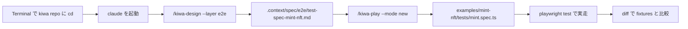

# dApp e2e test を skill で作って実走する手順 (Playwright + viem)

> 🇯🇵 日本語のみ (英語版は本手順をローカルで検証した後に追加予定)

`examples/mint-nft` の ERC721 mint flow を題材に、 **kiwa の skill chain (`/kiwa-design` → `/kiwa-play`) を使って dApp e2e test を 0 から作って実走する** 手順を歩く。 完成形 reference (`tests/fixtures/mint-nft/e2e-test/`) は答え合わせと挙動確認用に末尾で diff 比較する。

## 全体図



## Step 0 — 前提環境

すでに整っているか確認。

```bash
# 1. Terminal を開いて kiwa repo に移動
cd /Users/cardene/Desktop/projects/kiwa

# 2. branch を確認
git branch --show-current

# 3. 依存 install
pnpm install

# 4. @kiwa/core を build (e2e fixture が使う)
pnpm -F @kiwa/core build

# 5. Foundry (anvil) が PATH 上
anvil --version    # anvil x.y.z

# 6. Node.js 22+
node --version     # v22.x.x

# 7. Playwright chromium を install (初回 + Playwright update 時)
pnpm --dir examples/mint-nft exec playwright install chromium
```

## Step 1 — examples/mint-nft/tests が空 dir 状態であることを確認

retrofit walkthrough は examples 側を空 dir から始める前提。

```bash
ls examples/mint-nft/tests 2>&1            # "No such file" or 空

# .gitignore で tests/ が tracking 対象外であることを確認
grep -E "^tests/" examples/mint-nft/.gitignore
```

`tests/` 行が出ていれば作業台として正しい状態。

## Step 2 — Claude Code を起動

別 Terminal を開き、 kiwa repo 内で claude を起動。

```bash
cd /Users/cardene/Desktop/projects/kiwa
claude
```

`claude code` が起動し prompt が出る。 ここから skill コマンドを叩く。

## Step 3 — Layer 1: e2e 用仕様書を生成 (`/kiwa-design`)

claude prompt で以下を叩く。

```text
/kiwa-design --layer e2e --module mint-nft --input examples/mint-nft/
```

skill が以下を実施する。

- `examples/mint-nft/contracts/MintNft.sol` と `app/page.tsx` (もしくは inline HTML fixture) の対応関係を抽出
- contract event と UI 表示要素の対応を整理
- 観点別 (UI 表示 / wallet 接続 / contract 呼び出し / state 反映 / error 表示) で test ケースを生成

出力 — `.context/spec/e2e/test-spec-mint-nft.md`。 生成完了したら中身を `cat` で軽く確認。

```bash
# 別 Terminal で確認
cat .context/spec/e2e/test-spec-mint-nft.md | head -60
```

「対象機能」 / 「UI 要素対応」 / 「テスト観点」 / 「テストケース (9 column)」 の section が並んでいれば OK。

## Step 4 — Layer 2: `/kiwa-play --mode new` で spec を生成

claude prompt に戻って以下を叩く。

```text
/kiwa-play --mode new --example mint-nft
```

skill が以下を実施する。

- Step 3 で生成した `.context/spec/e2e/test-spec-mint-nft.md` を Read
- 観点を Playwright + `@kiwa/core` fixture (anvil 自動起動 / wallet inject / contract deploy) に変換
- `examples/mint-nft/tests/mint.spec.ts` を Write
- `prepare-env.ts` / `fixture.ts` / `global-setup.ts` 等の helper を同時生成 (必要に応じて)
- `pnpm test:e2e` 相当を 4 round 連続実走して flaky 0 検証

完了すると claude が test 件数 / PASS 数 / 4 round 結果を報告する。 期待は約 8 件全 PASS (完成形 fixtures と同数程度)。

### `--mode extend` を使うケース (補足)

既存 e2e test がある状態で観点だけ追加したいときは `--mode extend` を使う (本 step は new mode、 mint-nft は 0 から生成想定なので new を使う)。

## Step 5 — 生成 spec を手動実走 (flaky 検査込み)

claude を抜けて別 Terminal、 もしくは Bash tool で実走する。

```bash
cd /Users/cardene/Desktop/projects/kiwa

# 単発
pnpm -F examples-mint-nft test
# 期待: 8 passed (XX.Xs)

# 4 round 連続で flaky 検査
for r in 1 2 3 4; do
  echo "=== Round $r ==="
  pnpm -F examples-mint-nft test 2>&1 | tail -3
done
# 期待: 各 round 8 passed, failing 0
```

4 round 全て `failing 0` なら flaky 0 で合格。

### headed mode で見ながら実走 (debug 用)

```bash
pnpm -F examples-mint-nft exec playwright test --headed
```

chromium が立ち上がり click や入力が見える。 debug 中の test の前に `await page.pause()` を入れれば inspector が起動する。

### specific test だけ実走

```bash
# テスト名で filter
pnpm -F examples-mint-nft exec playwright test --grep "T-MN-002"

# file 指定
pnpm -F examples-mint-nft exec playwright test tests/mint.spec.ts:165
```

## Step 6 — 完成形 fixtures との diff 比較 (答え合わせ)

`tests/fixtures/mint-nft/e2e-test/` には完成済の reference spec が置いてある。 自分で skill chain で生成した spec と比較する。

```bash
cd /Users/cardene/Desktop/projects/kiwa
diff -r examples/mint-nft/tests tests/fixtures/mint-nft/e2e-test
```

完成形と **完全一致は期待しない** (skill が生成する spec の test ID 順序や assert 文字列は run ごとにブレる)。 重要なのは以下 3 点。

- 完成形 8 件 (T-MN-001 〜 T-MN-008) の観点が cover されている
- 全 test PASS する (Step 5 で確認済)
- 4 round 連続 PASS (Step 5 で確認済)

### 完成形 reference を直接実走したい場合 (補足)

skill chain なしで完成形だけ走らせたいなら、 fixtures 側 (独立 pnpm workspace) を直接叩ける。

```bash
cd /Users/cardene/Desktop/projects/kiwa
pnpm --dir tests/fixtures/mint-nft test:e2e          # 8/8
```

## トラブルシューティング

| 症状 | 原因 | 対処 |
|---|---|---|
| `Executable doesn't exist at .../chrome-headless-shell` | Playwright bundled chromium 未 install | `pnpm --dir examples/mint-nft exec playwright install chromium` |
| `ReferenceError: require is not defined in ES module scope` | package.json に `"type": "module"` 欠落 | examples 側は対応済、 自前 workspace で出たら追加 |
| `Cannot find module '@kiwa/core'` | `@kiwa/core` build 未実行 | `pnpm -F @kiwa/core build` |
| anvil port 衝突 (`EADDRINUSE: 8545`) | 別の anvil daemon が稼働中 | `pkill -f anvil` or `lsof -ti :8545 \| xargs kill` |
| Playwright timeout (test がハング) | UI 要素 selector ミス / anvil tx 滞留 | `--debug` で playwright inspector を起動 + `page.pause()` で停止点設定 |
| flaky test (1 round だけ failing) | timing 依存 / state リーク | `test.describe.serial` を使う / fixture で `beforeEach` で state reset |
| `Error: connect ECONNREFUSED 127.0.0.1:8545` | anvil 未起動 (`prepare-env.ts` 失敗) | `node --import tsx examples/mint-nft/tests/prepare-env.ts` 単独実行で error log 確認 |
| skill が「既存 test あり」で skip する | `.gitignore` が効いていない | Step 1 で `.gitignore` 設定を確認 |

## 関連 docs

- 完成形 reference の出自と provenance: `tests/fixtures/mint-nft/README.md`
- retrofit walkthrough 全体 flow (token-gating 題材): `tests/docs/retrofit-existing-dapp.ja.md`
- skill chain tutorial (4 skill 連携の概念図): `tests/docs/skill-chain-tutorial.ja.md`
- contract test 手順 (Foundry + Hardhat): `tests/docs/run-contract-tests.ja.md`
- Layer 1 skill: `.claude/skills/kiwa-design/SKILL.md`
- Layer 2 Playwright skill: `.claude/skills/kiwa-play/SKILL.md`
- `@kiwa/core` fixture 仕様: `packages/core/src/fixture.ts`
